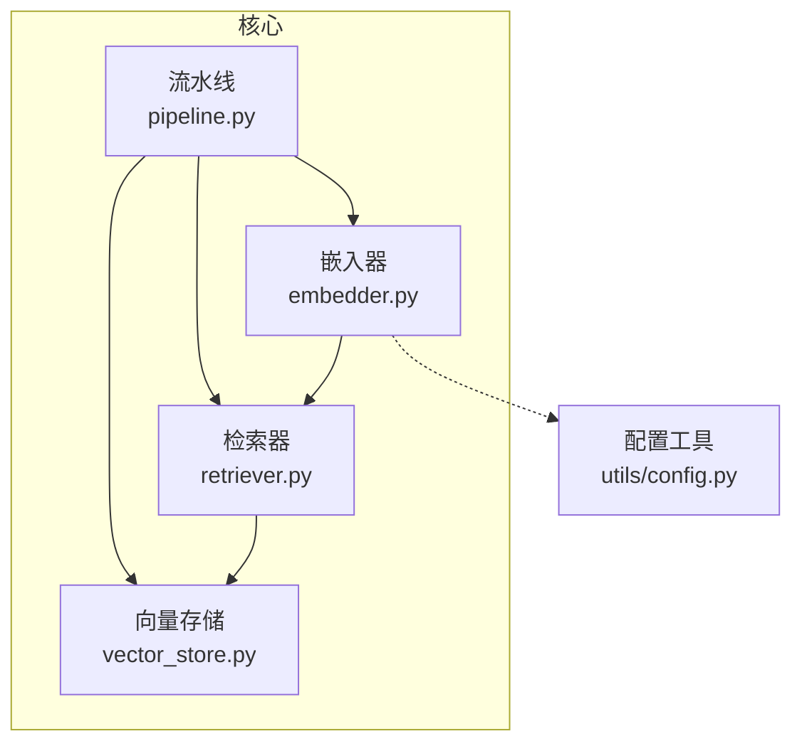
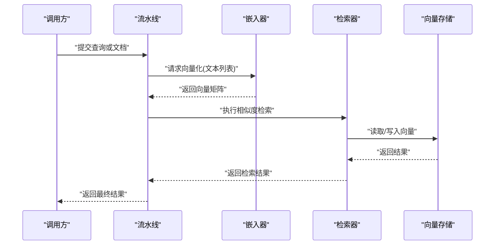
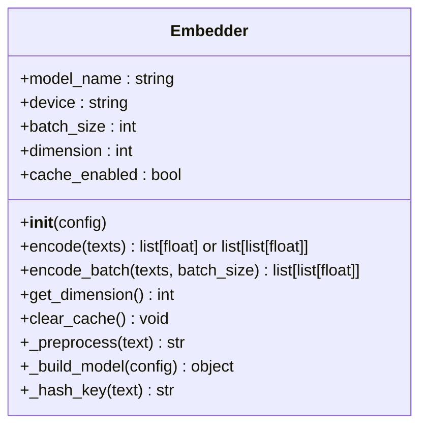
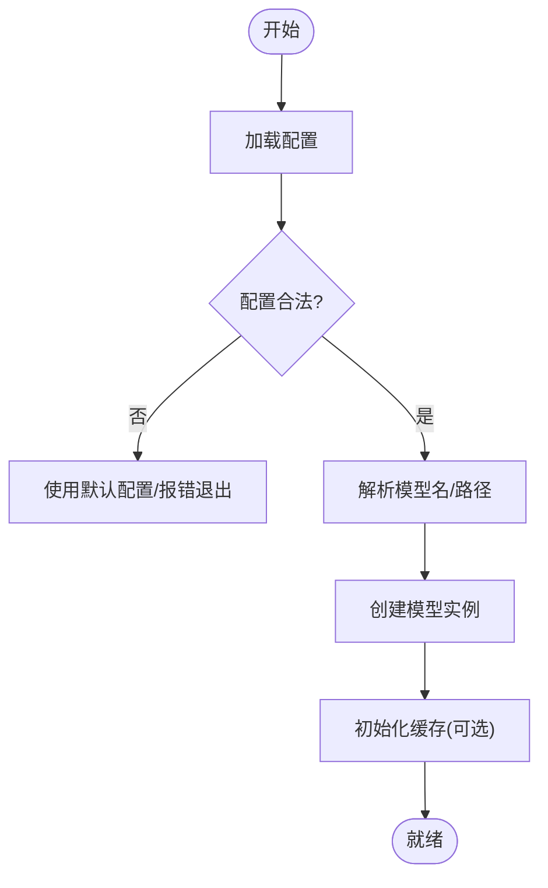
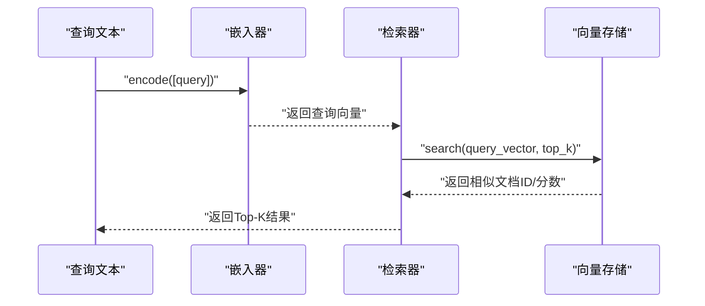
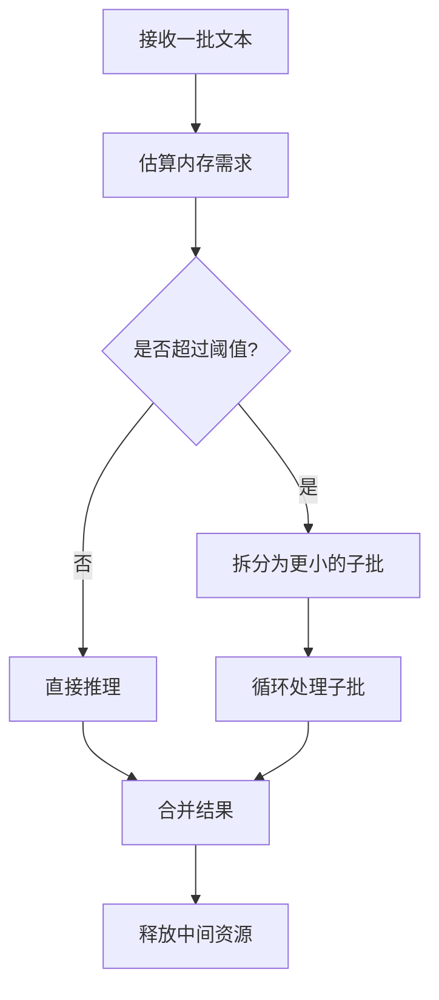
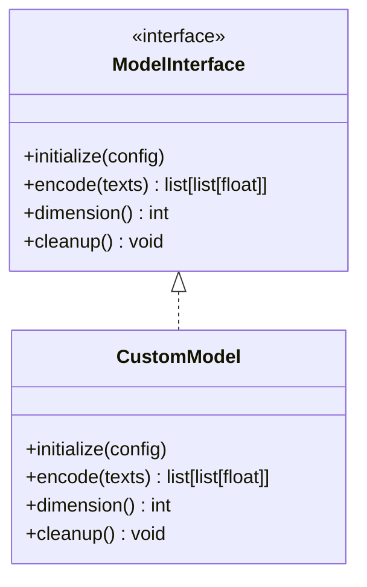
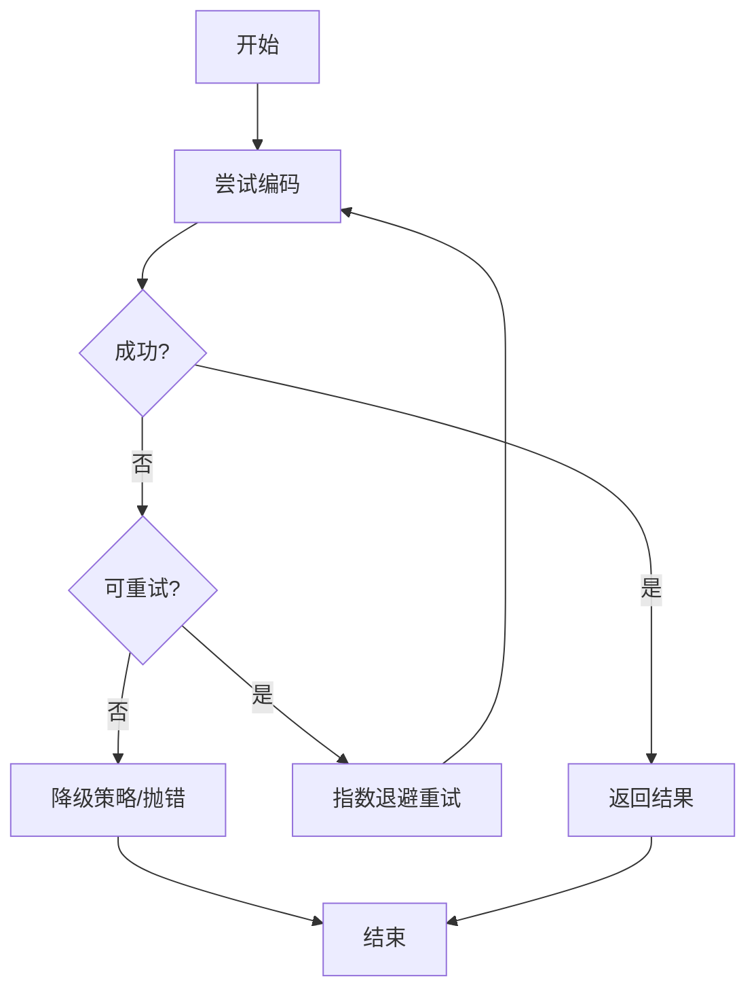
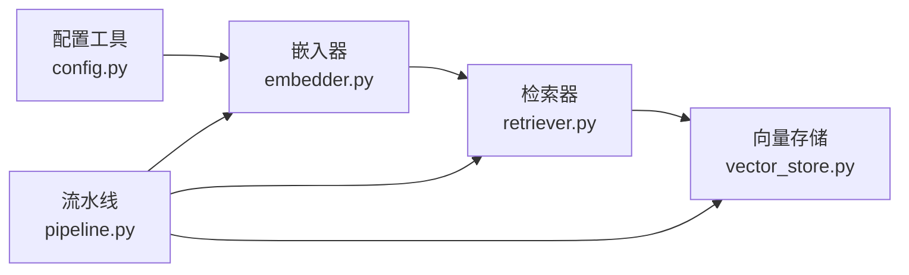

# 嵌入器组件

<cite>
**本文引用的文件**   
- [embedder.py](file://src/kag_pro/core/embedder.py)
- [config.py](file://src/kag_pro/utils/config.py)
- [retriever.py](file://src/kag_pro/core/retriever.py)
- [vector_store.py](file://src/kag_pro/core/vector_store.py)
- [pipeline.py](file://src/kag_pro/core/pipeline.py)
</cite>

## 目录
1. [简介](#简介)
2. [项目结构](#项目结构)
3. [核心组件](#核心组件)
4. [架构总览](#架构总览)
5. [详细组件分析](#详细组件分析)
6. [依赖关系分析](#依赖关系分析)
7. [性能考虑](#性能考虑)
8. [故障排查指南](#故障排查指南)
9. [结论](#结论)
10. [附录](#附录)

## 简介
本文件面向KAG-Pro的“嵌入器”组件，系统性阐述其设计原理、接口定义、模型选择与配置管理、批量处理、质量评估、性能优化、内存与缓存策略、错误处理与异常恢复，以及使用示例与最佳实践。文档旨在帮助开发者快速理解并高效集成文本嵌入能力，支撑检索、向量存储与下游任务。

## 项目结构
嵌入器位于核心模块中，负责将输入文本转换为稠密向量表示，并与检索器、向量存储等组件协作完成端到端流程。

图表来源
- [embedder.py](file://src/kag_pro/core/embedder.py)
- [retriever.py](file://src/kag_pro/core/retriever.py)
- [vector_store.py](file://src/kag_pro/core/vector_store.py)
- [pipeline.py](file://src/kag_pro/core/pipeline.py)
- [config.py](file://src/kag_pro/utils/config.py)

章节来源
- [embedder.py](file://src/kag_pro/core/embedder.py)
- [config.py](file://src/kag_pro/utils/config.py)
- [retriever.py](file://src/kag_pro/core/retriever.py)
- [vector_store.py](file://src/kag_pro/core/vector_store.py)
- [pipeline.py](file://src/kag_pro/core/pipeline.py)

## 核心组件
- 文本嵌入器：提供统一的文本到向量接口，支持单条与批量转换、维度控制、模型切换与配置加载。
- 配置管理：集中管理模型名称、设备、批大小、缓存开关等参数。
- 与检索/存储协作：为检索器提供查询向量，为向量存储提供索引向量。

章节来源
- [embedder.py](file://src/kag_pro/core/embedder.py)
- [config.py](file://src/kag_pro/utils/config.py)
- [retriever.py](file://src/kag_pro/core/retriever.py)
- [vector_store.py](file://src/kag_pro/core/vector_store.py)

## 架构总览
嵌入器作为数据流的关键节点，承接上游文本预处理，输出固定维度的向量供检索与存储使用。

图表来源
- [pipeline.py](file://src/kag_pro/core/pipeline.py)
- [embedder.py](file://src/kag_pro/core/embedder.py)
- [retriever.py](file://src/kag_pro/core/retriever.py)
- [vector_store.py](file://src/kag_pro/core/vector_store.py)

## 详细组件分析

### 嵌入器类设计与接口
- 初始化与配置
  - 通过配置对象加载模型标识、设备、批大小、是否启用缓存等。
  - 支持多模型类型（如本地模型、远程服务）的统一入口。
- 文本处理
  - 输入清洗、分词/编码、长度截断与填充、特殊标记处理。
- 向量化
  - 单条文本转向量；批量文本转矩阵；可选归一化。
- 维度与模型
  - 暴露维度属性；按模型自动推断或显式设置。
- 缓存
  - 基于文本指纹的轻量缓存，命中时直接返回向量，减少重复计算。
- 并发与批处理
  - 内部批处理调度，避免OOM；可配置最大批次与队列长度。
- 错误处理
  - 对空输入、超长文本、模型不可用等情况进行健壮性处理与重试。

图表来源
- [embedder.py](file://src/kag_pro/core/embedder.py)

章节来源
- [embedder.py](file://src/kag_pro/core/embedder.py)

### 配置管理与模型选择
- 配置项
  - 模型名称/路径、后端类型、设备、批大小、缓存开关、超时、重试次数等。
- 模型注册表
  - 以模型名为键，映射到具体实现或工厂函数，便于扩展新模型。
- 默认值与校验
  - 提供合理默认值，并对非法配置进行提示与回退。

图表来源
- [config.py](file://src/kag_pro/utils/config.py)
- [embedder.py](file://src/kag_pro/core/embedder.py)

章节来源
- [config.py](file://src/kag_pro/utils/config.py)
- [embedder.py](file://src/kag_pro/core/embedder.py)

### 与检索器和向量存储的协作
- 检索器
  - 接收查询文本，调用嵌入器生成查询向量，再在向量存储中进行相似度搜索。
- 向量存储
  - 持久化文档向量与元数据，支持增量更新与批量写入。

图表来源
- [retriever.py](file://src/kag_pro/core/retriever.py)
- [vector_store.py](file://src/kag_pro/core/vector_store.py)
- [embedder.py](file://src/kag_pro/core/embedder.py)

章节来源
- [retriever.py](file://src/kag_pro/core/retriever.py)
- [vector_store.py](file://src/kag_pro/core/vector_store.py)
- [embedder.py](file://src/kag_pro/core/embedder.py)

### 批量处理与内存管理
- 分批策略
  - 根据可用内存与GPU显存动态调整批次大小，防止溢出。
- 内存回收
  - 中间张量及时释放，避免累积占用。
- 零拷贝优化
  - 尽量复用缓冲区，减少复制开销。

图表来源
- [embedder.py](file://src/kag_pro/core/embedder.py)

章节来源
- [embedder.py](file://src/kag_pro/core/embedder.py)

### 自定义模型集成方式
- 插件化接口
  - 定义统一抽象：初始化、编码、维度获取、清理。
- 注册机制
  - 通过配置中的模型名指向自定义实现，无需修改主流程。
- 兼容层
  - 对第三方库封装适配，屏蔽差异。

图表来源
- [embedder.py](file://src/kag_pro/core/embedder.py)

章节来源
- [embedder.py](file://src/kag_pro/core/embedder.py)

### 嵌入质量评估方法
- 内蕴指标
  - 平均余弦相似度、方差、分布稳定性。
- 外置评测
  - 检索准确率/召回率、排序NDCG、下游任务AUC/F1。
- 回归测试
  - 固定基准集，监控版本变更导致的退化。

[本节为通用方法论说明，不直接分析具体文件]

### 性能优化策略
- 批大小自适应
  - 依据硬件与负载动态调节。
- 缓存命中
  - 对重复文本直接返回，降低延迟。
- 并行与异步
  - 在I/O密集场景下采用异步调用外部模型服务。
- 精度与速度权衡
  - 可选择半精度或量化模型以降低内存与提升吞吐。

[本节为通用优化建议，不直接分析具体文件]

### 错误处理与异常恢复
- 输入校验
  - 空文本、超长文本、非法字符的处理与修复。
- 模型异常
  - 连接失败、权重缺失、设备不可用的重试与降级。
- 优雅降级
  - 在部分失败时返回部分结果并记录日志，保证整体可用性。

图表来源
- [embedder.py](file://src/kag_pro/core/embedder.py)

章节来源
- [embedder.py](file://src/kag_pro/core/embedder.py)

### 使用示例（步骤化）
- 初始化
  - 从配置文件加载参数，构造嵌入器实例。
- 配置
  - 设置模型名、设备、批大小、缓存开关。
- 单次编码
  - 传入单条或多条文本，获取向量或向量矩阵。
- 批量编码
  - 指定批大小，处理大规模文本集合。
- 集成检索
  - 将查询向量交给检索器，结合向量存储完成检索。
- 清理
  - 应用退出前释放模型与缓存资源。

章节来源
- [embedder.py](file://src/kag_pro/core/embedder.py)
- [config.py](file://src/kag_pro/utils/config.py)
- [retriever.py](file://src/kag_pro/core/retriever.py)
- [vector_store.py](file://src/kag_pro/core/vector_store.py)

## 依赖关系分析
嵌入器依赖配置工具，被流水线调用，并为检索器与向量存储提供向量输入。

图表来源
- [config.py](file://src/kag_pro/utils/config.py)
- [embedder.py](file://src/kag_pro/core/embedder.py)
- [retriever.py](file://src/kag_pro/core/retriever.py)
- [vector_store.py](file://src/kag_pro/core/vector_store.py)
- [pipeline.py](file://src/kag_pro/core/pipeline.py)

章节来源
- [config.py](file://src/kag_pro/utils/config.py)
- [embedder.py](file://src/kag_pro/core/embedder.py)
- [retriever.py](file://src/kag_pro/core/retriever.py)
- [vector_store.py](file://src/kag_pro/core/vector_store.py)
- [pipeline.py](file://src/kag_pro/core/pipeline.py)

## 性能考虑
- 批大小与内存
  - 根据硬件上限设定批大小，避免频繁GC与OOM。
- 缓存命中率
  - 对热点查询开启缓存，显著降低延迟。
- 模型选择
  - 小模型用于低延迟场景，大模型用于高精度场景。
- 并行度
  - 在CPU/GPU多核环境下合理设置线程/进程数。
- I/O与网络
  - 对远程模型服务采用连接池与超时控制。

[本节为通用指导，不直接分析具体文件]

## 故障排查指南
- 常见问题
  - 维度不一致：检查模型与配置是否匹配。
  - 内存不足：减小批大小或启用缓存淘汰。
  - 模型加载失败：确认路径/权限/网络连通性。
- 诊断手段
  - 打印关键中间状态（文本长度分布、批次大小、缓存命中）。
  - 记录异常堆栈与重试次数。
- 恢复策略
  - 自动重试、回退到较小模型、清空缓存后重试。

章节来源
- [embedder.py](file://src/kag_pro/core/embedder.py)

## 结论
嵌入器在KAG-Pro中承担文本到向量的核心职责，具备灵活的配置、可扩展的模型接入、健壮的批处理与错误恢复能力。通过合理的性能调优与质量评估，可在不同业务场景中稳定提供高质量的语义表示。

## 附录
- 术语
  - 嵌入：将离散符号序列映射为连续向量。
  - 批处理：一次处理多条样本以提升吞吐。
  - 缓存：基于输入指纹的结果复用。
- 参考
  - 相关模块源码路径见“本文引用的文件”。