# 核心组件设计

<cite>
**本文引用的文件**   
- [embedder.py](file://src/kag_pro/core/embedder.py)
- [vector_store.py](file://src/kag_pro/core/vector_store.py)
- [config.py](file://src/kag_pro/utils/config.py)
- [pipeline.py](file://src/kag_pro/core/pipeline.py)
- [retriever.py](file://src/kag_pro/core/retriever.py)
- [loader.py](file://src/kag_pro/core/loader.py)
- [splitter.py](file://src/kag_pro/core/splitter.py)
- [generator.py](file://src/kag_pro/core/generator.py)
- [verifier.py](file://src/kag_pro/core/verifier.py)
- [favorite_store.py](file://src/kag_pro/core/favorite_store.py)
- [paper_store.py](file://src/kag_pro/core/paper_store.py)
</cite>

## 目录
1. [简介](#简介)
2. [项目结构](#项目结构)
3. [核心组件](#核心组件)
4. [架构总览](#架构总览)
5. [详细组件分析](#详细组件分析)
6. [依赖关系分析](#依赖关系分析)
7. [性能考虑](#性能考虑)
8. [故障排查指南](#故障排查指南)
9. [结论](#结论)
10. [附录](#附录)

## 简介
本技术文档聚焦于 KAG-Pro 的核心组件设计，围绕嵌入器（Embedder）、向量存储（VectorStore）、配置管理器（Config）等关键模块展开。文档从职责边界、接口定义、内部实现逻辑、依赖与通信机制、生命周期管理、配置选项与使用示例、错误处理与异常恢复、性能特征与最佳实践等方面进行全面阐述，帮助读者快速理解并正确集成这些组件。

## 项目结构
KAG-Pro 采用分层与模块化组织方式：
- core：核心能力层，包含嵌入、检索、生成、验证、管道编排、数据加载与切分、向量存储等
- utils：通用工具与配置管理
- data/datasets：数据与数据集相关脚本
- kg：知识图谱相关能力
- diagnosis：诊断与推荐
- evaluation：评估指标
- stage：阶段检测
- frontend：前端服务与样例
- tests：单元测试与集成测试

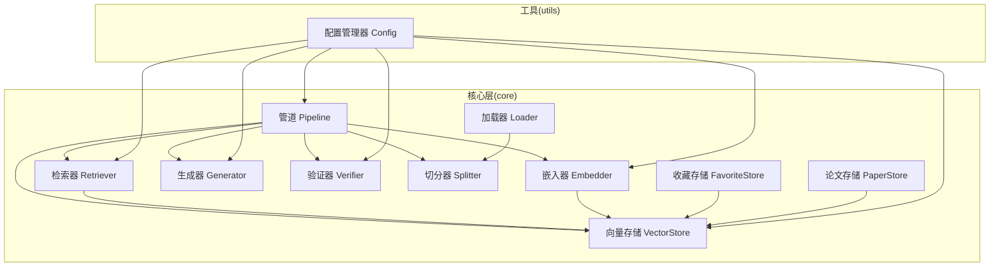

图表来源
- [pipeline.py](file://src/kag_pro/core/pipeline.py)
- [embedder.py](file://src/kag_pro/core/embedder.py)
- [vector_store.py](file://src/kag_pro/core/vector_store.py)
- [retriever.py](file://src/kag_pro/core/retriever.py)
- [generator.py](file://src/kag_pro/core/generator.py)
- [verifier.py](file://src/kag_pro/core/verifier.py)
- [loader.py](file://src/kag_pro/core/loader.py)
- [splitter.py](file://src/kag_pro/core/splitter.py)
- [favorite_store.py](file://src/kag_pro/core/favorite_store.py)
- [paper_store.py](file://src/kag_pro/core/paper_store.py)
- [config.py](file://src/kag_pro/utils/config.py)

章节来源
- [pipeline.py](file://src/kag_pro/core/pipeline.py)
- [embedder.py](file://src/kag_pro/core/embedder.py)
- [vector_store.py](file://src/kag_pro/core/vector_store.py)
- [config.py](file://src/kag_pro/utils/config.py)

## 核心组件
本节概述各核心组件的职责与协作关系，为后续深入分析奠定基础。

- 嵌入器（Embedder）
  - 职责：将文本或结构化内容转换为向量表示，供检索与相似度计算使用
  - 典型输入：原始文本片段、元数据
  - 典型输出：向量、ID、可选的元数据映射
  - 关键点：批量处理、维度一致性、可插拔后端

- 向量存储（VectorStore）
  - 职责：持久化与检索向量集合，支持增删改查、相似度搜索、过滤与分页
  - 典型操作：插入、查询、删除、更新、统计
  - 关键点：索引策略、内存/磁盘权衡、并发安全、事务性

- 配置管理器（Config）
  - 职责：集中管理运行时配置，提供默认值、覆盖与环境变量注入
  - 典型用法：读取全局配置、按组件作用域隔离配置、校验必填项
  - 关键点：类型转换、缺省回退、热重载（可选）

- 检索器（Retriever）
  - 职责：基于用户查询进行语义检索，返回相关片段与评分
  - 关键点：多路召回、重排序、结果裁剪

- 生成器（Generator）
  - 职责：根据上下文与提示词生成自然语言答案或结构化输出
  - 关键点：流式输出、温度控制、重试与超时

- 验证器（Verifier）
  - 职责：对生成结果进行事实性或格式校验，必要时触发修正流程
  - 关键点：规则引擎、外部校验服务、降级策略

- 管道（Pipeline）
  - 职责：编排加载、切分、嵌入、存储、检索、生成、验证等步骤
  - 关键点：同步/异步执行、错误传播、断点续跑

- 加载器（Loader）与切分器（Splitter）
  - 职责：从多种数据源加载数据并按策略切分为片段
  - 关键点：编码兼容、大小限制、去重与合并

- 收藏存储（FavoriteStore）与论文存储（PaperStore）
  - 职责：面向业务对象的持久化与检索，通常复用底层向量存储
  - 关键点：命名空间隔离、版本化、迁移

章节来源
- [embedder.py](file://src/kag_pro/core/embedder.py)
- [vector_store.py](file://src/kag_pro/core/vector_store.py)
- [config.py](file://src/kag_pro/utils/config.py)
- [retriever.py](file://src/kag_pro/core/retriever.py)
- [generator.py](file://src/kag_pro/core/generator.py)
- [verifier.py](file://src/kag_pro/core/verifier.py)
- [pipeline.py](file://src/kag_pro/core/pipeline.py)
- [loader.py](file://src/kag_pro/core/loader.py)
- [splitter.py](file://src/kag_pro/core/splitter.py)
- [favorite_store.py](file://src/kag_pro/core/favorite_store.py)
- [paper_store.py](file://src/kag_pro/core/paper_store.py)

## 架构总览
下图展示了核心组件之间的调用关系与数据流向。整体采用“编排+插件”的模式：Pipeline 作为编排中心，通过配置驱动各组件协同工作；Embedder 与 VectorStore 构成向量化与检索的基础设施；Retriever/Generator/Verifier 组成问答链路；FavoriteStore/PaperStore 封装领域对象访问。

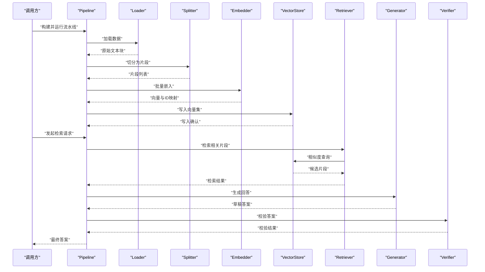

图表来源
- [pipeline.py](file://src/kag_pro/core/pipeline.py)
- [loader.py](file://src/kag_pro/core/loader.py)
- [splitter.py](file://src/kag_pro/core/splitter.py)
- [embedder.py](file://src/kag_pro/core/embedder.py)
- [vector_store.py](file://src/kag_pro/core/vector_store.py)
- [retriever.py](file://src/kag_pro/core/retriever.py)
- [generator.py](file://src/kag_pro/core/generator.py)
- [verifier.py](file://src/kag_pro/core/verifier.py)

## 详细组件分析

### 嵌入器（Embedder）
- 职责边界
  - 负责将文本片段转换为固定维度的向量
  - 维护模型后端抽象，支持替换不同嵌入模型
  - 提供批量处理与缓存策略
- 接口要点
  - 初始化参数：模型路径/名称、设备、批大小、是否归一化等
  - 主要方法：嵌入单个/批量文本、获取维度、健康检查
- 内部实现逻辑
  - 模型懒加载与预热
  - 批内并行与内存池
  - 失败重试与熔断
- 依赖关系
  - 依赖配置管理器获取模型与硬件参数
  - 被 Pipeline 与检索器间接使用
- 生命周期
  - 初始化：加载模型权重、建立连接
  - 启动：预热常用查询
  - 运行：响应嵌入请求
  - 销毁：释放显存/句柄
- 配置选项
  - 模型标识、设备选择、批大小、最大长度、是否归一化
- 使用示例（路径）
  - 参考 [embedder.py](file://src/kag_pro/core/embedder.py) 中的构造与调用入口
- 错误处理
  - 网络/模型不可用时的降级与告警
  - 输入非法时的快速失败与提示
- 性能特征
  - 批处理吞吐优先，延迟敏感场景建议开启缓存
  - 大模型需关注显存峰值与批大小调优

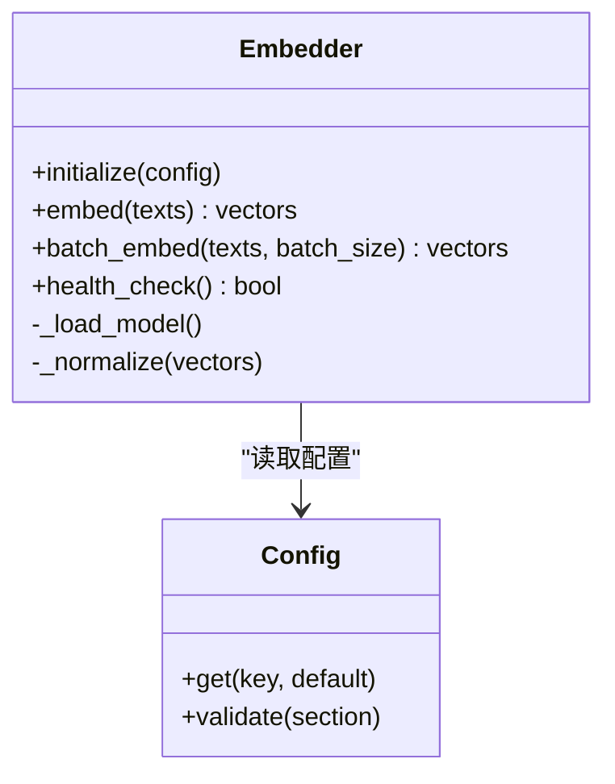

图表来源
- [embedder.py](file://src/kag_pro/core/embedder.py)
- [config.py](file://src/kag_pro/utils/config.py)

章节来源
- [embedder.py](file://src/kag_pro/core/embedder.py)
- [config.py](file://src/kag_pro/utils/config.py)

### 向量存储（VectorStore）
- 职责边界
  - 提供向量数据的增删改查、相似度检索、过滤与分页
  - 抽象底层存储实现（内存/磁盘/分布式）
- 接口要点
  - 初始化参数：存储后端、索引类型、度量方式、容量上限
  - 主要方法：upsert、query、delete、list、stats、optimize
- 内部实现逻辑
  - 索引构建与增量更新
  - 读写分离与并发锁
  - 持久化快照与恢复
- 依赖关系
  - 被 Embedder、Retriever、FavoriteStore、PaperStore 共同使用
- 生命周期
  - 初始化：创建/连接存储、加载索引
  - 启动：后台优化任务
  - 运行：高并发读写
  - 销毁：关闭连接、落盘
- 配置选项
  - 后端类型、索引参数、副本数、压缩策略、保留策略
- 使用示例（路径）
  - 参考 [vector_store.py](file://src/kag_pro/core/vector_store.py) 中的 API 定义与调用
- 错误处理
  - 存储不可用时的重试与回退
  - 数据冲突时的幂等写入
- 性能特征
  - 写放大与读延迟的权衡
  - 批量写入与异步提交提升吞吐

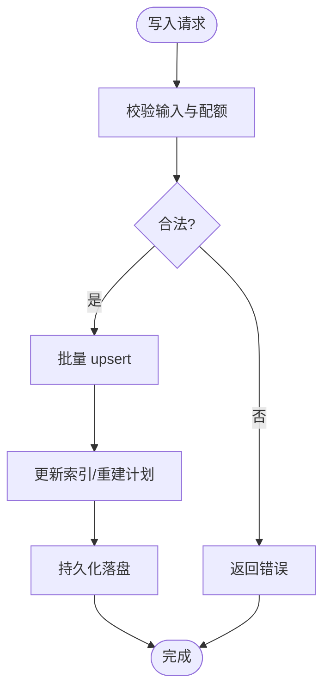

图表来源
- [vector_store.py](file://src/kag_pro/core/vector_store.py)

章节来源
- [vector_store.py](file://src/kag_pro/core/vector_store.py)

### 配置管理器（Config）
- 职责边界
  - 统一读取与合并配置，提供类型安全访问
  - 支持默认值、环境变量覆盖、配置文件优先级
- 接口要点
  - get/set、section 访问、校验与转换
- 内部实现逻辑
  - 多级覆盖：代码默认 < 配置文件 < 环境变量 < 运行时覆盖
  - 懒解析与按需校验
- 依赖关系
  - 被所有核心组件消费
- 生命周期
  - 应用启动时加载，运行期可热更新（可选）
- 配置选项
  - 全局开关、组件级参数、日志级别、资源限制
- 使用示例（路径）
  - 参考 [config.py](file://src/kag_pro/utils/config.py) 中的访问模式
- 错误处理
  - 缺失键抛出明确异常
  - 类型不匹配给出修复建议
- 性能特征
  - 配置读取应缓存，避免频繁 I/O

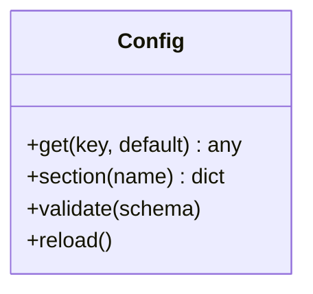

图表来源
- [config.py](file://src/kag_pro/utils/config.py)

章节来源
- [config.py](file://src/kag_pro/utils/config.py)

### 检索器（Retriever）
- 职责边界
  - 将用户查询转化为向量并在向量存储中检索
  - 支持多路召回与结果重排
- 接口要点
  - 初始化参数：TopK、阈值、过滤条件
  - 主要方法：retrieve(query)、retrieve_batch(queries)
- 内部实现逻辑
  - 查询预处理、相似度打分、截断与去重
- 依赖关系
  - 依赖 Embedder 与 VectorStore
- 生命周期
  - 随 Pipeline 初始化，常驻运行
- 配置选项
  - TopK、相似度阈值、过滤字段、重排策略
- 使用示例（路径）
  - 参考 [retriever.py](file://src/kag_pro/core/retriever.py)
- 错误处理
  - 空结果回退到关键词检索（可选）
- 性能特征
  - 缓存热门查询，减少重复嵌入

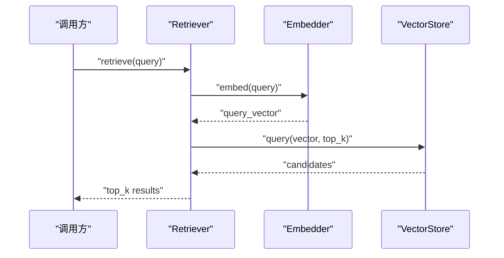

图表来源
- [retriever.py](file://src/kag_pro/core/retriever.py)
- [embedder.py](file://src/kag_pro/core/embedder.py)
- [vector_store.py](file://src/kag_pro/core/vector_store.py)

章节来源
- [retriever.py](file://src/kag_pro/core/retriever.py)
- [embedder.py](file://src/kag_pro/core/embedder.py)
- [vector_store.py](file://src/kag_pro/core/vector_store.py)

### 生成器（Generator）
- 职责边界
  - 基于检索上下文生成自然语言答案
  - 支持多种后端（本地/远程）与流式输出
- 接口要点
  - 初始化参数：模型、温度、最大长度、超时
  - 主要方法：generate(context, prompt)、stream_generate(...)
- 内部实现逻辑
  - 提示词组装、采样策略、重试与超时控制
- 依赖关系
  - 依赖配置管理器与可选的外部服务客户端
- 生命周期
  - 按需实例化或长驻
- 配置选项
  - 模型名、采样参数、超时、重试次数
- 使用示例（路径）
  - 参考 [generator.py](file://src/kag_pro/core/generator.py)
- 错误处理
  - 服务不可用时的降级与回退
- 性能特征
  - 流式输出降低首字延迟

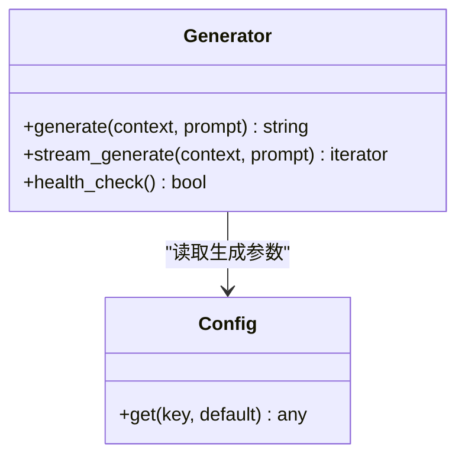

图表来源
- [generator.py](file://src/kag_pro/core/generator.py)
- [config.py](file://src/kag_pro/utils/config.py)

章节来源
- [generator.py](file://src/kag_pro/core/generator.py)
- [config.py](file://src/kag_pro/utils/config.py)

### 验证器（Verifier）
- 职责边界
  - 对生成结果进行事实性与格式校验
  - 支持规则与外部校验服务
- 接口要点
  - 主要方法：verify(answer, context)、fix(answer, feedback)
- 内部实现逻辑
  - 规则匹配、启发式检查、二次生成（可选）
- 依赖关系
  - 依赖配置与可选外部服务
- 生命周期
  - 随 Pipeline 运行
- 配置选项
  - 严格度、白名单/黑名单、重试策略
- 使用示例（路径）
  - 参考 [verifier.py](file://src/kag_pro/core/verifier.py)
- 错误处理
  - 校验失败时返回反馈以便修正
- 性能特征
  - 轻量规则优先，复杂校验异步化

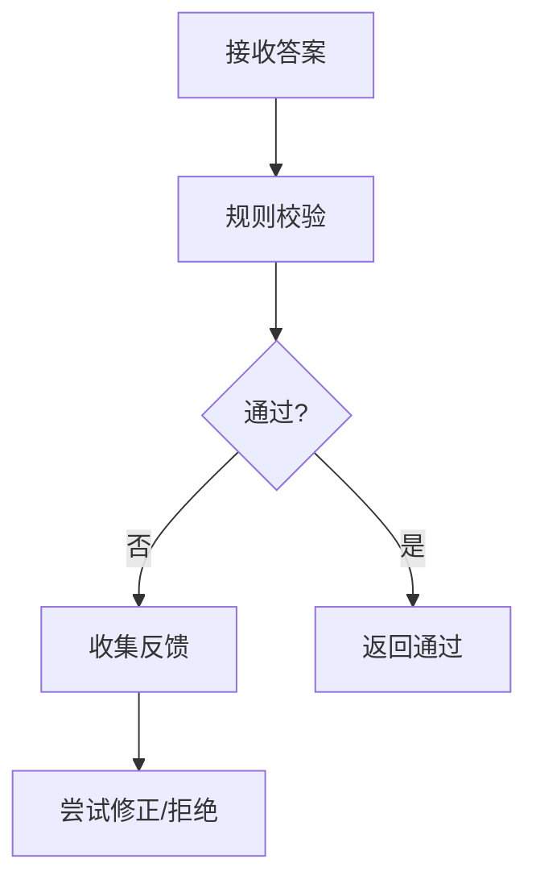

图表来源
- [verifier.py](file://src/kag_pro/core/verifier.py)

章节来源
- [verifier.py](file://src/kag_pro/core/verifier.py)

### 管道（Pipeline）
- 职责边界
  - 编排数据加载、切分、嵌入、存储、检索、生成、验证等步骤
  - 提供统一的启动、停止与监控接口
- 接口要点
  - 主要方法：build、run、stop、status
- 内部实现逻辑
  - 步骤图构建、依赖解析、错误传播与补偿
- 依赖关系
  - 聚合 Embedder、VectorStore、Retriever、Generator、Verifier、Loader、Splitter
- 生命周期
  - 初始化：注册组件与钩子
  - 启动：预检与预热
  - 运行：执行任务
  - 销毁：清理资源
- 配置选项
  - 全局开关、并发度、超时、重试
- 使用示例（路径）
  - 参考 [pipeline.py](file://src/kag_pro/core/pipeline.py)
- 错误处理
  - 单步失败可跳过/重试/终止
- 性能特征
  - 并行阶段、背压控制、断点续跑

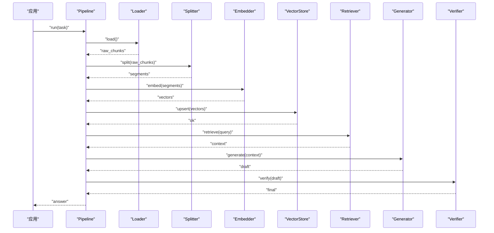

图表来源
- [pipeline.py](file://src/kag_pro/core/pipeline.py)
- [loader.py](file://src/kag_pro/core/loader.py)
- [splitter.py](file://src/kag_pro/core/splitter.py)
- [embedder.py](file://src/kag_pro/core/embedder.py)
- [vector_store.py](file://src/kag_pro/core/vector_store.py)
- [retriever.py](file://src/kag_pro/core/retriever.py)
- [generator.py](file://src/kag_pro/core/generator.py)
- [verifier.py](file://src/kag_pro/core/verifier.py)

章节来源
- [pipeline.py](file://src/kag_pro/core/pipeline.py)
- [loader.py](file://src/kag_pro/core/loader.py)
- [splitter.py](file://src/kag_pro/core/splitter.py)
- [embedder.py](file://src/kag_pro/core/embedder.py)
- [vector_store.py](file://src/kag_pro/core/vector_store.py)
- [retriever.py](file://src/kag_pro/core/retriever.py)
- [generator.py](file://src/kag_pro/core/generator.py)
- [verifier.py](file://src/kag_pro/core/verifier.py)

### 加载器（Loader）与切分器（Splitter）
- 职责边界
  - Loader：从多种数据源读取原始数据
  - Splitter：按段落/句子/窗口切分为片段
- 接口要点
  - Loader：load(source) -> chunks
  - Splitter：split(chunks, strategy) -> segments
- 内部实现逻辑
  - 编码自适应、大小限制、去重合并
- 依赖关系
  - 被 Pipeline 在入库前调用
- 配置选项
  - 编码、最大长度、重叠率、分隔符
- 使用示例（路径）
  - 参考 [loader.py](file://src/kag_pro/core/loader.py)、[splitter.py](file://src/kag_pro/core/splitter.py)
- 错误处理
  - 读取失败重试、部分失败记录
- 性能特征
  - 流式读取与惰性切分

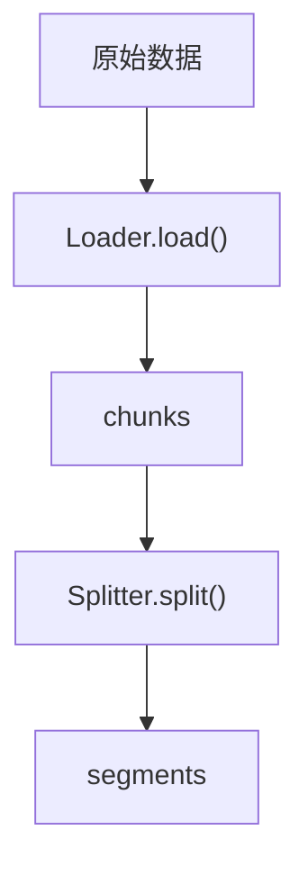

图表来源
- [loader.py](file://src/kag_pro/core/loader.py)
- [splitter.py](file://src/kag_pro/core/splitter.py)

章节来源
- [loader.py](file://src/kag_pro/core/loader.py)
- [splitter.py](file://src/kag_pro/core/splitter.py)

### 收藏存储（FavoriteStore）与论文存储（PaperStore）
- 职责边界
  - 面向业务对象的 CRUD 与检索，封装命名空间与元数据
- 接口要点
  - upsert、query_by_meta、list、delete
- 内部实现逻辑
  - 复用 VectorStore，附加业务字段索引
- 依赖关系
  - 依赖 VectorStore 与 Config
- 配置选项
  - 命名空间、索引字段、保留策略
- 使用示例（路径）
  - 参考 [favorite_store.py](file://src/kag_pro/core/favorite_store.py)、[paper_store.py](file://src/kag_pro/core/paper_store.py)
- 错误处理
  - 元数据校验失败快速失败
- 性能特征
  - 批量写入、冷热分离

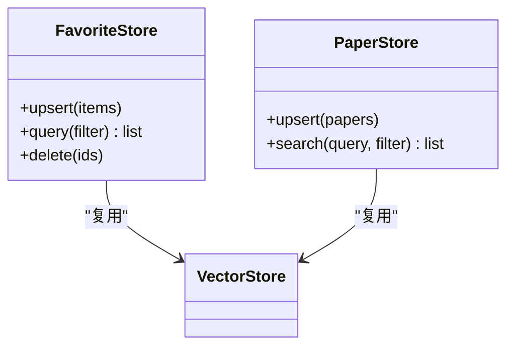

图表来源
- [favorite_store.py](file://src/kag_pro/core/favorite_store.py)
- [paper_store.py](file://src/kag_pro/core/paper_store.py)
- [vector_store.py](file://src/kag_pro/core/vector_store.py)

章节来源
- [favorite_store.py](file://src/kag_pro/core/favorite_store.py)
- [paper_store.py](file://src/kag_pro/core/paper_store.py)
- [vector_store.py](file://src/kag_pro/core/vector_store.py)

## 依赖关系分析
- 耦合与内聚
  - Pipeline 作为编排中心，适度耦合各组件，保持高内聚的业务流程
  - Embedder 与 VectorStore 解耦良好，便于替换实现
- 直接/间接依赖
  - Retriever 依赖 Embedder 与 VectorStore
  - FavoriteStore/PaperStore 依赖 VectorStore
  - 所有组件依赖 Config
- 潜在循环依赖
  - 当前设计无循环依赖，Pipeline 单向调度
- 外部依赖
  - 嵌入模型服务、向量数据库、LLM 服务（可通过配置切换）

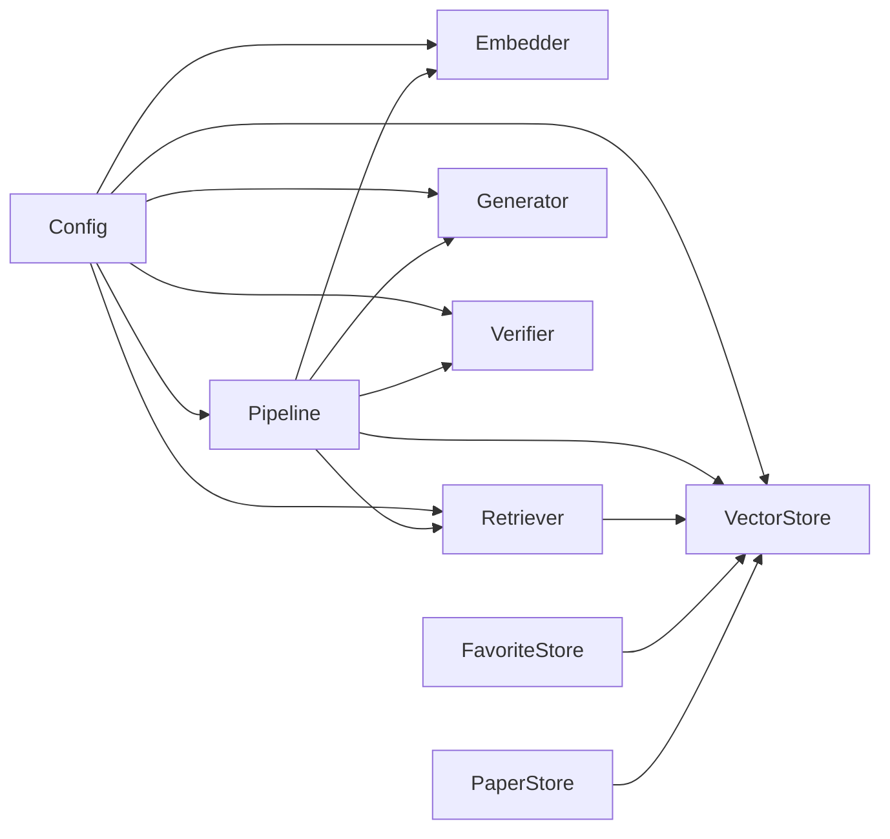

图表来源
- [pipeline.py](file://src/kag_pro/core/pipeline.py)
- [embedder.py](file://src/kag_pro/core/embedder.py)
- [vector_store.py](file://src/kag_pro/core/vector_store.py)
- [retriever.py](file://src/kag_pro/core/retriever.py)
- [generator.py](file://src/kag_pro/core/generator.py)
- [verifier.py](file://src/kag_pro/core/verifier.py)
- [favorite_store.py](file://src/kag_pro/core/favorite_store.py)
- [paper_store.py](file://src/kag_pro/core/paper_store.py)
- [config.py](file://src/kag_pro/utils/config.py)

章节来源
- [pipeline.py](file://src/kag_pro/core/pipeline.py)
- [embedder.py](file://src/kag_pro/core/embedder.py)
- [vector_store.py](file://src/kag_pro/core/vector_store.py)
- [retriever.py](file://src/kag_pro/core/retriever.py)
- [generator.py](file://src/kag_pro/core/generator.py)
- [verifier.py](file://src/kag_pro/core/verifier.py)
- [favorite_store.py](file://src/kag_pro/core/favorite_store.py)
- [paper_store.py](file://src/kag_pro/core/paper_store.py)
- [config.py](file://src/kag_pro/utils/config.py)

## 性能考虑
- 嵌入器
  - 增大批大小以提升吞吐，注意显存占用
  - 启用查询缓存以减少重复计算
- 向量存储
  - 合理设置索引与度量，平衡召回质量与延迟
  - 批量写入与异步提交提高写入吞吐
- 检索器
  - 调整 TopK 与阈值，结合重排提升准确率
  - 热点查询缓存
- 生成器
  - 流式输出降低首字延迟
  - 合理设置温度与最大长度，避免过长输出
- 管道
  - 并行阶段与背压控制
  - 断点续跑与幂等写入

## 故障排查指南
- 常见问题定位
  - 嵌入失败：检查模型路径、设备可用性与批大小
  - 向量写入失败：检查存储后端连通性与配额
  - 检索为空：检查阈值与过滤条件
  - 生成超时：检查 LLM 服务状态与超时配置
- 日志与监控
  - 关键步骤埋点：加载、切分、嵌入、写入、检索、生成、验证
  - 指标：QPS、P95/P99 延迟、错误率、缓存命中率
- 恢复策略
  - 重试与退避
  - 降级与回退（如关键词检索）
  - 幂等写入与快照恢复

章节来源
- [pipeline.py](file://src/kag_pro/core/pipeline.py)
- [embedder.py](file://src/kag_pro/core/embedder.py)
- [vector_store.py](file://src/kag_pro/core/vector_store.py)
- [retriever.py](file://src/kag_pro/core/retriever.py)
- [generator.py](file://src/kag_pro/core/generator.py)
- [verifier.py](file://src/kag_pro/core/verifier.py)

## 结论
KAG-Pro 的核心组件以 Pipeline 为中心，通过清晰的分层与插件化设计，实现了可扩展、高性能且易维护的问答与检索链路。Embedder 与 VectorStore 构成向量化基础设施，Retriever/Generator/Verifier 形成稳定的推理闭环，FavoriteStore/PaperStore 则封装了领域对象访问。配合完善的配置管理与错误处理策略，系统可在多种部署环境下稳定运行。

## 附录
- 组件初始化与配置清单（路径）
  - 嵌入器：[embedder.py](file://src/kag_pro/core/embedder.py)
  - 向量存储：[vector_store.py](file://src/kag_pro/core/vector_store.py)
  - 配置管理器：[config.py](file://src/kag_pro/utils/config.py)
  - 检索器：[retriever.py](file://src/kag_pro/core/retriever.py)
  - 生成器：[generator.py](file://src/kag_pro/core/generator.py)
  - 验证器：[verifier.py](file://src/kag_pro/core/verifier.py)
  - 管道：[pipeline.py](file://src/kag_pro/core/pipeline.py)
  - 加载器：[loader.py](file://src/kag_pro/core/loader.py)
  - 切分器：[splitter.py](file://src/kag_pro/core/splitter.py)
  - 收藏存储：[favorite_store.py](file://src/kag_pro/core/favorite_store.py)
  - 论文存储：[paper_store.py](file://src/kag_pro/core/paper_store.py)