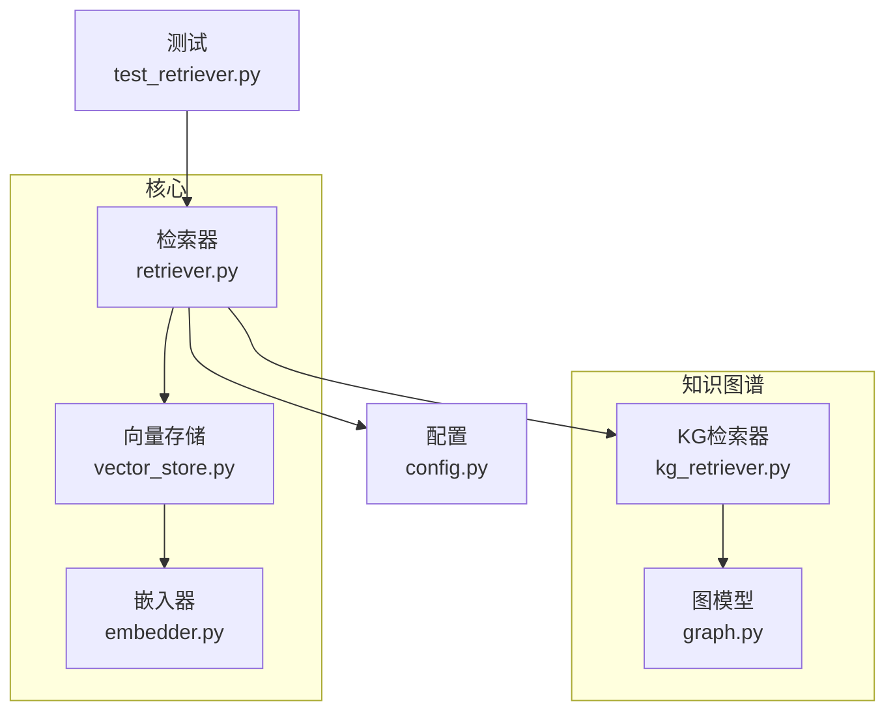
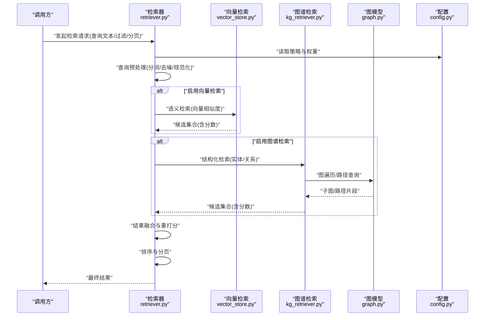
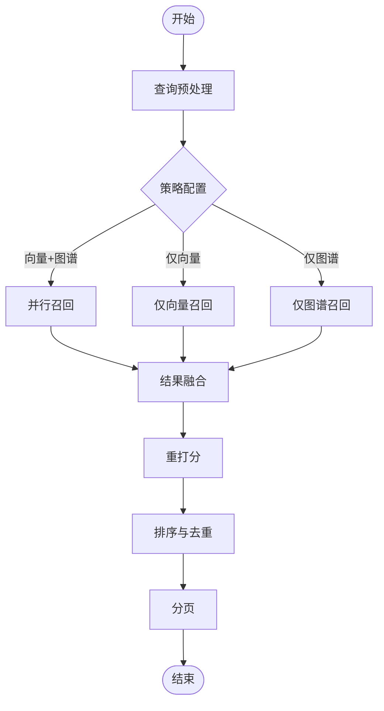
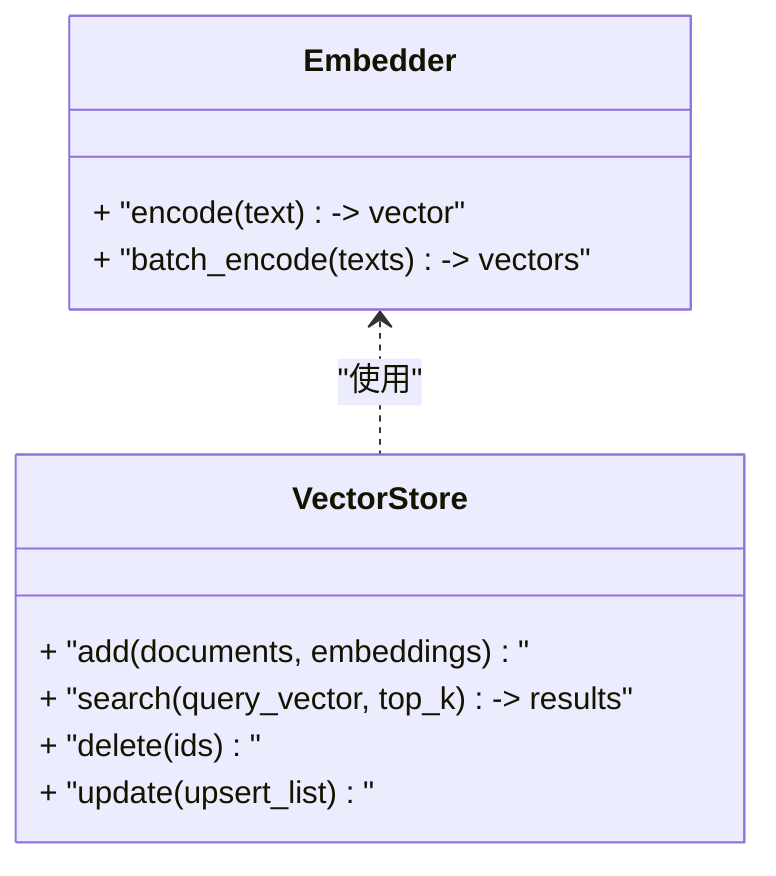
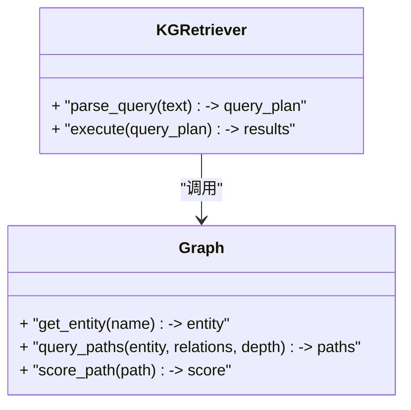
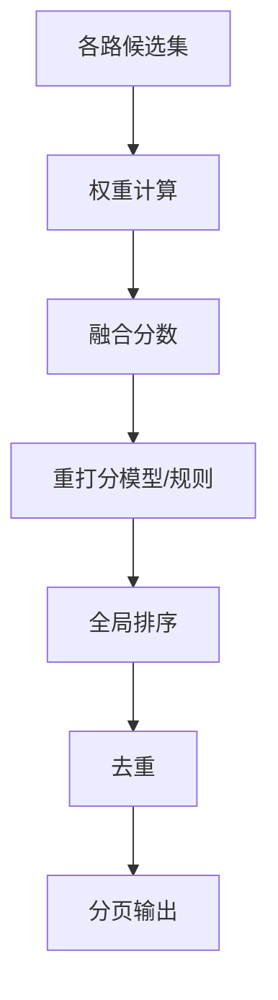
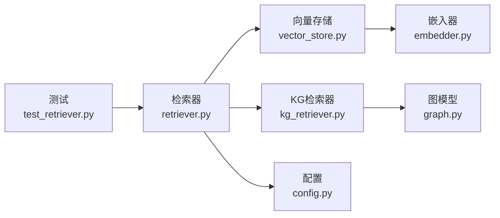

# 检索核心组件

<cite>
**本文引用的文件**   
- [retriever.py](file://src/kag_pro/core/retriever.py)
- [vector_store.py](file://src/kag_pro/core/vector_store.py)
- [embedder.py](file://src/kag_pro/core/embedder.py)
- [kg_retriever.py](file://src/kag_pro/kg/kg_retriever.py)
- [graph.py](file://src/kag_pro/kg/graph.py)
- [config.py](file://src/kag_pro/utils/config.py)
- [test_retriever.py](file://tests/test_retriever.py)
</cite>

## 目录
1. [简介](#简介)
2. [项目结构](#项目结构)
3. [核心组件](#核心组件)
4. [架构总览](#架构总览)
5. [详细组件分析](#详细组件分析)
6. [依赖关系分析](#依赖关系分析)
7. [性能考虑](#性能考虑)
8. [故障排查指南](#故障排查指南)
9. [结论](#结论)
10. [附录](#附录)

## 简介
本技术文档聚焦KAG-Pro的检索核心组件，系统性阐述混合检索策略（向量检索与知识图谱检索融合）的设计与实现，覆盖查询预处理、结果排序与重打分机制、可配置性（动态切换算法与权重调整）、缓存与增量更新、使用示例（语义搜索、关键词匹配、组合查询）、性能优化（索引优化、并行查询、分页），以及效果评估与A/B测试集成建议。

## 项目结构
检索相关代码主要分布在以下模块：
- 核心检索接口与编排：core/retriever.py
- 向量存储与嵌入：core/vector_store.py, core/embedder.py
- 知识图谱检索：kg/kg_retriever.py, kg/graph.py
- 配置管理：utils/config.py
- 单元测试：tests/test_retriever.py

图表来源
- [retriever.py](file://src/kag_pro/core/retriever.py)
- [vector_store.py](file://src/kag_pro/core/vector_store.py)
- [embedder.py](file://src/kag_pro/core/embedder.py)
- [kg_retriever.py](file://src/kag_pro/kg/kg_retriever.py)
- [graph.py](file://src/kag_pro/kg/graph.py)
- [config.py](file://src/kag_pro/utils/config.py)
- [test_retriever.py](file://tests/test_retriever.py)

章节来源
- [retriever.py](file://src/kag_pro/core/retriever.py)
- [vector_store.py](file://src/kag_pro/core/vector_store.py)
- [embedder.py](file://src/kag_pro/core/embedder.py)
- [kg_retriever.py](file://src/kag_pro/kg/kg_retriever.py)
- [graph.py](file://src/kag_pro/kg/graph.py)
- [config.py](file://src/kag_pro/utils/config.py)
- [test_retriever.py](file://tests/test_retriever.py)

## 核心组件
- 检索器（Retriever）：统一对外暴露检索接口，负责查询预处理、路由到具体检索后端（向量/图谱）、合并与重打分、排序与分页。
- 向量检索后端：基于向量存储与嵌入器，提供语义相似度检索能力。
- 知识图谱检索后端：基于图结构与查询解析，提供实体/关系路径检索能力。
- 配置中心：集中管理检索策略、权重、阈值、分页等参数。
- 测试套件：覆盖关键流程与边界条件，保障稳定性。

章节来源
- [retriever.py](file://src/kag_pro/core/retriever.py)
- [vector_store.py](file://src/kag_pro/core/vector_store.py)
- [embedder.py](file://src/kag_pro/core/embedder.py)
- [kg_retriever.py](file://src/kag_pro/kg/kg_retriever.py)
- [graph.py](file://src/kag_pro/kg/graph.py)
- [config.py](file://src/kag_pro/utils/config.py)
- [test_retriever.py](file://tests/test_retriever.py)

## 架构总览
下图展示检索主流程：查询进入后，经预处理与策略选择，分别调用向量与图谱检索，再执行融合与重打分，最终返回排序后的结果。

图表来源
- [retriever.py](file://src/kag_pro/core/retriever.py)
- [vector_store.py](file://src/kag_pro/core/vector_store.py)
- [kg_retriever.py](file://src/kag_pro/kg/kg_retriever.py)
- [graph.py](file://src/kag_pro/kg/graph.py)
- [config.py](file://src/kag_pro/utils/config.py)

## 详细组件分析

### 检索器接口与流程
- 职责
  - 接收原始查询，进行预处理（清洗、分词、同义词扩展、查询改写）。
  - 根据配置动态选择并调度向量检索与图谱检索。
  - 对多路召回结果进行融合、重打分与排序。
  - 支持分页输出与元数据携带。
- 关键方法（概念说明）
  - 查询预处理：标准化输入、提取关键词、生成查询向量。
  - 路由与并发：按策略并行或串行调用各后端。
  - 融合与重打分：加权融合、学习式重打分、规则修正。
  - 排序与分页：全局排序、去重、分页切片。
- 错误处理
  - 单路失败降级：某一路检索异常时回退至其他路。
  - 超时控制：为各后端设置超时与重试策略。
  - 空结果兜底：当所有路无结果时返回默认提示或放宽条件重试。

图表来源
- [retriever.py](file://src/kag_pro/core/retriever.py)
- [config.py](file://src/kag_pro/utils/config.py)

章节来源
- [retriever.py](file://src/kag_pro/core/retriever.py)
- [config.py](file://src/kag_pro/utils/config.py)

### 向量检索后端
- 职责
  - 将查询文本转换为向量，并在向量库中执行相似度检索。
  - 返回候选片段及其相似度分数。
- 关键流程
  - 文本向量化：通过嵌入器将查询转为向量。
  - 相似度检索：在向量存储中执行Top-K检索。
  - 结果归一化：分数归一化与元数据附加。
- 性能要点
  - 批量向量化与缓存热点查询。
  - 索引维度与度量方式的选择。
  - 内存与磁盘I/O优化。

图表来源
- [embedder.py](file://src/kag_pro/core/embedder.py)
- [vector_store.py](file://src/kag_pro/core/vector_store.py)

章节来源
- [vector_store.py](file://src/kag_pro/core/vector_store.py)
- [embedder.py](file://src/kag_pro/core/embedder.py)

### 知识图谱检索后端
- 职责
  - 解析查询中的实体与关系，执行图遍历与路径检索。
  - 返回相关子图、路径片段及评分依据。
- 关键流程
  - 实体识别与消歧：从查询中提取实体并进行对齐。
  - 关系抽取与约束：根据查询意图构建图查询。
  - 图遍历与聚合：深度/广度限制、路径评分与剪枝。
- 可扩展点
  - 不同图数据库或内存图的适配。
  - 自定义评分函数与路径启发式。

图表来源
- [kg_retriever.py](file://src/kag_pro/kg/kg_retriever.py)
- [graph.py](file://src/kag_pro/kg/graph.py)

章节来源
- [kg_retriever.py](file://src/kag_pro/kg/kg_retriever.py)
- [graph.py](file://src/kag_pro/kg/graph.py)

### 融合与重打分机制
- 融合策略
  - 线性加权融合：按配置权重对各路分数进行加权求和。
  - 互信息/互补性增强：对重复内容降权，提升多样性。
  - 规则修正：基于领域规则对特定类型结果进行加分或惩罚。
- 重打分
  - 学习式重打分：利用训练好的模型对候选进行二次打分。
  - 特征工程：结合位置、长度、命中次数、实体置信度等特征。
- 排序与分页
  - 全局排序：融合后统一排序。
  - 去重：基于内容指纹或ID去重。
  - 分页：支持页码与每页大小参数。

图表来源
- [retriever.py](file://src/kag_pro/core/retriever.py)
- [config.py](file://src/kag_pro/utils/config.py)

章节来源
- [retriever.py](file://src/kag_pro/core/retriever.py)
- [config.py](file://src/kag_pro/utils/config.py)

### 可配置性与动态切换
- 配置项（示例类别）
  - 策略开关：是否启用向量/图谱检索。
  - 权重参数：向量与图谱的融合权重。
  - 阈值与Top-K：相似度阈值、召回数量。
  - 分页参数：页码、每页大小。
  - 超时与重试：各后端超时时间与重试次数。
- 动态切换
  - 运行时加载配置，无需重启服务。
  - 支持热更新权重与阈值，便于在线调优。

章节来源
- [config.py](file://src/kag_pro/utils/config.py)
- [retriever.py](file://src/kag_pro/core/retriever.py)

### 缓存机制与增量更新
- 缓存设计
  - 查询级缓存：对高频查询结果进行短期缓存。
  - 结果级缓存：对稳定片段结果进行持久化缓存。
  - 失效策略：基于时间窗口或数据变更事件触发失效。
- 增量更新
  - 向量库增量：新增/更新/删除文档时只操作受影响条目。
  - 图谱增量：边与节点的增删改操作，保持索引一致性。
  - 一致性保证：事务或幂等写入，避免脏读。

章节来源
- [vector_store.py](file://src/kag_pro/core/vector_store.py)
- [kg_retriever.py](file://src/kag_pro/kg/kg_retriever.py)
- [graph.py](file://src/kag_pro/kg/graph.py)

### 使用示例（概念说明）
- 语义搜索
  - 输入自然语言问题，由嵌入器生成查询向量，向量检索返回最相似片段。
- 关键词匹配
  - 通过分词与关键词提取，在图谱中进行精确实体/关系匹配。
- 组合查询
  - 同时启用向量与图谱检索，按配置权重融合，得到兼顾语义与结构的综合结果。

章节来源
- [retriever.py](file://src/kag_pro/core/retriever.py)
- [vector_store.py](file://src/kag_pro/core/vector_store.py)
- [kg_retriever.py](file://src/kag_pro/kg/kg_retriever.py)

## 依赖关系分析
检索器作为编排层，依赖向量与图谱两个后端；两者分别依赖各自的底层实现（嵌入器、图模型）。配置贯穿全流程，测试覆盖检索器行为。

图表来源
- [retriever.py](file://src/kag_pro/core/retriever.py)
- [vector_store.py](file://src/kag_pro/core/vector_store.py)
- [embedder.py](file://src/kag_pro/core/embedder.py)
- [kg_retriever.py](file://src/kag_pro/kg/kg_retriever.py)
- [graph.py](file://src/kag_pro/kg/graph.py)
- [config.py](file://src/kag_pro/utils/config.py)
- [test_retriever.py](file://tests/test_retriever.py)

章节来源
- [retriever.py](file://src/kag_pro/core/retriever.py)
- [vector_store.py](file://src/kag_pro/core/vector_store.py)
- [embedder.py](file://src/kag_pro/core/embedder.py)
- [kg_retriever.py](file://src/kag_pro/kg/kg_retriever.py)
- [graph.py](file://src/kag_pro/kg/graph.py)
- [config.py](file://src/kag_pro/utils/config.py)
- [test_retriever.py](file://tests/test_retriever.py)

## 性能考虑
- 索引优化
  - 选择合适的向量维度与相似度度量，平衡精度与速度。
  - 对图谱建立常用实体的反向索引与邻接表优化。
- 并行查询
  - 向量与图谱检索并行执行，减少端到端延迟。
  - 内部批处理：批量向量化与批量图查询。
- 结果分页
  - 合理设置Top-K与分页大小，避免过大结果集造成下游压力。
- 缓存与预热
  - 热点查询与热门片段预加载，降低冷启动开销。
- 资源隔离
  - 为不同后端分配独立线程池/连接池，避免相互影响。

[本节为通用性能指导，不直接分析具体文件]

## 故障排查指南
- 常见问题
  - 向量检索为空：检查嵌入器可用性与向量库连通性，确认查询向量维度正确。
  - 图谱检索超时：检查图遍历深度与分支因子，适当剪枝或限制路径长度。
  - 融合分数异常：核对权重配置与分数归一化逻辑，确保各后端分数范围一致。
- 日志与监控
  - 记录各阶段耗时与错误码，定位瓶颈与异常。
  - 监控缓存命中率与增量更新成功率。
- 回退与降级
  - 单路失败自动降级至其他路，必要时放宽阈值重试一次。

章节来源
- [retriever.py](file://src/kag_pro/core/retriever.py)
- [vector_store.py](file://src/kag_pro/core/vector_store.py)
- [kg_retriever.py](file://src/kag_pro/kg/kg_retriever.py)

## 结论
KAG-Pro的检索核心组件以检索器为中心，融合向量与知识图谱两种检索范式，通过可配置的权重与阈值实现灵活的策略切换。其设计强调可扩展性、容错性与性能优化，配合缓存与增量更新机制，满足复杂业务场景下的检索需求。建议在上线前完善评估指标与A/B测试框架，持续迭代融合与重打分策略，以获得更稳定的检索效果。

[本节为总结性内容，不直接分析具体文件]

## 附录
- 评估方法与A/B测试建议
  - 离线评估：采用NDCG、Recall@K、MRR等指标衡量排序质量。
  - 在线评估：通过点击率、停留时长、转化率等业务指标验证效果。
  - A/B测试：按用户或流量比例分流，对比不同权重与策略的效果差异。
  - 回归测试：在每次策略变更后运行自动化测试用例，确保稳定性。

章节来源
- [test_retriever.py](file://tests/test_retriever.py)