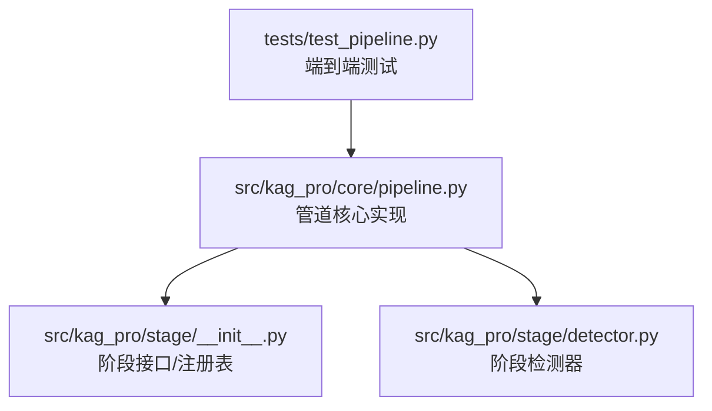
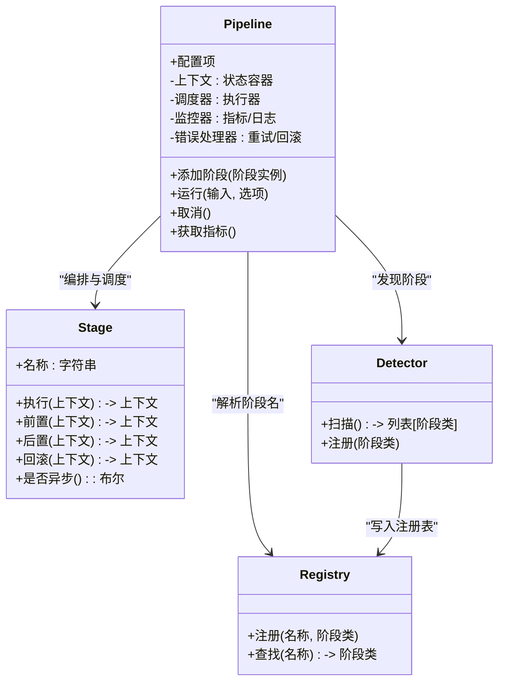
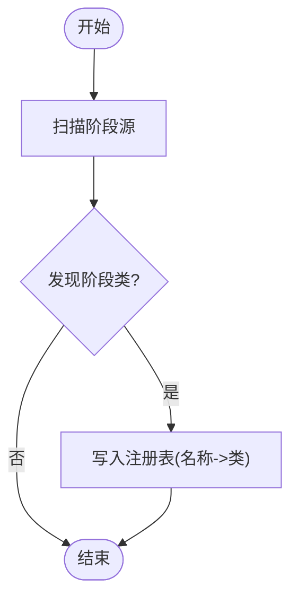
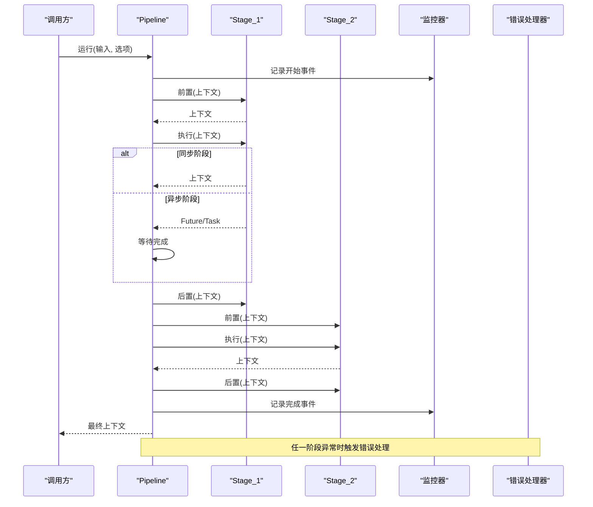
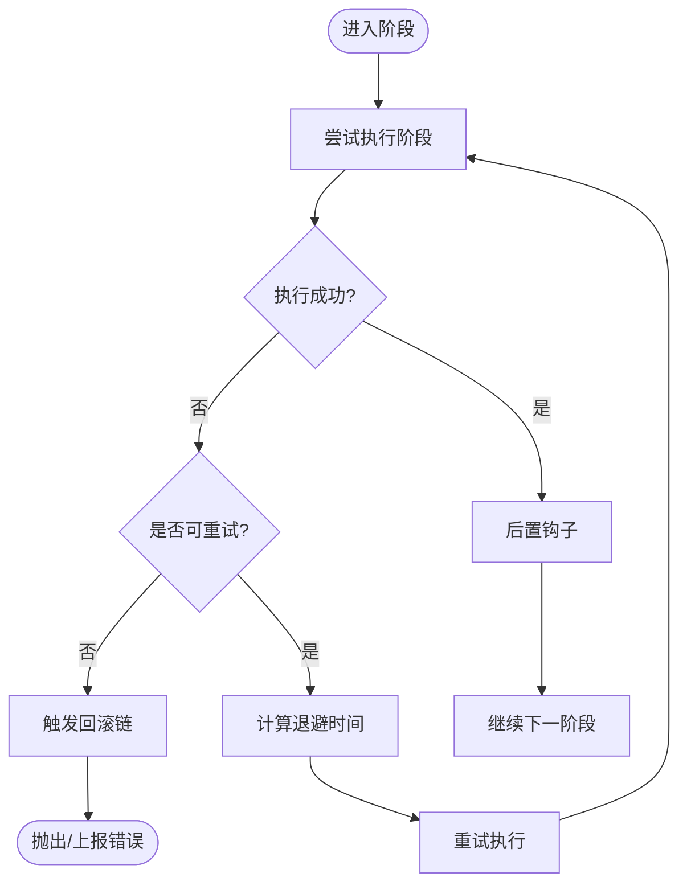
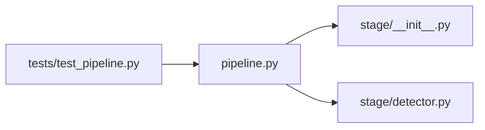

# 管道引擎

<cite>
**本文引用的文件**   
- [src/kag_pro/core/pipeline.py](file://src/kag_pro/core/pipeline.py)
- [tests/test_pipeline.py](file://tests/test_pipeline.py)
- [src/kag_pro/stage/__init__.py](file://src/kag_pro/stage/__init__.py)
- [src/kag_pro/stage/detector.py](file://src/kag_pro/stage/detector.py)
</cite>

## 目录
1. [简介](#简介)
2. [项目结构](#项目结构)
3. [核心组件](#核心组件)
4. [架构总览](#架构总览)
5. [详细组件分析](#详细组件分析)
6. [依赖分析](#依赖分析)
7. [性能考虑](#性能考虑)
8. [故障排查指南](#故障排查指南)
9. [结论](#结论)
10. [附录](#附录)

## 简介
本文件面向KAG-Pro的“管道引擎”组件，聚焦于数据处理管道的架构设计与执行流程。文档涵盖阶段编排、数据流转与状态管理；阶段定义与注册机制；同步/异步执行模式；错误处理策略（异常捕获、重试与回滚）；监控与日志记录；进度跟踪与性能指标收集；使用示例；扩展性与插件化设计；调试工具与性能优化建议。

## 项目结构
围绕管道引擎的相关代码主要位于以下位置：
- 核心实现：src/kag_pro/core/pipeline.py
- 阶段抽象与检测器：src/kag_pro/stage/__init__.py、src/kag_pro/stage/detector.py
- 测试用例：tests/test_pipeline.py

图表来源
- [src/kag_pro/core/pipeline.py](file://src/kag_pro/core/pipeline.py)
- [src/kag_pro/stage/__init__.py](file://src/kag_pro/stage/__init__.py)
- [src/kag_pro/stage/detector.py](file://src/kag_pro/stage/detector.py)
- [tests/test_pipeline.py](file://tests/test_pipeline.py)

章节来源
- [src/kag_pro/core/pipeline.py](file://src/kag_pro/core/pipeline.py)
- [src/kag_pro/stage/__init__.py](file://src/kag_pro/stage/__init__.py)
- [src/kag_pro/stage/detector.py](file://src/kag_pro/stage/detector.py)
- [tests/test_pipeline.py](file://tests/test_pipeline.py)

## 核心组件
- 管道（Pipeline）：负责阶段的编排、调度、上下文传递、生命周期钩子、错误处理、重试与回滚、监控与指标采集。
- 阶段（Stage）：可插拔的数据处理单元，支持同步或异步执行，具备输入/输出契约与可选的状态保存/恢复能力。
- 阶段检测器（Detector）：用于发现并加载已注册的阶段类型，便于动态装配。
- 注册表（Registry）：集中维护阶段名称到实现的映射，提供声明式装配能力。

章节来源
- [src/kag_pro/core/pipeline.py](file://src/kag_pro/core/pipeline.py)
- [src/kag_pro/stage/__init__.py](file://src/kag_pro/stage/__init__.py)
- [src/kag_pro/stage/detector.py](file://src/kag_pro/stage/detector.py)

## 架构总览
下图展示了管道引擎的整体架构与关键交互关系。

图表来源
- [src/kag_pro/core/pipeline.py](file://src/kag_pro/core/pipeline.py)
- [src/kag_pro/stage/__init__.py](file://src/kag_pro/stage/__init__.py)
- [src/kag_pro/stage/detector.py](file://src/kag_pro/stage/detector.py)

## 详细组件分析

### 阶段定义与注册机制
- 阶段接口约定
  - 每个阶段需暴露统一的执行入口，接收上下文对象，返回更新后的上下文。
  - 可选的前置/后置钩子用于准备资源与清理。
  - 可选的回滚方法用于失败时的补偿操作。
  - 通过标记或元数据声明是否为异步阶段。
- 注册表
  - 提供名称到阶段类的映射，支持在运行时按名称解析阶段。
  - 支持重复覆盖与版本选择策略（若实现）。
- 阶段检测器
  - 扫描指定包或模块，自动发现并注册阶段类。
  - 可通过白名单/黑名单过滤。

图表来源
- [src/kag_pro/stage/detector.py](file://src/kag_pro/stage/detector.py)
- [src/kag_pro/stage/__init__.py](file://src/kag_pro/stage/__init__.py)

章节来源
- [src/kag_pro/stage/__init__.py](file://src/kag_pro/stage/__init__.py)
- [src/kag_pro/stage/detector.py](file://src/kag_pro/stage/detector.py)

### 阶段编排与执行流程
- 编排方式
  - 顺序编排：按声明顺序依次执行。
  - 条件分支：根据上下文状态决定后续路径。
  - 并行扇出/汇聚：对独立阶段进行并发执行，再合并结果。
- 上下文与状态
  - 上下文贯穿整个管道，承载中间结果、配置、临时文件句柄等。
  - 阶段可读写上下文中的键值，避免全局变量。
- 生命周期钩子
  - 前置钩子在阶段执行前调用，用于资源初始化。
  - 后置钩子在成功完成后调用，用于资源释放。
  - 回滚钩子在失败时调用，用于补偿与清理。

图表来源
- [src/kag_pro/core/pipeline.py](file://src/kag_pro/core/pipeline.py)

章节来源
- [src/kag_pro/core/pipeline.py](file://src/kag_pro/core/pipeline.py)

### 同步与异步执行模式
- 同步模式
  - 阶段以阻塞方式执行，适合CPU密集或简单I/O任务。
  - 易于调试与追踪，但吞吐受限。
- 异步模式
  - 阶段返回Future/Task，由调度器统一协调。
  - 适合网络I/O或外部服务调用，提升整体吞吐。
- 混合模式
  - 同一管道可同时包含同步与异步阶段，调度器自动适配。

章节来源
- [src/kag_pro/core/pipeline.py](file://src/kag_pro/core/pipeline.py)

### 错误处理策略
- 异常捕获
  - 在阶段边界捕获异常，记录堆栈与上下文快照。
  - 区分可恢复与不可恢复错误。
- 重试机制
  - 基于指数退避的重试策略，支持最大次数与抖动参数。
  - 仅对幂等或可安全重试的操作启用。
- 回滚操作
  - 按阶段逆序调用回滚钩子，确保状态一致性。
  - 支持部分回滚与补偿事务。

图表来源
- [src/kag_pro/core/pipeline.py](file://src/kag_pro/core/pipeline.py)

章节来源
- [src/kag_pro/core/pipeline.py](file://src/kag_pro/core/pipeline.py)

### 监控与日志记录
- 指标采集
  - 阶段级耗时、成功率、失败率、重试次数。
  - 管道级吞吐、延迟分位、队列长度（若适用）。
- 日志记录
  - 结构化日志，包含阶段名、上下文ID、耗时、错误码。
  - 支持采样与分级输出。
- 进度跟踪
  - 阶段完成百分比、预计剩余时间。
  - 回调或事件流推送进度。

章节来源
- [src/kag_pro/core/pipeline.py](file://src/kag_pro/core/pipeline.py)

### 使用示例
以下为典型用法步骤（不展示具体代码内容，仅提供路径参考）：
- 定义阶段
  - 参考：[tests/test_pipeline.py](file://tests/test_pipeline.py)
- 注册阶段
  - 参考：[src/kag_pro/stage/__init__.py](file://src/kag_pro/stage/__init__.py)
- 组装管道
  - 参考：[tests/test_pipeline.py](file://tests/test_pipeline.py)
- 执行管道
  - 参考：[tests/test_pipeline.py](file://tests/test_pipeline.py)
- 查看指标与日志
  - 参考：[src/kag_pro/core/pipeline.py](file://src/kag_pro/core/pipeline.py)

章节来源
- [tests/test_pipeline.py](file://tests/test_pipeline.py)
- [src/kag_pro/core/pipeline.py](file://src/kag_pro/core/pipeline.py)
- [src/kag_pro/stage/__init__.py](file://src/kag_pro/stage/__init__.py)

### 扩展性与插件化设计
- 插件发现
  - 通过检测器扫描第三方包，自动注册新阶段。
- 命名空间隔离
  - 为不同业务域提供独立命名空间，避免名称冲突。
- 版本兼容
  - 阶段类可声明最小/最大兼容版本，管道启动时校验。
- 配置注入
  - 通过上下文或专用配置对象向阶段注入参数，避免硬编码。

章节来源
- [src/kag_pro/stage/detector.py](file://src/kag_pro/stage/detector.py)
- [src/kag_pro/stage/__init__.py](file://src/kag_pro/stage/__init__.py)

### 调试工具与性能优化建议
- 调试工具
  - 单步执行：逐阶段断点与上下文快照导出。
  - 重放：从某阶段起点重放历史上下文。
  - 可视化：阶段依赖图与执行时序图。
- 性能优化
  - 合理设置并发度，避免过度竞争。
  - 将长尾阶段拆分或缓存中间结果。
  - 使用批处理减少外部调用开销。
  - 对幂等阶段启用重试，降低瞬时失败影响。

章节来源
- [src/kag_pro/core/pipeline.py](file://src/kag_pro/core/pipeline.py)

## 依赖分析
- 内部依赖
  - 管道核心依赖阶段接口与注册表，解耦了具体实现。
  - 检测器依赖注册表，负责发现与装配。
- 外部依赖
  - 日志与指标库（如实现中引入）。
  - 并发原语（线程池/事件循环）。
- 潜在风险
  - 循环依赖：阶段不应反向依赖管道核心。
  - 全局状态：应通过上下文传递，避免共享可变状态。

图表来源
- [src/kag_pro/core/pipeline.py](file://src/kag_pro/core/pipeline.py)
- [src/kag_pro/stage/__init__.py](file://src/kag_pro/stage/__init__.py)
- [src/kag_pro/stage/detector.py](file://src/kag_pro/stage/detector.py)
- [tests/test_pipeline.py](file://tests/test_pipeline.py)

章节来源
- [src/kag_pro/core/pipeline.py](file://src/kag_pro/core/pipeline.py)
- [src/kag_pro/stage/__init__.py](file://src/kag_pro/stage/__init__.py)
- [src/kag_pro/stage/detector.py](file://src/kag_pro/stage/detector.py)
- [tests/test_pipeline.py](file://tests/test_pipeline.py)

## 性能考虑
- 并发模型选择
  - I/O密集型优先异步；CPU密集型优先多进程或多线程池。
- 背压与限流
  - 对上游生产者与下游消费者之间增加缓冲与限流，防止雪崩。
- 缓存与去重
  - 对昂贵计算或外部查询结果进行缓存，结合键策略避免污染。
- 资源回收
  - 严格在后置钩子释放连接、文件句柄与临时文件。

## 故障排查指南
- 常见问题定位
  - 阶段超时：检查外部依赖响应时间与重试策略。
  - 内存泄漏：确认未释放的资源与上下文过大对象。
  - 死锁：避免跨阶段持有锁的顺序不一致。
- 诊断手段
  - 开启详细日志与指标导出。
  - 导出上下文快照与阶段执行时序。
  - 使用重放功能复现问题。

章节来源
- [src/kag_pro/core/pipeline.py](file://src/kag_pro/core/pipeline.py)

## 结论
KAG-Pro的管道引擎通过清晰的阶段接口、灵活的编排与强大的错误处理机制，提供了高内聚、低耦合的数据处理框架。借助检测器与注册表，系统具备良好的扩展性与插件化能力。配合完善的监控、日志与调试工具，可在复杂场景下保障稳定性与可观测性。

## 附录
- 术语
  - 阶段：最小可复用处理单元。
  - 上下文：贯穿管道的状态载体。
  - 注册表：名称到实现的映射表。
  - 检测器：自动发现并注册阶段的工具。
- 最佳实践
  - 保持阶段幂等与无副作用。
  - 明确输入/输出契约，避免隐式依赖。
  - 为外部调用设置超时与熔断。
  - 为关键路径添加指标与告警。