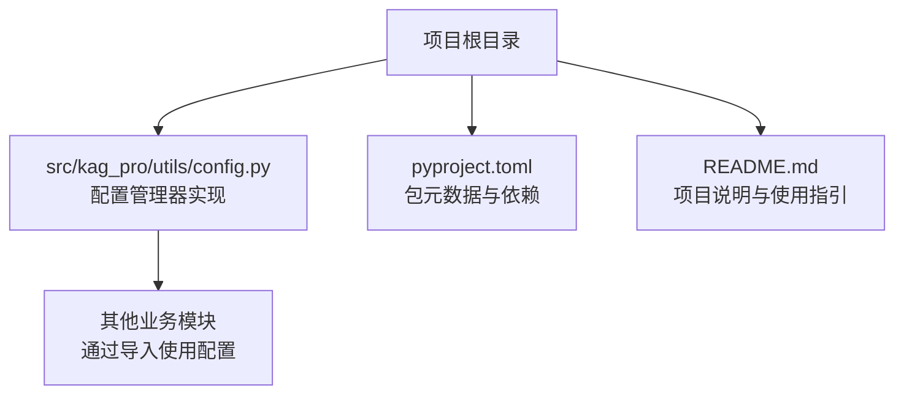
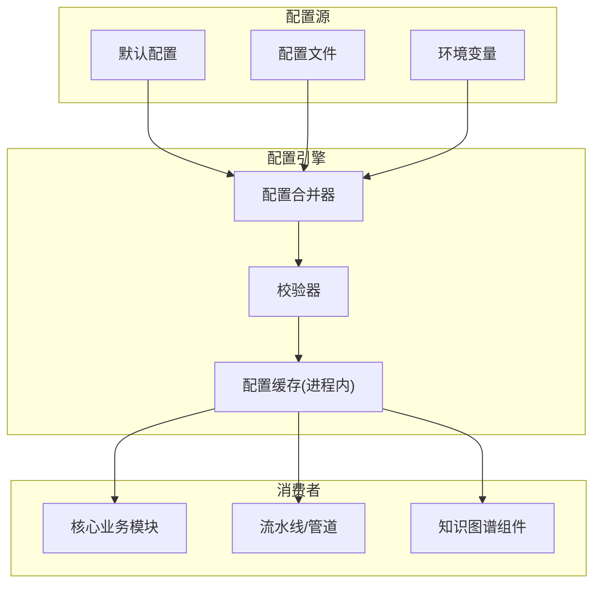
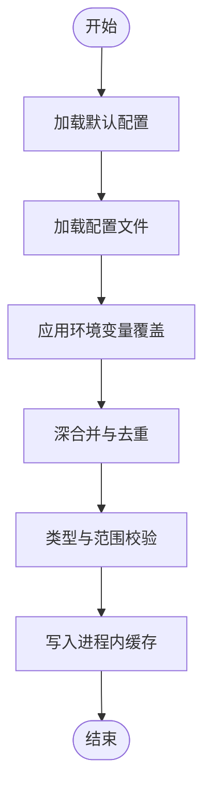
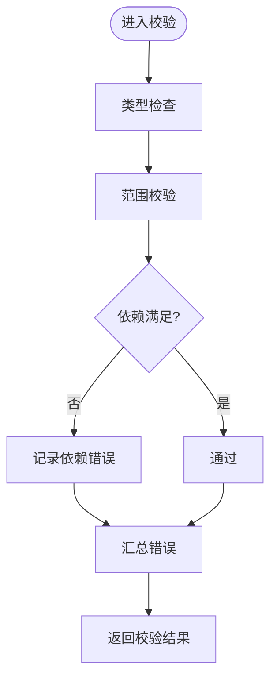
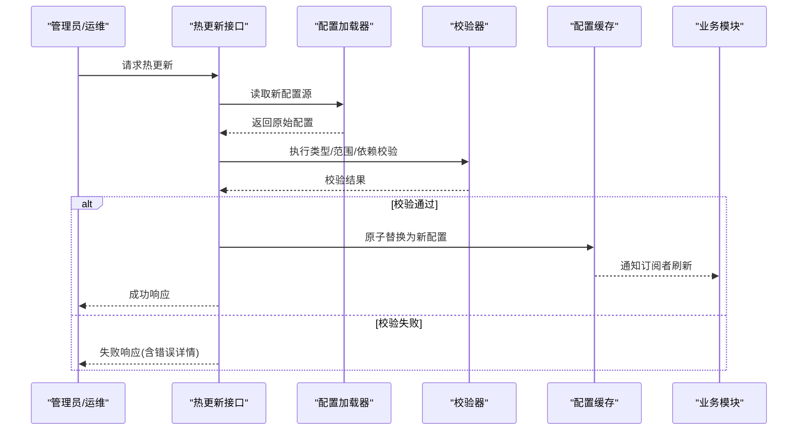
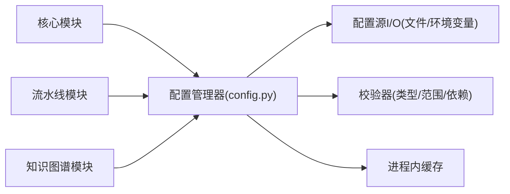

# 配置管理器

<cite>
**本文引用的文件**   
- [src/kag_pro/utils/config.py](file://src/kag_pro/utils/config.py)
- [pyproject.toml](file://pyproject.toml)
- [README.md](file://README.md)
</cite>

## 目录
1. [简介](#简介)
2. [项目结构](#项目结构)
3. [核心组件](#核心组件)
4. [架构总览](#架构总览)
5. [详细组件分析](#详细组件分析)
6. [依赖关系分析](#依赖关系分析)
7. [性能考虑](#性能考虑)
8. [故障排查指南](#故障排查指南)
9. [结论](#结论)
10. [附录](#附录) 

## 简介
本技术文档聚焦于 KAG-Pro 的配置管理器组件，围绕以下目标展开：
- 解释配置系统的设计模式与层次结构，包括环境变量、配置文件与默认值的优先级管理。
- 说明配置项的定义规范与数据验证机制（类型检查、范围校验、依赖关系检查）。
- 文档化配置的动态加载与热更新能力，支持运行时修改而不重启服务。
- 阐述多环境配置管理策略（开发、测试、生产差异化）。
- 提供使用示例路径，展示如何定义配置类、读取配置值并进行验证。
- 讨论配置安全性（敏感信息加密与访问权限控制）。
- 给出配置迁移工具与版本兼容性管理策略建议。

## 项目结构
KAG-Pro 采用按功能域组织源码的方式，配置相关逻辑集中在 utils 模块中，便于被各子系统复用。顶层的 pyproject.toml 用于声明包元数据与依赖，README.md 提供项目概览与使用说明。

图表来源
- [src/kag_pro/utils/config.py](file://src/kag_pro/utils/config.py)
- [pyproject.toml](file://pyproject.toml)
- [README.md](file://README.md)

章节来源
- [src/kag_pro/utils/config.py](file://src/kag_pro/utils/config.py)
- [pyproject.toml](file://pyproject.toml)
- [README.md](file://README.md)

## 核心组件
配置管理器位于 utils/config.py，承担以下职责：
- 统一入口：对外暴露获取配置对象的方法，供业务模块调用。
- 层级合并：将默认配置、配置文件与环境变量进行合并，形成最终生效配置。
- 类型与约束：对关键配置项执行类型转换与范围校验，确保运行期稳定性。
- 动态更新：在进程内维护可更新的配置缓存，支持热更新。
- 多环境：依据环境变量或显式参数选择不同环境配置集。

章节来源
- [src/kag_pro/utils/config.py](file://src/kag_pro/utils/config.py)

## 架构总览
下图展示了配置系统的整体架构与数据流向：从默认配置到配置文件再到环境变量，最终生成全局可用的配置对象；同时提供热更新接口以在不重启的情况下刷新配置。

图表来源
- [src/kag_pro/utils/config.py](file://src/kag_pro/utils/config.py)

## 详细组件分析

### 配置项定义与命名规范
- 命名约定：采用分层键名，如“模块.子模块.配置项”，避免冲突并提升可读性。
- 类型标注：为每个配置项明确期望类型（字符串、数值、布尔、列表等），以便进行类型检查与自动转换。
- 默认值：为所有非必填项提供合理默认值，降低启动失败概率。
- 分组与注释：按功能域分组，并为关键配置项添加描述性注释，便于维护与审计。

章节来源
- [src/kag_pro/utils/config.py](file://src/kag_pro/utils/config.py)

### 优先级与合并策略
- 优先级顺序（从高到低）：环境变量 > 配置文件 > 默认配置。
- 覆盖规则：高优先级源会覆盖低优先级源的相同键；未出现的键保留低优先级值。
- 合并粒度：支持深合并（嵌套字典逐层合并），避免上层覆盖下层全部结构。
- 环境选择：根据环境变量或显式参数选择不同配置文件或配置片段。

图表来源
- [src/kag_pro/utils/config.py](file://src/kag_pro/utils/config.py)

章节来源
- [src/kag_pro/utils/config.py](file://src/kag_pro/utils/config.py)

### 数据验证机制
- 类型检查：对配置值进行类型断言与必要时的类型转换（例如字符串转整数）。
- 范围校验：对数值型配置进行上下界限制，防止越界导致异常。
- 依赖关系检查：当某配置启用时，强制要求其他关联配置存在且合法。
- 错误聚合：收集所有校验错误并一次性返回，便于快速修复。

图表来源
- [src/kag_pro/utils/config.py](file://src/kag_pro/utils/config.py)

章节来源
- [src/kag_pro/utils/config.py](file://src/kag_pro/utils/config.py)

### 动态加载与热更新
- 进程内缓存：配置对象缓存在内存中，避免频繁 I/O。
- 热更新接口：提供方法在运行时重新加载指定配置源并触发校验，成功后替换缓存。
- 原子切换：新配置校验通过后，再原子替换旧配置，保证一致性。
- 事件通知：可选地广播配置变更事件，驱动订阅者刷新状态。

图表来源
- [src/kag_pro/utils/config.py](file://src/kag_pro/utils/config.py)

章节来源
- [src/kag_pro/utils/config.py](file://src/kag_pro/utils/config.py)

### 多环境配置管理
- 环境标识：通过环境变量（如运行环境名称）选择对应配置集。
- 文件组织：可按环境拆分配置文件或使用同一文件的条件分支。
- 差异化管理：仅在不同环境间差异化的部分进行覆盖，减少冗余。
- 安全隔离：生产环境禁用调试开关与日志级别过高输出。

章节来源
- [src/kag_pro/utils/config.py](file://src/kag_pro/utils/config.py)

### 使用示例（路径指引）
- 定义配置类：参考配置定义位置，了解如何声明配置项、默认值与校验规则。
- 读取配置值：参考配置获取入口，学习如何以类型安全方式读取配置。
- 配置验证：参考校验流程，理解类型、范围与依赖关系的检查点。
- 热更新调用：参考热更新接口，掌握如何在运行时刷新配置。

章节来源
- [src/kag_pro/utils/config.py](file://src/kag_pro/utils/config.py)

### 安全性考虑
- 敏感信息：建议使用环境变量注入密钥、令牌等敏感配置，避免硬编码。
- 最小权限：按需授予配置读取权限，限制无关进程访问。
- 审计与脱敏：记录配置变更审计日志，并在日志中脱敏敏感字段。
- 传输安全：若涉及远程配置中心，需启用 TLS 与鉴权。

章节来源
- [src/kag_pro/utils/config.py](file://src/kag_pro/utils/config.py)

### 配置迁移与版本兼容
- 向后兼容：新增配置项需提供默认值，避免破坏旧版本行为。
- 废弃策略：对即将移除的配置项提供弃用警告与替代方案。
- 迁移脚本：提供命令行工具或函数，批量完成配置项重命名、格式升级与默认值填充。
- 版本标记：在配置元数据中标注最低兼容版本，启动时进行版本检查。

章节来源
- [src/kag_pro/utils/config.py](file://src/kag_pro/utils/config.py)

## 依赖关系分析
配置管理器作为基础设施组件，被多个业务模块依赖。其自身依赖应尽可能精简，以降低耦合度。

图表来源
- [src/kag_pro/utils/config.py](file://src/kag_pro/utils/config.py)

章节来源
- [src/kag_pro/utils/config.py](file://src/kag_pro/utils/config.py)

## 性能考虑
- 懒加载：仅在首次访问时加载配置，减少启动开销。
- 增量更新：热更新只处理变更部分，避免全量重建。
- 缓存命中：高频读取走内存缓存，避免重复解析与校验。
- 并发安全：对配置读写加锁或采用无锁数据结构，保障线程安全。

[本节为通用指导，不直接分析具体文件]

## 故障排查指南
- 常见错误
  - 类型不匹配：检查配置值类型是否与定义一致，必要时进行转换。
  - 范围越界：确认数值是否在允许区间内。
  - 依赖缺失：启用某功能后，补齐必需的配置项。
- 定位步骤
  - 查看校验错误汇总，优先修复第一个错误。
  - 对比当前环境与默认配置差异，逐步缩小范围。
  - 开启调试日志，追踪配置加载与合并过程。
- 恢复策略
  - 回滚至上一份已知正确的配置快照。
  - 临时降级关闭有问题的功能开关。

章节来源
- [src/kag_pro/utils/config.py](file://src/kag_pro/utils/config.py)

## 结论
KAG-Pro 的配置管理器通过清晰的层次结构与严格的校验机制，提供了稳定、可扩展且安全的配置管理能力。结合热更新与多环境策略，能够在不中断服务的前提下灵活调整运行参数，满足不同场景下的需求。建议在团队内统一配置定义规范与安全实践，并配合迁移工具与版本策略，持续演进配置体系。

[本节为总结性内容，不直接分析具体文件]

## 附录
- 术语表
  - 热更新：在不重启进程的情况下动态刷新配置。
  - 深合并：递归合并嵌套结构，避免上层覆盖下层全部字段。
  - 最小权限：仅授予必要的配置访问权限。
- 参考文件
  - 包元数据与依赖：[pyproject.toml](file://pyproject.toml)
  - 项目说明与使用指引：[README.md](file://README.md)