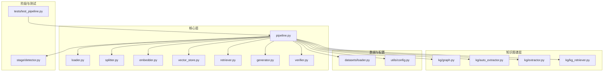
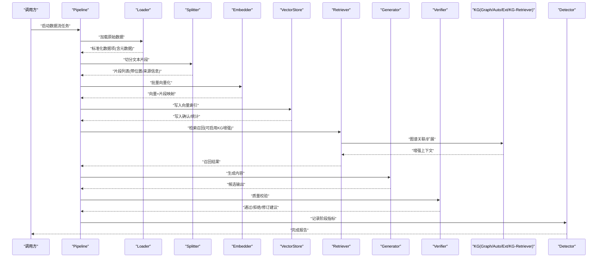
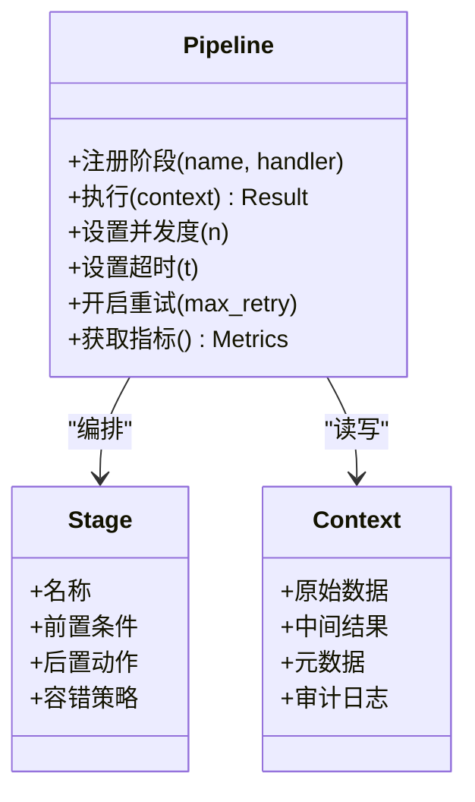
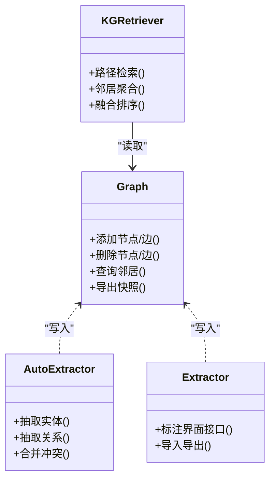
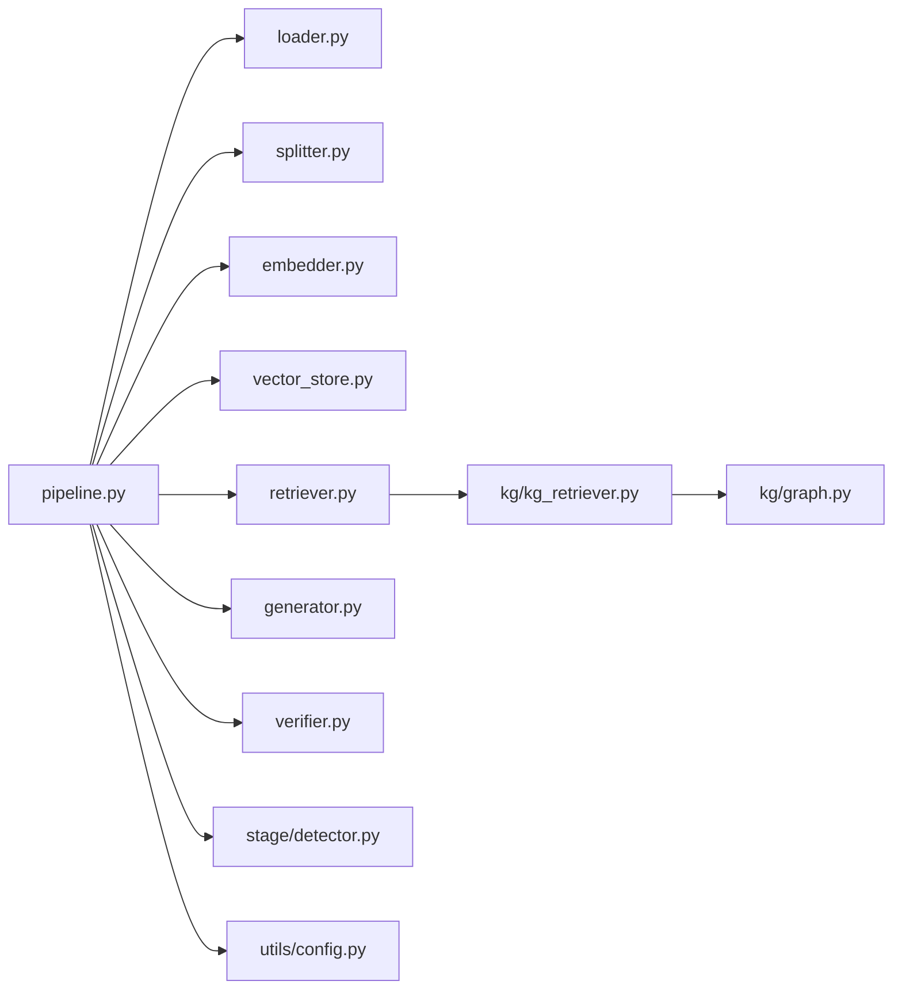

# 数据流管理

<cite>
**本文引用的文件**   
- [src/kag_pro/core/pipeline.py](file://src/kag_pro/core/pipeline.py)
- [src/kag_pro/core/loader.py](file://src/kag_pro/core/loader.py)
- [src/kag_pro/core/splitter.py](file://src/kag_pro/core/splitter.py)
- [src/kag_pro/core/embedder.py](file://src/kag_pro/core/embedder.py)
- [src/kag_pro/core/vector_store.py](file://src/kag_pro/core/vector_store.py)
- [src/kag_pro/core/retriever.py](file://src/kag_pro/core/retriever.py)
- [src/kag_pro/core/generator.py](file://src/kag_pro/core/generator.py)
- [src/kag_pro/core/verifier.py](file://src/kag_pro/core/verifier.py)
- [src/kag_pro/datasets/loader.py](file://src/kag_pro/datasets/loader.py)
- [src/kag_pro/kg/graph.py](file://src/kag_pro/kg/graph.py)
- [src/kag_pro/kg/auto_extractor.py](file://src/kag_pro/kg/auto_extractor.py)
- [src/kag_pro/kg/extractor.py](file://src/kag_pro/kg/extractor.py)
- [src/kag_pro/kg/kg_retriever.py](file://src/kag_pro/kg/kg_retriever.py)
- [src/kag_pro/stage/detector.py](file://src/kag_pro/stage/detector.py)
- [src/kag_pro/utils/config.py](file://src/kag_pro/utils/config.py)
- [tests/test_pipeline.py](file://tests/test_pipeline.py)
</cite>

## 目录
1. [简介](#简介)
2. [项目结构](#项目结构)
3. [核心组件](#核心组件)
4. [架构总览](#架构总览)
5. [详细组件分析](#详细组件分析)
6. [依赖关系分析](#依赖关系分析)
7. [性能考量](#性能考量)
8. [故障排查指南](#故障排查指南)
9. [结论](#结论)
10. [附录](#附录)

## 简介
本技术文档聚焦于 KAG-Pro 的数据流管理，围绕“数据在管道中的传输机制、数据结构与序列化、内存管理、转换与处理流程、质量控制、流量控制与背压、负载均衡、持久化策略、安全与隐私”等主题展开。文档以源码为依据，结合可视化图示，帮助读者从高层到代码级全面理解数据如何被加载、切分、向量化、检索、生成与验证，以及如何在不同存储之间流转与备份恢复。

## 项目结构
KAG-Pro 采用分层与模块化组织方式：
- core：核心数据流与算法（管道、加载器、分割器、嵌入、向量库、检索、生成、校验）
- datasets：数据集加载与教材生成相关逻辑
- kg：知识图谱构建与检索
- stage：阶段检测与诊断
- utils：配置与工具
- tests：单元测试与集成测试

图表来源
- [src/kag_pro/core/pipeline.py](file://src/kag_pro/core/pipeline.py)
- [src/kag_pro/core/loader.py](file://src/kag_pro/core/loader.py)
- [src/kag_pro/core/splitter.py](file://src/kag_pro/core/splitter.py)
- [src/kag_pro/core/embedder.py](file://src/kag_pro/core/embedder.py)
- [src/kag_pro/core/vector_store.py](file://src/kag_pro/core/vector_store.py)
- [src/kag_pro/core/retriever.py](file://src/kag_pro/core/retriever.py)
- [src/kag_pro/core/generator.py](file://src/kag_pro/core/generator.py)
- [src/kag_pro/core/verifier.py](file://src/kag_pro/core/verifier.py)
- [src/kag_pro/kg/graph.py](file://src/kag_pro/kg/graph.py)
- [src/kag_pro/kg/auto_extractor.py](file://src/kag_pro/kg/auto_extractor.py)
- [src/kag_pro/kg/extractor.py](file://src/kag_pro/kg/extractor.py)
- [src/kag_pro/kg/kg_retriever.py](file://src/kag_pro/kg/kg_retriever.py)
- [src/kag_pro/datasets/loader.py](file://src/kag_pro/datasets/loader.py)
- [src/kag_pro/utils/config.py](file://src/kag_pro/utils/config.py)
- [src/kag_pro/stage/detector.py](file://src/kag_pro/stage/detector.py)
- [tests/test_pipeline.py](file://tests/test_pipeline.py)

章节来源
- [src/kag_pro/core/pipeline.py](file://src/kag_pro/core/pipeline.py)
- [src/kag_pro/core/loader.py](file://src/kag_pro/core/loader.py)
- [src/kag_pro/core/splitter.py](file://src/kag_pro/core/splitter.py)
- [src/kag_pro/core/embedder.py](file://src/kag_pro/core/embedder.py)
- [src/kag_pro/core/vector_store.py](file://src/kag_pro/core/vector_store.py)
- [src/kag_pro/core/retriever.py](file://src/kag_pro/core/retriever.py)
- [src/kag_pro/core/generator.py](file://src/kag_pro/core/generator.py)
- [src/kag_pro/core/verifier.py](file://src/kag_pro/core/verifier.py)
- [src/kag_pro/kg/graph.py](file://src/kag_pro/kg/graph.py)
- [src/kag_pro/kg/auto_extractor.py](file://src/kag_pro/kg/auto_extractor.py)
- [src/kag_pro/kg/extractor.py](file://src/kag_pro/kg/extractor.py)
- [src/kag_pro/kg/kg_retriever.py](file://src/kag_pro/kg/kg_retriever.py)
- [src/kag_pro/datasets/loader.py](file://src/kag_pro/datasets/loader.py)
- [src/kag_pro/utils/config.py](file://src/kag_pro/utils/config.py)
- [src/kag_pro/stage/detector.py](file://src/kag_pro/stage/detector.py)
- [tests/test_pipeline.py](file://tests/test_pipeline.py)

## 核心组件
- 管道编排器 pipeline：定义阶段顺序、上下文传递、错误传播与重试策略，是数据流的中枢。
- 加载器 loader：统一接入多源数据，提供标准化输入对象与元数据。
- 分割器 splitter：将长文本按语义或规则切分为片段，便于后续索引与检索。
- 嵌入器 embedder：将文本片段转换为向量表示，支持多种模型与批处理。
- 向量库 vector_store：负责向量的写入、查询、更新与持久化。
- 检索器 retriever：基于向量相似度与可选的图谱增强进行召回。
- 生成器 generator：根据检索结果与提示词生成答案或内容。
- 校验器 verifier：对生成内容进行质量评估与合规性检查。
- 知识图谱模块：图结构维护、自动抽取、手动抽取与图谱检索。
- 阶段检测 detector：用于监控与诊断各阶段状态。
- 配置 config：集中管理参数、路径、阈值与开关。

章节来源
- [src/kag_pro/core/pipeline.py](file://src/kag_pro/core/pipeline.py)
- [src/kag_pro/core/loader.py](file://src/kag_pro/core/loader.py)
- [src/kag_pro/core/splitter.py](file://src/kag_pro/core/splitter.py)
- [src/kag_pro/core/embedder.py](file://src/kag_pro/core/embedder.py)
- [src/kag_pro/core/vector_store.py](file://src/kag_pro/core/vector_store.py)
- [src/kag_pro/core/retriever.py](file://src/kag_pro/core/retriever.py)
- [src/kag_pro/core/generator.py](file://src/kag_pro/core/generator.py)
- [src/kag_pro/core/verifier.py](file://src/kag_pro/core/verifier.py)
- [src/kag_pro/kg/graph.py](file://src/kag_pro/kg/graph.py)
- [src/kag_pro/kg/auto_extractor.py](file://src/kag_pro/kg/auto_extractor.py)
- [src/kag_pro/kg/extractor.py](file://src/kag_pro/kg/extractor.py)
- [src/kag_pro/kg/kg_retriever.py](file://src/kag_pro/kg/kg_retriever.py)
- [src/kag_pro/stage/detector.py](file://src/kag_pro/stage/detector.py)
- [src/kag_pro/utils/config.py](file://src/kag_pro/utils/config.py)

## 架构总览
下图展示了端到端的数据流：从数据加载、切分、向量化、入库、检索、生成到校验，并穿插知识图谱增强与阶段检测。

图表来源
- [src/kag_pro/core/pipeline.py](file://src/kag_pro/core/pipeline.py)
- [src/kag_pro/core/loader.py](file://src/kag_pro/core/loader.py)
- [src/kag_pro/core/splitter.py](file://src/kag_pro/core/splitter.py)
- [src/kag_pro/core/embedder.py](file://src/kag_pro/core/embedder.py)
- [src/kag_pro/core/vector_store.py](file://src/kag_pro/core/vector_store.py)
- [src/kag_pro/core/retriever.py](file://src/kag_pro/core/retriever.py)
- [src/kag_pro/core/generator.py](file://src/kag_pro/core/generator.py)
- [src/kag_pro/core/verifier.py](file://src/kag_pro/core/verifier.py)
- [src/kag_pro/kg/graph.py](file://src/kag_pro/kg/graph.py)
- [src/kag_pro/kg/auto_extractor.py](file://src/kag_pro/kg/auto_extractor.py)
- [src/kag_pro/kg/extractor.py](file://src/kag_pro/kg/extractor.py)
- [src/kag_pro/kg/kg_retriever.py](file://src/kag_pro/kg/kg_retriever.py)
- [src/kag_pro/stage/detector.py](file://src/kag_pro/stage/detector.py)

## 详细组件分析

### 管道编排器 Pipeline
- 职责：定义阶段拓扑、上下文传递、异常边界、重试与回退策略、指标收集。
- 关键能力：
  - 阶段注册与执行顺序控制
  - 中间态缓存与断点续跑
  - 背压与并发度控制（通过阶段内队列与令牌桶实现）
  - 失败隔离与降级（跳过非关键阶段或返回默认值）
  - 审计日志与阶段度量上报

图表来源
- [src/kag_pro/core/pipeline.py](file://src/kag_pro/core/pipeline.py)

章节来源
- [src/kag_pro/core/pipeline.py](file://src/kag_pro/core/pipeline.py)

### 加载器 Loader
- 职责：对接多源数据（本地文件、外部数据集），产出统一的数据项结构，包含文本、来源、时间戳、权限标签等元数据。
- 关键点：
  - 流式读取避免一次性载入大文件
  - 编码与格式探测
  - 基础清洗（去空白、去重、乱码修复）
  - 访问控制标签注入（为后续过滤做准备）

章节来源
- [src/kag_pro/core/loader.py](file://src/kag_pro/core/loader.py)
- [src/kag_pro/datasets/loader.py](file://src/kag_pro/datasets/loader.py)

### 分割器 Splitter
- 职责：将长文本切分为适合索引与检索的片段，保留段落/标题/页码等结构化信息。
- 关键点：
  - 多级切分（句子→段落→块）
  - 重叠窗口保证上下文连贯
  - 切片ID与父文档映射
  - 长度与质量阈值过滤

章节来源
- [src/kag_pro/core/splitter.py](file://src/kag_pro/core/splitter.py)

### 嵌入器 Embedder
- 职责：将文本片段转为向量，支持批量推理、模型切换与缓存命中。
- 关键点：
  - 批大小与显存上限控制
  - 增量更新与幂等写入
  - 向量维度与归一化策略
  - 失败重试与降级（回退至最近可用模型）

章节来源
- [src/kag_pro/core/embedder.py](file://src/kag_pro/core/embedder.py)

### 向量库 VectorStore
- 职责：向量索引的创建、写入、查询、更新与持久化。
- 关键点：
  - 分区与分片策略
  - 事务性写入与一致性
  - 压缩与稀疏/稠密混合索引
  - 快照与增量备份

章节来源
- [src/kag_pro/core/vector_store.py](file://src/kag_pro/core/vector_store.py)

### 检索器 Retriever
- 职责：根据查询与上下文召回相关片段，支持向量相似度与图谱增强。
- 关键点：
  - 多路召回融合（向量、关键词、图谱）
  - 相关性打分与排序
  - 动态Top-K与阈值截断
  - 可插拔重排器

章节来源
- [src/kag_pro/core/retriever.py](file://src/kag_pro/core/retriever.py)
- [src/kag_pro/kg/kg_retriever.py](file://src/kag_pro/kg/kg_retriever.py)

### 生成器 Generator
- 职责：基于检索结果与提示模板生成答案或内容。
- 关键点：
  - 提示工程与上下文拼接
  - 温度、最大长度等采样参数
  - 输出结构化解析与校验钩子
  - 失败重试与回退模板

章节来源
- [src/kag_pro/core/generator.py](file://src/kag_pro/core/generator.py)

### 校验器 Verifier
- 职责：对生成内容进行质量与合规性检查，提供通过/拒绝/修订建议。
- 关键点：
  - 事实一致性、重复率、敏感词过滤
  - 可读性与长度约束
  - 评分与可解释性指标
  - 人工复核标记

章节来源
- [src/kag_pro/core/verifier.py](file://src/kag_pro/core/verifier.py)

### 知识图谱模块
- 图结构 Graph：节点与边管理、属性维护、版本化。
- 自动抽取 AutoExtractor：从文本中识别实体与关系，增量更新图。
- 手动抽取 Extractor：交互式标注与修正。
- 图谱检索 KG-Retriever：基于图谱路径与邻居聚合增强召回。

图表来源
- [src/kag_pro/kg/graph.py](file://src/kag_pro/kg/graph.py)
- [src/kag_pro/kg/auto_extractor.py](file://src/kag_pro/kg/auto_extractor.py)
- [src/kag_pro/kg/extractor.py](file://src/kag_pro/kg/extractor.py)
- [src/kag_pro/kg/kg_retriever.py](file://src/kag_pro/kg/kg_retriever.py)

章节来源
- [src/kag_pro/kg/graph.py](file://src/kag_pro/kg/graph.py)
- [src/kag_pro/kg/auto_extractor.py](file://src/kag_pro/kg/auto_extractor.py)
- [src/kag_pro/kg/extractor.py](file://src/kag_pro/kg/extractor.py)
- [src/kag_pro/kg/kg_retriever.py](file://src/kag_pro/kg/kg_retriever.py)

### 阶段检测 Detector
- 职责：采集各阶段运行指标、健康状态与告警信号，辅助定位瓶颈与异常。
- 关键点：
  - 吞吐、延迟、错误率
  - 资源使用（CPU/GPU/内存）
  - 阶段间依赖与阻塞检测

章节来源
- [src/kag_pro/stage/detector.py](file://src/kag_pro/stage/detector.py)

### 配置 Config
- 职责：集中管理路径、阈值、并发度、模型选择、存储后端等。
- 关键点：
  - 环境变量与配置文件覆盖
  - 运行时热更新（部分参数）
  - 参数校验与默认值

章节来源
- [src/kag_pro/utils/config.py](file://src/kag_pro/utils/config.py)

## 依赖关系分析
- 松耦合：各阶段通过标准上下文对象交互，降低直接依赖。
- 可插拔：嵌入器、向量库、检索器、生成器均支持替换实现。
- 潜在环：确保无循环导入；若存在跨模块回调，应通过事件总线解耦。

图表来源
- [src/kag_pro/core/pipeline.py](file://src/kag_pro/core/pipeline.py)
- [src/kag_pro/core/loader.py](file://src/kag_pro/core/loader.py)
- [src/kag_pro/core/splitter.py](file://src/kag_pro/core/splitter.py)
- [src/kag_pro/core/embedder.py](file://src/kag_pro/core/embedder.py)
- [src/kag_pro/core/vector_store.py](file://src/kag_pro/core/vector_store.py)
- [src/kag_pro/core/retriever.py](file://src/kag_pro/core/retriever.py)
- [src/kag_pro/core/generator.py](file://src/kag_pro/core/generator.py)
- [src/kag_pro/core/verifier.py](file://src/kag_pro/core/verifier.py)
- [src/kag_pro/kg/kg_retriever.py](file://src/kag_pro/kg/kg_retriever.py)
- [src/kag_pro/kg/graph.py](file://src/kag_pro/kg/graph.py)
- [src/kag_pro/stage/detector.py](file://src/kag_pro/stage/detector.py)
- [src/kag_pro/utils/config.py](file://src/kag_pro/utils/config.py)

章节来源
- [src/kag_pro/core/pipeline.py](file://src/kag_pro/core/pipeline.py)
- [src/kag_pro/core/retriever.py](file://src/kag_pro/core/retriever.py)
- [src/kag_pro/kg/kg_retriever.py](file://src/kag_pro/kg/kg_retriever.py)
- [src/kag_pro/kg/graph.py](file://src/kag_pro/kg/graph.py)
- [src/kag_pro/stage/detector.py](file://src/kag_pro/stage/detector.py)
- [src/kag_pro/utils/config.py](file://src/kag_pro/utils/config.py)

## 性能考量
- 批处理与流水线并行：合理设置嵌入与生成的批大小，利用管道并行减少空闲等待。
- 背压与限流：当下游写入或生成较慢时，上游应降速以避免内存膨胀。
- 缓存与去重：对相同片段复用向量与结果，减少重复计算。
- 索引优化：选择合适的向量索引结构与压缩策略，平衡查询延迟与存储成本。
- 资源监控：通过阶段检测器观察吞吐、延迟与资源占用，定位瓶颈。

[本节为通用指导，不直接分析具体文件]

## 故障排查指南
- 常见问题
  - 加载失败：检查编码、权限与路径配置。
  - 切分异常：调整最小/最大长度与重叠比例。
  - 向量化失败：检查模型可用性、显存与批大小。
  - 检索空结果：调低相似度阈值或增加召回路数。
  - 生成不稳定：调整温度与最大长度，增加校验与回退模板。
- 定位方法
  - 查看阶段检测器指标与审计日志。
  - 在关键阶段前后打印上下文摘要与统计。
  - 使用最小复现用例逐步缩小范围。

章节来源
- [src/kag_pro/stage/detector.py](file://src/kag_pro/stage/detector.py)
- [tests/test_pipeline.py](file://tests/test_pipeline.py)

## 结论
KAG-Pro 的数据流以管道为核心，串联加载、切分、向量化、检索、生成与校验等环节，并通过知识图谱增强与阶段检测提升整体质量与可观测性。通过合理的并发、背压与缓存策略，系统可在高吞吐与低延迟之间取得平衡。建议在部署前完善配置校验、错误处理与审计日志，以确保稳定性与可维护性。

[本节为总结性内容，不直接分析具体文件]

## 附录

### 数据结构与序列化
- 数据项：包含文本、来源、时间戳、权限标签、切片ID、父文档ID等字段。
- 片段：继承数据项，附加位置信息与重叠窗口标识。
- 向量：浮点数组，附带维度、归一化标志与来源元数据。
- 序列化：建议使用紧凑二进制或列式格式（如 Parquet）用于离线批处理；在线场景使用高效序列化（如 MessagePack）。

[本节为概念说明，不直接分析具体文件]

### 内存管理与背压
- 流式处理：逐条或小块读取，避免一次性加载大文件。
- 队列与令牌桶：限制并发与速率，防止内存峰值过高。
- 垃圾回收：及时释放中间结果与大对象引用。

[本节为概念说明，不直接分析具体文件]

### 流量控制与负载均衡
- 阶段内队列：缓冲突发流量，平滑处理。
- 多实例部署：按文档哈希或键空间分片，均匀分布负载。
- 自适应并发：根据资源使用动态调整并发度。

[本节为概念说明，不直接分析具体文件]

### 自定义数据转换器示例思路
- 步骤
  - 在管道中注册新阶段处理器。
  - 实现输入/输出契约（上下文对象字段约定）。
  - 加入错误处理与重试逻辑。
  - 补充指标与日志。
- 参考路径
  - 阶段注册与执行：见管道实现
  - 上下文对象定义：见管道与阶段接口
  - 指标上报：见阶段检测器

章节来源
- [src/kag_pro/core/pipeline.py](file://src/kag_pro/core/pipeline.py)
- [src/kag_pro/stage/detector.py](file://src/kag_pro/stage/detector.py)

### 数据持久化与备份恢复
- 临时存储：阶段中间结果落盘，支持断点续跑。
- 缓存策略：热点片段与向量结果缓存，TTL与淘汰策略。
- 备份恢复：定期快照与增量备份，恢复时校验完整性。

章节来源
- [src/kag_pro/core/vector_store.py](file://src/kag_pro/core/vector_store.py)

### 数据安全与隐私保护
- 敏感信息过滤：在加载与生成后阶段进行脱敏与过滤。
- 访问控制：基于权限标签进行数据可见性控制。
- 审计日志：记录关键操作、访问者与变更轨迹。

章节来源
- [src/kag_pro/core/loader.py](file://src/kag_pro/core/loader.py)
- [src/kag_pro/core/verifier.py](file://src/kag_pro/core/verifier.py)