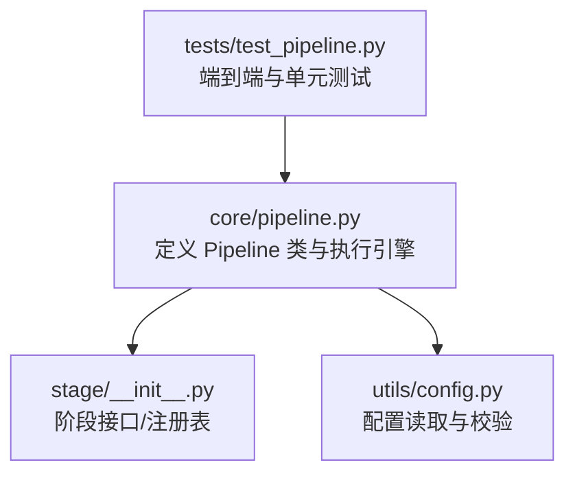
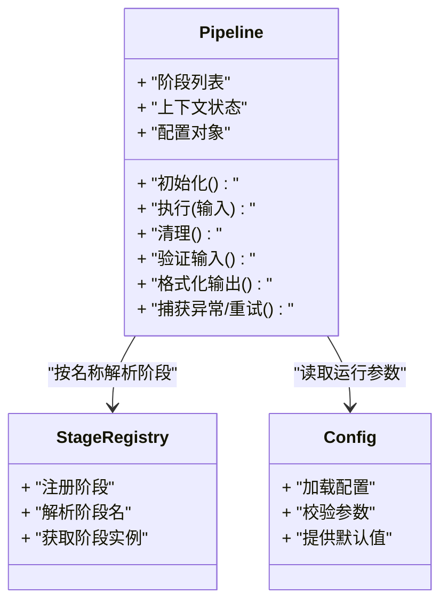
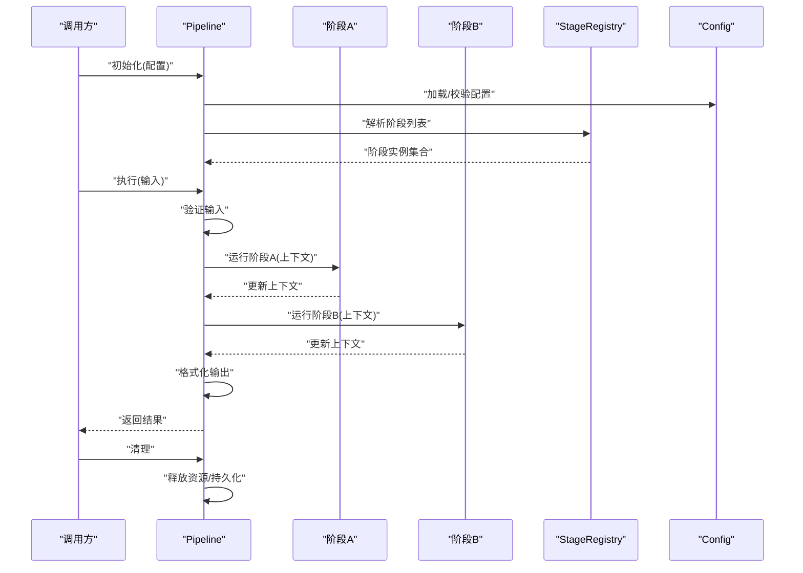
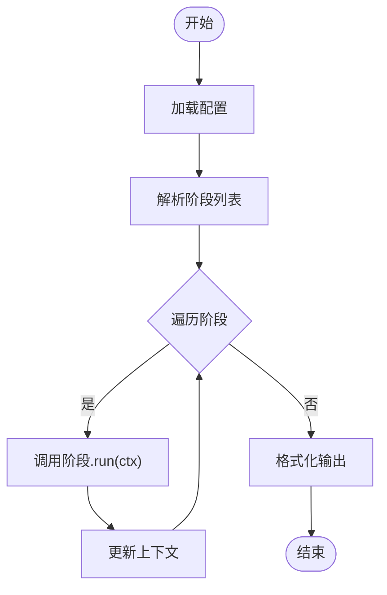
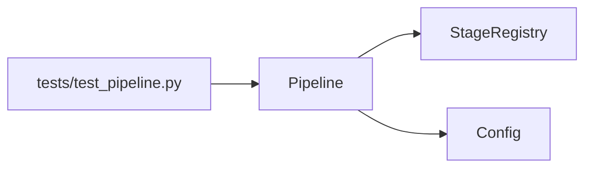

# 管道核心逻辑

<cite>
**本文引用的文件**   
- [src/kag_pro/core/pipeline.py](file://src/kag_pro/core/pipeline.py)
- [tests/test_pipeline.py](file://tests/test_pipeline.py)
- [src/kag_pro/stage/__init__.py](file://src/kag_pro/stage/__init__.py)
- [src/kag_pro/utils/config.py](file://src/kag_pro/utils/config.py)
</cite>

## 目录
1. [简介](#简介)
2. [项目结构](#项目结构)
3. [核心组件](#核心组件)
4. [架构总览](#架构总览)
5. [详细组件分析](#详细组件分析)
6. [依赖关系分析](#依赖关系分析)
7. [性能考虑](#性能考虑)
8. [故障排查指南](#故障排查指南)
9. [结论](#结论)
10. [附录](#附录)

## 简介
本文件聚焦于 KAG-Pro 中“管道”（Pipeline）的核心执行逻辑，围绕 Pipeline 类的设计与实现展开，涵盖阶段定义、执行顺序控制、状态管理、数据流转、生命周期管理、错误处理机制以及性能优化策略。文档旨在帮助读者快速理解并扩展自定义管道，构建复杂的数据处理流程。

## 项目结构
KAG-Pro 采用模块化组织方式，核心管道逻辑位于 core 模块下，测试用例位于 tests 模块，辅助配置位于 utils 模块，通用阶段接口/注册表位于 stage 模块。下图展示了与管道相关的核心文件及其职责：

图表来源
- [src/kag_pro/core/pipeline.py](file://src/kag_pro/core/pipeline.py)
- [src/kag_pro/stage/__init__.py](file://src/kag_pro/stage/__init__.py)
- [src/kag_pro/utils/config.py](file://src/kag_pro/utils/config.py)
- [tests/test_pipeline.py](file://tests/test_pipeline.py)

章节来源
- [src/kag_pro/core/pipeline.py](file://src/kag_pro/core/pipeline.py)
- [src/kag_pro/stage/__init__.py](file://src/kag_pro/stage/__init__.py)
- [src/kag_pro/utils/config.py](file://src/kag_pro/utils/config.py)
- [tests/test_pipeline.py](file://tests/test_pipeline.py)

## 核心组件
- Pipeline 类：负责阶段编排、执行顺序控制、上下文状态管理、输入验证与输出格式化、生命周期钩子（初始化/执行/清理）、错误处理与重试策略、并行与缓存开关等。
- Stage 抽象与注册表：提供统一的阶段接口，支持声明式注册与按名称解析，便于扩展自定义阶段。
- 配置系统：集中管理管道参数、阶段参数、资源限制与行为开关。
- 测试套件：覆盖正常路径、异常路径、边界条件与并发场景，确保管道稳定性。

章节来源
- [src/kag_pro/core/pipeline.py](file://src/kag_pro/core/pipeline.py)
- [src/kag_pro/stage/__init__.py](file://src/kag_pro/stage/__init__.py)
- [src/kag_pro/utils/config.py](file://src/kag_pro/utils/config.py)
- [tests/test_pipeline.py](file://tests/test_pipeline.py)

## 架构总览
下图从代码层面展示 Pipeline 与其关键依赖的交互关系：

图表来源
- [src/kag_pro/core/pipeline.py](file://src/kag_pro/core/pipeline.py)
- [src/kag_pro/stage/__init__.py](file://src/kag_pro/stage/__init__.py)
- [src/kag_pro/utils/config.py](file://src/kag_pro/utils/config.py)

## 详细组件分析

### Pipeline 类设计与执行流程
- 阶段定义与顺序控制
  - 通过声明式阶段列表或配置驱动的阶段序列进行编排。
  - 支持基于依赖关系的拓扑排序（若存在阶段间依赖）。
- 状态管理
  - 维护一个上下文对象，贯穿各阶段共享中间结果。
  - 提供安全的读写访问与版本化快照能力（用于回滚与调试）。
- 输入验证与输出格式化
  - 在入口对输入进行结构化校验，失败即短路返回。
  - 在出口统一格式化输出，保证下游一致消费。
- 生命周期管理
  - 初始化：加载配置、解析阶段、建立资源池/连接。
  - 执行：遍历阶段、传递上下文、记录指标与日志。
  - 清理：释放资源、关闭连接、持久化中间产物（可选）。
- 错误处理与重试
  - 统一异常捕获，区分可恢复与不可恢复错误。
  - 支持指数退避重试、最大重试次数、熔断与降级策略。
- 并行与缓存
  - 可配置阶段级并行度与全局并发上限。
  - 支持阶段输出缓存（键控），避免重复计算。

图表来源
- [src/kag_pro/core/pipeline.py](file://src/kag_pro/core/pipeline.py)
- [src/kag_pro/stage/__init__.py](file://src/kag_pro/stage/__init__.py)
- [src/kag_pro/utils/config.py](file://src/kag_pro/utils/config.py)

章节来源
- [src/kag_pro/core/pipeline.py](file://src/kag_pro/core/pipeline.py)

### 阶段接口与注册表
- 阶段接口
  - 统一方法签名：接收上下文，返回更新后的上下文或中间结果。
  - 支持元数据：阶段描述、依赖声明、资源需求、超时与重试策略。
- 注册表
  - 提供装饰器或显式注册 API，将具体阶段实现映射到名称。
  - 支持版本化与别名，便于演进与兼容。

图表来源
- [src/kag_pro/stage/__init__.py](file://src/kag_pro/stage/__init__.py)
- [src/kag_pro/core/pipeline.py](file://src/kag_pro/core/pipeline.py)

章节来源
- [src/kag_pro/stage/__init__.py](file://src/kag_pro/stage/__init__.py)
- [src/kag_pro/core/pipeline.py](file://src/kag_pro/core/pipeline.py)

### 配置与参数管理
- 集中式配置：包含全局并发、重试策略、缓存开关、阶段参数等。
- 参数校验：类型检查、范围约束、必填项校验。
- 默认值与覆盖：支持配置文件、环境变量与运行时参数叠加。

章节来源
- [src/kag_pro/utils/config.py](file://src/kag_pro/utils/config.py)
- [src/kag_pro/core/pipeline.py](file://src/kag_pro/core/pipeline.py)

### 测试与示例用法
- 单元测试覆盖
  - 正常路径：多阶段串联、上下文传递、输出格式校验。
  - 异常路径：阶段抛错、重试生效、最终失败上报。
  - 边界条件：空输入、零阶段、超长输入、并发竞争。
- 自定义管道示例（以路径引用代替代码片段）
  - 创建自定义阶段：参考测试中的阶段构造与注册方式。
  - 组装管道：使用配置或声明式 API 指定阶段序列与参数。
  - 执行与清理：调用执行接口并处理返回值与异常。
  - 复杂流程：引入分支、合并、重试与缓存的组合。

章节来源
- [tests/test_pipeline.py](file://tests/test_pipeline.py)
- [src/kag_pro/core/pipeline.py](file://src/kag_pro/core/pipeline.py)

## 依赖关系分析
- 内部依赖
  - Pipeline 依赖 StageRegistry 解析阶段实例。
  - Pipeline 依赖 Config 获取运行期参数。
  - 测试依赖 Pipeline 与 StageRegistry 进行断言与模拟。
- 外部依赖
  - 根据实际阶段实现可能依赖 IO、网络、向量库等；这些依赖应通过阶段接口隔离，保持 Pipeline 的纯粹性。

图表来源
- [src/kag_pro/core/pipeline.py](file://src/kag_pro/core/pipeline.py)
- [src/kag_pro/stage/__init__.py](file://src/kag_pro/stage/__init__.py)
- [src/kag_pro/utils/config.py](file://src/kag_pro/utils/config.py)
- [tests/test_pipeline.py](file://tests/test_pipeline.py)

章节来源
- [src/kag_pro/core/pipeline.py](file://src/kag_pro/core/pipeline.py)
- [src/kag_pro/stage/__init__.py](file://src/kag_pro/stage/__init__.py)
- [src/kag_pro/utils/config.py](file://src/kag_pro/utils/config.py)
- [tests/test_pipeline.py](file://tests/test_pipeline.py)

## 性能考虑
- 并行处理
  - 阶段级并行：对无依赖阶段启用并发执行，提升吞吐。
  - 全局并发上限：防止资源争用与 OOM。
- 缓存机制
  - 阶段输出缓存：基于输入指纹或键控缓存，命中直接返回。
  - 缓存失效策略：TTL、大小上限、LRU 淘汰。
- 资源管理
  - 连接池与线程池复用，减少创建销毁开销。
  - 大对象分块处理与流式传输，降低峰值内存。
- 监控与度量
  - 记录阶段耗时、成功率、重试次数、缓存命中率等指标。
  - 结合日志与追踪 ID 定位瓶颈。

[本节为通用指导，不直接分析具体文件]

## 故障排查指南
- 常见问题
  - 阶段未注册或名称解析失败：检查注册表与阶段命名。
  - 输入校验失败：核对输入结构与必填字段。
  - 重试风暴：调整退避策略与最大重试次数。
  - 资源泄漏：确认清理钩子是否被调用，连接是否正确关闭。
- 诊断建议
  - 开启详细日志与上下文快照，定位失败阶段。
  - 使用最小复现用例与单测回归。
  - 针对高延迟阶段增加超时与熔断保护。

章节来源
- [tests/test_pipeline.py](file://tests/test_pipeline.py)
- [src/kag_pro/core/pipeline.py](file://src/kag_pro/core/pipeline.py)

## 结论
Pipeline 作为 KAG-Pro 的执行中枢，通过清晰的阶段抽象、严格的输入输出契约、完善的生命周期管理与健壮的错误处理，提供了可扩展、可观测且高性能的数据处理框架。借助配置化与注册表机制，用户可以快速组合出复杂的数据流水线，并通过并行与缓存等手段获得更好的性能表现。

## 附录
- 术语
  - 阶段：管道中的一个处理单元，具备统一接口与元数据。
  - 上下文：跨阶段共享的状态载体。
  - 注册表：阶段实现与名称的映射容器。
- 最佳实践
  - 将副作用尽量收敛在阶段内，保持纯函数风格。
  - 为每个阶段编写单测，覆盖成功与失败路径。
  - 合理设置超时、重试与缓存，平衡可靠性与性能。