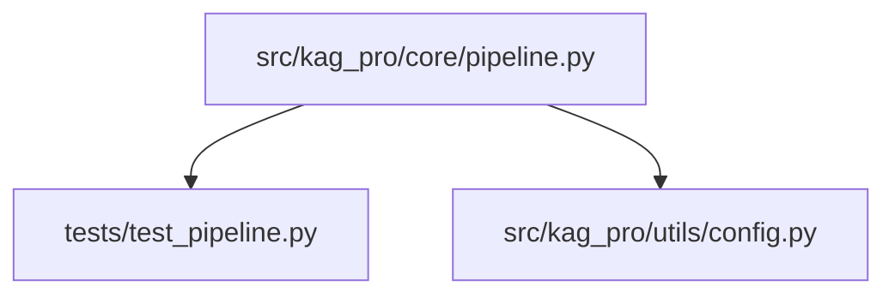
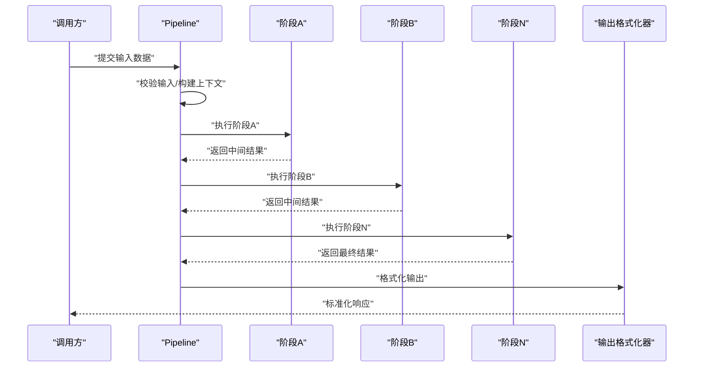
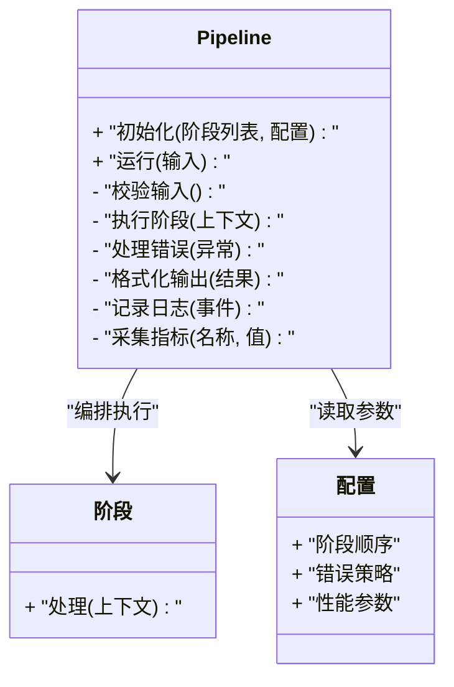
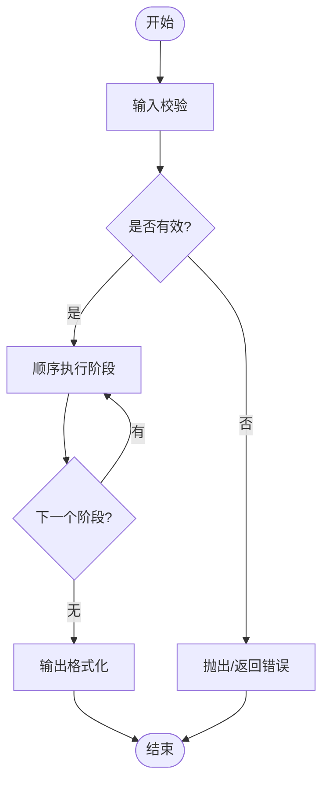
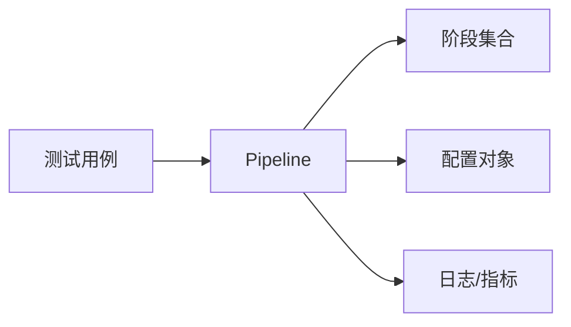

# 管道模式实现

<cite>
**本文引用的文件**   
- [src/kag_pro/core/pipeline.py](file://src/kag_pro/core/pipeline.py)
- [tests/test_pipeline.py](file://tests/test_pipeline.py)
- [src/kag_pro/utils/config.py](file://src/kag_pro/utils/config.py)
</cite>

## 目录
1. [简介](#简介)
2. [项目结构](#项目结构)
3. [核心组件](#核心组件)
4. [架构总览](#架构总览)
5. [详细组件分析](#详细组件分析)
6. [依赖分析](#依赖分析)
7. [性能考虑](#性能考虑)
8. [故障排查指南](#故障排查指南)
9. [结论](#结论)
10. [附录](#附录)

## 简介
本文件面向KAG-Pro的“管道模式”实现，聚焦于Pipeline类的核心逻辑、阶段定义与执行机制，系统阐述数据在管道中的流转过程（输入验证、中间结果处理、输出格式化），并文档化配置选项（阶段顺序控制、错误处理策略、性能优化参数）。同时提供自定义管道阶段的实践指引、扩展点说明，以及监控与调试方法（日志记录、性能指标收集、问题排查）。

## 项目结构
围绕管道模式的核心代码位于core模块中，测试用例位于tests目录，配置工具位于utils目录。下图展示了与管道相关的文件组织关系：

图表来源
- [src/kag_pro/core/pipeline.py](file://src/kag_pro/core/pipeline.py)
- [tests/test_pipeline.py](file://tests/test_pipeline.py)
- [src/kag_pro/utils/config.py](file://src/kag_pro/utils/config.py)

章节来源
- [src/kag_pro/core/pipeline.py](file://src/kag_pro/core/pipeline.py)
- [tests/test_pipeline.py](file://tests/test_pipeline.py)
- [src/kag_pro/utils/config.py](file://src/kag_pro/utils/config.py)

## 核心组件
- Pipeline类：负责编排多个处理阶段，管理阶段生命周期、上下文传递、错误处理与结果聚合。
- 阶段接口/约定：每个阶段需遵循统一的输入/输出契约，以便被Pipeline调度。
- 配置对象：用于声明阶段顺序、错误处理策略、性能相关参数等。

章节来源
- [src/kag_pro/core/pipeline.py](file://src/kag_pro/core/pipeline.py)
- [src/kag_pro/utils/config.py](file://src/kag_pro/utils/config.py)

## 架构总览
下图给出管道模式的总体架构视图，展示从输入到输出的端到端流程，以及各阶段之间的数据流转与控制流。

图表来源
- [src/kag_pro/core/pipeline.py](file://src/kag_pro/core/pipeline.py)
- [tests/test_pipeline.py](file://tests/test_pipeline.py)

## 详细组件分析

### Pipeline类设计与执行机制
- 阶段编排：按配置顺序依次执行阶段；支持并行或串行策略（由配置决定）。
- 上下文传递：每个阶段接收统一上下文对象，包含输入、中间结果、元数据与错误信息。
- 错误处理：可配置是否中断、跳过失败阶段或继续执行并汇总错误。
- 结果聚合：将最后一个阶段的输出作为管道结果，并可进行后处理与格式化。
- 生命周期钩子：在进入/退出阶段前后提供回调点，便于日志与指标采集。

图表来源
- [src/kag_pro/core/pipeline.py](file://src/kag_pro/core/pipeline.py)

章节来源
- [src/kag_pro/core/pipeline.py](file://src/kag_pro/core/pipeline.py)

### 数据流转与处理逻辑
- 输入验证：在管道入口对输入进行必要校验，不合法则快速失败并返回结构化错误。
- 中间结果处理：每个阶段仅关注自身职责，通过上下文读写共享状态，避免强耦合。
- 输出格式化：在管道末尾统一格式化输出，确保对外接口一致性与稳定性。

图表来源
- [src/kag_pro/core/pipeline.py](file://src/kag_pro/core/pipeline.py)

章节来源
- [src/kag_pro/core/pipeline.py](file://src/kag_pro/core/pipeline.py)

### 配置选项与策略
- 阶段顺序控制：通过配置指定阶段执行顺序，支持动态插入/替换。
- 错误处理策略：
  - 立即中断：遇到首个错误即停止后续阶段。
  - 容错继续：记录错误并继续执行剩余阶段，最后汇总错误。
  - 重试与回退：针对特定阶段配置重试次数与回退逻辑。
- 性能优化参数：
  - 并发度：控制阶段并行执行的线程/进程数。
  - 批大小：批量处理时的批次大小。
  - 超时：单阶段最大执行时间。
  - 缓存开关：是否启用中间结果缓存以减少重复计算。

章节来源
- [src/kag_pro/core/pipeline.py](file://src/kag_pro/core/pipeline.py)
- [src/kag_pro/utils/config.py](file://src/kag_pro/utils/config.py)

### 自定义管道阶段与集成新逻辑
- 阶段契约：实现统一的处理接口，接收上下文并返回更新后的上下文。
- 注册与装配：将自定义阶段加入阶段列表并按需排序。
- 示例路径：参考测试用例中的用法，了解如何构造Pipeline、注入阶段与断言结果。

章节来源
- [tests/test_pipeline.py](file://tests/test_pipeline.py)
- [src/kag_pro/core/pipeline.py](file://src/kag_pro/core/pipeline.py)

### 扩展点与组件替换
- 可扩展点：
  - 阶段工厂：根据配置创建不同阶段实例。
  - 错误处理器：替换默认错误处理策略。
  - 输出格式化器：替换默认输出格式。
  - 指标收集器：接入外部监控系统。
- 替换方式：通过配置注入新的实现，无需修改Pipeline核心逻辑。

章节来源
- [src/kag_pro/core/pipeline.py](file://src/kag_pro/core/pipeline.py)

### 监控与调试机制
- 日志记录：在每个阶段前后记录关键事件（进入、退出、异常、耗时）。
- 性能指标：采集阶段耗时、吞吐、错误率、缓存命中率等指标。
- 调试建议：
  - 开启详细日志级别以定位问题。
  - 使用最小复现集隔离故障阶段。
  - 结合指标看板观察瓶颈与抖动。

章节来源
- [src/kag_pro/core/pipeline.py](file://src/kag_pro/core/pipeline.py)

## 依赖分析
下图展示Pipeline与其直接依赖的关系：

图表来源
- [src/kag_pro/core/pipeline.py](file://src/kag_pro/core/pipeline.py)
- [tests/test_pipeline.py](file://tests/test_pipeline.py)
- [src/kag_pro/utils/config.py](file://src/kag_pro/utils/config.py)

章节来源
- [src/kag_pro/core/pipeline.py](file://src/kag_pro/core/pipeline.py)
- [tests/test_pipeline.py](file://tests/test_pipeline.py)
- [src/kag_pro/utils/config.py](file://src/kag_pro/utils/config.py)

## 性能考虑
- 合理设置并发度与批大小，平衡吞吐与资源占用。
- 为昂贵阶段启用缓存，减少重复计算。
- 为长耗时阶段设置超时与熔断，防止雪崩。
- 避免在上下文中传递过大对象，必要时采用引用或分片。
- 利用指标监控热点阶段，针对性优化。

[本节为通用指导，不涉及具体文件分析]

## 故障排查指南
- 常见错误类型：
  - 输入校验失败：检查输入结构与必填字段。
  - 阶段执行异常：查看阶段日志与堆栈，确认依赖与资源。
  - 超时/内存不足：调整超时、批大小与并发度。
- 定位步骤：
  - 缩小范围：禁用部分阶段，逐步恢复以定位问题阶段。
  - 增强日志：在可疑阶段增加关键变量快照。
  - 指标对比：对比正常与异常场景的耗时与错误率差异。

章节来源
- [src/kag_pro/core/pipeline.py](file://src/kag_pro/core/pipeline.py)
- [tests/test_pipeline.py](file://tests/test_pipeline.py)

## 结论
KAG-Pro的管道模式通过清晰的阶段契约与灵活的配置体系，实现了高内聚、低耦合的数据处理流水线。借助完善的错误处理、监控与调试能力，可在复杂业务场景中稳定运行并持续演进。

[本节为总结性内容，不涉及具体文件分析]

## 附录
- 术语表：
  - 阶段：管道中的一个独立处理单元。
  - 上下文：贯穿管道的共享状态载体。
  - 错误策略：定义管道遇到异常时的行为。
- 最佳实践：
  - 单一职责：每个阶段只做一件事。
  - 幂等设计：阶段可安全重试。
  - 可观测性：完善日志与指标。

[本节为补充信息，不涉及具体文件分析]