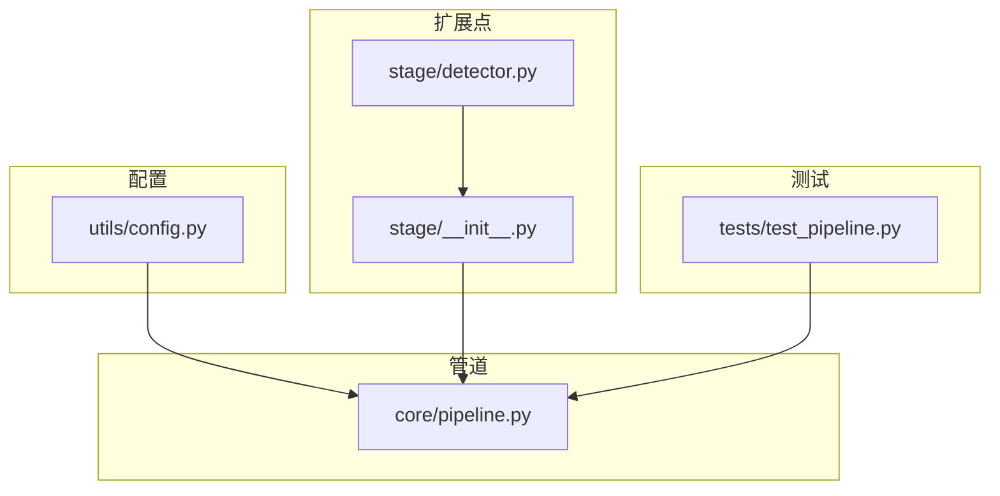
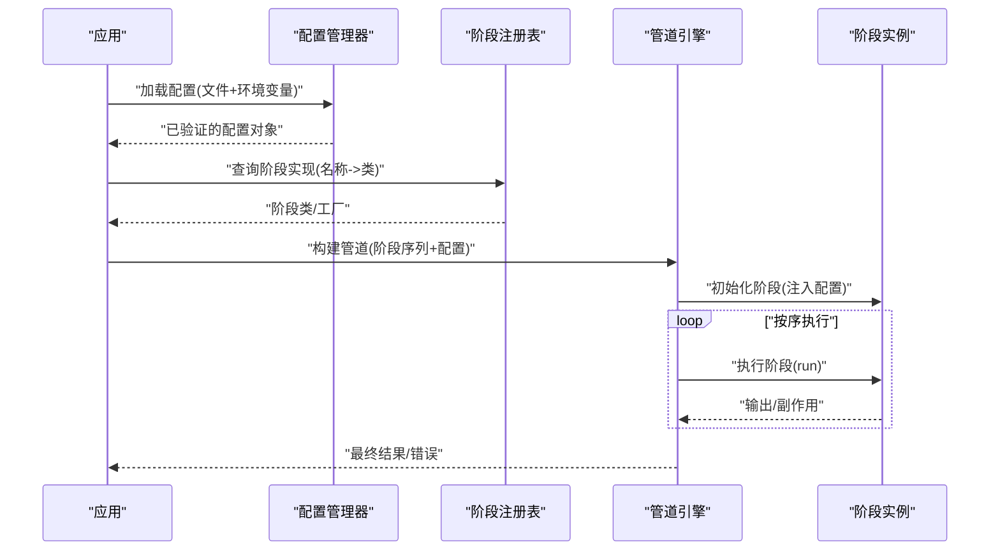
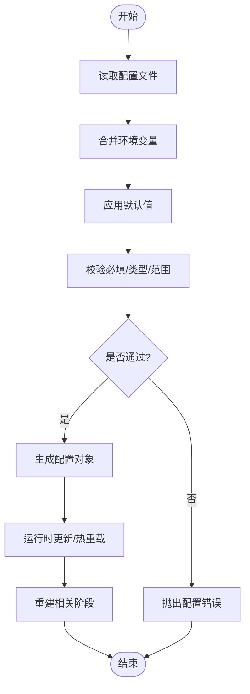
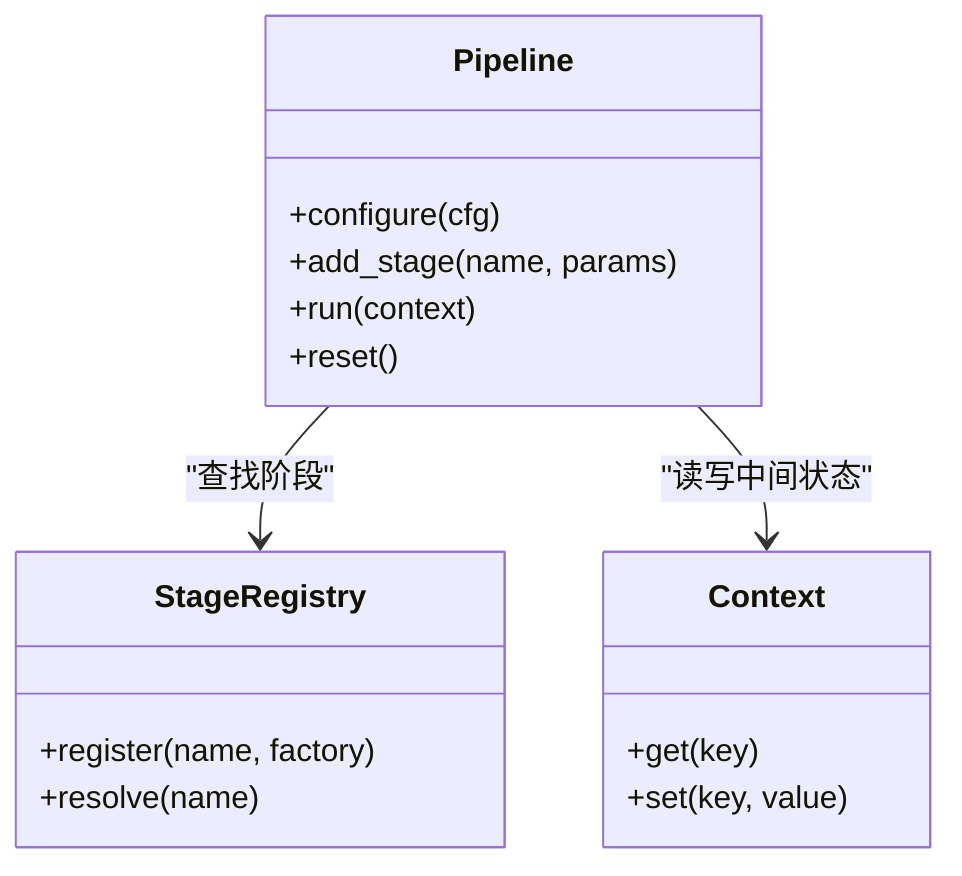
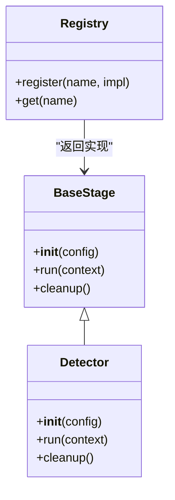
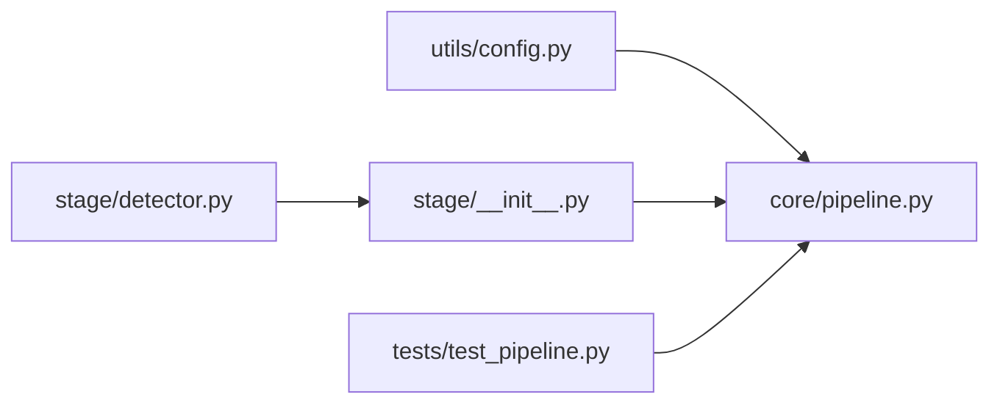

# 配置与扩展

<cite>
**本文引用的文件**   
- [src/kag_pro/utils/config.py](file://src/kag_pro/utils/config.py)
- [src/kag_pro/core/pipeline.py](file://src/kag_pro/core/pipeline.py)
- [src/kag_pro/stage/__init__.py](file://src/kag_pro/stage/__init__.py)
- [src/kag_pro/stage/detector.py](file://src/kag_pro/stage/detector.py)
- [tests/test_pipeline.py](file://tests/test_pipeline.py)
</cite>

## 目录
1. [简介](#简介)
2. [项目结构](#项目结构)
3. [核心组件](#核心组件)
4. [架构总览](#架构总览)
5. [详细组件分析](#详细组件分析)
6. [依赖关系分析](#依赖关系分析)
7. [性能考虑](#性能考虑)
8. [故障排查指南](#故障排查指南)
9. [结论](#结论)
10. [附录](#附录)

## 简介
本文件聚焦于 KAG-Pro 的配置与扩展机制，围绕以下目标展开：
- 管道配置系统：配置文件格式、环境变量支持、动态配置更新与热重载。
- 扩展点设计：插件接口、工厂模式与依赖注入。
- 新增管道阶段：接口实现、注册机制与版本兼容性。
- 可插拔组件与自定义处理器：具体示例路径与最佳实践。
- 配置验证与默认值管理：校验规则、环境适配与热重载。
- 扩展最佳实践：命名约定、文档规范与测试策略。

## 项目结构
KAG-Pro 将“配置”与“扩展”能力分别落在 utils 与 core/stage 等模块中：
- 配置层：utils.config 提供配置加载、合并、校验与默认值处理。
- 管道层：core.pipeline 定义管道执行流程与阶段编排。
- 扩展点：stage 包暴露阶段抽象与注册入口，detector 作为参考实现。
- 测试：tests.test_pipeline 覆盖关键流程与边界条件。

图表来源
- [src/kag_pro/utils/config.py](file://src/kag_pro/utils/config.py)
- [src/kag_pro/core/pipeline.py](file://src/kag_pro/core/pipeline.py)
- [src/kag_pro/stage/__init__.py](file://src/kag_pro/stage/__init__.py)
- [src/kag_pro/stage/detector.py](file://src/kag_pro/stage/detector.py)
- [tests/test_pipeline.py](file://tests/test_pipeline.py)

章节来源
- [src/kag_pro/utils/config.py](file://src/kag_pro/utils/config.py)
- [src/kag_pro/core/pipeline.py](file://src/kag_pro/core/pipeline.py)
- [src/kag_pro/stage/__init__.py](file://src/kag_pro/stage/__init__.py)
- [src/kag_pro/stage/detector.py](file://src/kag_pro/stage/detector.py)
- [tests/test_pipeline.py](file://tests/test_pipeline.py)

## 核心组件
- 配置管理器（utils/config）
  - 职责：读取多源配置（文件、环境变量、默认值），进行合并与校验，提供统一访问接口。
  - 关键点：支持层级覆盖、类型转换、缺失字段回退到默认值、运行时更新与热重载。
- 管道引擎（core/pipeline）
  - 职责：解析阶段序列、按序调度执行、传递上下文数据、收集结果与错误。
  - 关键点：阶段注册表、生命周期钩子、失败快速返回或继续策略。
- 阶段抽象与注册（stage/__init__.py）
  - 职责：定义阶段基类/协议、注册中心、查找与实例化逻辑。
  - 关键点：名称到实现的映射、参数注入、版本兼容检查。
- 参考阶段实现（stage/detector.py）
  - 职责：展示一个完整阶段的实现范式，包括初始化、运行、清理。
  - 关键点：配置项使用、日志记录、异常处理。

章节来源
- [src/kag_pro/utils/config.py](file://src/kag_pro/utils/config.py)
- [src/kag_pro/core/pipeline.py](file://src/kag_pro/core/pipeline.py)
- [src/kag_pro/stage/__init__.py](file://src/kag_pro/stage/__init__.py)
- [src/kag_pro/stage/detector.py](file://src/kag_pro/stage/detector.py)

## 架构总览
下图展示了配置如何驱动管道，以及阶段如何通过注册表被动态装配。

图表来源
- [src/kag_pro/utils/config.py](file://src/kag_pro/utils/config.py)
- [src/kag_pro/core/pipeline.py](file://src/kag_pro/core/pipeline.py)
- [src/kag_pro/stage/__init__.py](file://src/kag_pro/stage/__init__.py)

## 详细组件分析

### 配置系统（utils/config）
- 配置来源与优先级
  - 默认值 -> 配置文件 -> 环境变量 -> 运行时更新
- 数据结构
  - 分层字典结构，支持嵌套键访问与路径式取值。
- 校验与默认值
  - 基于 schema 的必填字段校验、类型约束、范围限制。
  - 未提供时自动填充默认值，保证管道可用。
- 环境变量适配
  - 支持前缀过滤、类型转换（字符串转布尔/数字/列表）。
- 动态更新与热重载
  - 提供增量更新接口；监听配置变更事件后重建受影响阶段。

图表来源
- [src/kag_pro/utils/config.py](file://src/kag_pro/utils/config.py)

章节来源
- [src/kag_pro/utils/config.py](file://src/kag_pro/utils/config.py)

### 管道引擎（core/pipeline）
- 阶段编排
  - 从配置中解析阶段序列，按顺序创建并执行。
- 上下文传递
  - 每个阶段接收共享上下文，写入中间结果供后续阶段消费。
- 错误处理
  - 可选择在首个失败时中断，或记录错误继续执行。
- 生命周期钩子
  - 提供 before/after 钩子用于监控、统计与资源管理。

图表来源
- [src/kag_pro/core/pipeline.py](file://src/kag_pro/core/pipeline.py)
- [src/kag_pro/stage/__init__.py](file://src/kag_pro/stage/__init__.py)

章节来源
- [src/kag_pro/core/pipeline.py](file://src/kag_pro/core/pipeline.py)

### 扩展点与阶段注册（stage/__init__.py）
- 阶段协议
  - 定义统一的初始化、运行、清理接口，确保可插拔。
- 注册表
  - 维护“名称 -> 工厂/类”的映射，支持按名解析与按需实例化。
- 依赖注入
  - 根据阶段声明的参数，从配置或外部容器注入依赖。
- 版本兼容
  - 在注册时声明兼容的最小/最大版本，避免不兼容实现被加载。

图表来源
- [src/kag_pro/stage/__init__.py](file://src/kag_pro/stage/__init__.py)
- [src/kag_pro/stage/detector.py](file://src/kag_pro/stage/detector.py)

章节来源
- [src/kag_pro/stage/__init__.py](file://src/kag_pro/stage/__init__.py)
- [src/kag_pro/stage/detector.py](file://src/kag_pro/stage/detector.py)

### 参考阶段实现（stage/detector.py）
- 作用：演示一个完整阶段的实现范式，包括参数读取、输入校验、核心逻辑与输出写入。
- 要点：
  - 从配置中读取阈值、策略等参数。
  - 对输入数据进行前置校验，失败时抛出明确异常。
  - 将检测结果写入上下文，供下游阶段使用。
  - 在 cleanup 中释放资源（如临时文件、连接池）。

章节来源
- [src/kag_pro/stage/detector.py](file://src/kag_pro/stage/detector.py)

### 添加新管道阶段（步骤与示例路径）
- 步骤概览
  1) 定义阶段类：实现统一接口（初始化、运行、清理）。
  2) 注册阶段：在注册表中以唯一名称登记。
  3) 配置接入：在配置文件中声明阶段及其参数。
  4) 管道编排：在管道配置中引用该阶段名称。
  5) 编写测试：覆盖正常路径、边界条件与错误路径。
- 示例路径
  - 阶段实现参考：[src/kag_pro/stage/detector.py](file://src/kag_pro/stage/detector.py)
  - 注册入口参考：[src/kag_pro/stage/__init__.py](file://src/kag_pro/stage/__init__.py)
  - 管道集成参考：[src/kag_pro/core/pipeline.py](file://src/kag_pro/core/pipeline.py)
  - 测试用例参考：[tests/test_pipeline.py](file://tests/test_pipeline.py)

章节来源
- [src/kag_pro/stage/detector.py](file://src/kag_pro/stage/detector.py)
- [src/kag_pro/stage/__init__.py](file://src/kag_pro/stage/__init__.py)
- [src/kag_pro/core/pipeline.py](file://src/kag_pro/core/pipeline.py)
- [tests/test_pipeline.py](file://tests/test_pipeline.py)

### 可插拔组件与自定义处理器（示例路径）
- 组件契约
  - 明确输入/输出结构，遵循上下文约定。
  - 对外暴露稳定接口，内部实现可替换。
- 工厂模式
  - 通过工厂函数/类创建组件实例，便于注入依赖与延迟初始化。
- 依赖注入
  - 从配置或容器中获取服务（如存储、模型、客户端）。
- 示例路径
  - 工厂与注册：[src/kag_pro/stage/__init__.py](file://src/kag_pro/stage/__init__.py)
  - 处理器实现参考：[src/kag_pro/stage/detector.py](file://src/kag_pro/stage/detector.py)
  - 管道组装参考：[src/kag_pro/core/pipeline.py](file://src/kag_pro/core/pipeline.py)

章节来源
- [src/kag_pro/stage/__init__.py](file://src/kag_pro/stage/__init__.py)
- [src/kag_pro/stage/detector.py](file://src/kag_pro/stage/detector.py)
- [src/kag_pro/core/pipeline.py](file://src/kag_pro/core/pipeline.py)

### 配置验证与默认值管理
- 校验规则
  - 必填字段、类型约束、枚举值、数值范围、正则匹配。
- 默认值策略
  - 分层覆盖：默认 < 文件 < 环境变量 < 运行时更新。
- 环境适配
  - 不同环境（开发/测试/生产）通过环境变量切换行为。
- 热重载
  - 监听配置变更，仅重建受影响的阶段，保持服务连续性。

章节来源
- [src/kag_pro/utils/config.py](file://src/kag_pro/utils/config.py)

## 依赖关系分析
- 耦合与内聚
  - 配置与管道低耦合：通过配置对象与上下文传递数据。
  - 阶段与注册表解耦：通过名称解析，避免硬编码依赖。
- 外部依赖
  - 文件系统、环境变量、可能的网络/存储服务由阶段实现引入。
- 循环依赖
  - 通过注册表与工厂模式避免直接导入，降低环依赖风险。

图表来源
- [src/kag_pro/utils/config.py](file://src/kag_pro/utils/config.py)
- [src/kag_pro/core/pipeline.py](file://src/kag_pro/core/pipeline.py)
- [src/kag_pro/stage/__init__.py](file://src/kag_pro/stage/__init__.py)
- [src/kag_pro/stage/detector.py](file://src/kag_pro/stage/detector.py)
- [tests/test_pipeline.py](file://tests/test_pipeline.py)

章节来源
- [src/kag_pro/utils/config.py](file://src/kag_pro/utils/config.py)
- [src/kag_pro/core/pipeline.py](file://src/kag_pro/core/pipeline.py)
- [src/kag_pro/stage/__init__.py](file://src/kag_pro/stage/__init__.py)
- [src/kag_pro/stage/detector.py](file://src/kag_pro/stage/detector.py)
- [tests/test_pipeline.py](file://tests/test_pipeline.py)

## 性能考虑
- 配置加载
  - 缓存配置对象，避免重复解析；增量更新减少开销。
- 阶段执行
  - 并行执行无依赖阶段；批处理减少 I/O 次数。
- 资源管理
  - 复用连接/模型实例；及时释放临时资源。
- 监控与度量
  - 在管道钩子中采集耗时、吞吐与错误率。

## 故障排查指南
- 常见问题
  - 配置缺失或类型错误：检查必填字段与环境变量映射。
  - 阶段未注册：确认名称一致且已在注册表中登记。
  - 热重载无效：确认监听器已启动且变更事件正确触发。
- 定位方法
  - 启用调试日志，查看配置合并与阶段实例化过程。
  - 使用最小化配置复现问题，逐步扩大范围。
- 恢复策略
  - 回滚至上一份有效配置；隔离故障阶段并降级运行。

章节来源
- [src/kag_pro/utils/config.py](file://src/kag_pro/utils/config.py)
- [src/kag_pro/core/pipeline.py](file://src/kag_pro/core/pipeline.py)
- [src/kag_pro/stage/__init__.py](file://src/kag_pro/stage/__init__.py)

## 结论
KAG-Pro 通过清晰的配置系统与可扩展的阶段注册机制，实现了高内聚、低耦合的管道架构。借助工厂模式与依赖注入，新增阶段与自定义处理器变得简单可控；配合完善的校验、默认值管理与热重载，系统在灵活性与稳定性之间取得良好平衡。建议在实际扩展中遵循命名约定、完善文档与测试，以确保长期可维护性。

## 附录
- 命名约定
  - 阶段名称采用小写下划线分隔，避免与内置名称冲突。
  - 配置键采用层级命名，体现作用域与用途。
- 文档规范
  - 为每个阶段提供使用说明、参数说明、输入输出样例与注意事项。
- 测试策略
  - 单元测试覆盖阶段逻辑；集成测试覆盖端到端管道；混沌测试模拟配置异常与外部故障。