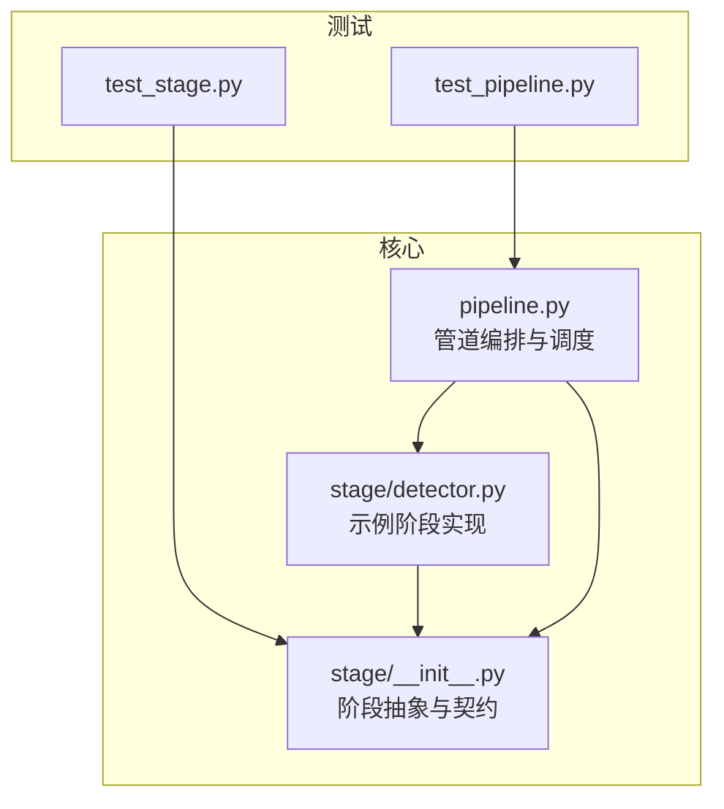
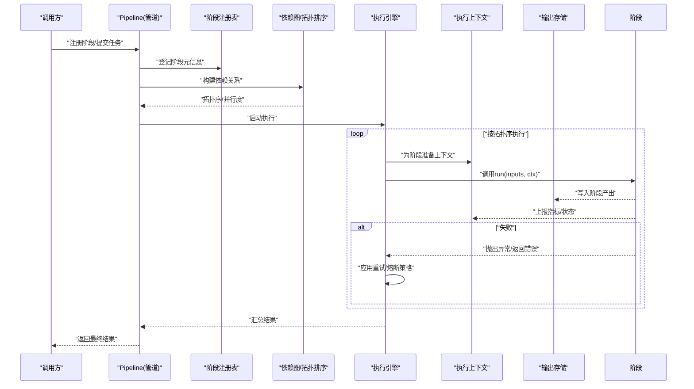
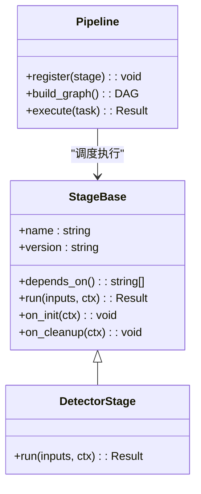
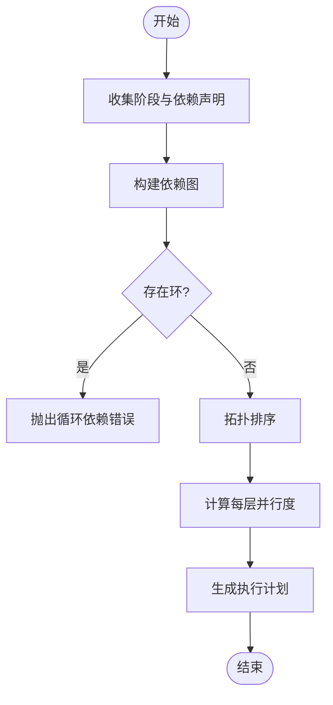
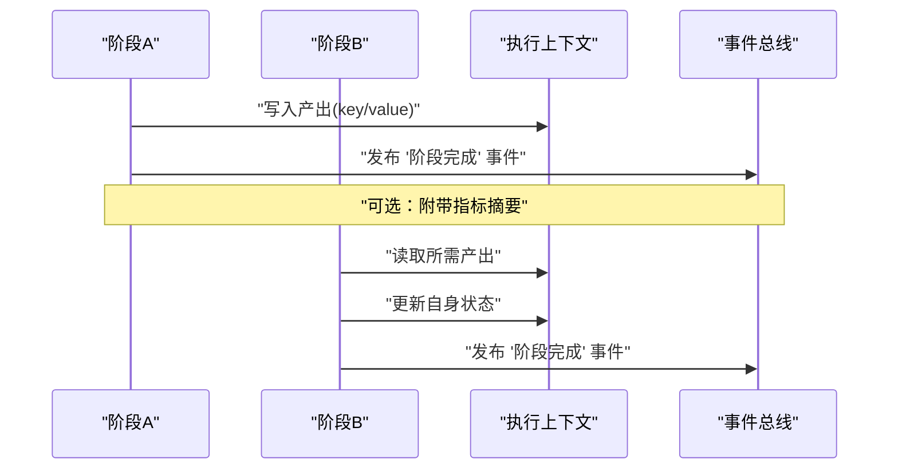
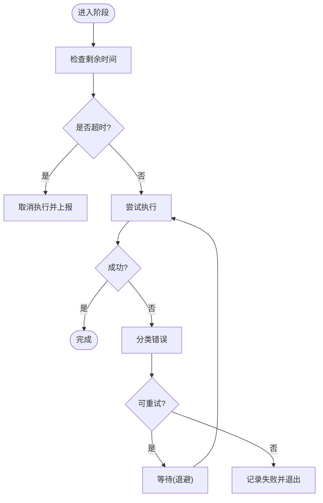
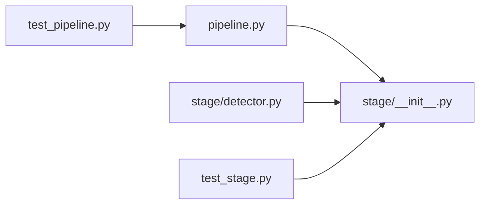

# 阶段执行机制

<cite>
**本文引用的文件**   
- [src/kag_pro/core/pipeline.py](file://src/kag_pro/core/pipeline.py)
- [src/kag_pro/stage/__init__.py](file://src/kag_pro/stage/__init__.py)
- [src/kag_pro/stage/detector.py](file://src/kag_pro/stage/detector.py)
- [tests/test_pipeline.py](file://tests/test_pipeline.py)
- [tests/test_stage.py](file://tests/test_stage.py)
</cite>

## 目录
1. [简介](#简介)
2. [项目结构](#项目结构)
3. [核心组件](#核心组件)
4. [架构总览](#架构总览)
5. [详细组件分析](#详细组件分析)
6. [依赖分析](#依赖分析)
7. [性能考虑](#性能考虑)
8. [故障排查指南](#故障排查指南)
9. [结论](#结论)
10. [附录](#附录)

## 简介
本文件面向KAG-Pro的阶段执行机制，系统化阐述“管道”与“阶段”的设计与实现：阶段接口规范、参数传递与返回值约定；阶段的依赖解析与执行顺序确定；阶段间通信（数据共享、状态同步、事件通知）；配置项（超时、重试、错误处理）；以及监控与调试（日志、指标、诊断）。文档同时提供自定义阶段与第三方组件集成的实践指引。

## 项目结构
围绕阶段执行的核心代码位于 core 与 stage 两个包中，测试覆盖在 tests 下：
- src/kag_pro/core/pipeline.py：定义管道编排、阶段注册、依赖解析与调度执行等核心逻辑。
- src/kag_pro/stage/__init__.py：阶段抽象基类与通用工具，用于统一阶段契约。
- src/kag_pro/stage/detector.py：示例/内置阶段实现，展示如何接入外部检测能力。
- tests/test_pipeline.py：验证管道生命周期、依赖解析、执行顺序与错误传播。
- tests/test_stage.py：验证阶段基类行为与扩展点。

图表来源
- [src/kag_pro/core/pipeline.py](file://src/kag_pro/core/pipeline.py)
- [src/kag_pro/stage/__init__.py](file://src/kag_pro/stage/__init__.py)
- [src/kag_pro/stage/detector.py](file://src/kag_pro/stage/detector.py)
- [tests/test_pipeline.py](file://tests/test_pipeline.py)
- [tests/test_stage.py](file://tests/test_stage.py)

章节来源
- [src/kag_pro/core/pipeline.py](file://src/kag_pro/core/pipeline.py)
- [src/kag_pro/stage/__init__.py](file://src/kag_pro/stage/__init__.py)
- [src/kag_pro/stage/detector.py](file://src/kag_pro/stage/detector.py)
- [tests/test_pipeline.py](file://tests/test_pipeline.py)
- [tests/test_stage.py](file://tests/test_stage.py)

## 核心组件
- 阶段抽象与契约
  - 阶段基类定义了统一的输入输出协议、上下文访问、资源获取与生命周期钩子，确保所有阶段具备一致的调用方式与可观测性。
  - 典型职责包括：声明依赖、读取上游产出、写入下游可用数据、上报执行指标与异常。
- 管道编排器
  - 负责阶段注册、依赖图构建、拓扑排序、并发控制、超时与重试策略、错误传播与恢复。
  - 提供运行入口、结果收集与中间产物访问接口。
- 示例阶段
  - detector 模块提供具体阶段实现样例，演示如何接入外部服务或模型，并遵循阶段契约进行数据读写与状态上报。

章节来源
- [src/kag_pro/stage/__init__.py](file://src/kag_pro/stage/__init__.py)
- [src/kag_pro/core/pipeline.py](file://src/kag_pro/core/pipeline.py)
- [src/kag_pro/stage/detector.py](file://src/kag_pro/stage/detector.py)

## 架构总览
下图展示了阶段执行的整体流程：从阶段注册到依赖解析、执行调度、数据流转与结果聚合。

图表来源
- [src/kag_pro/core/pipeline.py](file://src/kag_pro/core/pipeline.py)
- [src/kag_pro/stage/__init__.py](file://src/kag_pro/stage/__init__.py)

## 详细组件分析

### 阶段接口与数据契约
- 输入与输出
  - 输入：由上游阶段产出的结构化数据，通过上下文注入到当前阶段。
  - 输出：阶段完成时写入的产物，供后续阶段消费。
- 上下文对象
  - 提供只读的配置、运行时参数、资源句柄、指标上报与事件发布通道。
- 生命周期钩子
  - 初始化、前置校验、执行、后置清理等钩子，便于资源管理与幂等保障。
- 错误与状态
  - 阶段应明确区分业务错误与系统错误，并通过上下文上报状态码与诊断信息。

图表来源
- [src/kag_pro/stage/__init__.py](file://src/kag_pro/stage/__init__.py)
- [src/kag_pro/stage/detector.py](file://src/kag_pro/stage/detector.py)
- [src/kag_pro/core/pipeline.py](file://src/kag_pro/core/pipeline.py)

章节来源
- [src/kag_pro/stage/__init__.py](file://src/kag_pro/stage/__init__.py)
- [src/kag_pro/stage/detector.py](file://src/kag_pro/stage/detector.py)
- [src/kag_pro/core/pipeline.py](file://src/kag_pro/core/pipeline.py)

### 依赖解析与执行顺序
- 依赖声明
  - 阶段通过声明式依赖描述对上游阶段的产出需求。
- 图构建与排序
  - 管道将阶段及其依赖构建成有向无环图，并进行拓扑排序以确定执行顺序。
- 冲突与循环
  - 若检测到循环依赖或缺失依赖，应在构建阶段报错并给出定位信息。
- 并行度控制
  - 基于拓扑层计算最大并行度，避免资源争用。

图表来源
- [src/kag_pro/core/pipeline.py](file://src/kag_pro/core/pipeline.py)

章节来源
- [src/kag_pro/core/pipeline.py](file://src/kag_pro/core/pipeline.py)

### 阶段间通信机制
- 数据共享
  - 通过上下文提供的键值空间或命名空间隔离不同阶段的数据，避免污染。
- 状态同步
  - 使用上下文的状态字典记录跨阶段一致视图，如全局开关、进度标记。
- 事件通知
  - 通过上下文的事件总线发布/订阅关键事件（如阶段开始、结束、失败），便于监听与告警。

图表来源
- [src/kag_pro/stage/__init__.py](file://src/kag_pro/stage/__init__.py)
- [src/kag_pro/core/pipeline.py](file://src/kag_pro/core/pipeline.py)

章节来源
- [src/kag_pro/stage/__init__.py](file://src/kag_pro/stage/__init__.py)
- [src/kag_pro/core/pipeline.py](file://src/kag_pro/core/pipeline.py)

### 配置选项：超时、重试与错误处理
- 超时设置
  - 支持阶段级与全局级超时，防止长尾阻塞。
- 重试策略
  - 支持指数退避、最大重试次数与可重试错误类型白名单。
- 错误处理
  - 区分可恢复与不可恢复错误；提供回滚/补偿钩子与失败分支路径。
- 资源限制
  - 并发上限、内存/CPU配额、外部服务限流等。

图表来源
- [src/kag_pro/core/pipeline.py](file://src/kag_pro/core/pipeline.py)

章节来源
- [src/kag_pro/core/pipeline.py](file://src/kag_pro/core/pipeline.py)

### 监控与调试：日志、指标与诊断
- 执行日志
  - 结构化日志包含阶段名、输入摘要、耗时、错误堆栈与追踪ID。
- 性能指标
  - 暴露吞吐、延迟分位、队列长度、重试次数等指标。
- 故障诊断
  - 提供阶段快照、中间产物导出、依赖图可视化与失败根因定位。

章节来源
- [src/kag_pro/core/pipeline.py](file://src/kag_pro/core/pipeline.py)
- [src/kag_pro/stage/__init__.py](file://src/kag_pro/stage/__init__.py)

### 自定义阶段与第三方集成示例
- 自定义阶段步骤
  - 继承阶段基类，实现 run 方法与必要的钩子。
  - 在 depends_on 中声明上游依赖，确保数据就绪。
  - 通过上下文读取输入、写入输出、上报指标与事件。
- 集成第三方组件
  - 在 on_init 中初始化客户端连接，在 on_cleanup 中释放资源。
  - 对外部服务的错误进行分类，决定是否触发重试。
- 参考路径
  - 阶段基类与契约：[src/kag_pro/stage/__init__.py](file://src/kag_pro/stage/__init__.py)
  - 示例阶段实现：[src/kag_pro/stage/detector.py](file://src/kag_pro/stage/detector.py)
  - 管道注册与执行：[src/kag_pro/core/pipeline.py](file://src/kag_pro/core/pipeline.py)

章节来源
- [src/kag_pro/stage/__init__.py](file://src/kag_pro/stage/__init__.py)
- [src/kag_pro/stage/detector.py](file://src/kag_pro/stage/detector.py)
- [src/kag_pro/core/pipeline.py](file://src/kag_pro/core/pipeline.py)

## 依赖分析
- 耦合关系
  - 管道强依赖阶段抽象契约；示例阶段依赖基类；测试依赖两者以验证行为。
- 外部依赖
  - 示例阶段可能依赖外部检测服务；管道可能依赖日志/指标基础设施。
- 潜在循环
  - 依赖图必须在构建期检测并拒绝循环。

图表来源
- [src/kag_pro/core/pipeline.py](file://src/kag_pro/core/pipeline.py)
- [src/kag_pro/stage/__init__.py](file://src/kag_pro/stage/__init__.py)
- [src/kag_pro/stage/detector.py](file://src/kag_pro/stage/detector.py)
- [tests/test_pipeline.py](file://tests/test_pipeline.py)
- [tests/test_stage.py](file://tests/test_stage.py)

章节来源
- [src/kag_pro/core/pipeline.py](file://src/kag_pro/core/pipeline.py)
- [src/kag_pro/stage/__init__.py](file://src/kag_pro/stage/__init__.py)
- [src/kag_pro/stage/detector.py](file://src/kag_pro/stage/detector.py)
- [tests/test_pipeline.py](file://tests/test_pipeline.py)
- [tests/test_stage.py](file://tests/test_stage.py)

## 性能考虑
- 并行度与背压
  - 合理设置最大并行度，避免下游瓶颈；必要时引入背压控制。
- 批处理与缓存
  - 对重复计算或昂贵I/O启用缓存；对批量数据采用批处理降低开销。
- 资源隔离
  - 为高成本阶段分配独立线程/进程池，避免相互影响。
- 超时与熔断
  - 为外部依赖设置短超时与快速失败，保护整体SLA。

## 故障排查指南
- 常见问题
  - 循环依赖：检查阶段依赖声明，确认无环。
  - 缺失输入：核对上游阶段产出键名与命名空间。
  - 超时/重试风暴：调整退避策略与最大重试次数。
  - 资源泄漏：确认 on_cleanup 被调用且外部连接已关闭。
- 定位手段
  - 查看阶段级日志与指标；导出中间产物；复现最小依赖子图。
- 参考路径
  - 管道执行与错误处理：[src/kag_pro/core/pipeline.py](file://src/kag_pro/core/pipeline.py)
  - 阶段契约与上下文：[src/kag_pro/stage/__init__.py](file://src/kag_pro/stage/__init__.py)
  - 示例阶段行为：[src/kag_pro/stage/detector.py](file://src/kag_pro/stage/detector.py)
  - 回归用例：[tests/test_pipeline.py](file://tests/test_pipeline.py), [tests/test_stage.py](file://tests/test_stage.py)

章节来源
- [src/kag_pro/core/pipeline.py](file://src/kag_pro/core/pipeline.py)
- [src/kag_pro/stage/__init__.py](file://src/kag_pro/stage/__init__.py)
- [src/kag_pro/stage/detector.py](file://src/kag_pro/stage/detector.py)
- [tests/test_pipeline.py](file://tests/test_pipeline.py)
- [tests/test_stage.py](file://tests/test_stage.py)

## 结论
KAG-Pro 的阶段执行机制以清晰的契约与强大的编排能力为核心：通过声明式依赖与拓扑排序保证正确性与可扩展性；借助上下文实现松耦合的数据与事件通信；配合超时、重试与错误分类提升鲁棒性；并以完善的日志与指标支撑可观测性与排障。遵循本文档的规范与最佳实践，可高效地构建复杂数据处理流水线并稳定集成第三方组件。

## 附录
- 术语
  - 阶段：可独立执行的计算单元，具有明确的输入/输出与依赖。
  - 管道：阶段集合及其执行计划的载体。
  - 上下文：阶段执行期的运行时环境，承载配置、数据、指标与事件。
- 参考路径
  - 阶段基类与契约：[src/kag_pro/stage/__init__.py](file://src/kag_pro/stage/__init__.py)
  - 示例阶段实现：[src/kag_pro/stage/detector.py](file://src/kag_pro/stage/detector.py)
  - 管道编排与执行：[src/kag_pro/core/pipeline.py](file://src/kag_pro/core/pipeline.py)
  - 测试用例：[tests/test_pipeline.py](file://tests/test_pipeline.py), [tests/test_stage.py](file://tests/test_stage.py)