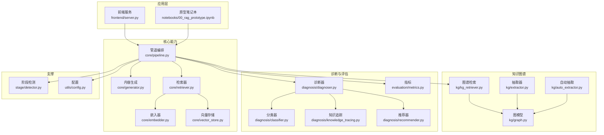
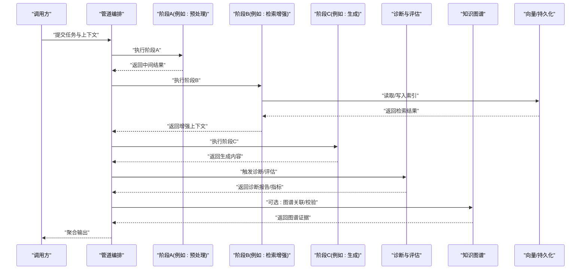
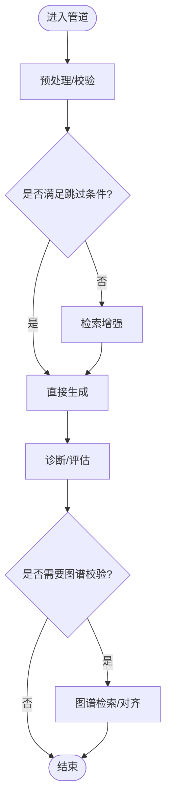
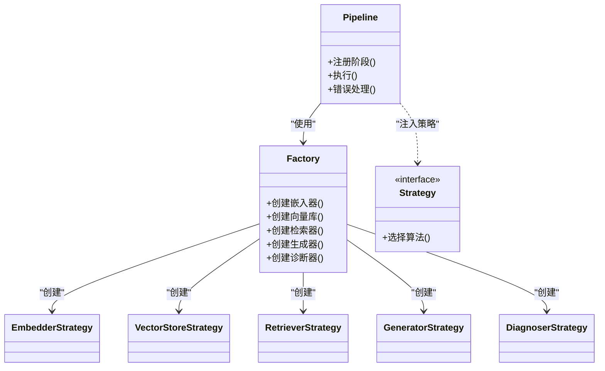
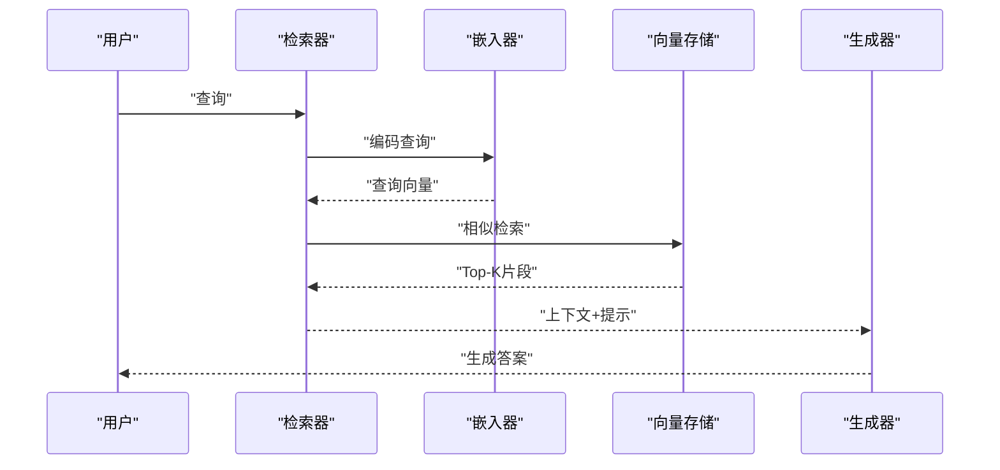
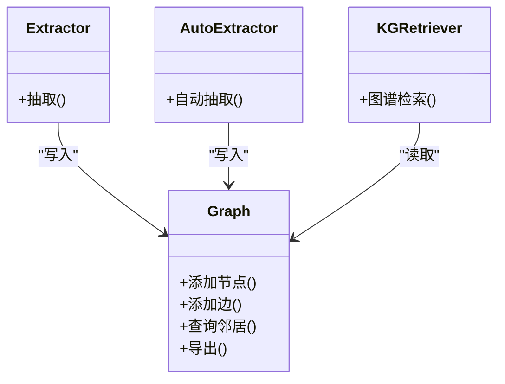
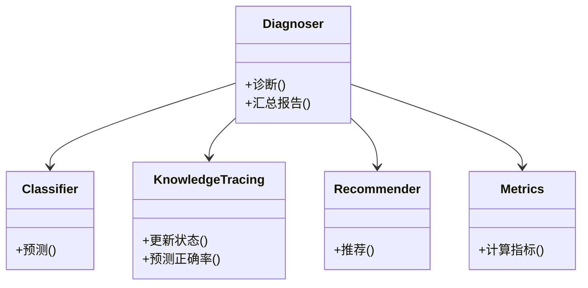
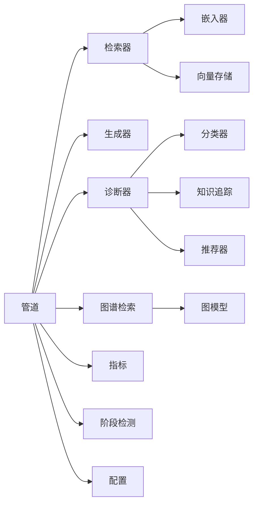
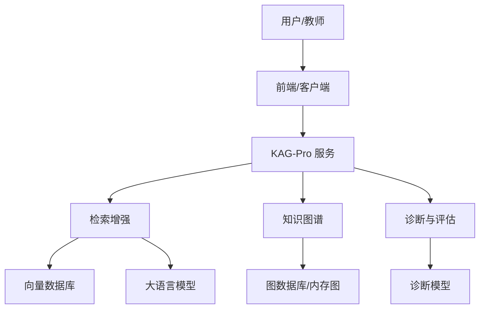

# 系统架构设计

<cite>
**本文引用的文件**   
- [README.md](file://README.md)
- [pyproject.toml](file://pyproject.toml)
- [src/kag_pro/core/pipeline.py](file://src/kag_pro/core/pipeline.py)
- [src/kag_pro/core/generator.py](file://src/kag_pro/core/generator.py)
- [src/kag_pro/core/retriever.py](file://src/kag_pro/core/retriever.py)
- [src/kag_pro/core/embedder.py](file://src/kag_pro/core/embedder.py)
- [src/kag_pro/core/vector_store.py](file://src/kag_pro/core/vector_store.py)
- [src/kag_pro/kg/graph.py](file://src/kag_pro/kg/graph.py)
- [src/kag_pro/kg/extractor.py](file://src/kag_pro/kg/extractor.py)
- [src/kag_pro/kg/auto_extractor.py](file://src/kag_pro/kg/auto_extractor.py)
- [src/kag_pro/kg/kg_retriever.py](file://src/kag_pro/kg/kg_retriever.py)
- [src/kag_pro/diagnosis/diagnoser.py](file://src/kag_pro/diagnosis/diagnoser.py)
- [src/kag_pro/diagnosis/classifier.py](file://src/kag_pro/diagnosis/classifier.py)
- [src/kag_pro/diagnosis/knowledge_tracing.py](file://src/kag_pro/diagnosis/knowledge_tracing.py)
- [src/kag_pro/diagnosis/recommender.py](file://src/kag_pro/diagnosis/recommender.py)
- [src/kag_pro/evaluation/metrics.py](file://src/kag_pro/evaluation/metrics.py)
- [src/kag_pro/stage/detector.py](file://src/kag_pro/stage/detector.py)
- [src/kag_pro/utils/config.py](file://src/kag_pro/utils/config.py)
- [tests/test_pipeline.py](file://tests/test_pipeline.py)
</cite>

## 目录
1. [简介](#简介)
2. [项目结构](#项目结构)
3. [核心组件](#核心组件)
4. [架构总览](#架构总览)
5. [详细组件分析](#详细组件分析)
6. [依赖关系分析](#依赖关系分析)
7. [性能与可扩展性](#性能与可扩展性)
8. [故障排查指南](#故障排查指南)
9. [结论](#结论)
10. [附录](#附录)

## 简介
本架构文档面向KAG-Pro系统，聚焦于高层设计模式、系统边界与组件交互。重点阐述：
- 管道模式（Pipeline Pattern）的实现原理、数据流向、处理阶段与错误处理机制
- 工厂模式与策略模式在组件创建与算法替换中的应用
- 知识图谱模块、诊断评估模块、内容生成模块与检索增强模块的协作方式
- 技术决策权衡、可扩展性与性能优化策略、部署拓扑
- 第三方依赖的版本兼容性与集成要求

## 项目结构
KAG-Pro采用分层与按领域划分的组织方式：
- core：通用能力（嵌入、向量存储、检索、生成、管道编排等）
- kg：知识图谱构建与检索
- diagnosis：学习者诊断、知识追踪与推荐
- evaluation：指标与评估
- stage：阶段检测与门控
- utils：配置与工具
- frontend/notebooks/data/tests：前端、示例、数据与测试

图表来源
- [src/kag_pro/core/pipeline.py](file://src/kag_pro/core/pipeline.py)
- [src/kag_pro/core/generator.py](file://src/kag_pro/core/generator.py)
- [src/kag_pro/core/retriever.py](file://src/kag_pro/core/retriever.py)
- [src/kag_pro/core/embedder.py](file://src/kag_pro/core/embedder.py)
- [src/kag_pro/core/vector_store.py](file://src/kag_pro/core/vector_store.py)
- [src/kag_pro/kg/graph.py](file://src/kag_pro/kg/graph.py)
- [src/kag_pro/kg/extractor.py](file://src/kag_pro/kg/extractor.py)
- [src/kag_pro/kg/auto_extractor.py](file://src/kag_pro/kg/auto_extractor.py)
- [src/kag_pro/kg/kg_retriever.py](file://src/kag_pro/kg/kg_retriever.py)
- [src/kag_pro/diagnosis/diagnoser.py](file://src/kag_pro/diagnosis/diagnoser.py)
- [src/kag_pro/diagnosis/classifier.py](file://src/kag_pro/diagnosis/classifier.py)
- [src/kag_pro/diagnosis/knowledge_tracing.py](file://src/kag_pro/diagnosis/knowledge_tracing.py)
- [src/kag_pro/diagnosis/recommender.py](file://src/kag_pro/diagnosis/recommender.py)
- [src/kag_pro/evaluation/metrics.py](file://src/kag_pro/evaluation/metrics.py)
- [src/kag_pro/stage/detector.py](file://src/kag_pro/stage/detector.py)
- [src/kag_pro/utils/config.py](file://src/kag_pro/utils/config.py)

章节来源
- [README.md](file://README.md)
- [pyproject.toml](file://pyproject.toml)

## 核心组件
- 管道编排（Pipeline）：统一入口，负责阶段注册、执行顺序控制、上下文传递与错误收敛。
- 检索增强（Retriever + Embedder + Vector Store）：将文本向量化并检索相关片段，为生成提供上下文。
- 知识图谱（KG Graph/Extractor/Auto Extractor/KG Retriever）：从文本抽取结构化知识，支持基于图的检索。
- 诊断与评估（Diagnoser/Classifier/KT/Recommender/Metrics）：对学习者状态建模、诊断薄弱点并给出学习路径建议；提供评估指标。
- 阶段检测（Stage Detector）：根据输入或中间结果决定后续分支与策略。
- 配置（Config）：集中管理外部服务、模型参数与运行时开关。

章节来源
- [src/kag_pro/core/pipeline.py](file://src/kag_pro/core/pipeline.py)
- [src/kag_pro/core/retriever.py](file://src/kag_pro/core/retriever.py)
- [src/kag_pro/core/embedder.py](file://src/kag_pro/core/embedder.py)
- [src/kag_pro/core/vector_store.py](file://src/kag_pro/core/vector_store.py)
- [src/kag_pro/kg/graph.py](file://src/kag_pro/kg/graph.py)
- [src/kag_pro/kg/extractor.py](file://src/kag_pro/kg/extractor.py)
- [src/kag_pro/kg/auto_extractor.py](file://src/kag_pro/kg/auto_extractor.py)
- [src/kag_pro/kg/kg_retriever.py](file://src/kag_pro/kg/kg_retriever.py)
- [src/kag_pro/diagnosis/diagnoser.py](file://src/kag_pro/diagnosis/diagnoser.py)
- [src/kag_pro/diagnosis/classifier.py](file://src/kag_pro/diagnosis/classifier.py)
- [src/kag_pro/diagnosis/knowledge_tracing.py](file://src/kag_pro/diagnosis/knowledge_tracing.py)
- [src/kag_pro/diagnosis/recommender.py](file://src/kag_pro/diagnosis/recommender.py)
- [src/kag_pro/evaluation/metrics.py](file://src/kag_pro/evaluation/metrics.py)
- [src/kag_pro/stage/detector.py](file://src/kag_pro/stage/detector.py)
- [src/kag_pro/utils/config.py](file://src/kag_pro/utils/config.py)

## 架构总览
KAG-Pro以“管道+插件”为核心思想：
- 管道作为控制面，定义阶段接口与执行语义
- 各业务域以插件形式接入（如检索、图谱、诊断、评估）
- 通过工厂/策略实现可插拔的算法与后端替换

图表来源
- [src/kag_pro/core/pipeline.py](file://src/kag_pro/core/pipeline.py)
- [src/kag_pro/core/retriever.py](file://src/kag_pro/core/retriever.py)
- [src/kag_pro/core/vector_store.py](file://src/kag_pro/core/vector_store.py)
- [src/kag_pro/kg/kg_retriever.py](file://src/kag_pro/kg/kg_retriever.py)
- [src/kag_pro/diagnosis/diagnoser.py](file://src/kag_pro/diagnosis/diagnoser.py)
- [src/kag_pro/evaluation/metrics.py](file://src/kag_pro/evaluation/metrics.py)

## 详细组件分析

### 管道模式（Pipeline Pattern）
- 设计要点
  - 阶段抽象：每个处理单元遵循统一的输入/输出契约，便于组合与替换
  - 执行流：顺序/条件/并行（由具体实现决定），支持上下文对象贯穿
  - 错误处理：阶段级异常捕获、重试、降级与熔断策略
  - 可观测性：阶段耗时、命中缓存、失败率等埋点
- 数据流向
  - 输入 -> 预处理 -> 检索增强 -> 生成 -> 诊断/评估 -> 输出
- 典型流程

图表来源
- [src/kag_pro/core/pipeline.py](file://src/kag_pro/core/pipeline.py)
- [src/kag_pro/core/retriever.py](file://src/kag_pro/core/retriever.py)
- [src/kag_pro/core/generator.py](file://src/kag_pro/core/generator.py)
- [src/kag_pro/kg/kg_retriever.py](file://src/kag_pro/kg/kg_retriever.py)
- [src/kag_pro/diagnosis/diagnoser.py](file://src/kag_pro/diagnosis/diagnoser.py)
- [src/kag_pro/evaluation/metrics.py](file://src/kag_pro/evaluation/metrics.py)

章节来源
- [src/kag_pro/core/pipeline.py](file://src/kag_pro/core/pipeline.py)
- [tests/test_pipeline.py](file://tests/test_pipeline.py)

### 工厂模式与策略模式
- 工厂模式
  - 用于按配置动态创建Embedder、VectorStore、Retriever、Generator、Diagnoser等实例
  - 好处：解耦创建逻辑，支持多后端切换（如不同向量库、不同LLM）
- 策略模式
  - 用于可替换算法：如相似度度量、分块策略、诊断模型、推荐策略
  - 好处：在不改动主流程的前提下扩展新算法

图表来源
- [src/kag_pro/core/pipeline.py](file://src/kag_pro/core/pipeline.py)
- [src/kag_pro/core/embedder.py](file://src/kag_pro/core/embedder.py)
- [src/kag_pro/core/vector_store.py](file://src/kag_pro/core/vector_store.py)
- [src/kag_pro/core/retriever.py](file://src/kag_pro/core/retriever.py)
- [src/kag_pro/core/generator.py](file://src/kag_pro/core/generator.py)
- [src/kag_pro/diagnosis/diagnoser.py](file://src/kag_pro/diagnosis/diagnoser.py)

章节来源
- [src/kag_pro/core/pipeline.py](file://src/kag_pro/core/pipeline.py)
- [src/kag_pro/core/embedder.py](file://src/kag_pro/core/embedder.py)
- [src/kag_pro/core/vector_store.py](file://src/kag_pro/core/vector_store.py)
- [src/kag_pro/core/retriever.py](file://src/kag_pro/core/retriever.py)
- [src/kag_pro/core/generator.py](file://src/kag_pro/core/generator.py)
- [src/kag_pro/diagnosis/diagnoser.py](file://src/kag_pro/diagnosis/diagnoser.py)

### 检索增强模块（RAG）
- 组成
  - Embedder：文本到向量
  - Vector Store：向量索引与检索
  - Retriever：查询构造、召回与重排
- 数据流
  - 原始文本 -> 分块 -> 嵌入 -> 入库
  - 查询 -> 嵌入 -> 检索 -> 上下文拼接 -> 生成
- 关键权衡
  - 分块粒度 vs 检索精度
  - 向量维度 vs 检索延迟
  - 近似检索 vs 精确度

图表来源
- [src/kag_pro/core/retriever.py](file://src/kag_pro/core/retriever.py)
- [src/kag_pro/core/embedder.py](file://src/kag_pro/core/embedder.py)
- [src/kag_pro/core/vector_store.py](file://src/kag_pro/core/vector_store.py)
- [src/kag_pro/core/generator.py](file://src/kag_pro/core/generator.py)

章节来源
- [src/kag_pro/core/retriever.py](file://src/kag_pro/core/retriever.py)
- [src/kag_pro/core/embedder.py](file://src/kag_pro/core/embedder.py)
- [src/kag_pro/core/vector_store.py](file://src/kag_pro/core/vector_store.py)
- [src/kag_pro/core/generator.py](file://src/kag_pro/core/generator.py)

### 知识图谱模块
- 职责
  - 从文本中抽取实体/关系，构建图结构
  - 提供基于图的检索与推理辅助
- 组件
  - Graph：图数据结构与基本操作
  - Extractor/Auto Extractor：规则/模型驱动的抽取
  - KG Retriever：基于图的邻居/路径检索
- 与RAG协作
  - 用图谱证据校验/补充RAG结果，提升可信度

图表来源
- [src/kag_pro/kg/graph.py](file://src/kag_pro/kg/graph.py)
- [src/kag_pro/kg/extractor.py](file://src/kag_pro/kg/extractor.py)
- [src/kag_pro/kg/auto_extractor.py](file://src/kag_pro/kg/auto_extractor.py)
- [src/kag_pro/kg/kg_retriever.py](file://src/kag_pro/kg/kg_retriever.py)

章节来源
- [src/kag_pro/kg/graph.py](file://src/kag_pro/kg/graph.py)
- [src/kag_pro/kg/extractor.py](file://src/kag_pro/kg/extractor.py)
- [src/kag_pro/kg/auto_extractor.py](file://src/kag_pro/kg/auto_extractor.py)
- [src/kag_pro/kg/kg_retriever.py](file://src/kag_pro/kg/kg_retriever.py)

### 诊断与评估模块
- 诊断器：整合分类器、知识追踪与推荐器，输出学习画像与建议
- 分类器：知识点掌握度判定
- 知识追踪：时序建模学习者表现
- 推荐器：个性化题目/资源推荐
- 评估指标：准确率、召回率、F1、覆盖率等

图表来源
- [src/kag_pro/diagnosis/diagnoser.py](file://src/kag_pro/diagnosis/diagnoser.py)
- [src/kag_pro/diagnosis/classifier.py](file://src/kag_pro/diagnosis/classifier.py)
- [src/kag_pro/diagnosis/knowledge_tracing.py](file://src/kag_pro/diagnosis/knowledge_tracing.py)
- [src/kag_pro/diagnosis/recommender.py](file://src/kag_pro/diagnosis/recommender.py)
- [src/kag_pro/evaluation/metrics.py](file://src/kag_pro/evaluation/metrics.py)

章节来源
- [src/kag_pro/diagnosis/diagnoser.py](file://src/kag_pro/diagnosis/diagnoser.py)
- [src/kag_pro/diagnosis/classifier.py](file://src/kag_pro/diagnosis/classifier.py)
- [src/kag_pro/diagnosis/knowledge_tracing.py](file://src/kag_pro/diagnosis/knowledge_tracing.py)
- [src/kag_pro/diagnosis/recommender.py](file://src/kag_pro/diagnosis/recommender.py)
- [src/kag_pro/evaluation/metrics.py](file://src/kag_pro/evaluation/metrics.py)

### 阶段检测与门控
- 作用：根据输入特征或中间结果决定后续分支（如是否启用图谱校验、是否走特定诊断策略）
- 与管道配合：在阶段间插入门控，减少不必要计算

章节来源
- [src/kag_pro/stage/detector.py](file://src/kag_pro/stage/detector.py)

### 配置管理
- 集中管理外部服务地址、模型参数、阈值与开关
- 支持环境区分与热更新（视实现而定）

章节来源
- [src/kag_pro/utils/config.py](file://src/kag_pro/utils/config.py)

## 依赖关系分析
- 内部耦合
  - 管道强依赖各阶段接口，弱依赖具体实现（通过工厂/策略注入）
  - 检索模块依赖嵌入与向量库，图谱模块独立但可与检索协同
  - 诊断模块依赖分类/追踪/推荐，评估模块可被任意阶段消费
- 外部依赖
  - 向量数据库、LLM服务、NLP工具链等（详见依赖清单）

图表来源
- [src/kag_pro/core/pipeline.py](file://src/kag_pro/core/pipeline.py)
- [src/kag_pro/core/retriever.py](file://src/kag_pro/core/retriever.py)
- [src/kag_pro/core/embedder.py](file://src/kag_pro/core/embedder.py)
- [src/kag_pro/core/vector_store.py](file://src/kag_pro/core/vector_store.py)
- [src/kag_pro/core/generator.py](file://src/kag_pro/core/generator.py)
- [src/kag_pro/kg/kg_retriever.py](file://src/kag_pro/kg/kg_retriever.py)
- [src/kag_pro/kg/graph.py](file://src/kag_pro/kg/graph.py)
- [src/kag_pro/diagnosis/diagnoser.py](file://src/kag_pro/diagnosis/diagnoser.py)
- [src/kag_pro/diagnosis/classifier.py](file://src/kag_pro/diagnosis/classifier.py)
- [src/kag_pro/diagnosis/knowledge_tracing.py](file://src/kag_pro/diagnosis/knowledge_tracing.py)
- [src/kag_pro/diagnosis/recommender.py](file://src/kag_pro/diagnosis/recommender.py)
- [src/kag_pro/evaluation/metrics.py](file://src/kag_pro/evaluation/metrics.py)
- [src/kag_pro/stage/detector.py](file://src/kag_pro/stage/detector.py)
- [src/kag_pro/utils/config.py](file://src/kag_pro/utils/config.py)

章节来源
- [pyproject.toml](file://pyproject.toml)

## 性能与可扩展性
- 性能优化
  - 批处理：批量嵌入与检索，降低网络与模型调用开销
  - 缓存：对常见查询与中间结果进行缓存（向量、检索结果、诊断画像）
  - 异步：I/O密集阶段（检索、生成）异步化
  - 索引优化：选择合适的向量库与索引参数（HNSW/IVF等）
  - 分块策略：按语义切分，平衡召回与上下文长度
- 可扩展性
  - 插件化：新增阶段只需实现标准接口并通过工厂注册
  - 策略替换：通过策略注入更换算法（相似度、分块、诊断模型）
  - 水平扩展：检索与生成服务无状态化，便于横向扩容
- 部署拓扑
  - 单进程：开发/小规模场景
  - 微服务：检索、生成、图谱、诊断各自独立部署，通过API/消息队列通信
  - 边缘/本地：轻量嵌入与检索，离线图谱构建

[本节为通用指导，不直接分析具体文件]

## 故障排查指南
- 常见问题定位
  - 管道阶段失败：查看阶段日志与错误类型，确认输入契约是否满足
  - 检索质量差：检查分块策略、嵌入模型、向量库索引参数与Top-K设置
  - 生成不稳定：调整温度、最大长度、提示模板与上下文裁剪
  - 诊断偏差：核对训练数据分布、追踪窗口与推荐策略
- 可观测性
  - 记录阶段耗时、命中率、失败率与关键指标
  - 对关键路径增加trace ID，便于跨服务链路追踪

章节来源
- [src/kag_pro/core/pipeline.py](file://src/kag_pro/core/pipeline.py)
- [src/kag_pro/core/retriever.py](file://src/kag_pro/core/retriever.py)
- [src/kag_pro/core/generator.py](file://src/kag_pro/core/generator.py)
- [src/kag_pro/diagnosis/diagnoser.py](file://src/kag_pro/diagnosis/diagnoser.py)
- [src/kag_pro/evaluation/metrics.py](file://src/kag_pro/evaluation/metrics.py)

## 结论
KAG-Pro以管道为核心，结合工厂与策略模式实现高内聚、低耦合的可插拔架构。检索增强与知识图谱协同提升生成质量与可信度；诊断与评估闭环驱动个性化学习。该设计兼顾可扩展性与性能，适合在不同规模环境中部署演进。

[本节为总结性内容，不直接分析具体文件]

## 附录

### 系统上下文图

[此图为概念性上下文图，不映射具体源码文件]

### 第三方依赖与版本兼容性
- 依赖清单与版本约束见项目配置文件
- 集成要求
  - 向量数据库：需支持相似检索与批量写入
  - LLM服务：需支持流式/非流式生成与上下文长度限制
  - NLP工具：确保与嵌入模型和分块策略兼容
- 升级策略
  - 锁定关键依赖版本，灰度验证后逐步升级
  - 对不兼容变更提供适配层或回滚方案

章节来源
- [pyproject.toml](file://pyproject.toml)