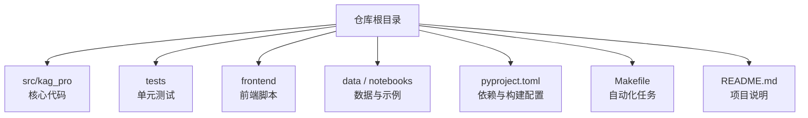
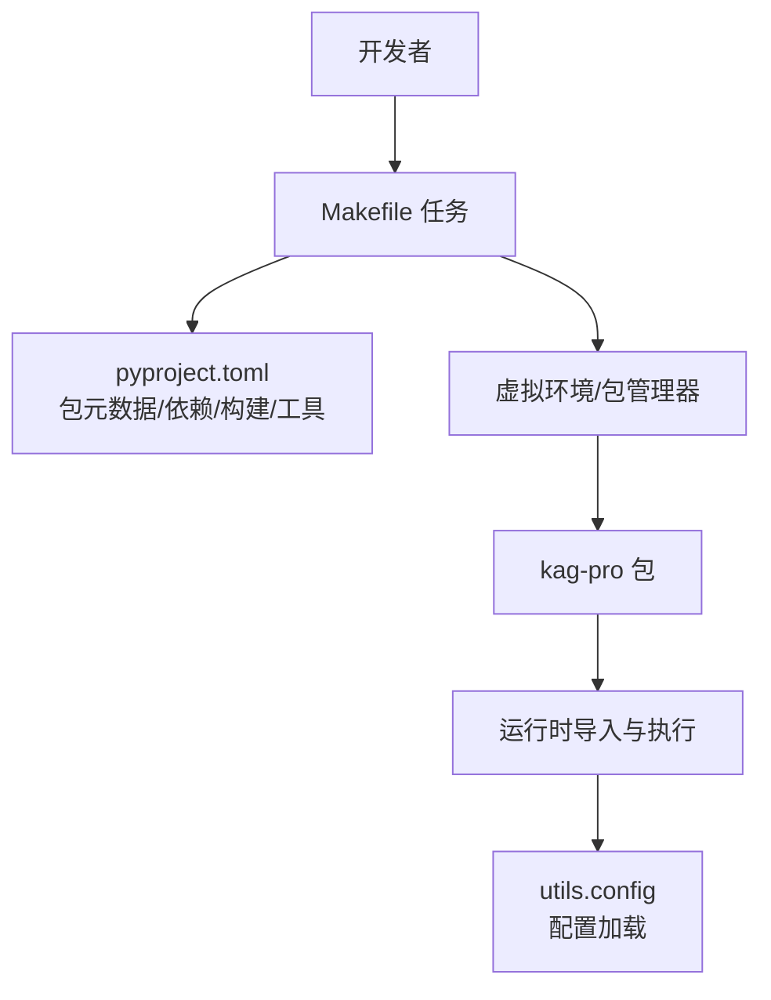
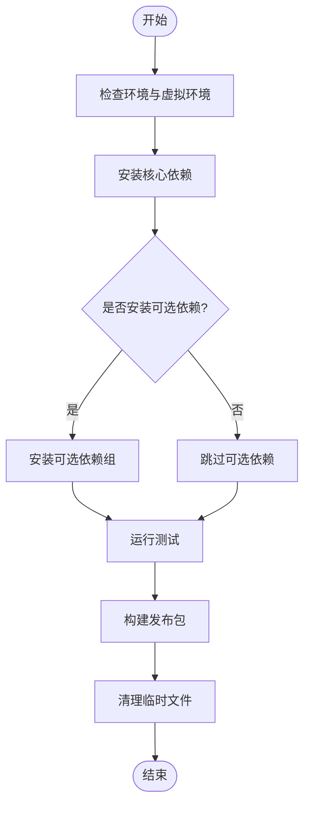

# 依赖管理

<cite>
**本文引用的文件**   
- [pyproject.toml](file://pyproject.toml)
- [Makefile](file://Makefile)
- [README.md](file://README.md)
- [src/kag_pro/utils/config.py](file://src/kag_pro/utils/config.py)
</cite>

## 目录
1. [简介](#简介)
2. [项目结构](#项目结构)
3. [核心组件](#核心组件)
4. [架构总览](#架构总览)
5. [详细组件分析](#详细组件分析)
6. [依赖关系分析](#依赖关系分析)
7. [性能考虑](#性能考虑)
8. [故障排查指南](#故障排查指南)
9. [结论](#结论)
10. [附录](#附录)

## 简介
本文件面向KAG-Pro项目的依赖管理，覆盖以下目标：
- 说明依赖分类（核心、开发、可选）与组织方式
- 解读pyproject.toml的结构与作用（包元数据、依赖声明、构建系统、工具配置）
- 文档化Makefile中的自动化命令（安装、测试、构建、清理）
- 制定版本管理策略（语义版本控制、依赖更新流程、兼容性考虑）
- 提供依赖冲突的排查与解决方法
- 给出第三方库升级最佳实践与安全更新流程

## 项目结构
从仓库根目录可见，本项目采用现代Python工程结构：
- 源码位于 src/kag_pro/ 下，按功能模块划分（core、kg、diagnosis、evaluation、stage、utils等）
- 测试位于 tests/ 下，使用pytest组织用例
- 前端脚本位于 frontend/，用于文本生成演示与服务
- 数据与示例位于 data/ 与 notebooks/
- 顶层配置文件包括 pyproject.toml、Makefile、README.md 等

[本节为概念性概述，不直接分析具体文件]

## 核心组件
围绕依赖管理的核心组件包括：
- 包定义与依赖声明：集中在 pyproject.toml
- 自动化任务：集中在 Makefile
- 运行时配置加载：在 utils/config.py 中提供配置读取能力，便于在不同环境切换依赖行为（如可选特性开关）

本节后续章节将分别对 pyproject.toml 和 Makefile 进行结构化解析。

**章节来源**
- [pyproject.toml](file://pyproject.toml)
- [Makefile](file://Makefile)
- [src/kag_pro/utils/config.py](file://src/kag_pro/utils/config.py)

## 架构总览
下图展示依赖管理与构建运行时的整体关系：开发者通过Makefile触发任务，任务调用基于pyproject.toml定义的构建系统与工具链；运行时由Python解释器加载包及其依赖。

[本节为概念性架构图，未映射到具体代码行]

## 详细组件分析

### pyproject.toml 结构与依赖声明
pyproject.toml 是Python工程的单一事实源，通常包含如下部分：
- 包元数据：名称、版本、描述、作者、许可证、URL、入口点等
- 依赖声明：
  - 核心依赖：运行时必需的基础库
  - 开发依赖：测试、格式化、类型检查、文档等工具
  - 可选依赖：以“extras”形式提供的可选功能（例如不同向量数据库后端、不同嵌入模型后端）
- 构建系统：指定构建后端（如 setuptools、hatchling、pdm-backend 等）
- 工具配置：lint、test、format、type-check 等工具的参数与规则

建议的组织方式：
- 将核心依赖与可选依赖分离，避免默认安装体积过大
- 使用明确的版本约束策略（见“版本管理策略”）
- 将常用工具配置集中，便于团队统一风格

**章节来源**
- [pyproject.toml](file://pyproject.toml)

### Makefile 自动化命令
Makefile 提供一键式任务，常见任务包括：
- 安装：创建或激活虚拟环境，安装核心依赖与可选依赖
- 测试：运行 pytest，支持覆盖率、并行、报告输出
- 构建：打包分发（wheel/sdist），生成文档或前端产物
- 清理：删除缓存、构建产物、临时文件
- 代码质量：格式化、静态检查、类型检查

典型任务命名约定：
- install: 安装依赖
- test: 运行测试
- build: 构建发布包
- clean: 清理工作区
- lint/format/typecheck: 代码质量相关

建议在Makefile中使用变量统一管理Python路径、虚拟环境名、测试参数等，提升可移植性。

**章节来源**
- [Makefile](file://Makefile)

### 运行时配置与可选依赖
utils/config.py 提供配置加载能力，可用于：
- 根据环境变量或配置文件选择后端实现（如不同的向量存储、检索器、嵌入模型）
- 按需启用可选依赖（例如仅在开启某特性时导入对应库）
- 集中管理敏感信息（API密钥、路径等）

建议：
- 对可选依赖进行懒加载与异常捕获，避免在未安装可选包时报错
- 为关键配置项提供默认值与校验逻辑

**章节来源**
- [src/kag_pro/utils/config.py](file://src/kag_pro/utils/config.py)

### 版本管理策略
- 语义版本控制（SemVer）：遵循 MAJOR.MINOR.PATCH 规范
  - MAJOR：破坏性变更
  - MINOR：向后兼容的功能新增
  - PATCH：向后兼容的问题修复
- 依赖版本约束策略：
  - 核心依赖：建议使用“>=X,<Y”范围约束，平衡稳定性与可获得性
  - 开发依赖：可使用较宽松的版本范围，优先保证本地一致性
  - 可选依赖：明确最小版本要求，并在导入失败时给出友好提示
- 锁定与复现：
  - 在CI环境中使用锁文件（如 poetry.lock、pip-tools、uv 等）确保可复现构建
  - 定期同步上游依赖并回归测试

**章节来源**
- [pyproject.toml](file://pyproject.toml)

### 依赖冲突排查与解决
常见问题与定位步骤：
- 症状：安装失败、导入错误、运行时异常
- 定位：
  - 查看依赖树，识别冲突来源
  - 检查是否存在多个提供者（如多个向量库后端）
  - 确认Python版本与平台差异导致的二进制包不可用
- 解决：
  - 调整版本约束，缩小冲突范围
  - 使用隔离环境（venv/poetry/uv）避免全局污染
  - 使用可选依赖分组，按需安装
  - 在CI中固定Python版本与操作系统，减少环境差异

**章节来源**
- [pyproject.toml](file://pyproject.toml)
- [Makefile](file://Makefile)

### 第三方库升级最佳实践与安全更新
- 升级流程：
  - 先升级开发依赖，验证本地测试与构建
  - 再升级核心依赖，逐包升级并运行全量测试
  - 记录变更日志与迁移指南，必要时编写适配层
- 安全更新：
  - 订阅安全公告，建立漏洞扫描机制
  - 对高危漏洞优先处理，必要时回滚至已知稳定版本
  - 在CI中加入安全扫描任务（如依赖审计）
- 回滚策略：
  - 保留最近稳定版本的锁文件与制品
  - 提供一键回滚任务（Makefile 中定义）

**章节来源**
- [pyproject.toml](file://pyproject.toml)
- [Makefile](file://Makefile)

## 依赖关系分析
下图展示依赖管理与构建任务的交互关系：

[本节为概念流程图，未映射到具体代码行]

## 性能考虑
- 依赖体积：仅安装必要依赖，使用可选依赖分组减少镜像与部署体积
- 冷启动优化：延迟导入重型库，按需加载
- 缓存策略：利用包管理器缓存与离线安装加速CI
- 并发测试：合理设置测试并行度，避免资源争用

[本节为通用指导，不直接分析具体文件]

## 故障排查指南
- 安装阶段失败：
  - 检查Python版本与平台匹配
  - 查看缺失的系统级依赖（编译工具链、C扩展依赖）
  - 使用更严格的日志级别输出
- 导入阶段失败：
  - 确认可选依赖已正确安装
  - 检查utils.config中的后端选择与环境变量
- 运行时异常：
  - 核对依赖版本是否与预期一致
  - 使用最小可复现示例定位问题

**章节来源**
- [Makefile](file://Makefile)
- [src/kag_pro/utils/config.py](file://src/kag_pro/utils/config.py)

## 结论
通过统一的pyproject.toml与Makefile，KAG-Pro实现了清晰的依赖分层、可复现的构建流程与高效的自动化任务。配合语义版本控制与严格的安全更新流程，可在保持稳定的同时持续演进。

[本节为总结性内容，不直接分析具体文件]

## 附录
- 参考文件
  - README.md：项目背景与使用说明
  - pyproject.toml：包元数据、依赖与构建配置
  - Makefile：自动化任务清单
  - utils/config.py：运行时配置加载

**章节来源**
- [README.md](file://README.md)
- [pyproject.toml](file://pyproject.toml)
- [Makefile](file://Makefile)
- [src/kag_pro/utils/config.py](file://src/kag_pro/utils/config.py)