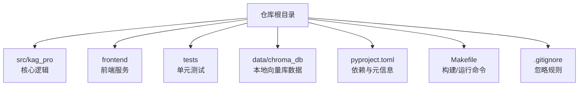
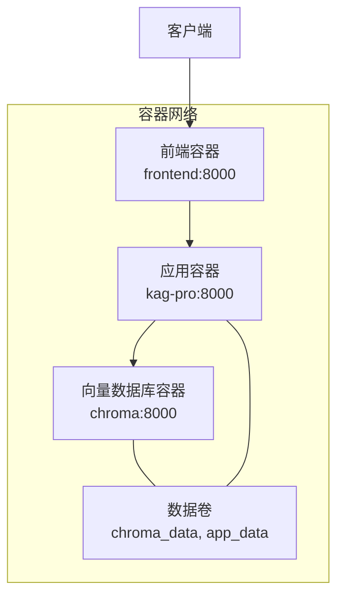
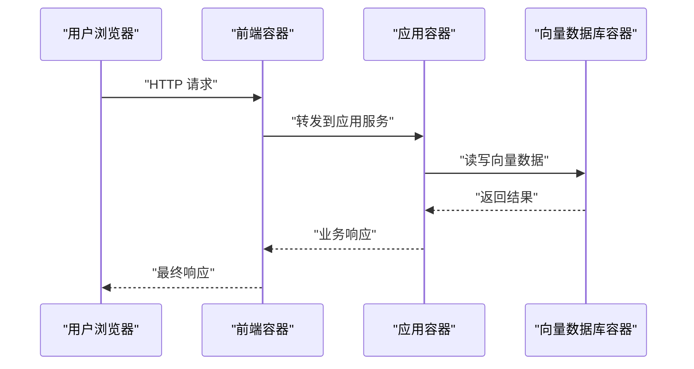
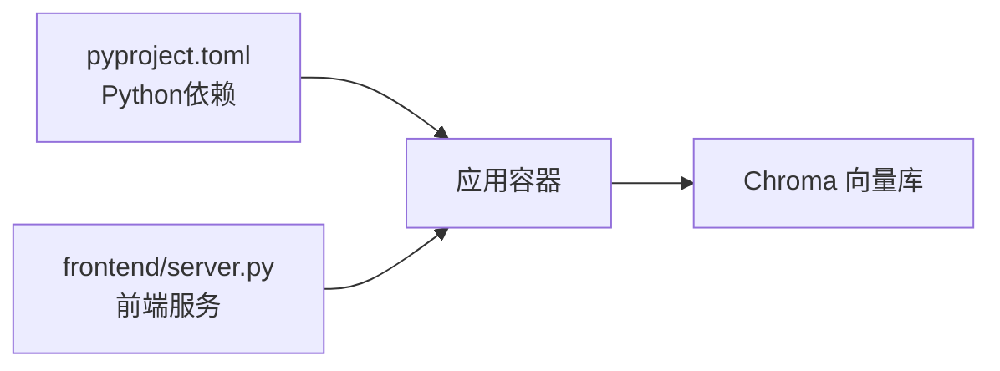

# 容器化部署

<cite>
**本文引用的文件**   
- [README.md](file://README.md)
- [pyproject.toml](file://pyproject.toml)
- [Makefile](file://Makefile)
- [.gitignore](file://.gitignore)
- [src/kag_pro/utils/config.py](file://src/kag_pro/utils/config.py)
- [frontend/server.py](file://frontend/server.py)
</cite>

## 目录
1. [简介](#简介)
2. [项目结构](#项目结构)
3. [核心组件](#核心组件)
4. [架构总览](#架构总览)
5. [详细组件分析](#详细组件分析)
6. [依赖关系分析](#依赖关系分析)
7. [性能考虑](#性能考虑)
8. [故障排查指南](#故障排查指南)
9. [结论](#结论)
10. [附录](#附录)

## 简介
本文件面向KAG-Pro的容器化与生产部署，覆盖Docker镜像构建（多阶段构建、分层策略、体积优化）、Dockerfile配置要点、Docker Compose编排（服务通信、数据持久化）、网络配置（端口映射、服务发现、负载均衡）、生产最佳实践（安全加固、资源限制、健康检查）以及监控与日志收集方案。文档以仓库现有代码为依据，结合通用容器化最佳实践给出可操作建议。

## 项目结构
从仓库结构看，KAG-Pro包含Python后端核心模块（src/kag_pro）、前端静态页面与服务（frontend）、测试与示例脚本等。容器化需关注：
- Python应用入口与依赖声明
- 前端服务（如存在）
- 外部依赖（向量数据库、模型权重等）
- 配置文件与环境变量

**图表来源** 
- [pyproject.toml](file://pyproject.toml)
- [Makefile](file://Makefile)
- [.gitignore](file://.gitignore)
- [frontend/server.py](file://frontend/server.py)

**章节来源**
- [README.md](file://README.md)
- [pyproject.toml](file://pyproject.toml)
- [Makefile](file://Makefile)
- [.gitignore](file://.gitignore)

## 核心组件
- Python应用层：位于src/kag_pro，包含核心业务逻辑、工具与配置读取。
- 前端服务：frontend/server.py提供前端静态资源或轻量HTTP服务。
- 依赖管理：pyproject.toml声明运行时依赖与包元信息。
- 构建与运行：Makefile提供常用命令，便于在容器内外统一执行。

**章节来源**
- [src/kag_pro/utils/config.py](file://src/kag_pro/utils/config.py)
- [frontend/server.py](file://frontend/server.py)
- [pyproject.toml](file://pyproject.toml)
- [Makefile](file://Makefile)

## 架构总览
下图展示推荐的容器化架构：应用容器通过内部网络访问向量数据库（Chroma），前端容器与应用容器通信；数据卷持久化向量库与用户数据；可选地引入反向代理进行负载均衡与健康检查。

[此图为概念性架构图，不直接映射具体源码文件]

## 详细组件分析

### Docker镜像构建与Dockerfile设计
- 基础镜像选择
  - 推荐基于官方Python精简镜像（slim或alpine变体）以降低体积。
  - 若需要系统级依赖（如编译C扩展），可选择带必要工具的镜像或在构建阶段安装后清理。
- 多阶段构建
  - 构建阶段：安装构建依赖、下载并缓存wheel、编译扩展。
  - 运行阶段：仅复制最终产物与最小运行时依赖，显著减小镜像体积。
- 分层策略
  - 将依赖安装与代码拷贝分离，利用Docker缓存加速重复构建。
  - 使用.dockerignore排除无关文件（测试、notebook、临时文件）。
- 体积优化技巧
  - 合并RUN指令减少层数。
  - 使用--no-cache-dir、pip缓存清理、apt-get clean。
  - 避免将大文件（模型权重、数据集）打入镜像，改用挂载卷或启动时拉取。
- 运行配置
  - 指定非root用户运行，提升安全性。
  - 设置工作目录、环境变量、健康检查端点。
  - 暴露端口并定义默认启动命令。

参考路径（用于定位相关配置与入口）：
- [pyproject.toml](file://pyproject.toml)
- [Makefile](file://Makefile)
- [frontend/server.py](file://frontend/server.py)

**章节来源**
- [pyproject.toml](file://pyproject.toml)
- [Makefile](file://Makefile)
- [frontend/server.py](file://frontend/server.py)

### Docker Compose编排与服务间通信
- 服务定义
  - kag-pro：应用服务，依赖向量数据库。
  - chroma：向量数据库服务，数据持久化到卷。
  - frontend：前端服务，转发请求至应用服务。
- 服务间通信
  - 使用Compose内部DNS以服务名解析（如chroma、app）。
  - 通过环境变量注入连接地址、密钥等敏感信息。
- 数据持久化
  - 为向量数据库与应用数据创建命名卷，确保重启不丢失。
- 网络与端口
  - 对外暴露前端端口（如80/443），内部服务端口不直接暴露。
  - 可通过反向代理（Nginx/Traefik）实现TLS终止与负载均衡。

[此图为概念性序列图，不直接映射具体源码文件]

**章节来源**
- [frontend/server.py](file://frontend/server.py)
- [src/kag_pro/utils/config.py](file://src/kag_pro/utils/config.py)

### 容器网络配置（端口映射、服务发现、负载均衡）
- 端口映射
  - 仅对外暴露前端或网关端口；应用与数据库端口保持内网隔离。
- 服务发现
  - 使用Compose内置DNS或服务网格（如Kubernetes Service）进行服务发现。
- 负载均衡
  - 在生产环境建议使用反向代理或Ingress控制器对多个应用副本进行负载均衡与健康检查。

[本节为通用网络配置指导，不直接分析具体源码文件]

### 生产环境最佳实践（安全、资源、健康检查）
- 安全加固
  - 使用非root用户运行容器。
  - 最小权限原则：只暴露必要端口与文件系统写入权限。
  - 扫描镜像漏洞，定期更新基础镜像。
- 资源限制
  - 为容器设置CPU与内存上限，防止资源争用。
- 健康检查
  - 为应用与数据库定义健康检查端点，失败自动重启或剔除流量。
- 配置管理
  - 使用环境变量或Secrets管理敏感配置，避免硬编码。

[本节为通用生产实践指导，不直接分析具体源码文件]

### 监控与日志收集
- 指标采集
  - 暴露Prometheus指标端点，由Prometheus抓取。
  - 应用层关键指标：QPS、延迟、错误率、队列长度、向量检索耗时。
- 日志收集
  - 输出结构化JSON日志到stdout/stderr，由Fluent Bit/Filebeat收集并转发至集中式存储（ELK/Loki）。
- 链路追踪
  - 集成OpenTelemetry，跨服务追踪请求链路。

[本节为通用监控与日志方案，不直接分析具体源码文件]

## 依赖关系分析
- 运行时依赖
  - Python包依赖由pyproject.toml声明，建议在构建阶段生成锁定文件并在运行镜像中复用。
- 外部依赖
  - 向量数据库（Chroma）作为独立服务运行，通过环境变量配置连接参数。
- 前端依赖
  - 前端服务可能依赖Node或静态资源打包产物，根据实际server.py实现决定。

**图表来源** 
- [pyproject.toml](file://pyproject.toml)
- [frontend/server.py](file://frontend/server.py)

**章节来源**
- [pyproject.toml](file://pyproject.toml)
- [frontend/server.py](file://frontend/server.py)

## 性能考虑
- 构建期优化
  - 使用多阶段构建与依赖缓存，缩短CI构建时间。
  - 预编译二进制与wheel缓存，避免重复编译。
- 运行期优化
  - 合理设置进程数与线程数（如Gunicorn workers）。
  - 调整JIT/向量化库参数，匹配容器资源限制。
  - 启用连接池与对象缓存，降低外部IO开销。
- 存储优化
  - 将大体积数据（模型、语料）置于外部存储或对象存储，按需加载。

[本节为通用性能优化建议，不直接分析具体源码文件]

## 故障排查指南
- 常见问题
  - 端口冲突：检查宿主机与容器端口映射是否冲突。
  - 依赖缺失：确认构建阶段已安装所有系统级依赖。
  - 数据卷权限：确保容器内用户有写入权限。
  - 健康检查失败：检查应用健康端点与探针配置。
- 诊断步骤
  - 查看容器日志与指标。
  - 进入容器执行调试命令（如ping、curl、python -c）。
  - 验证环境变量与配置项是否正确注入。

[本节为通用排障建议，不直接分析具体源码文件]

## 结论
通过多阶段构建、严格分层与体积优化，结合Docker Compose编排与生产最佳实践，KAG-Pro可在容器中稳定运行。配合完善的监控与日志体系，可实现高可用与可观测的生产部署。

[本节为总结性内容，不直接分析具体源码文件]

## 附录
- 参考路径（用于定位仓库中的关键配置与入口）
  - [README.md](file://README.md)
  - [pyproject.toml](file://pyproject.toml)
  - [Makefile](file://Makefile)
  - [src/kag_pro/utils/config.py](file://src/kag_pro/utils/config.py)
  - [frontend/server.py](file://frontend/server.py)
  - [.gitignore](file://.gitignore)