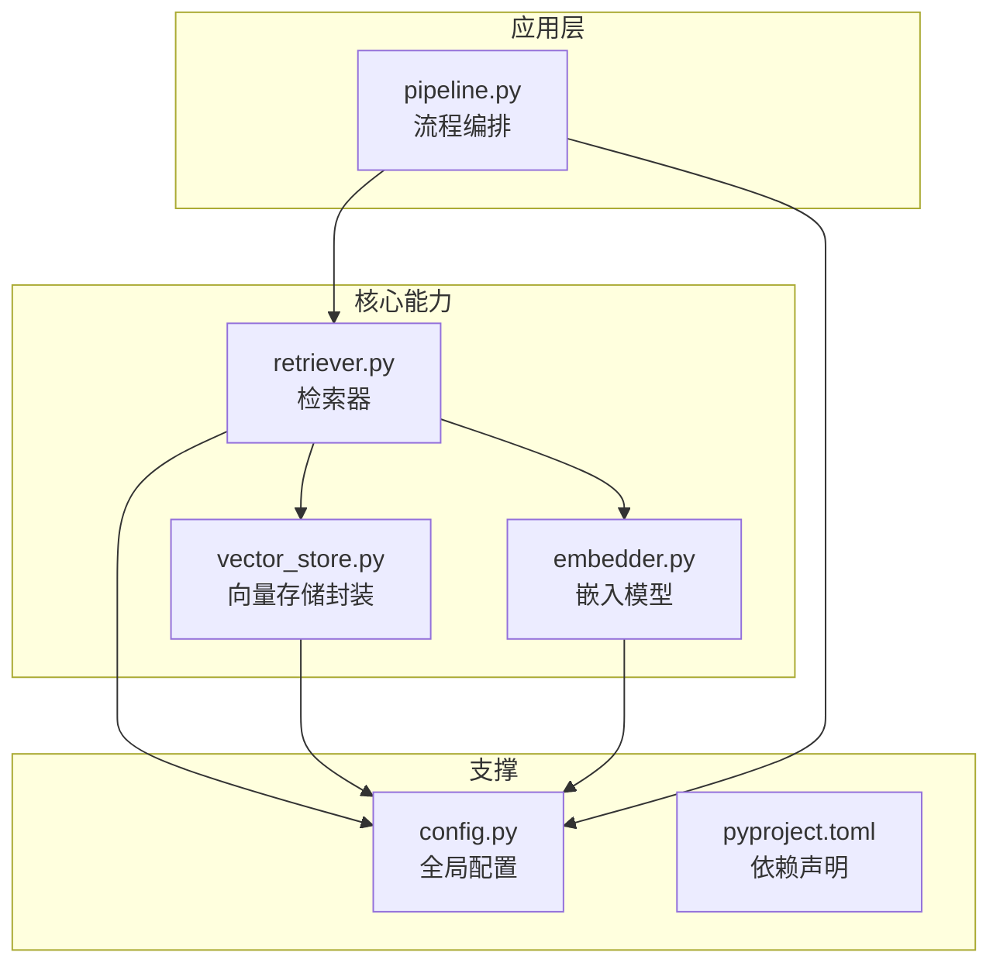
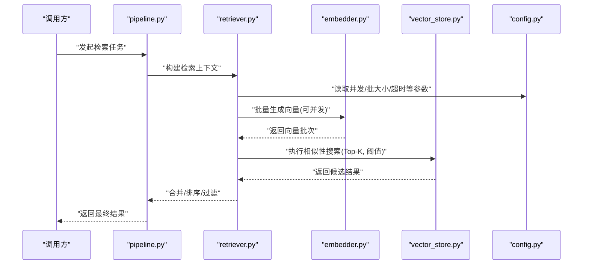
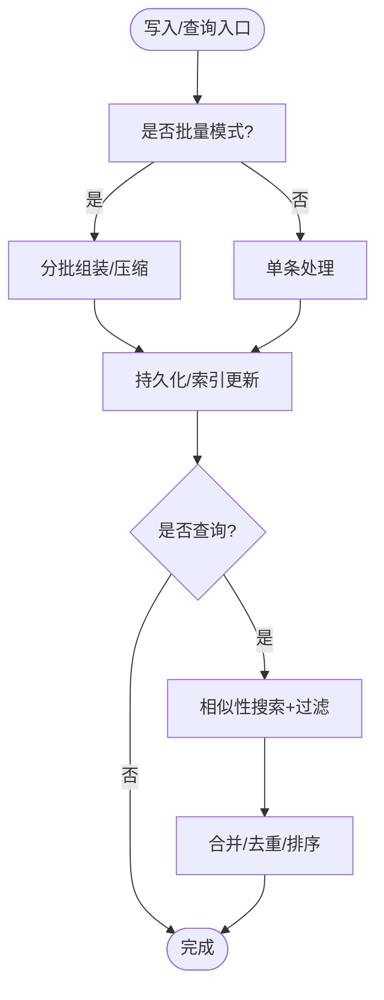
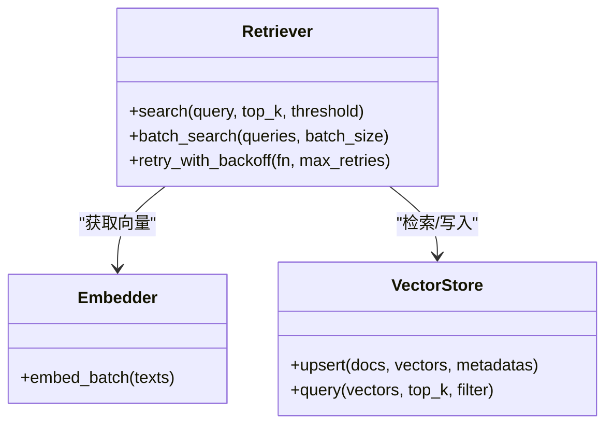
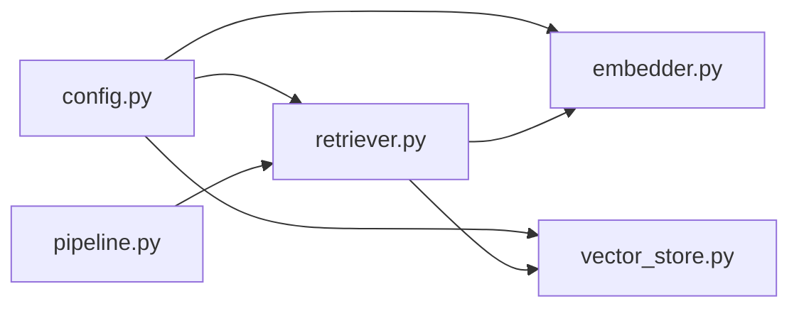

# 性能优化配置

<cite>
**本文引用的文件**   
- [src/kag_pro/utils/config.py](file://src/kag_pro/utils/config.py)
- [src/kag_pro/core/vector_store.py](file://src/kag_pro/core/vector_store.py)
- [src/kag_pro/core/embedder.py](file://src/kag_pro/core/embedder.py)
- [src/kag_pro/core/retriever.py](file://src/kag_pro/core/retriever.py)
- [src/kag_pro/core/pipeline.py](file://src/kag_pro/core/pipeline.py)
- [pyproject.toml](file://pyproject.toml)
</cite>

## 目录
1. [简介](#简介)
2. [项目结构](#项目结构)
3. [核心组件](#核心组件)
4. [架构总览](#架构总览)
5. [详细组件分析](#详细组件分析)
6. [依赖关系分析](#依赖关系分析)
7. [性能考虑](#性能考虑)
8. [故障排查指南](#故障排查指南)
9. [结论](#结论)
10. [附录](#附录)

## 简介
本文件面向KAG-Pro的性能调优与配置，聚焦以下方面：内存管理、CPU使用率与I/O优化；向量存储（ChromaDB）的索引策略与查询调优；数据库连接池参数（连接数、超时、故障转移）；多级缓存策略与失效机制；并发处理（线程池、异步、负载均衡）；以及性能监控指标与瓶颈分析方法。文档以仓库现有实现为依据，提供可操作的配置建议与可视化说明，帮助读者快速定位并优化系统瓶颈。

## 项目结构
KAG-Pro采用分层模块化组织：核心流程在core下，工具与配置在utils下，外部依赖通过pyproject.toml声明。与性能相关的关键位置包括：
- 配置入口：utils/config.py
- 向量检索链路：core/vector_store.py、core/retriever.py、core/embedder.py
- 编排与调度：core/pipeline.py
- 依赖版本与可选特性：pyproject.toml

图表来源
- [src/kag_pro/core/pipeline.py](file://src/kag_pro/core/pipeline.py)
- [src/kag_pro/core/retriever.py](file://src/kag_pro/core/retriever.py)
- [src/kag_pro/core/vector_store.py](file://src/kag_pro/core/vector_store.py)
- [src/kag_pro/core/embedder.py](file://src/kag_pro/core/embedder.py)
- [src/kag_pro/utils/config.py](file://src/kag_pro/utils/config.py)
- [pyproject.toml](file://pyproject.toml)

章节来源
- [src/kag_pro/utils/config.py](file://src/kag_pro/utils/config.py)
- [src/kag_pro/core/vector_store.py](file://src/kag_pro/core/vector_store.py)
- [src/kag_pro/core/embedder.py](file://src/kag_pro/core/embedder.py)
- [src/kag_pro/core/retriever.py](file://src/kag_pro/core/retriever.py)
- [src/kag_pro/core/pipeline.py](file://src/kag_pro/core/pipeline.py)
- [pyproject.toml](file://pyproject.toml)

## 核心组件
- 配置中心（config.py）：集中管理运行期可调参数，如并发度、批大小、超时、路径等。建议将性能相关键值统一命名空间，便于按环境切换。
- 向量存储（vector_store.py）：封装ChromaDB客户端与集合操作，负责持久化与查询。应关注集合初始化参数、批量写入与查询批大小、索引类型选择。
- 检索器（retriever.py）：组合嵌入与向量检索，控制Top-K、相似度阈值、过滤条件与重试/降级逻辑。
- 嵌入器（embedder.py）：调用外部Embedding服务或本地模型，涉及批处理、分片、缓存与错误恢复。
- 流程编排（pipeline.py）：串联加载、切分、嵌入、入库、检索与生成阶段，适合引入并行与背压控制。

章节来源
- [src/kag_pro/utils/config.py](file://src/kag_pro/utils/config.py)
- [src/kag_pro/core/vector_store.py](file://src/kag_pro/core/vector_store.py)
- [src/kag_pro/core/retriever.py](file://src/kag_pro/core/retriever.py)
- [src/kag_pro/core/embedder.py](file://src/kag_pro/core/embedder.py)
- [src/kag_pro/core/pipeline.py](file://src/kag_pro/core/pipeline.py)

## 架构总览
下图展示从请求到检索返回的主路径，以及关键性能点（批处理、并发、缓存、连接池）。

图表来源
- [src/kag_pro/core/pipeline.py](file://src/kag_pro/core/pipeline.py)
- [src/kag_pro/core/retriever.py](file://src/kag_pro/core/retriever.py)
- [src/kag_pro/core/embedder.py](file://src/kag_pro/core/embedder.py)
- [src/kag_pro/core/vector_store.py](file://src/kag_pro/core/vector_store.py)
- [src/kag_pro/utils/config.py](file://src/kag_pro/utils/config.py)

## 详细组件分析

### 配置中心（config.py）
- 职责：集中暴露运行时参数，如并发度、批大小、超时、路径、日志级别等。
- 建议：
  - 为“并发”“批处理”“超时”“缓存”“存储”建立独立命名空间，避免散乱分布。
  - 提供默认值与环境覆盖（开发/预发/生产），支持热更新或进程内重载。
  - 对数值型参数增加边界校验与告警（过大导致OOM，过小导致吞吐不足）。

章节来源
- [src/kag_pro/utils/config.py](file://src/kag_pro/utils/config.py)

### 向量存储（vector_store.py）
- 职责：封装ChromaDB集合的创建、插入、查询与元数据管理。
- 关键调优点：
  - 集合初始化：选择合适的索引类型与度量方式，权衡召回与延迟。
  - 批量写入：增大批大小可减少RPC次数，但需平衡内存峰值。
  - 查询批处理：对高QPS场景，聚合查询可降低网络往返。
  - 元数据过滤：利用元数据索引减少全表扫描。
  - 持久化与快照：定期落盘与增量同步，缩短冷启动时间。

图表来源
- [src/kag_pro/core/vector_store.py](file://src/kag_pro/core/vector_store.py)

章节来源
- [src/kag_pro/core/vector_store.py](file://src/kag_pro/core/vector_store.py)

### 检索器（retriever.py）
- 职责：协调嵌入与向量检索，控制Top-K、相似度阈值、过滤与重试。
- 关键调优点：
  - Top-K与阈值：根据业务精度/时延目标联合调参。
  - 重试与降级：对ChromaDB瞬时失败进行指数退避与回退策略。
  - 结果后处理：去重、截断、重排，降低下游压力。

图表来源
- [src/kag_pro/core/retriever.py](file://src/kag_pro/core/retriever.py)
- [src/kag_pro/core/embedder.py](file://src/kag_pro/core/embedder.py)
- [src/kag_pro/core/vector_store.py](file://src/kag_pro/core/vector_store.py)

章节来源
- [src/kag_pro/core/retriever.py](file://src/kag_pro/core/retriever.py)

### 嵌入器（embedder.py）
- 职责：文本向量化，支持批处理、缓存与错误恢复。
- 关键调优点：
  - 批大小与并发：结合GPU/CPU资源与外部服务限流调整。
  - 缓存：基于内容哈希的本地缓存，命中直接返回，减少重复计算。
  - 分片与背压：大输入分片，防止内存抖动。

章节来源
- [src/kag_pro/core/embedder.py](file://src/kag_pro/core/embedder.py)

### 流程编排（pipeline.py）
- 职责：串联数据加载、切分、嵌入、入库、检索与生成。
- 关键调优点：
  - 阶段并行：对无依赖阶段并行执行，注意共享资源竞争。
  - 背压与队列：用有界队列缓冲上下游速率差异。
  - 优雅关闭：确保中断信号下安全释放资源。

章节来源
- [src/kag_pro/core/pipeline.py](file://src/kag_pro/core/pipeline.py)

## 依赖关系分析
- 模块耦合：retriever依赖embedder与vector_store；pipeline编排各组件；config被多处读取。
- 外部依赖：ChromaDB作为向量库，嵌入服务可能为本地或远程API。
- 风险点：
  - 循环依赖：避免在组件间互相import形成环。
  - 资源争用：多线程/多进程共享文件句柄、连接池时需加锁或隔离。

图表来源
- [src/kag_pro/utils/config.py](file://src/kag_pro/utils/config.py)
- [src/kag_pro/core/retriever.py](file://src/kag_pro/core/retriever.py)
- [src/kag_pro/core/vector_store.py](file://src/kag_pro/core/vector_store.py)
- [src/kag_pro/core/embedder.py](file://src/kag_pro/core/embedder.py)
- [src/kag_pro/core/pipeline.py](file://src/kag_pro/core/pipeline.py)

章节来源
- [src/kag_pro/utils/config.py](file://src/kag_pro/utils/config.py)
- [src/kag_pro/core/retriever.py](file://src/kag_pro/core/retriever.py)
- [src/kag_pro/core/vector_store.py](file://src/kag_pro/core/vector_store.py)
- [src/kag_pro/core/embedder.py](file://src/kag_pro/core/embedder.py)
- [src/kag_pro/core/pipeline.py](file://src/kag_pro/core/pipeline.py)

## 性能考虑

### 内存管理
- 控制批大小：增大批提升吞吐，但需评估峰值内存；建议动态批大小与上限保护。
- 对象复用：重用字符串缓冲区、字节数组与连接对象，减少GC压力。
- 显式释放：及时关闭文件句柄、断开连接、清空临时变量引用。
- 监控：跟踪RSS、堆分配、GC暂停时间，识别泄漏与抖动。

### CPU使用率
- 合理并发：根据CPU核数与任务类型设置线程/进程池大小，避免上下文切换过多。
- 向量化计算：优先使用BLAS/MKL加速矩阵运算；必要时启用GPU。
- 热点优化：对高频路径进行采样剖析，消除不必要拷贝与序列化。

### I/O优化
- 批量读写：合并小写为大写，减少系统调用次数。
- 零拷贝：尽量使用内存映射或零拷贝传输接口。
- 磁盘布局：将热数据置于SSD/NVMe，分离冷热路径。

### 向量存储优化（ChromaDB）
- 索引策略：根据维度与查询量选择合适索引类型；对高维数据考虑降维或近似索引。
- 查询调优：Top-K与阈值联动调节；开启元数据过滤以减少扫描范围。
- 写入策略：批量Upsert，配合事务或幂等键避免重复。
- 持久化：定期快照与增量备份，缩短重启恢复时间。

### 数据库连接池配置
- 连接数限制：根据后端容量与并发需求设定最小/最大连接数。
- 超时设置：连接、读、写超时分别配置，避免长尾阻塞。
- 故障转移：主备切换、重试与熔断；失败快速失败与降级路径。
- 健康检查：周期性探测连接可用性，剔除异常节点。

### 缓存策略
- 多级缓存：L1进程内缓存（LRU/TTL）、L2分布式缓存（Redis/Memcached）。
- 失效策略：TTL、LRU、LFU、事件驱动失效；保证一致性窗口。
- 内存管理：设置上限与淘汰策略，监控命中率与内存占用。

### 并发处理优化
- 线程池：IO密集型使用较多线程，CPU密集型使用较少线程；区分工作队列。
- 异步处理：非阻塞I/O与协程提升吞吐；注意避免GIL瓶颈。
- 负载均衡：多实例部署，基于权重/最少连接/一致性哈希分发。

### 性能监控指标与瓶颈分析
- 指标采集：QPS、P95/P99延迟、错误率、CPU/内存/磁盘/网络利用率、连接池活跃/等待。
- 追踪埋点：端到端TraceID，记录关键阶段耗时与分支。
- 瓶颈定位：火焰图、热点函数剖析、慢查询日志、系统调用统计。
- 容量规划：压测基线、弹性伸缩策略、灰度发布验证。

## 故障排查指南
- 常见问题
  - 向量检索超时：检查ChromaDB负载、网络延迟、Top-K与阈值设置。
  - OOM：缩小批大小、启用分页/流式处理、检查缓存上限。
  - 连接池耗尽：提高最大连接数、缩短超时、排查未释放连接。
  - 缓存命中率低：优化键设计、调整TTL与淘汰策略。
- 诊断步骤
  - 查看配置项是否生效，核对环境变量与默认值覆盖顺序。
  - 采集关键指标与日志，定位异常阶段。
  - 复现问题并逐步放宽限制，观察变化趋势。

章节来源
- [src/kag_pro/utils/config.py](file://src/kag_pro/utils/config.py)
- [src/kag_pro/core/vector_store.py](file://src/kag_pro/core/vector_store.py)
- [src/kag_pro/core/retriever.py](file://src/kag_pro/core/retriever.py)
- [src/kag_pro/core/embedder.py](file://src/kag_pro/core/embedder.py)
- [src/kag_pro/core/pipeline.py](file://src/kag_pro/core/pipeline.py)

## 结论
通过对配置中心、向量存储、检索器、嵌入器与流程编排的系统化调优，可在不牺牲召回质量的前提下显著提升吞吐与稳定性。建议在生产环境建立完善的监控与压测体系，持续迭代参数与架构，确保性能与成本的最优平衡。

## 附录
- 参考依赖与版本：参见项目依赖清单，确认ChromaDB与嵌入服务版本兼容性。

章节来源
- [pyproject.toml](file://pyproject.toml)