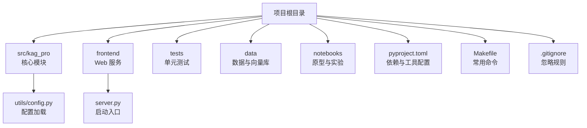
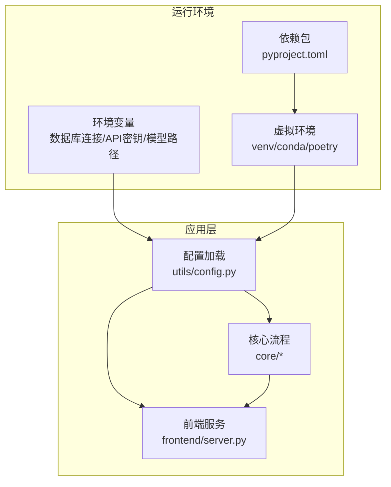
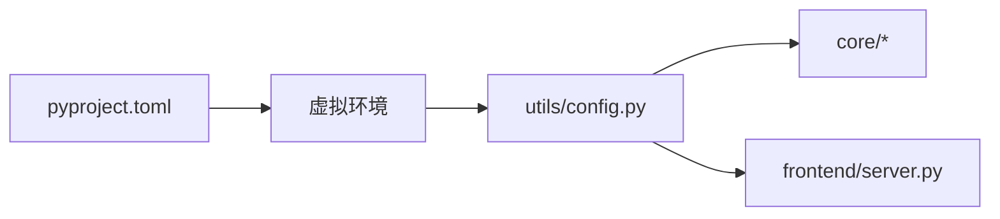

# 环境配置

<cite>
**本文引用的文件**   
- [pyproject.toml](file://pyproject.toml)
- [README.md](file://README.md)
- [Makefile](file://Makefile)
- [.gitignore](file://.gitignore)
- [src/kag_pro/utils/config.py](file://src/kag_pro/utils/config.py)
- [frontend/server.py](file://frontend/server.py)
</cite>

## 目录
1. [简介](#简介)
2. [项目结构](#项目结构)
3. [核心组件](#核心组件)
4. [架构总览](#架构总览)
5. [详细组件分析](#详细组件分析)
6. [依赖分析](#依赖分析)
7. [性能考虑](#性能考虑)
8. [故障排查指南](#故障排查指南)
9. [结论](#结论)
10. [附录](#附录)

## 简介
本文件为 KAG-Pro 的环境配置文档，覆盖系统要求、依赖管理、虚拟环境设置、环境变量与差异化配置（开发/生产），并提供常见问题排查方法。目标是帮助开发者快速搭建稳定可复现的运行环境，并理解关键配置项的作用与影响。

## 项目结构
KAG-Pro 采用 Python 包组织方式，核心代码位于 src/kag_pro，前端服务位于 frontend，构建与任务脚本位于 Makefile，依赖声明位于 pyproject.toml。配置文件与环境变量读取逻辑集中在 utils/config.py，前端服务器在 frontend/server.py 中加载运行所需配置。

图表来源
- [pyproject.toml](file://pyproject.toml)
- [Makefile](file://Makefile)
- [src/kag_pro/utils/config.py](file://src/kag_pro/utils/config.py)
- [frontend/server.py](file://frontend/server.py)

章节来源
- [README.md](file://README.md)
- [pyproject.toml](file://pyproject.toml)
- [Makefile](file://Makefile)
- [.gitignore](file://.gitignore)

## 核心组件
本节聚焦与环境配置直接相关的核心组件：依赖声明、配置加载、前端服务启动。

- 依赖与工具配置
  - 通过 pyproject.toml 声明运行时依赖、可选依赖组与开发工具链。
  - 建议锁定版本以保障可复现性；可选依赖组用于按需安装功能（如不同向量库或模型后端）。
- 配置加载
  - 使用 utils/config.py 集中读取环境变量与默认值，供各模块统一获取配置。
- 前端服务
  - frontend/server.py 作为轻量 Web 服务，按环境变量加载必要配置（如端口、静态资源路径等）。

章节来源
- [pyproject.toml](file://pyproject.toml)
- [src/kag_pro/utils/config.py](file://src/kag_pro/utils/config.py)
- [frontend/server.py](file://frontend/server.py)

## 架构总览
下图展示环境相关的关键交互：应用从环境变量与配置文件读取参数，初始化核心组件（嵌入器、检索器、生成器等），并通过前端服务对外暴露能力。

图表来源
- [src/kag_pro/utils/config.py](file://src/kag_pro/utils/config.py)
- [frontend/server.py](file://frontend/server.py)
- [pyproject.toml](file://pyproject.toml)

## 详细组件分析

### 依赖管理与版本锁定策略
- 依赖声明位置
  - 所有依赖与工具均在 pyproject.toml 中声明，包括核心依赖、可选依赖组与开发依赖。
- 版本锁定策略
  - 建议使用固定版本号或兼容范围，结合依赖解析工具生成锁文件，确保团队与 CI 一致性。
- 可选依赖组
  - 可按功能域划分可选依赖（例如不同的向量存储后端、外部 API SDK 等），按需安装以减少体积与冲突。
- 推荐实践
  - 将敏感信息（API 密钥）放入环境变量，不在仓库中硬编码。
  - 使用 .gitignore 排除本地生成的锁文件或临时文件。

章节来源
- [pyproject.toml](file://pyproject.toml)
- [.gitignore](file://.gitignore)

### 虚拟环境设置
- venv
  - 使用标准库 venv 创建隔离环境，激活后安装依赖。
- conda
  - 适合需要系统级依赖（如 CUDA）的场景，便于管理二进制依赖。
- poetry
  - 提供依赖解析与锁文件管理，支持可选依赖组一键安装。
- 选择建议
  - 纯 Python 场景优先 venv 或 poetry；涉及 GPU/CUDA 时优先考虑 conda。

章节来源
- [pyproject.toml](file://pyproject.toml)
- [Makefile](file://Makefile)

### 环境变量与关键配置项
- 配置加载机制
  - 通过 utils/config.py 统一读取环境变量并提供默认值，避免在各模块重复实现。
- 常见配置项类别
  - 数据库连接：连接地址、用户名、密码、数据库名、池大小等。
  - 外部 API 密钥：第三方服务的访问令牌与端点地址。
  - 模型与向量库路径：本地模型权重目录、向量库索引目录等。
  - 服务端口与日志级别：控制前端服务与内部调试输出。
- 安全建议
  - 禁止将密钥写入代码或提交到仓库；使用 .env 文件配合环境变量注入，并在 .gitignore 中忽略。

章节来源
- [src/kag_pro/utils/config.py](file://src/kag_pro/utils/config.py)

### 前端服务与环境
- 启动入口
  - frontend/server.py 负责加载配置并启动服务，通常监听指定端口并提供静态页面与接口。
- 配置项
  - 端口号、静态资源目录、跨域策略、日志开关等。
- 部署建议
  - 生产环境建议使用反向代理（Nginx）与进程管理器（systemd/supervisor）托管服务。

章节来源
- [frontend/server.py](file://frontend/server.py)

### 开发环境与生产环境的差异化配置
- 差异维度
  - 数据库连接：开发使用本地或测试库，生产指向高可用实例。
  - 日志级别：开发开启详细日志，生产仅保留警告及以上。
  - 缓存与索引：开发可关闭或减少缓存规模，生产启用持久化与预热。
  - 外部服务：开发使用沙箱或低配额账号，生产使用正式凭据。
- 切换方式
  - 通过环境变量或配置文件区分；CI/CD 中注入对应环境变量的值。
- 验证清单
  - 启动前后端、连通数据库、调用一次完整流程、检查日志与指标。

章节来源
- [src/kag_pro/utils/config.py](file://src/kag_pro/utils/config.py)
- [frontend/server.py](file://frontend/server.py)

### 常用命令与工作流
- 使用 Makefile 封装常用操作（安装依赖、运行测试、启动服务等），提升一致性与效率。
- 建议在本地与 CI 中使用相同命令，减少“在我机器上能跑”的问题。

章节来源
- [Makefile](file://Makefile)

## 依赖分析
下图展示与环境配置相关的依赖关系：pyproject.toml 定义依赖，虚拟环境负责隔离与安装，应用通过配置加载模块读取环境变量并初始化核心组件。

图表来源
- [pyproject.toml](file://pyproject.toml)
- [src/kag_pro/utils/config.py](file://src/kag_pro/utils/config.py)
- [frontend/server.py](file://frontend/server.py)

章节来源
- [pyproject.toml](file://pyproject.toml)
- [Makefile](file://Makefile)

## 性能考虑
- 依赖安装
  - 优先使用预编译二进制与镜像源，缩短安装时间。
- 内存与并发
  - 根据数据集规模调整向量库索引与连接池大小，避免 OOM。
- 模型与缓存
  - 合理设置模型加载与缓存策略，减少冷启动延迟。
- 前端服务
  - 在生产环境启用压缩与静态资源缓存，降低请求开销。

[本节为通用指导，不直接分析具体文件]

## 故障排查指南
- 依赖安装失败
  - 检查 Python 版本与平台兼容性；确认网络与镜像源；必要时使用 conda 安装系统级依赖。
- 环境变量未生效
  - 确认环境变量已正确导出或被进程管理器注入；检查配置加载模块的键名与默认值。
- 数据库连接错误
  - 校验连接字符串、认证信息与防火墙策略；检查连接池上限与超时设置。
- 前端无法访问
  - 核对端口占用与绑定地址；检查反向代理与跨域配置；查看服务日志定位问题。
- 模型或向量库路径错误
  - 确认路径存在且可读；检查权限与磁盘空间；验证索引是否已构建完成。

章节来源
- [src/kag_pro/utils/config.py](file://src/kag_pro/utils/config.py)
- [frontend/server.py](file://frontend/server.py)

## 结论
通过统一的依赖声明、严格的版本锁定、清晰的虚拟环境策略以及集中的环境变量管理，KAG-Pro 能够在开发与生产环境中保持一致的可复现性与稳定性。建议结合 Makefile 与 CI/CD 固化流程，持续优化安装与启动性能，并建立完善的监控与告警机制。

[本节为总结性内容，不直接分析具体文件]

## 附录
- 快速开始
  - 创建并激活虚拟环境，安装依赖，设置环境变量，启动前端服务，执行端到端验证。
- 参考文件
  - README.md：项目概览与使用说明
  - Makefile：常用命令集合
  - .gitignore：忽略规则

章节来源
- [README.md](file://README.md)
- [Makefile](file://Makefile)
- [.gitignore](file://.gitignore)