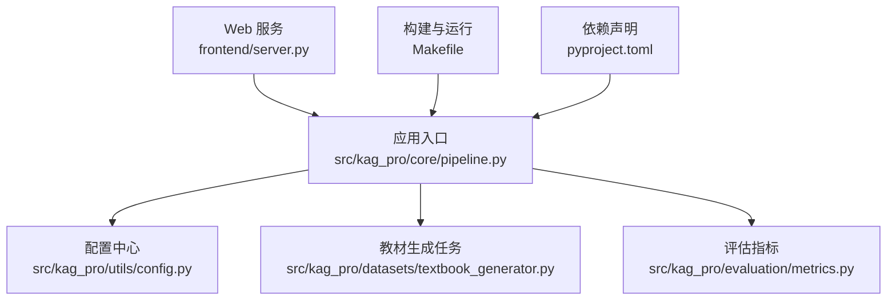
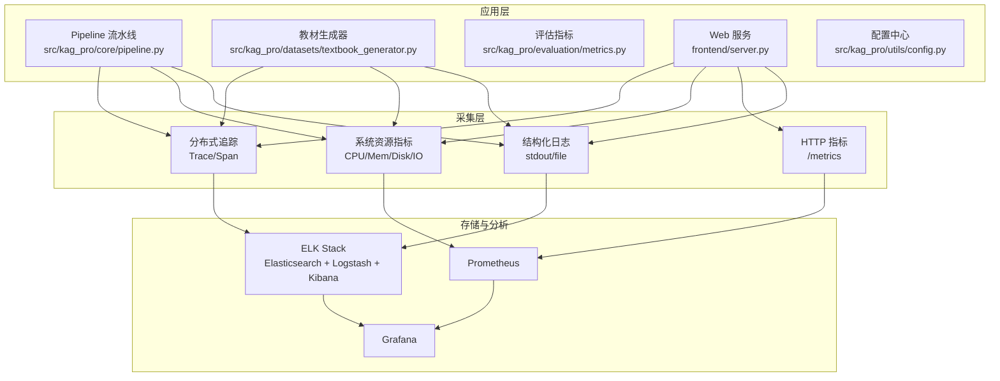
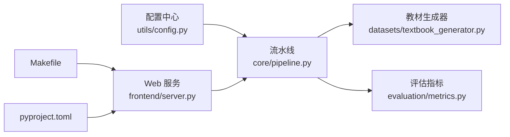

# 监控与日志

<cite>
**本文引用的文件**   
- [README.md](file://README.md)
- [pyproject.toml](file://pyproject.toml)
- [Makefile](file://Makefile)
- [src/kag_pro/utils/config.py](file://src/kag_pro/utils/config.py)
- [src/kag_pro/core/pipeline.py](file://src/kag_pro/core/pipeline.py)
- [src/kag_pro/datasets/textbook_generator.py](file://src/kag_pro/datasets/textbook_generator.py)
- [src/kag_pro/evaluation/metrics.py](file://src/kag_pro/evaluation/metrics.py)
- [frontend/server.py](file://frontend/server.py)
</cite>

## 目录
1. [简介](#简介)
2. [项目结构](#项目结构)
3. [核心组件](#核心组件)
4. [架构总览](#架构总览)
5. [详细组件分析](#详细组件分析)
6. [依赖分析](#依赖分析)
7. [性能考虑](#性能考虑)
8. [故障排查指南](#故障排查指南)
9. [结论](#结论)
10. [附录](#附录)

## 简介
本文件为 KAG-Pro 的“监控与日志”配置文档，目标是在现有代码基础上，系统化地落地以下能力：
- 日志系统：统一日志级别、输出格式与轮转策略
- 性能监控：系统资源、应用性能指标与业务指标采集
- 错误追踪与告警：异常捕获、错误上报与告警规则
- 分布式追踪：请求链路追踪与服务调用监控
- 工具集成：ELK Stack、Prometheus、Grafana 的配置方法
- 可视化与报告：监控数据可视化与报告生成

说明：当前仓库未内置专门的监控与日志实现。本文基于仓库中已有的入口与模块，给出最小可行方案与集成建议，确保在不破坏现有功能的前提下快速落地。

## 项目结构
从仓库结构看，KAG-Pro 的核心逻辑位于 src/kag_pro 下，包含数据处理、知识图谱、诊断评估等子模块；前端服务在 frontend/server.py；构建与运行脚本在 Makefile；依赖声明在 pyproject.toml。

图表来源
- [src/kag_pro/core/pipeline.py](file://src/kag_pro/core/pipeline.py)
- [src/kag_pro/utils/config.py](file://src/kag_pro/utils/config.py)
- [src/kag_pro/datasets/textbook_generator.py](file://src/kag_pro/datasets/textbook_generator.py)
- [src/kag_pro/evaluation/metrics.py](file://src/kag_pro/evaluation/metrics.py)
- [frontend/server.py](file://frontend/server.py)
- [Makefile](file://Makefile)
- [pyproject.toml](file://pyproject.toml)

章节来源
- [README.md](file://README.md)
- [pyproject.toml](file://pyproject.toml)
- [Makefile](file://Makefile)

## 核心组件
- 配置中心（utils/config.py）：集中管理运行时配置项，便于接入日志、监控、追踪开关与参数。
- 流水线（core/pipeline.py）：编排核心处理流程，是埋点与指标采集的关键位置。
- 教材生成（datasets/textbook_generator.py）：典型批处理任务，适合记录吞吐、耗时与失败率等业务指标。
- 评估指标（evaluation/metrics.py）：可复用指标计算逻辑，可作为业务指标的数据源。
- Web 服务（frontend/server.py）：对外暴露接口，适合接入 HTTP 指标、访问日志与链路追踪。
- 构建与运行（Makefile、pyproject.toml）：用于安装依赖与启动服务，便于注入环境变量与启动参数。

章节来源
- [src/kag_pro/utils/config.py](file://src/kag_pro/utils/config.py)
- [src/kag_pro/core/pipeline.py](file://src/kag_pro/core/pipeline.py)
- [src/kag_pro/datasets/textbook_generator.py](file://src/kag_pro/datasets/textbook_generator.py)
- [src/kag_pro/evaluation/metrics.py](file://src/kag_pro/evaluation/metrics.py)
- [frontend/server.py](file://frontend/server.py)
- [Makefile](file://Makefile)
- [pyproject.toml](file://pyproject.toml)

## 架构总览
下图展示推荐的监控与日志整体架构，将应用层、指标采集层、日志收集层与可视化层解耦。

图表来源
- [src/kag_pro/core/pipeline.py](file://src/kag_pro/core/pipeline.py)
- [src/kag_pro/datasets/textbook_generator.py](file://src/kag_pro/datasets/textbook_generator.py)
- [src/kag_pro/evaluation/metrics.py](file://src/kag_pro/evaluation/metrics.py)
- [frontend/server.py](file://frontend/server.py)
- [src/kag_pro/utils/config.py](file://src/kag_pro/utils/config.py)

## 详细组件分析

### 日志系统配置
- 日志级别
  - 开发环境：DEBUG/INFO
  - 预发/生产：INFO/WARN/ERROR
  - 通过配置中心统一读取并初始化日志器
- 输出格式化
  - 推荐 JSON 结构化输出，便于 ELK 解析
  - 字段建议包含：时间戳、级别、服务名、实例ID、请求ID、模块、消息、上下文键值对
- 轮转策略
  - 按大小或时间滚动，保留固定天数或数量
  - 压缩归档，降低磁盘占用
- 关键埋点位置
  - 流水线各阶段开始/结束、异常捕获
  - 教材生成任务的批次、成功/失败计数
  - Web 服务的请求进入/退出、状态码分布

章节来源
- [src/kag_pro/utils/config.py](file://src/kag_pro/utils/config.py)
- [src/kag_pro/core/pipeline.py](file://src/kag_pro/core/pipeline.py)
- [src/kag_pro/datasets/textbook_generator.py](file://src/kag_pro/datasets/textbook_generator.py)
- [frontend/server.py](file://frontend/server.py)

### 性能监控指标
- 系统资源
  - CPU、内存、磁盘使用率、网络 I/O、进程数
  - 采集方式：系统探针或 exporter
- 应用性能
  - 请求延迟（P50/P90/P99）、QPS、错误率
  - 线程/协程池利用率、GC 停顿（如适用）
- 业务指标
  - 教材生成任务：批次大小、成功率、平均耗时、失败原因分布
  - 评估指标：准确率、召回率、F1 等（由 evaluation/metrics.py 提供）
- 指标出口
  - Prometheus 抓取 /metrics 端点
  - 可选：OpenMetrics、StatsD、InfluxDB

章节来源
- [src/kag_pro/evaluation/metrics.py](file://src/kag_pro/evaluation/metrics.py)
- [src/kag_pro/datasets/textbook_generator.py](file://src/kag_pro/datasets/textbook_generator.py)
- [frontend/server.py](file://frontend/server.py)

### 错误追踪与告警
- 异常捕获
  - 在流水线与任务入口处统一 try/catch，记录堆栈与上下文
  - 区分可恢复与不可恢复错误，设置不同级别
- 错误上报
  - 本地写入结构化日志，同时异步上报到错误追踪平台（如 Sentry）
  - 附带请求ID、用户ID、操作类型、版本信息
- 告警规则
  - 错误率阈值、延迟超阈、资源水位告警
  - 通知渠道：邮件、企业微信、钉钉、Slack

章节来源
- [src/kag_pro/core/pipeline.py](file://src/kag_pro/core/pipeline.py)
- [src/kag_pro/datasets/textbook_generator.py](file://src/kag_pro/datasets/textbook_generator.py)
- [frontend/server.py](file://frontend/server.py)

### 分布式追踪配置
- 链路标识
  - 每个请求分配唯一 TraceID，跨服务传递
- Span 划分
  - 按服务/模块/函数粒度创建 Span，标注关键步骤
- 采样策略
  - 全量或按比例采样，结合错误与慢请求优先采样
- 导出后端
  - OpenTelemetry Collector -> Jaeger/Zipkin/Elastic APM

章节来源
- [src/kag_pro/core/pipeline.py](file://src/kag_pro/core/pipeline.py)
- [frontend/server.py](file://frontend/server.py)

### 日志分析工具集成

#### ELK Stack
- 日志采集
  - Filebeat/Fluent Bit 采集 stdout 或文件日志
- 索引策略
  - 按天分索引，设置生命周期（ILM），冷热分层
- 可视化
  - Kibana 仪表盘：错误趋势、Top 报错、请求分布

章节来源
- [src/kag_pro/core/pipeline.py](file://src/kag_pro/core/pipeline.py)
- [src/kag_pro/datasets/textbook_generator.py](file://src/kag_pro/datasets/textbook_generator.py)
- [frontend/server.py](file://frontend/server.py)

#### Prometheus
- 指标暴露
  - 在 Web 服务暴露 /metrics，返回标准格式
- 抓取配置
  - prometheus.yml 添加 job，设置 scrape_interval
- 告警
  - alertmanager 配置规则与接收者

章节来源
- [frontend/server.py](file://frontend/server.py)
- [src/kag_pro/evaluation/metrics.py](file://src/kag_pro/evaluation/metrics.py)

#### Grafana
- 数据源
  - 连接 Prometheus 与 Elasticsearch
- 仪表盘
  - 系统资源、应用性能、业务指标、错误与告警面板
- 报告
  - 定时导出 PDF/图片，或通过插件发送报表

章节来源
- [frontend/server.py](file://frontend/server.py)
- [src/kag_pro/evaluation/metrics.py](file://src/kag_pro/evaluation/metrics.py)

## 依赖分析
- 运行时依赖
  - 日志库、指标库、追踪 SDK 可通过 pyproject.toml 声明
- 启动参数与环境变量
  - 通过 Makefile 传入环境变量控制日志级别、是否开启指标与追踪
- 模块耦合
  - pipeline 作为编排中心，应仅依赖配置中心与必要的指标/追踪 SDK，避免直接耦合外部系统

图表来源
- [src/kag_pro/utils/config.py](file://src/kag_pro/utils/config.py)
- [src/kag_pro/core/pipeline.py](file://src/kag_pro/core/pipeline.py)
- [src/kag_pro/datasets/textbook_generator.py](file://src/kag_pro/datasets/textbook_generator.py)
- [src/kag_pro/evaluation/metrics.py](file://src/kag_pro/evaluation/metrics.py)
- [frontend/server.py](file://frontend/server.py)
- [Makefile](file://Makefile)
- [pyproject.toml](file://pyproject.toml)

章节来源
- [pyproject.toml](file://pyproject.toml)
- [Makefile](file://Makefile)

## 性能考虑
- 指标采集开销
  - 使用直方图/计数器聚合，避免高频打点造成锁竞争
- 日志落盘
  - 异步写入、批量刷盘、合理轮转策略
- 追踪采样
  - 默认低采样率，错误与慢请求提高采样权重
- 资源隔离
  - 指标与日志采集与主业务进程分离（Sidecar/Exporter）

## 故障排查指南
- 常见问题
  - 指标缺失：检查 /metrics 端点可达性与抓取间隔
  - 日志丢失：确认 Filebeat/Fluent Bit 权限与路径
  - 追踪断裂：检查 TraceID 透传与采样比例
- 定位步骤
  - 通过 Kibana 检索错误堆栈与上下文
  - 在 Grafana 查看延迟与错误率突增时段
  - 使用 Jaeger/Zipkin 定位慢调用链
- 回滚与降级
  - 关闭非关键指标与追踪，降低开销
  - 临时降级复杂任务，保障核心链路稳定

## 结论
通过在配置中心统一管理、在流水线与任务处精准埋点、以标准化方式暴露指标与结构化日志，并结合 ELK/Prometheus/Grafana 形成闭环，KAG-Pro 可在不侵入核心业务的前提下，快速建立完善的监控与日志体系，支撑问题定位、容量规划与持续优化。

## 附录

### 配置清单（示例字段）
- 日志
  - 级别、输出格式（JSON）、轮转策略（大小/时间/保留天数）
- 指标
  - 是否启用、端口、标签维度（服务、实例、版本）
- 追踪
  - 是否启用、采样率、导出后端地址
- 告警
  - 阈值、通知渠道、静默期

章节来源
- [src/kag_pro/utils/config.py](file://src/kag_pro/utils/config.py)
- [Makefile](file://Makefile)
- [pyproject.toml](file://pyproject.toml)