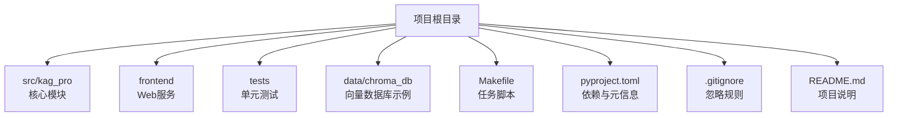
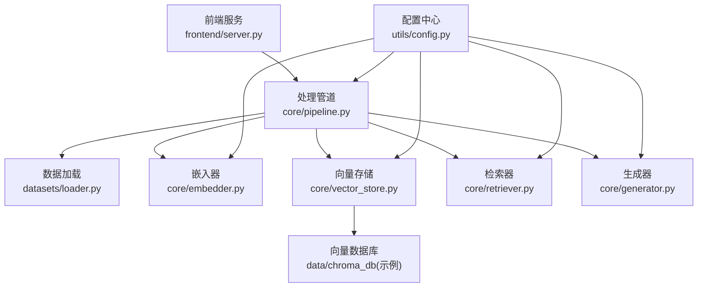
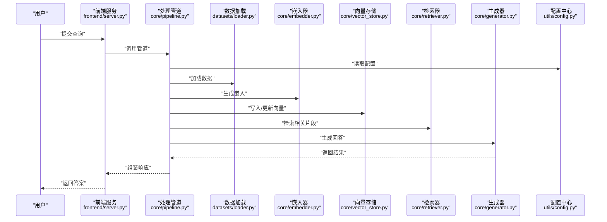
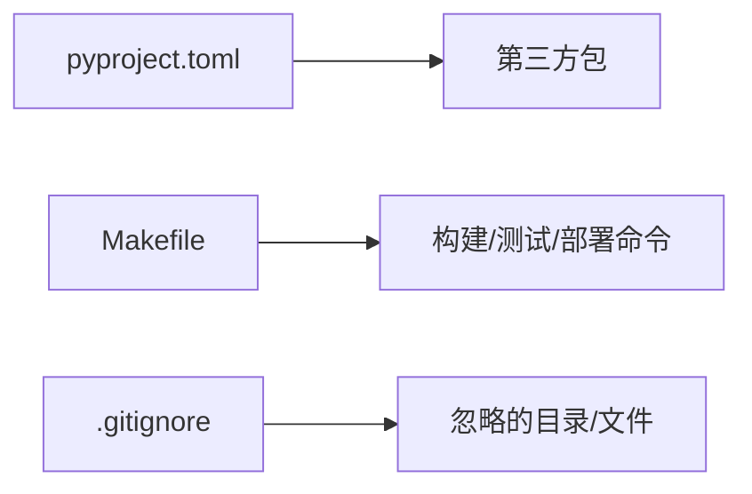

# 配置与部署

<cite>
**本文引用的文件**   
- [README.md](file://README.md)
- [pyproject.toml](file://pyproject.toml)
- [Makefile](file://Makefile)
- [.gitignore](file://.gitignore)
- [src/kag_pro/utils/config.py](file://src/kag_pro/utils/config.py)
- [src/kag_pro/core/pipeline.py](file://src/kag_pro/core/pipeline.py)
- [src/kag_pro/core/embedder.py](file://src/kag_pro/core/embedder.py)
- [src/kag_pro/core/vector_store.py](file://src/kag_pro/core/vector_store.py)
- [src/kag_pro/core/retriever.py](file://src/kag_pro/core/retriever.py)
- [src/kag_pro/core/generator.py](file://src/kag_pro/core/generator.py)
- [src/kag_pro/datasets/loader.py](file://src/kag_pro/datasets/loader.py)
- [frontend/server.py](file://frontend/server.py)
</cite>

## 目录
1. [简介](#简介)
2. [项目结构](#项目结构)
3. [核心组件](#核心组件)
4. [架构总览](#架构总览)
5. [详细组件分析](#详细组件分析)
6. [依赖关系分析](#依赖关系分析)
7. [性能考虑](#性能考虑)
8. [故障排除指南](#故障排除指南)
9. [结论](#结论)
10. [附录](#附录)

## 简介
本文件面向KAG-Pro的配置与部署，覆盖环境要求、配置文件与环境变量、依赖管理、容器化与编排、生产部署要点、性能优化、CI/CD流水线以及故障排除。文档以仓库现有实现为依据，提供可操作的步骤与最佳实践建议，帮助读者快速完成从本地开发到生产环境的端到端交付。

## 项目结构
KAG-Pro采用Python包组织方式，核心逻辑位于src/kag_pro下，前端服务位于frontend，测试位于tests，构建与任务脚本位于根目录（如Makefile）。数据与向量库示例位于data/chroma_db等目录。

图表来源
- [README.md](file://README.md)
- [pyproject.toml](file://pyproject.toml)
- [Makefile](file://Makefile)
- [.gitignore](file://.gitignore)

章节来源
- [README.md](file://README.md)
- [pyproject.toml](file://pyproject.toml)
- [Makefile](file://Makefile)
- [.gitignore](file://.gitignore)

## 核心组件
本节聚焦与配置和部署密切相关的核心模块：配置加载、数据处理、嵌入生成、向量存储、检索与生成。

- 配置加载
  - 负责读取环境变量与默认值，为各子系统提供统一配置入口。
  - 典型职责：解析路径、模型参数、外部服务连接信息、日志级别等。
  - 参考实现位置：[src/kag_pro/utils/config.py](file://src/kag_pro/utils/config.py)

- 数据集加载器
  - 负责从本地或外部数据源加载教材、题目等数据，供后续流程使用。
  - 参考实现位置：[src/kag_pro/datasets/loader.py](file://src/kag_pro/datasets/loader.py)

- 嵌入器
  - 将文本转换为向量表示，支持多种后端与模型选择。
  - 参考实现位置：[src/kag_pro/core/embedder.py](file://src/kag_pro/core/embedder.py)

- 向量存储
  - 封装向量数据库操作（索引、写入、查询），默认示例使用Chroma。
  - 参考实现位置：[src/kag_pro/core/vector_store.py](file://src/kag_pro/core/vector_store.py)

- 检索器
  - 基于向量相似度进行召回，结合业务策略返回候选片段。
  - 参考实现位置：[src/kag_pro/core/retriever.py](file://src/kag_pro/core/retriever.py)

- 生成器
  - 调用大模型进行内容生成，支持不同模型后端与提示模板。
  - 参考实现位置：[src/kag_pro/core/generator.py](file://src/kag_pro/core/generator.py)

- 管道
  - 串联数据加载、分块、嵌入、入库、检索、生成等阶段，形成端到端流程。
  - 参考实现位置：[src/kag_pro/core/pipeline.py](file://src/kag_pro/core/pipeline.py)

章节来源
- [src/kag_pro/utils/config.py](file://src/kag_pro/utils/config.py)
- [src/kag_pro/datasets/loader.py](file://src/kag_pro/datasets/loader.py)
- [src/kag_pro/core/embedder.py](file://src/kag_pro/core/embedder.py)
- [src/kag_pro/core/vector_store.py](file://src/kag_pro/core/vector_store.py)
- [src/kag_pro/core/retriever.py](file://src/kag_pro/core/retriever.py)
- [src/kag_pro/core/generator.py](file://src/kag_pro/core/generator.py)
- [src/kag_pro/core/pipeline.py](file://src/kag_pro/core/pipeline.py)

## 架构总览
下图展示了KAG-Pro在运行时的主要组件交互：前端服务通过HTTP请求触发后端管道；管道依次执行数据加载、分块、嵌入、向量入库、检索与生成；向量存储作为持久化层；配置模块贯穿全链路提供运行时参数。

图表来源
- [frontend/server.py](file://frontend/server.py)
- [src/kag_pro/core/pipeline.py](file://src/kag_pro/core/pipeline.py)
- [src/kag_pro/datasets/loader.py](file://src/kag_pro/datasets/loader.py)
- [src/kag_pro/core/embedder.py](file://src/kag_pro/core/embedder.py)
- [src/kag_pro/core/vector_store.py](file://src/kag_pro/core/vector_store.py)
- [src/kag_pro/core/retriever.py](file://src/kag_pro/core/retriever.py)
- [src/kag_pro/core/generator.py](file://src/kag_pro/core/generator.py)
- [src/kag_pro/utils/config.py](file://src/kag_pro/utils/config.py)

## 详细组件分析

### 配置系统（utils/config.py）
- 设计目标
  - 集中管理环境变量与默认值，避免硬编码。
  - 提供类型安全与校验能力，便于在不同环境切换。
- 关键职责
  - 读取并缓存配置项（如路径、模型、连接串、超时、并发度等）。
  - 暴露统一的访问接口给其他模块。
- 常见配置项类别（示例）
  - 路径类：数据目录、输出目录、向量库目录等。
  - 模型类：模型名称、后端地址、API密钥、超时与重试次数。
  - 服务类：前端端口、CORS设置、日志级别。
  - 资源类：最大并发、批大小、内存限制等。
- 使用建议
  - 在生产环境中通过环境变量注入敏感信息。
  - 对必填项进行严格校验，启动时失败早于业务逻辑。

章节来源
- [src/kag_pro/utils/config.py](file://src/kag_pro/utils/config.py)

### 数据处理与管道（datasets/loader.py, core/pipeline.py）
- 数据加载器
  - 支持从本地目录或外部数据源读取结构化/半结构化数据。
  - 提供清洗、过滤、格式化等预处理能力。
- 管道
  - 定义端到端流程：加载→分块→嵌入→入库→检索→生成。
  - 支持阶段开关与并行控制，便于按需启用功能。
- 错误处理
  - 对缺失数据、IO异常、格式错误等进行捕获与上报。
  - 提供重试与降级策略（例如回退到较小批次）。

章节来源
- [src/kag_pro/datasets/loader.py](file://src/kag_pro/datasets/loader.py)
- [src/kag_pro/core/pipeline.py](file://src/kag_pro/core/pipeline.py)

### 嵌入与向量存储（core/embedder.py, core/vector_store.py）
- 嵌入器
  - 封装模型调用，支持批量推理与流式处理。
  - 提供维度、归一化、缓存键策略等选项。
- 向量存储
  - 抽象向量库接口，默认适配Chroma。
  - 支持集合/命名空间管理、索引重建、增量更新。
- 性能要点
  - 合理设置批大小与并发度，避免OOM。
  - 定期清理无效索引，监控磁盘与内存占用。

章节来源
- [src/kag_pro/core/embedder.py](file://src/kag_pro/core/embedder.py)
- [src/kag_pro/core/vector_store.py](file://src/kag_pro/core/vector_store.py)

### 检索与生成（core/retriever.py, core/generator.py）
- 检索器
  - 基于向量相似度召回Top-K片段，支持重排与去重。
  - 可结合关键词过滤、时间衰减等策略提升相关性。
- 生成器
  - 封装LLM调用，支持温度、最大长度、停止词等参数。
  - 提供结果后处理（截断、格式化、引用标注）。
- 稳定性
  - 对网络抖动、限流、超时进行重试与熔断。
  - 记录详细日志以便定位问题。

章节来源
- [src/kag_pro/core/retriever.py](file://src/kag_pro/core/retriever.py)
- [src/kag_pro/core/generator.py](file://src/kag_pro/core/generator.py)

### 前端服务（frontend/server.py）
- 职责
  - 提供HTTP接口，接收用户输入并转发至后端管道。
  - 返回结构化响应（包含中间结果与最终答案）。
- 部署要点
  - 绑定0.0.0.0并在容器中暴露端口。
  - 配置CORS、鉴权与速率限制。

章节来源
- [frontend/server.py](file://frontend/server.py)

### 配置到运行的序列图

图表来源
- [frontend/server.py](file://frontend/server.py)
- [src/kag_pro/core/pipeline.py](file://src/kag_pro/core/pipeline.py)
- [src/kag_pro/datasets/loader.py](file://src/kag_pro/datasets/loader.py)
- [src/kag_pro/core/embedder.py](file://src/kag_pro/core/embedder.py)
- [src/kag_pro/core/vector_store.py](file://src/kag_pro/core/vector_store.py)
- [src/kag_pro/core/retriever.py](file://src/kag_pro/core/retriever.py)
- [src/kag_pro/core/generator.py](file://src/kag_pro/core/generator.py)
- [src/kag_pro/utils/config.py](file://src/kag_pro/utils/config.py)

## 依赖关系分析
- 包管理与元信息
  - 使用pyproject.toml声明依赖、工具链与打包信息。
  - 建议在CI中固定版本，确保可重复构建。
- 任务脚本
  - Makefile提供常用命令（安装、测试、构建、清理等），简化本地与CI操作。
- 忽略规则
  - .gitignore用于排除虚拟环境、缓存、临时文件与敏感配置。

图表来源
- [pyproject.toml](file://pyproject.toml)
- [Makefile](file://Makefile)
- [.gitignore](file://.gitignore)

章节来源
- [pyproject.toml](file://pyproject.toml)
- [Makefile](file://Makefile)
- [.gitignore](file://.gitignore)

## 性能考虑
- 嵌入与向量库
  - 调整批大小与并发度，平衡吞吐与延迟。
  - 对向量库进行索引优化与定期维护，避免碎片化。
- 检索与生成
  - 控制Top-K与重排策略，减少冗余计算。
  - 对生成器设置合理的最大长度与温度，降低长尾耗时。
- 资源限制
  - 在容器或进程层面设置CPU/内存上限，防止单点过载。
  - 使用连接池与缓存（如模型权重、热点片段）减少重复开销。
- 监控与告警
  - 采集关键指标（QPS、延迟、错误率、队列长度、GPU/CPU利用率）。
  - 对慢查询与高错误率设置阈值告警。

## 故障排除指南
- 常见问题
  - 环境变量缺失或格式错误：检查配置加载阶段的校验日志。
  - 向量库不可用：确认服务地址、认证信息与磁盘空间。
  - 模型调用失败：核对API密钥、配额与网络连通性。
  - 前端无法访问：检查端口绑定、防火墙与安全组。
- 日志与诊断
  - 开启详细日志级别，记录请求ID与关键步骤耗时。
  - 收集堆栈与上下文信息，便于复现与定位。
- 恢复策略
  - 对幂等操作启用重试；对非幂等操作增加幂等键。
  - 提供降级模式（如关闭重排、减小Top-K）保障可用性。

## 结论
通过统一的配置中心、清晰的管道化架构与完善的依赖管理，KAG-Pro能够在多环境下稳定运行。配合容器化与CI/CD，可实现从开发到生产的自动化交付。在生产环境中，应重点关注性能调优、监控告警与故障恢复策略，以确保服务的高可用与可扩展性。

## 附录

### 环境配置要求
- Python版本
  - 建议使用与pyproject.toml中声明一致的Python版本。
- 系统依赖
  - 根据平台差异准备编译工具链与必要的系统库（如C/C++编译器）。
- 第三方服务
  - 向量数据库：按vector_store配置初始化（示例使用Chroma）。
  - 模型服务：按generator与embedder配置提供API或本地模型路径。

章节来源
- [pyproject.toml](file://pyproject.toml)
- [src/kag_pro/core/vector_store.py](file://src/kag_pro/core/vector_store.py)
- [src/kag_pro/core/generator.py](file://src/kag_pro/core/generator.py)
- [src/kag_pro/core/embedder.py](file://src/kag_pro/core/embedder.py)

### 配置文件与环境变量
- 配置文件结构
  - 由utils/config.py统一管理，涵盖路径、模型、服务与资源四类。
- 环境变量
  - 敏感信息（密钥、连接串）通过环境变量注入。
  - 非敏感配置可通过配置文件或环境变量覆盖默认值。
- 路径配置
  - 数据目录、输出目录、向量库目录需提前创建并确保读写权限。

章节来源
- [src/kag_pro/utils/config.py](file://src/kag_pro/utils/config.py)

### 依赖管理机制
- pip与虚拟环境
  - 推荐使用虚拟环境隔离依赖，避免系统污染。
- 版本锁定
  - 在CI中固定依赖版本，保证构建可重复。
- 工具链
  - 使用Makefile统一命令，简化本地与CI操作。

章节来源
- [pyproject.toml](file://pyproject.toml)
- [Makefile](file://Makefile)

### 容器化与编排
- Docker镜像构建
  - 基于官方Python镜像，复制源码与依赖，暴露必要端口。
  - 将敏感配置通过环境变量注入，不放入镜像。
- 容器编排
  - 使用编排工具（如Docker Compose/Kubernetes）管理服务实例、存储卷与服务发现。
  - 为向量库与模型服务独立部署，通过环境变量或配置中心接入。
- 健康检查与滚动更新
  - 配置健康检查探针，支持零停机发布与自动回滚。

章节来源
- [frontend/server.py](file://frontend/server.py)
- [src/kag_pro/core/vector_store.py](file://src/kag_pro/core/vector_store.py)

### 生产环境部署指南
- 负载均衡
  - 在前端前放置反向代理或负载均衡器，分发请求并做限流与鉴权。
- 数据库配置
  - 为向量库配置持久化卷与备份策略，定期巡检与扩容。
- 监控设置
  - 集成APM与日志聚合，采集关键指标与错误追踪。
  - 建立仪表盘与告警规则，覆盖SLO与容量规划。

章节来源
- [frontend/server.py](file://frontend/server.py)
- [src/kag_pro/core/vector_store.py](file://src/kag_pro/core/vector_store.py)

### 性能优化配置
- 缓存策略
  - 对热点片段与模型权重进行缓存，减少重复计算。
- 连接池设置
  - 为向量库与模型服务配置合适的连接池大小与超时。
- 资源限制
  - 在容器或进程层面设置CPU/内存上限，避免争抢与抖动。

### CI/CD流水线配置
- 自动化测试
  - 在CI中运行单元测试与关键路径集成测试。
- 构建与打包
  - 固定依赖版本，构建镜像并推送至镜像仓库。
- 部署流程
  - 使用蓝绿或金丝雀发布策略，结合健康检查与自动回滚。

章节来源
- [Makefile](file://Makefile)
- [pyproject.toml](file://pyproject.toml)