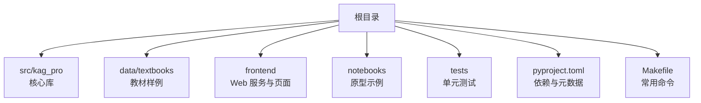
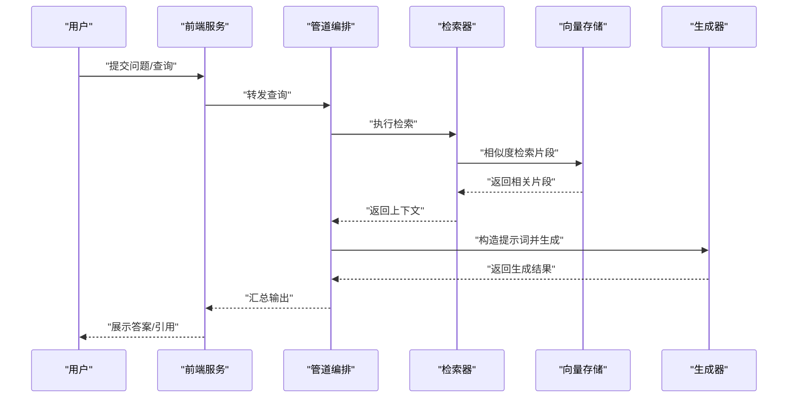
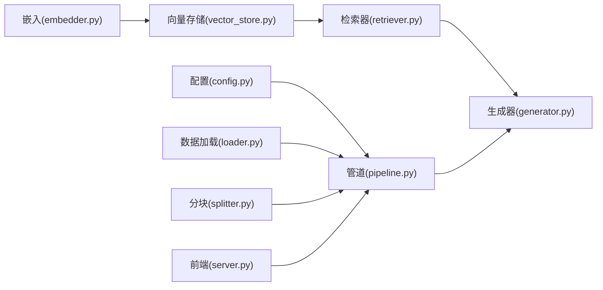

# 快速开始指南

<cite>
**本文引用的文件**   
- [README.md](file://README.md)
- [pyproject.toml](file://pyproject.toml)
- [Makefile](file://Makefile)
- [src/kag_pro/utils/config.py](file://src/kag_pro/utils/config.py)
- [src/kag_pro/core/pipeline.py](file://src/kag_pro/core/pipeline.py)
- [src/kag_pro/core/generator.py](file://src/kag_pro/core/generator.py)
- [src/kag_pro/core/retriever.py](file://src/kag_pro/core/retriever.py)
- [src/kag_pro/core/embedder.py](file://src/kag_pro/core/embedder.py)
- [src/kag_pro/core/vector_store.py](file://src/kag_pro/core/vector_store.py)
- [src/kag_pro/core/splitter.py](file://src/kag_pro/core/splitter.py)
- [src/kag_pro/data/datasets/loader.py](file://src/kag_pro/data/datasets/loader.py)
- [src/kag_pro/kg/graph.py](file://src/kag_pro/kg/graph.py)
- [frontend/server.py](file://frontend/server.py)
- [notebooks/00_rag_prototype.ipynb](file://notebooks/00_rag_prototype.ipynb)
</cite>

## 目录
1. [简介](#简介)
2. [项目结构](#项目结构)
3. [核心组件](#核心组件)
4. [架构总览](#架构总览)
5. [详细组件分析](#详细组件分析)
6. [依赖关系分析](#依赖关系分析)
7. [性能与配置建议](#性能与配置建议)
8. [故障排除指南](#故障排除指南)
9. [结论](#结论)
10. [附录：最小化运行示例](#附录最小化运行示例)

## 简介
本指南面向首次接触 KAG-Pro 的用户，目标是在 30 分钟内完成环境搭建、基础配置并成功运行第一个示例。内容涵盖 Python 环境准备、依赖安装、关键目录与文件说明、从数据到结果的完整流程、常见问题排查，以及命令行与 API 的基本使用方法。

## 项目结构
KAG-Pro 采用“核心库 + 数据 + 前端 + 示例”的分层组织方式：
- src/kag_pro：核心代码（检索、生成、向量存储、知识图谱等）
- data/textbooks：内置教材文本样例，便于快速体验
- frontend：轻量 Web 服务与页面，提供可视化入口
- notebooks：Jupyter 原型示例，辅助理解 RAG 流程
- tests：单元测试，覆盖核心模块行为
- pyproject.toml：项目元数据与依赖声明
- Makefile：常用命令封装（构建、测试、运行等）

章节来源
- [README.md](file://README.md)
- [pyproject.toml](file://pyproject.toml)
- [Makefile](file://Makefile)

## 核心组件
- 配置管理：集中读取与合并配置项，支持环境变量与配置文件
- 数据加载：从本地文本或数据集目录加载文档，进行清洗与分块
- 嵌入与检索：将文本向量化并存入向量数据库；基于相似度检索相关片段
- 生成器：结合检索结果调用大模型生成答案或摘要
- 管道编排：串联“加载→分块→嵌入→入库→检索→生成”的端到端流程
- 知识图谱：图结构与检索增强，用于结构化知识关联
- 前端服务：提供简单的 Web 界面与服务接口

章节来源
- [src/kag_pro/utils/config.py](file://src/kag_pro/utils/config.py)
- [src/kag_pro/data/datasets/loader.py](file://src/kag_pro/data/datasets/loader.py)
- [src/kag_pro/core/embedder.py](file://src/kag_pro/core/embedder.py)
- [src/kag_pro/core/vector_store.py](file://src/kag_pro/core/vector_store.py)
- [src/kag_pro/core/retriever.py](file://src/kag_pro/core/retriever.py)
- [src/kag_pro/core/generator.py](file://src/kag_pro/core/generator.py)
- [src/kag_pro/core/pipeline.py](file://src/kag_pro/core/pipeline.py)
- [src/kag_pro/kg/graph.py](file://src/kag_pro/kg/graph.py)
- [frontend/server.py](file://frontend/server.py)

## 架构总览
下图展示了从用户输入到最终输出的主要流程：请求进入后，系统按“检索→生成”的范式工作，中间涉及分块、嵌入、向量检索与可选的知识图谱增强。

图表来源
- [src/kag_pro/core/pipeline.py](file://src/kag_pro/core/pipeline.py)
- [src/kag_pro/core/retriever.py](file://src/kag_pro/core/retriever.py)
- [src/kag_pro/core/vector_store.py](file://src/kag_pro/core/vector_store.py)
- [src/kag_pro/core/generator.py](file://src/kag_pro/core/generator.py)
- [frontend/server.py](file://frontend/server.py)

## 详细组件分析

### 配置管理（Config）
- 职责：统一加载配置项（如模型地址、API Key、向量库路径、分块大小等），支持环境变量覆盖
- 关键点：默认值、优先级、校验与错误提示
- 使用建议：通过环境变量注入敏感信息，避免硬编码

章节来源
- [src/kag_pro/utils/config.py](file://src/kag_pro/utils/config.py)

### 数据加载与预处理（Loader & Splitter）
- 职责：从 data/textbooks 或自定义目录加载文本，进行清洗、切分为适合检索的片段
- 关键点：分块策略、去噪、编码处理
- 使用建议：根据领域术语调整分块大小，保证语义完整性

章节来源
- [src/kag_pro/data/datasets/loader.py](file://src/kag_pro/data/datasets/loader.py)
- [src/kag_pro/core/splitter.py](file://src/kag_pro/core/splitter.py)

### 嵌入与向量存储（Embedder & Vector Store）
- 职责：将文本片段转换为向量并持久化；支持索引构建与增量更新
- 关键点：模型选择、维度一致性、索引策略
- 使用建议：首次构建索引时预留足够磁盘空间；生产环境考虑持久化路径与备份

章节来源
- [src/kag_pro/core/embedder.py](file://src/kag_pro/core/embedder.py)
- [src/kag_pro/core/vector_store.py](file://src/kag_pro/core/vector_store.py)

### 检索器（Retriever）
- 职责：对查询进行向量化，在向量库中检索 Top-K 相关片段
- 关键点：相似度度量、Top-K 调优、过滤条件
- 使用建议：根据任务复杂度调整 Top-K，平衡召回与噪声

章节来源
- [src/kag_pro/core/retriever.py](file://src/kag_pro/core/retriever.py)

### 生成器（Generator）
- 职责：基于检索上下文与大模型生成回答，支持多种提示模板
- 关键点：温度、最大长度、引用标注
- 使用建议：控制生成参数以避免冗长或重复

章节来源
- [src/kag_pro/core/generator.py](file://src/kag_pro/core/generator.py)

### 管道编排（Pipeline）
- 职责：串联“加载→分块→嵌入→入库→检索→生成”，提供一键式运行能力
- 关键点：阶段可插拔、错误回退、日志记录
- 使用建议：按需启用/禁用阶段以加速调试

章节来源
- [src/kag_pro/core/pipeline.py](file://src/kag_pro/core/pipeline.py)

### 知识图谱（KG Graph）
- 职责：维护实体与关系，提供结构化检索增强
- 关键点：节点/边定义、查询语言、与向量检索融合
- 使用建议：小样本场景下先以向量检索为主，逐步引入 KG 增强

章节来源
- [src/kag_pro/kg/graph.py](file://src/kag_pro/kg/graph.py)

### 前端服务（Frontend Server）
- 职责：提供简单 Web 界面与服务接口，方便非技术用户交互
- 关键点：路由、请求解析、响应格式
- 使用建议：开发阶段开启热重载，生产环境配合反向代理

章节来源
- [frontend/server.py](file://frontend/server.py)

## 依赖关系分析
- 外部依赖：由 pyproject.toml 统一管理，包含数据处理、向量库、LLM 客户端等
- 内部依赖：core 各模块之间通过明确接口耦合，pipeline 作为编排中心
- 前端依赖：与 core 通过 HTTP 或进程内调用集成

图表来源
- [src/kag_pro/utils/config.py](file://src/kag_pro/utils/config.py)
- [src/kag_pro/core/pipeline.py](file://src/kag_pro/core/pipeline.py)
- [src/kag_pro/data/datasets/loader.py](file://src/kag_pro/data/datasets/loader.py)
- [src/kag_pro/core/splitter.py](file://src/kag_pro/core/splitter.py)
- [src/kag_pro/core/embedder.py](file://src/kag_pro/core/embedder.py)
- [src/kag_pro/core/vector_store.py](file://src/kag_pro/core/vector_store.py)
- [src/kag_pro/core/retriever.py](file://src/kag_pro/core/retriever.py)
- [src/kag_pro/core/generator.py](file://src/kag_pro/core/generator.py)
- [frontend/server.py](file://frontend/server.py)

章节来源
- [pyproject.toml](file://pyproject.toml)

## 性能与配置建议
- 分块大小：中等段落（例如 300–800 字）通常能兼顾召回与精度
- Top-K：从 3–5 起步，根据业务反馈逐步上调
- 向量库：优先选择本地持久化方案，避免每次重建索引
- 并发与缓存：热点查询可加缓存层，减少 LLM 调用成本
- 资源规划：嵌入与检索为 CPU/GPU 密集操作，合理分配资源

[本节为通用建议，不直接分析具体文件]

## 故障排除指南
- 无法导入包或版本冲突
  - 检查虚拟环境与依赖安装是否成功
  - 参考 pyproject.toml 中的依赖声明，必要时锁定版本
- 找不到数据目录或文本为空
  - 确认 data/textbooks 存在且包含 .txt 文件
  - 检查 loader 的路径配置与环境变量
- 向量库初始化失败
  - 检查磁盘空间与写入权限
  - 确认向量库后端配置（路径、驱动、连接串）
- 检索结果为空或质量差
  - 调整分块策略与 Top-K
  - 检查嵌入模型与查询预处理是否一致
- 生成器报错或超时
  - 检查 LLM 服务可达性与密钥配置
  - 降低温度或最大长度，缩短提示词

章节来源
- [pyproject.toml](file://pyproject.toml)
- [src/kag_pro/data/datasets/loader.py](file://src/kag_pro/data/datasets/loader.py)
- [src/kag_pro/core/vector_store.py](file://src/kag_pro/core/vector_store.py)
- [src/kag_pro/core/retriever.py](file://src/kag_pro/core/retriever.py)
- [src/kag_pro/core/generator.py](file://src/kag_pro/core/generator.py)

## 结论
通过本指南，您已了解 KAG-Pro 的整体架构、核心组件与快速上手路径。建议先从内置教材样例入手，验证端到端流程，再逐步替换数据源与模型，以满足实际业务需求。

[本节为总结性内容，不直接分析具体文件]

## 附录：最小化运行示例

### 环境准备
- 安装 Python（推荐 3.10+）
- 创建并激活虚拟环境
- 在项目根目录安装依赖（见 pyproject.toml）
- 设置必要的环境变量（如 LLM 密钥、向量库路径等）

章节来源
- [pyproject.toml](file://pyproject.toml)

### 使用 Makefile 快速启动
- 查看可用命令：make help
- 安装依赖：make install
- 运行示例：make run-example
- 启动前端：make start-frontend

章节来源
- [Makefile](file://Makefile)

### 第一个示例：从教材到答案
- 数据准备：确保 data/textbooks 下有若干 .txt 文件
- 构建索引：运行管道脚本，触发“加载→分块→嵌入→入库”
- 检索与生成：提交一个与教材内容相关的问题，观察检索片段与生成答案
- 验证输出：检查控制台或前端页面的结果与引用来源

章节来源
- [src/kag_pro/core/pipeline.py](file://src/kag_pro/core/pipeline.py)
- [src/kag_pro/data/datasets/loader.py](file://src/kag_pro/data/datasets/loader.py)
- [src/kag_pro/core/splitter.py](file://src/kag_pro/core/splitter.py)
- [src/kag_pro/core/embedder.py](file://src/kag_pro/core/embedder.py)
- [src/kag_pro/core/vector_store.py](file://src/kag_pro/core/vector_store.py)
- [src/kag_pro/core/retriever.py](file://src/kag_pro/core/retriever.py)
- [src/kag_pro/core/generator.py](file://src/kag_pro/core/generator.py)

### 使用 Jupyter Notebook 交互式体验
- 打开 notebooks/00_rag_prototype.ipynb
- 按步骤执行单元格，观察数据加载、检索与生成的中间结果
- 修改参数（如 Top-K、分块大小）对比效果

章节来源
- [notebooks/00_rag_prototype.ipynb](file://notebooks/00_rag_prototype.ipynb)

### 命令行工具基本用法
- 查看帮助：python -m kag_pro --help
- 构建索引：python -m kag_pro build-index --input data/textbooks
- 检索问答：python -m kag_pro query --question "你的问题"
- 批量处理：python -m kag_pro batch --config config.yaml

章节来源
- [src/kag_pro/core/pipeline.py](file://src/kag_pro/core/pipeline.py)

### API 接口基本用法
- 启动前端服务：make start-frontend 或直接运行 frontend/server.py
- 提交查询：POST /api/query，请求体包含 question 字段
- 获取结果：响应中包含 answer 与 references（检索片段）
- 健康检查：GET /health

章节来源
- [frontend/server.py](file://frontend/server.py)