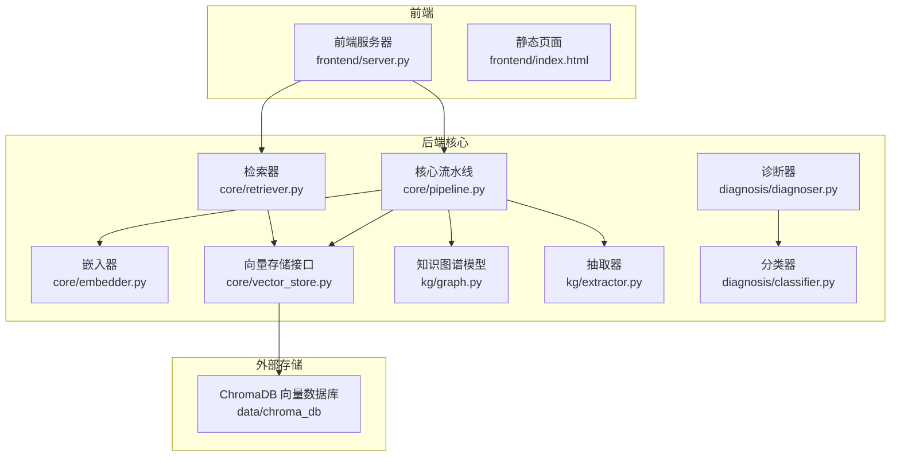
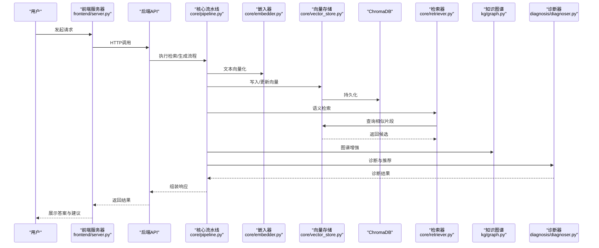
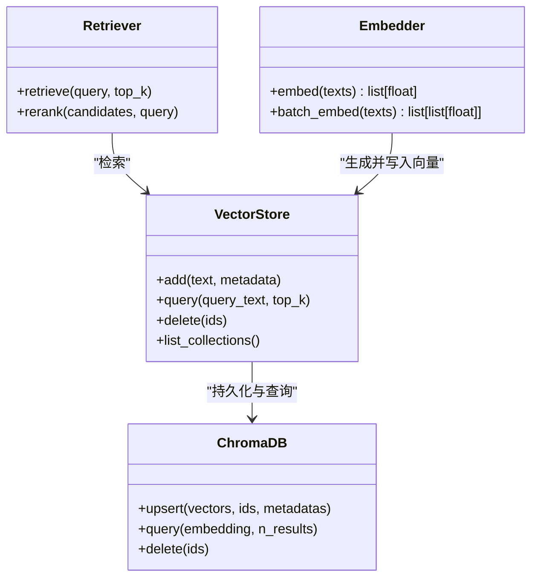
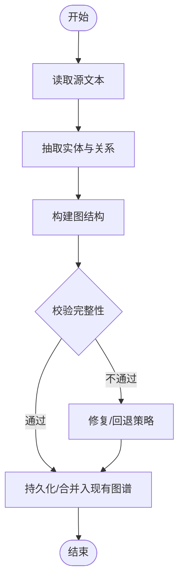
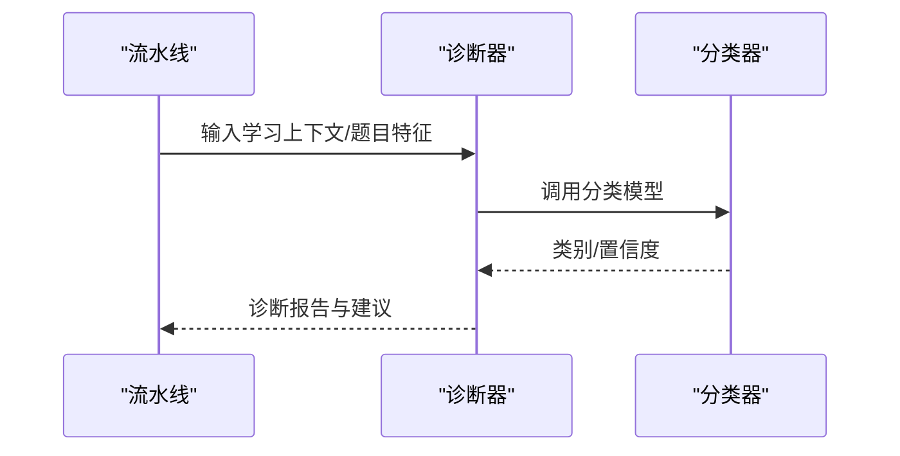
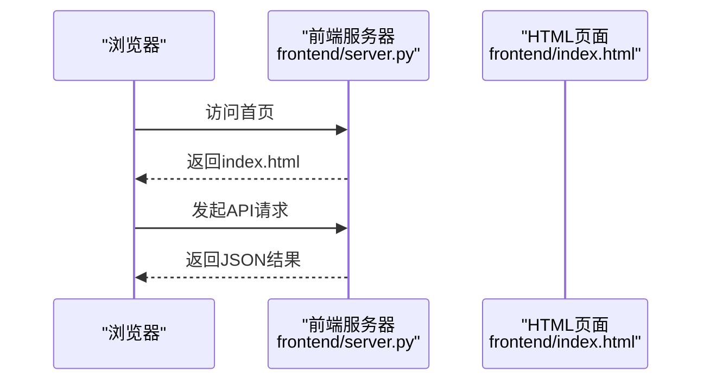
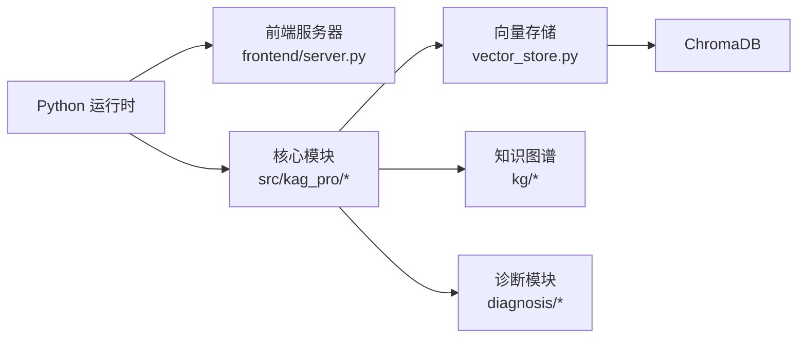

# 技术栈说明

<cite>
**本文引用的文件**   
- [README.md](file://README.md)
- [pyproject.toml](file://pyproject.toml)
- [Makefile](file://Makefile)
- [src/kag_pro/core/embedder.py](file://src/kag_pro/core/embedder.py)
- [src/kag_pro/core/vector_store.py](file://src/kag_pro/core/vector_store.py)
- [src/kag_pro/core/retriever.py](file://src/kag_pro/core/retriever.py)
- [src/kag_pro/core/pipeline.py](file://src/kag_pro/core/pipeline.py)
- [src/kag_pro/kg/graph.py](file://src/kag_pro/kg/graph.py)
- [src/kag_pro/kg/extractor.py](file://src/kag_pro/kg/extractor.py)
- [src/kag_pro/diagnosis/classifier.py](file://src/kag_pro/diagnosis/classifier.py)
- [src/kag_pro/diagnosis/diagnoser.py](file://src/kag_pro/diagnosis/diagnoser.py)
- [frontend/server.py](file://frontend/server.py)
- [frontend/index.html](file://frontend/index.html)
</cite>

## 目录
1. [简介](#简介)
2. [项目结构](#项目结构)
3. [核心组件](#核心组件)
4. [架构总览](#架构总览)
5. [详细组件分析](#详细组件分析)
6. [依赖关系分析](#依赖关系分析)
7. [性能考量](#性能考量)
8. [故障排查指南](#故障排查指南)
9. [结论](#结论)
10. [附录](#附录)

## 简介
本技术栈说明面向KAG-Pro平台，聚焦于后端与前端的技术选型、版本要求、职责边界、交互方式与扩展路径。系统围绕“知识图谱+向量检索”的混合检索范式构建，结合诊断与推荐能力，提供从数据加载、分块、向量化、存储、检索到生成与验证的一体化流水线；前端通过轻量Web服务暴露交互界面。

## 项目结构
仓库采用分层与领域划分相结合的组织方式：
- src/kag_pro：核心业务域（核心流水线、知识图谱、诊断、评估等）
- frontend：前端页面与轻量Web服务
- data/chroma_db：本地ChromaDB持久化目录
- notebooks：原型探索与演示
- tests：单元测试与集成测试
- pyproject.toml：Python依赖与元信息
- Makefile：常用任务命令

图表来源
- [frontend/server.py](file://frontend/server.py)
- [frontend/index.html](file://frontend/index.html)
- [src/kag_pro/core/pipeline.py](file://src/kag_pro/core/pipeline.py)
- [src/kag_pro/core/embedder.py](file://src/kag_pro/core/embedder.py)
- [src/kag_pro/core/vector_store.py](file://src/kag_pro/core/vector_store.py)
- [src/kag_pro/core/retriever.py](file://src/kag_pro/core/retriever.py)
- [src/kag_pro/kg/graph.py](file://src/kag_pro/kg/graph.py)
- [src/kag_pro/kg/extractor.py](file://src/kag_pro/kg/extractor.py)
- [src/kag_pro/diagnosis/classifier.py](file://src/kag_pro/diagnosis/classifier.py)
- [src/kag_pro/diagnosis/diagnoser.py](file://src/kag_pro/diagnosis/diagnoser.py)

章节来源
- [README.md](file://README.md)
- [pyproject.toml](file://pyproject.toml)
- [Makefile](file://Makefile)

## 核心组件
- 核心流水线（Pipeline）：编排数据加载、文本切分、嵌入、写入向量库、检索与结果组装，串联知识图谱抽取与诊断模块。
- 嵌入器（Embedder）：将文本转换为稠密向量，供向量检索使用。
- 向量存储（Vector Store）：抽象向量库操作，对接ChromaDB进行持久化与查询。
- 检索器（Retriever）：基于语义相似度召回相关片段，支持多路召回与重排策略。
- 知识图谱（KG Graph/Extractor）：从文本中抽取实体与关系，构建图结构以增强可解释性与推理能力。
- 诊断与分类（Diagnoser/Classifier）：对学习者状态或问题类型进行分类与诊断，为个性化推荐提供依据。

章节来源
- [src/kag_pro/core/pipeline.py](file://src/kag_pro/core/pipeline.py)
- [src/kag_pro/core/embedder.py](file://src/kag_pro/core/embedder.py)
- [src/kag_pro/core/vector_store.py](file://src/kag_pro/core/vector_store.py)
- [src/kag_pro/core/retriever.py](file://src/kag_pro/core/retriever.py)
- [src/kag_pro/kg/graph.py](file://src/kag_pro/kg/graph.py)
- [src/kag_pro/kg/extractor.py](file://src/kag_pro/kg/extractor.py)
- [src/kag_pro/diagnosis/classifier.py](file://src/kag_pro/diagnosis/classifier.py)
- [src/kag_pro/diagnosis/diagnoser.py](file://src/kag_pro/diagnosis/diagnoser.py)

## 架构总览
整体采用“前后端分离 + 领域驱动”的架构：前端通过HTTP调用后端API；后端由核心流水线统一编排，向量检索与知识图谱并行增强召回质量；诊断模块在检索后对结果进行二次加工，输出个性化建议。

图表来源
- [frontend/server.py](file://frontend/server.py)
- [src/kag_pro/core/pipeline.py](file://src/kag_pro/core/pipeline.py)
- [src/kag_pro/core/embedder.py](file://src/kag_pro/core/embedder.py)
- [src/kag_pro/core/vector_store.py](file://src/kag_pro/core/vector_store.py)
- [src/kag_pro/core/retriever.py](file://src/kag_pro/core/retriever.py)
- [src/kag_pro/kg/graph.py](file://src/kag_pro/kg/graph.py)
- [src/kag_pro/diagnosis/diagnoser.py](file://src/kag_pro/diagnosis/diagnoser.py)

## 详细组件分析

### 向量检索与存储（ChromaDB）
- 作用：提供高维向量索引与近似最近邻搜索，支撑语义检索。
- 选择理由：轻量、易部署、与Python生态良好兼容，适合单机与小型集群场景。
- 关键实现位置：
  - 向量存储接口定义与封装：[src/kag_pro/core/vector_store.py](file://src/kag_pro/core/vector_store.py)
  - 嵌入器实现：[src/kag_pro/core/embedder.py](file://src/kag_pro/core/embedder.py)
  - 检索器逻辑：[src/kag_pro/core/retriever.py](file://src/kag_pro/core/retriever.py)
  - 本地数据目录：data/chroma_db

图表来源
- [src/kag_pro/core/vector_store.py](file://src/kag_pro/core/vector_store.py)
- [src/kag_pro/core/embedder.py](file://src/kag_pro/core/embedder.py)
- [src/kag_pro/core/retriever.py](file://src/kag_pro/core/retriever.py)

章节来源
- [src/kag_pro/core/vector_store.py](file://src/kag_pro/core/vector_store.py)
- [src/kag_pro/core/embedder.py](file://src/kag_pro/core/embedder.py)
- [src/kag_pro/core/retriever.py](file://src/kag_pro/core/retriever.py)

### 知识图谱抽取与融合
- 作用：从文本中抽取实体与关系，构建结构化知识，辅助检索与解释。
- 选择理由：提升可解释性、支持跨文档推理与路径检索。
- 关键实现位置：
  - 图谱数据结构与操作：[src/kag_pro/kg/graph.py](file://src/kag_pro/kg/graph.py)
  - 抽取器实现：[src/kag_pro/kg/extractor.py](file://src/kag_pro/kg/extractor.py)

图表来源
- [src/kag_pro/kg/graph.py](file://src/kag_pro/kg/graph.py)
- [src/kag_pro/kg/extractor.py](file://src/kag_pro/kg/extractor.py)

章节来源
- [src/kag_pro/kg/graph.py](file://src/kag_pro/kg/graph.py)
- [src/kag_pro/kg/extractor.py](file://src/kag_pro/kg/extractor.py)

### 诊断与推荐
- 作用：基于学习行为或题目特征进行诊断分类，输出个性化学习建议。
- 选择理由：将诊断结果融入检索与生成环节，提升个性化体验。
- 关键实现位置：
  - 分类器：[src/kag_pro/diagnosis/classifier.py](file://src/kag_pro/diagnosis/classifier.py)
  - 诊断器：[src/kag_pro/diagnosis/diagnoser.py](file://src/kag_pro/diagnosis/diagnoser.py)

图表来源
- [src/kag_pro/diagnosis/diagnoser.py](file://src/kag_pro/diagnosis/diagnoser.py)
- [src/kag_pro/diagnosis/classifier.py](file://src/kag_pro/diagnosis/classifier.py)

章节来源
- [src/kag_pro/diagnosis/diagnoser.py](file://src/kag_pro/diagnosis/diagnoser.py)
- [src/kag_pro/diagnosis/classifier.py](file://src/kag_pro/diagnosis/classifier.py)

### 前端与Web服务
- 作用：提供静态页面与轻量HTTP服务，便于本地调试与演示。
- 选择理由：快速搭建、低门槛、易于与后端API集成。
- 关键实现位置：
  - 前端服务器：[frontend/server.py](file://frontend/server.py)
  - 静态页面：[frontend/index.html](file://frontend/index.html)

图表来源
- [frontend/server.py](file://frontend/server.py)
- [frontend/index.html](file://frontend/index.html)

章节来源
- [frontend/server.py](file://frontend/server.py)
- [frontend/index.html](file://frontend/index.html)

## 依赖关系分析
- Python后端框架：项目使用Python生态，具体Web框架与深度学习框架的选择以依赖声明为准。
- 向量数据库：ChromaDB用于向量存储与检索。
- 前端：轻量HTTP服务配合静态页面。
- 版本与兼容性：以pyproject.toml中的依赖约束为准，确保环境一致。

图表来源
- [pyproject.toml](file://pyproject.toml)
- [frontend/server.py](file://frontend/server.py)
- [src/kag_pro/core/vector_store.py](file://src/kag_pro/core/vector_store.py)
- [src/kag_pro/kg/graph.py](file://src/kag_pro/kg/graph.py)
- [src/kag_pro/diagnosis/diagnoser.py](file://src/kag_pro/diagnosis/diagnoser.py)

章节来源
- [pyproject.toml](file://pyproject.toml)
- [Makefile](file://Makefile)

## 性能考量
- 向量检索
  - 批量嵌入与写入：减少网络往返与序列化开销。
  - 合理设置top_k与阈值，平衡召回率与延迟。
  - 对高频查询启用缓存层（如内存缓存）。
- 知识图谱
  - 增量构建与冲突合并策略，避免全量重建。
  - 关系抽取失败的回退与重试机制。
- 诊断与推荐
  - 分类模型轻量化与批处理推理。
  - 异步编排流水线，降低端到端时延。
- 前端
  - 静态资源压缩与懒加载。
  - 错误提示与重试策略优化用户体验。

## 故障排查指南
- 启动与依赖
  - 检查Python环境与依赖安装是否成功，参考项目根目录的任务脚本与依赖声明。
- 向量库连接
  - 确认ChromaDB数据目录存在且权限正确。
  - 检查向量维度与模型输出一致性。
- 检索异常
  - 核对检索参数（top_k、相似度阈值）。
  - 查看嵌入器日志与向量写入记录。
- 图谱抽取
  - 校验抽取规则与正则表达式。
  - 对异常样本进行抽样分析与回滚。
- 诊断模块
  - 验证分类器输入特征与标签分布。
  - 监控预测置信度与误判样本。

章节来源
- [Makefile](file://Makefile)
- [pyproject.toml](file://pyproject.toml)
- [src/kag_pro/core/vector_store.py](file://src/kag_pro/core/vector_store.py)
- [src/kag_pro/core/embedder.py](file://src/kag_pro/core/embedder.py)
- [src/kag_pro/core/retriever.py](file://src/kag_pro/core/retriever.py)
- [src/kag_pro/kg/extractor.py](file://src/kag_pro/kg/extractor.py)
- [src/kag_pro/diagnosis/classifier.py](file://src/kag_pro/diagnosis/classifier.py)

## 结论
KAG-Pro以Python为核心语言，结合ChromaDB向量检索与知识图谱抽取，形成“语义+结构”的双通道检索体系；诊断模块进一步注入个性化能力。前端采用轻量Web服务便于开发与演示。整体架构清晰、模块化程度高，具备良好的可扩展性与工程落地可行性。

## 附录
- 版本与兼容性
  - 所有第三方库与Python版本的约束以pyproject.toml为准。
  - 建议在虚拟环境中安装依赖，避免系统级污染。
- 运行与开发
  - 使用Makefile提供的任务命令进行常见操作（如安装、测试、清理等）。
  - 前端可通过本地服务器快速启动，便于联调。

章节来源
- [pyproject.toml](file://pyproject.toml)
- [Makefile](file://Makefile)
- [frontend/server.py](file://frontend/server.py)
- [frontend/index.html](file://frontend/index.html)