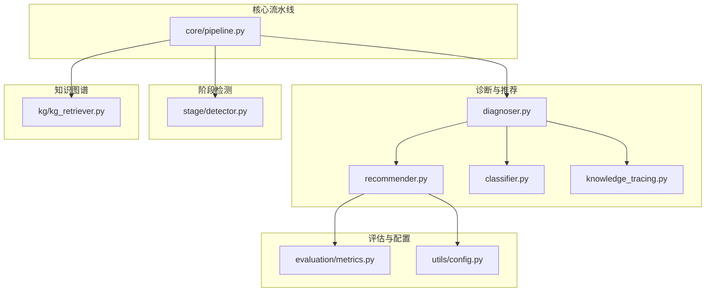
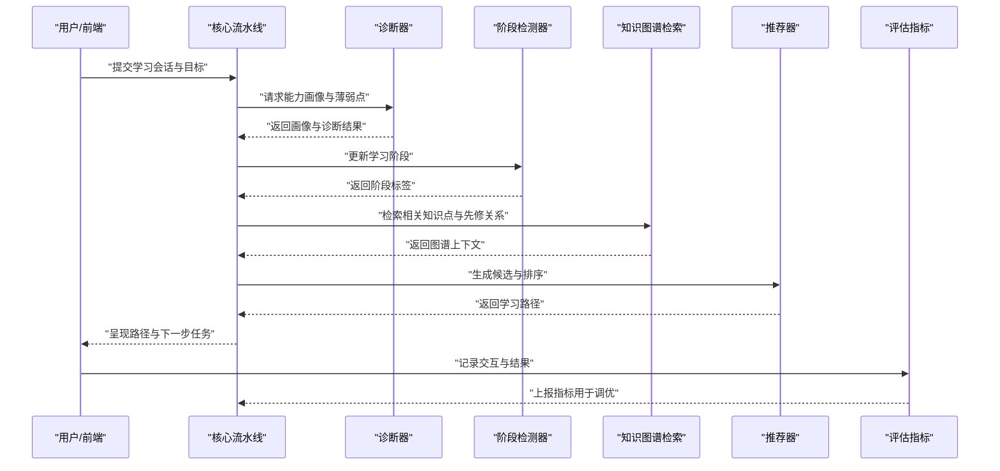
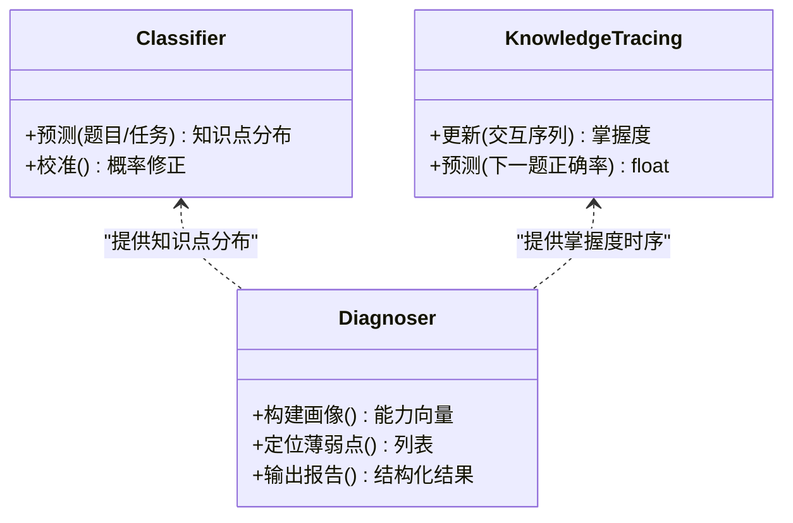
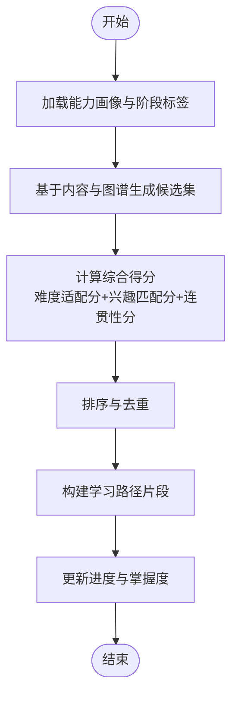
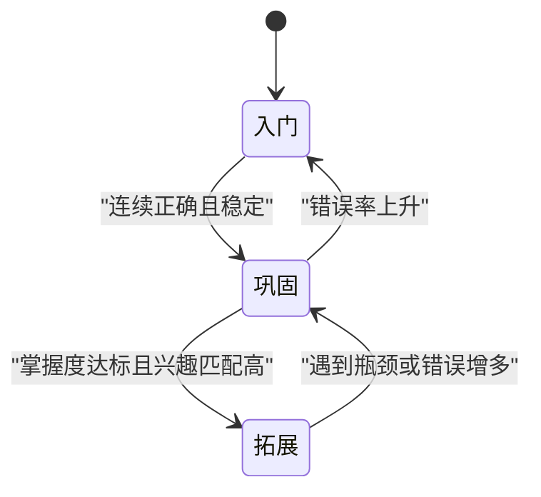
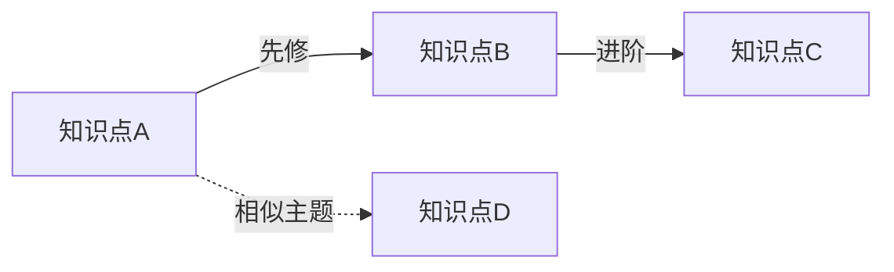
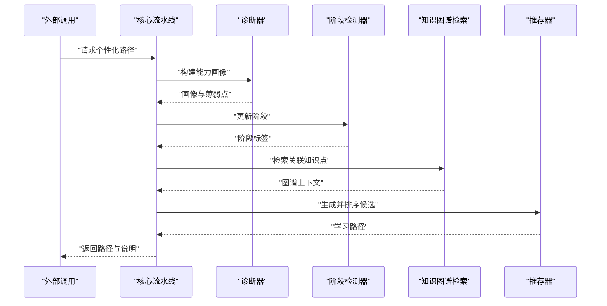
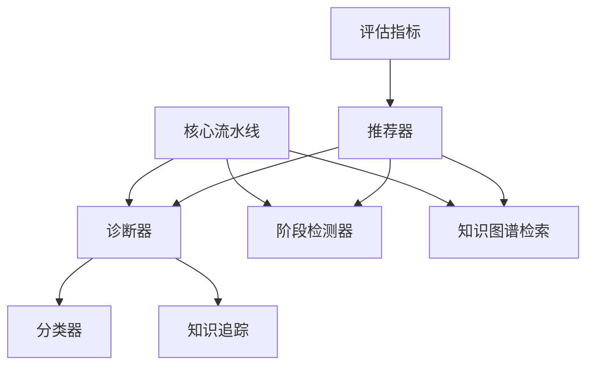

# 个性化推荐系统

<cite>
**本文引用的文件**   
- [README.md](file://README.md)
- [pyproject.toml](file://pyproject.toml)
- [src/kag_pro/diagnosis/recommender.py](file://src/kag_pro/diagnosis/recommender.py)
- [src/kag_pro/diagnosis/classifier.py](file://src/kag_pro/diagnosis/classifier.py)
- [src/kag_pro/diagnosis/diagnoser.py](file://src/kag_pro/diagnosis/diagnoser.py)
- [src/kag_pro/diagnosis/knowledge_tracing.py](file://src/kag_pro/diagnosis/knowledge_tracing.py)
- [src/kag_pro/stage/detector.py](file://src/kag_pro/stage/detector.py)
- [src/kag_pro/kg/kg_retriever.py](file://src/kag_pro/kg/kg_retriever.py)
- [src/kag_pro/core/pipeline.py](file://src/kag_pro/core/pipeline.py)
- [src/kag_pro/evaluation/metrics.py](file://src/kag_pro/evaluation/metrics.py)
- [src/kag_pro/utils/config.py](file://src/kag_pro/utils/config.py)
</cite>

## 目录
1. [简介](#简介)
2. [项目结构](#项目结构)
3. [核心组件](#核心组件)
4. [架构总览](#架构总览)
5. [详细组件分析](#详细组件分析)
6. [依赖关系分析](#依赖关系分析)
7. [性能考虑](#性能考虑)
8. [故障排查指南](#故障排查指南)
9. [结论](#结论)
10. [附录](#附录)

## 简介
本文件面向KAG-Pro平台的“个性化推荐系统”，聚焦于基于学生能力画像与内容特征的学习路径规划算法，涵盖难度自适应、兴趣匹配与进度跟踪机制。文档从系统架构、关键模块职责、数据流与控制流入手，解释推荐引擎的实现原理、阶段检测器的作用以及与知识图谱、诊断评估等模块的集成方式。同时提供推荐策略配置、权重调优与效果评估方法，并展示个性化学习路径的动态生成与调整流程，辅以实际应用案例与性能优化建议，帮助读者快速理解与落地使用。

## 项目结构
本项目采用分层与按功能域组织相结合的结构：
- 诊断与推荐：能力诊断、知识追踪、推荐策略与结果输出
- 阶段检测：学习阶段识别与状态切换
- 知识图谱：知识点抽取、检索与关联推理
- 核心流水线：编排各子模块形成端到端工作流
- 评估指标：推荐质量与学习效果的量化度量
- 工具与配置：通用配置加载与参数管理

图表来源
- [src/kag_pro/core/pipeline.py](file://src/kag_pro/core/pipeline.py)
- [src/kag_pro/diagnosis/diagnoser.py](file://src/kag_pro/diagnosis/diagnoser.py)
- [src/kag_pro/diagnosis/recommender.py](file://src/kag_pro/diagnosis/recommender.py)
- [src/kag_pro/diagnosis/classifier.py](file://src/kag_pro/diagnosis/classifier.py)
- [src/kag_pro/diagnosis/knowledge_tracing.py](file://src/kag_pro/diagnosis/knowledge_tracing.py)
- [src/kag_pro/stage/detector.py](file://src/kag_pro/stage/detector.py)
- [src/kag_pro/kg/kg_retriever.py](file://src/kag_pro/kg/kg_retriever.py)
- [src/kag_pro/evaluation/metrics.py](file://src/kag_pro/evaluation/metrics.py)
- [src/kag_pro/utils/config.py](file://src/kag_pro/utils/config.py)

章节来源
- [README.md](file://README.md)
- [pyproject.toml](file://pyproject.toml)

## 核心组件
- 诊断器（Diagnoser）：整合分类器、知识追踪与能力画像，产出学习者当前能力分布与薄弱点。
- 推荐器（Recommender）：基于能力画像与内容特征，结合难度自适应与兴趣匹配，生成候选资源与排序。
- 阶段检测器（Stage Detector）：依据学习行为与表现判定当前学习阶段，驱动路径动态调整。
- 知识图谱检索（KG Retriever）：提供知识点关联、先修关系与内容语义检索，支撑推荐可解释性与连贯性。
- 评估指标（Metrics）：对推荐质量与学习效果进行量化评估，支持A/B实验与回归监控。
- 配置（Config）：集中管理推荐策略、权重与阈值等可调参数。

章节来源
- [src/kag_pro/diagnosis/diagnoser.py](file://src/kag_pro/diagnosis/diagnoser.py)
- [src/kag_pro/diagnosis/recommender.py](file://src/kag_pro/diagnosis/recommender.py)
- [src/kag_pro/diagnosis/classifier.py](file://src/kag_pro/diagnosis/classifier.py)
- [src/kag_pro/diagnosis/knowledge_tracing.py](file://src/kag_pro/diagnosis/knowledge_tracing.py)
- [src/kag_pro/stage/detector.py](file://src/kag_pro/stage/detector.py)
- [src/kag_pro/kg/kg_retriever.py](file://src/kag_pro/kg/kg_retriever.py)
- [src/kag_pro/evaluation/metrics.py](file://src/kag_pro/evaluation/metrics.py)
- [src/kag_pro/utils/config.py](file://src/kag_pro/utils/config.py)

## 架构总览
推荐系统以“诊断—推荐—执行—评估”的闭环为核心，由流水线统一编排。输入包括学习者历史交互、测验结果与偏好信号；中间层通过诊断器构建能力画像，阶段检测器更新学习阶段；推荐器融合能力、兴趣与内容特征，结合知识图谱约束生成学习路径；最终由评估模块度量效果并反馈至策略与权重调优。

图表来源
- [src/kag_pro/core/pipeline.py](file://src/kag_pro/core/pipeline.py)
- [src/kag_pro/diagnosis/diagnoser.py](file://src/kag_pro/diagnosis/diagnoser.py)
- [src/kag_pro/stage/detector.py](file://src/kag_pro/stage/detector.py)
- [src/kag_pro/kg/kg_retriever.py](file://src/kag_pro/kg/kg_retriever.py)
- [src/kag_pro/diagnosis/recommender.py](file://src/kag_pro/diagnosis/recommender.py)
- [src/kag_pro/evaluation/metrics.py](file://src/kag_pro/evaluation/metrics.py)

## 详细组件分析

### 诊断器与能力画像
- 职责：聚合分类器与知识追踪结果，形成稳定的能力画像与知识点掌握度估计，为推荐提供输入。
- 关键要点：
  - 分类器负责将题目或任务映射到知识点维度，输出类别概率或强度。
  - 知识追踪模型基于历史交互序列更新掌握度，体现遗忘与巩固效应。
  - 诊断器汇总上述信息，输出能力向量、薄弱点清单与置信度。

图表来源
- [src/kag_pro/diagnosis/classifier.py](file://src/kag_pro/diagnosis/classifier.py)
- [src/kag_pro/diagnosis/knowledge_tracing.py](file://src/kag_pro/diagnosis/knowledge_tracing.py)
- [src/kag_pro/diagnosis/diagnoser.py](file://src/kag_pro/diagnosis/diagnoser.py)

章节来源
- [src/kag_pro/diagnosis/classifier.py](file://src/kag_pro/diagnosis/classifier.py)
- [src/kag_pro/diagnosis/knowledge_tracing.py](file://src/kag_pro/diagnosis/knowledge_tracing.py)
- [src/kag_pro/diagnosis/diagnoser.py](file://src/kag_pro/diagnosis/diagnoser.py)

### 推荐引擎：难度自适应、兴趣匹配与进度跟踪
- 难度自适应：根据能力画像与掌握度，选择难度区间，避免过难挫败或过易无效。
- 兴趣匹配：融合显式偏好与隐式行为信号，提升点击与完成率。
- 进度跟踪：结合阶段检测与知识图谱先修关系，保证路径连贯与循序渐进。

图表来源
- [src/kag_pro/diagnosis/recommender.py](file://src/kag_pro/diagnosis/recommender.py)
- [src/kag_pro/kg/kg_retriever.py](file://src/kag_pro/kg/kg_retriever.py)
- [src/kag_pro/stage/detector.py](file://src/kag_pro/stage/detector.py)

章节来源
- [src/kag_pro/diagnosis/recommender.py](file://src/kag_pro/diagnosis/recommender.py)
- [src/kag_pro/kg/kg_retriever.py](file://src/kag_pro/kg/kg_retriever.py)
- [src/kag_pro/stage/detector.py](file://src/kag_pro/stage/detector.py)

### 阶段检测器：学习阶段识别与状态切换
- 职责：依据近期表现、错误模式与时间衰减，判定当前学习阶段（如入门、巩固、拓展）。
- 影响：决定推荐难度区间、练习密度与反馈粒度。

图表来源
- [src/kag_pro/stage/detector.py](file://src/kag_pro/stage/detector.py)

章节来源
- [src/kag_pro/stage/detector.py](file://src/kag_pro/stage/detector.py)

### 知识图谱检索：先修关系与语义关联
- 职责：提供知识点间的先修、并列与进阶关系，辅助路径连贯性与可解释性。
- 用法：在候选生成与排序中引入连通性惩罚/奖励，确保学习路径符合认知顺序。

图表来源
- [src/kag_pro/kg/kg_retriever.py](file://src/kag_pro/kg/kg_retriever.py)

章节来源
- [src/kag_pro/kg/kg_retriever.py](file://src/kag_pro/kg/kg_retriever.py)

### 核心流水线：端到端编排
- 职责：串联诊断、阶段检测、知识检索与推荐，管理输入输出与异常处理。
- 关键点：批处理与缓存策略、超时与降级、日志与埋点。

图表来源
- [src/kag_pro/core/pipeline.py](file://src/kag_pro/core/pipeline.py)
- [src/kag_pro/diagnosis/diagnoser.py](file://src/kag_pro/diagnosis/diagnoser.py)
- [src/kag_pro/stage/detector.py](file://src/kag_pro/stage/detector.py)
- [src/kag_pro/kg/kg_retriever.py](file://src/kag_pro/kg/kg_retriever.py)
- [src/kag_pro/diagnosis/recommender.py](file://src/kag_pro/diagnosis/recommender.py)

章节来源
- [src/kag_pro/core/pipeline.py](file://src/kag_pro/core/pipeline.py)

### 评估指标：推荐质量与学习效果
- 推荐侧：覆盖率、多样性、新颖性、排序质量（如NDCG）、冷启动表现。
- 学习侧：正确率变化、掌握度提升、完成时长、退课率。
- 用途：A/B测试、在线监控、离线回溯与策略迭代。

章节来源
- [src/kag_pro/evaluation/metrics.py](file://src/kag_pro/evaluation/metrics.py)

### 配置管理：策略与权重
- 管理项：难度区间阈值、兴趣权重、连贯性权重、探索与利用比例、阶段切换阈值。
- 最佳实践：分层配置（全局/租户/用户）、灰度发布、回滚与审计。

章节来源
- [src/kag_pro/utils/config.py](file://src/kag_pro/utils/config.py)

## 依赖关系分析
- 内聚与耦合：
  - 诊断器内部强内聚（分类器+知识追踪），对外仅暴露画像接口，降低耦合。
  - 推荐器依赖诊断器、阶段检测器与知识图谱检索，属于高耦合枢纽，需明确接口契约。
  - 核心流水线作为编排者，弱耦合地组合各服务，便于替换与扩展。
- 外部依赖：
  - 知识图谱存储与检索服务
  - 向量/文本嵌入与相似度计算
  - 指标采集与监控系统

图表来源
- [src/kag_pro/core/pipeline.py](file://src/kag_pro/core/pipeline.py)
- [src/kag_pro/diagnosis/diagnoser.py](file://src/kag_pro/diagnosis/diagnoser.py)
- [src/kag_pro/diagnosis/classifier.py](file://src/kag_pro/diagnosis/classifier.py)
- [src/kag_pro/diagnosis/knowledge_tracing.py](file://src/kag_pro/diagnosis/knowledge_tracing.py)
- [src/kag_pro/stage/detector.py](file://src/kag_pro/stage/detector.py)
- [src/kag_pro/kg/kg_retriever.py](file://src/kag_pro/kg/kg_retriever.py)
- [src/kag_pro/diagnosis/recommender.py](file://src/kag_pro/diagnosis/recommender.py)
- [src/kag_pro/evaluation/metrics.py](file://src/kag_pro/evaluation/metrics.py)

章节来源
- [src/kag_pro/core/pipeline.py](file://src/kag_pro/core/pipeline.py)
- [src/kag_pro/diagnosis/diagnoser.py](file://src/kag_pro/diagnosis/diagnoser.py)
- [src/kag_pro/diagnosis/recommender.py](file://src/kag_pro/diagnosis/recommender.py)
- [src/kag_pro/stage/detector.py](file://src/kag_pro/stage/detector.py)
- [src/kag_pro/kg/kg_retriever.py](file://src/kag_pro/kg/kg_retriever.py)
- [src/kag_pro/evaluation/metrics.py](file://src/kag_pro/evaluation/metrics.py)

## 性能考虑
- 索引与检索：
  - 对知识点与内容建立倒排与向量双索引，缩短召回延迟。
  - 预计算先修关系闭包，减少在线图遍历开销。
- 计算与缓存：
  - 能力画像增量更新，避免全量重算。
  - 热门路径片段缓存，命中时直接复用。
- 并发与批处理：
  - 流水线并行化（诊断与检索并行），限制最大并发与队列长度。
- 降级与容错：
  - 图谱不可用时回退到规则路径；推荐失败时返回默认路径。
- 监控与观测：
  - 关键路径耗时、错误率与指标趋势可视化，设置告警阈值。

[本节为通用指导，不直接分析具体文件]

## 故障排查指南
- 常见问题定位：
  - 推荐为空或路径断裂：检查知识图谱连通性与先修关系完整性。
  - 难度不适配：核对阶段检测阈值与难度区间映射。
  - 兴趣匹配失效：确认偏好信号采集与权重配置。
  - 指标异常：验证埋点上报与指标口径一致性。
- 调试建议：
  - 开启诊断日志，记录画像快照、阶段标签与候选评分明细。
  - 使用离线回放数据集复现问题，对比不同策略版本差异。
  - 逐步隔离模块（关闭图谱、固定权重）定位根因。

章节来源
- [src/kag_pro/evaluation/metrics.py](file://src/kag_pro/evaluation/metrics.py)
- [src/kag_pro/utils/config.py](file://src/kag_pro/utils/config.py)

## 结论
本推荐系统以“能力画像+阶段检测+知识图谱”为核心，实现难度自适应、兴趣匹配与进度跟踪的协同优化。通过流水线编排与指标闭环，可在保障学习连贯性的同时提升个性化体验。建议在上线后持续进行A/B测试与权重调优，并结合业务目标平衡探索与利用，稳步提升学习成效与平台留存。

[本节为总结性内容，不直接分析具体文件]

## 附录

### 推荐策略配置与权重调优
- 关键参数：
  - 难度区间阈值：控制入门/巩固/拓展阶段的切换边界
  - 兴趣权重：显式偏好与隐式行为的加权系数
  - 连贯性权重：先修关系与主题一致性的评分权重
  - 探索比例：对新内容的尝试频率
- 调优方法：
  - 离线网格搜索与贝叶斯优化
  - 在线多臂老虎机或上下文Bandit
  - 分层灰度与快速回滚

章节来源
- [src/kag_pro/utils/config.py](file://src/kag_pro/utils/config.py)

### 效果评估方法与指标体系
- 推荐质量：覆盖率、多样性、新颖性、排序质量（NDCG）
- 学习成效：正确率、掌握度提升、完成时长、退课率
- 实验设计：随机对照试验、分层抽样、长期追踪

章节来源
- [src/kag_pro/evaluation/metrics.py](file://src/kag_pro/evaluation/metrics.py)

### 个性化学习路径生成与动态调整
- 生成流程：
  - 初始化画像与阶段 → 候选生成 → 评分排序 → 路径构建 → 进度更新
- 动态调整：
  - 实时反馈触发阶段切换与难度再平衡
  - 周期性复盘与策略版本迭代

章节来源
- [src/kag_pro/diagnosis/recommender.py](file://src/kag_pro/diagnosis/recommender.py)
- [src/kag_pro/stage/detector.py](file://src/kag_pro/stage/detector.py)
- [src/kag_pro/core/pipeline.py](file://src/kag_pro/core/pipeline.py)

### 实际应用案例
- 初中数学分数初步到四则运算：
  - 入门阶段：基础概念与简单练习
  - 巩固阶段：混合运算与错题回顾
  - 拓展阶段：应用题与跨知识点综合
- 高中物理力学到电磁：
  - 先修关系驱动路径衔接
  - 兴趣匹配引导专题深化

[本节为概念性示例，不直接分析具体文件]