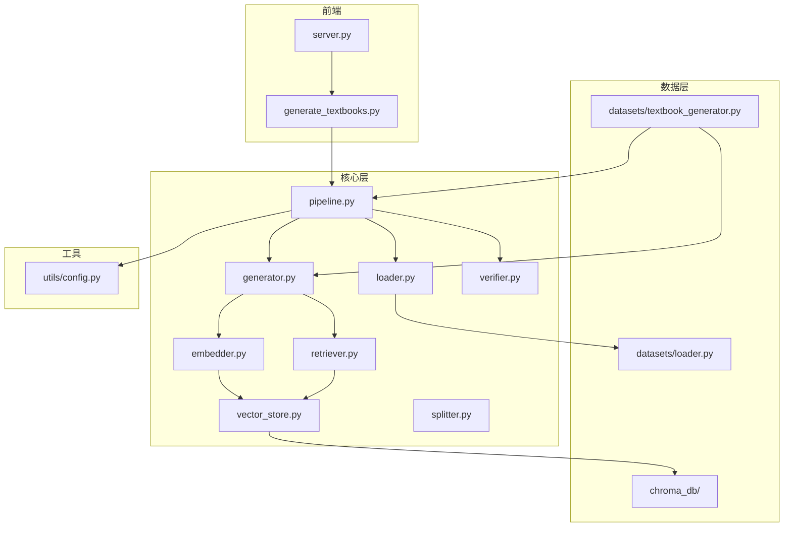
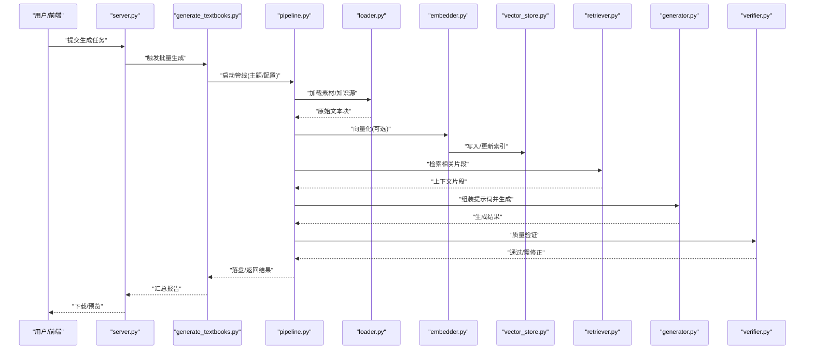
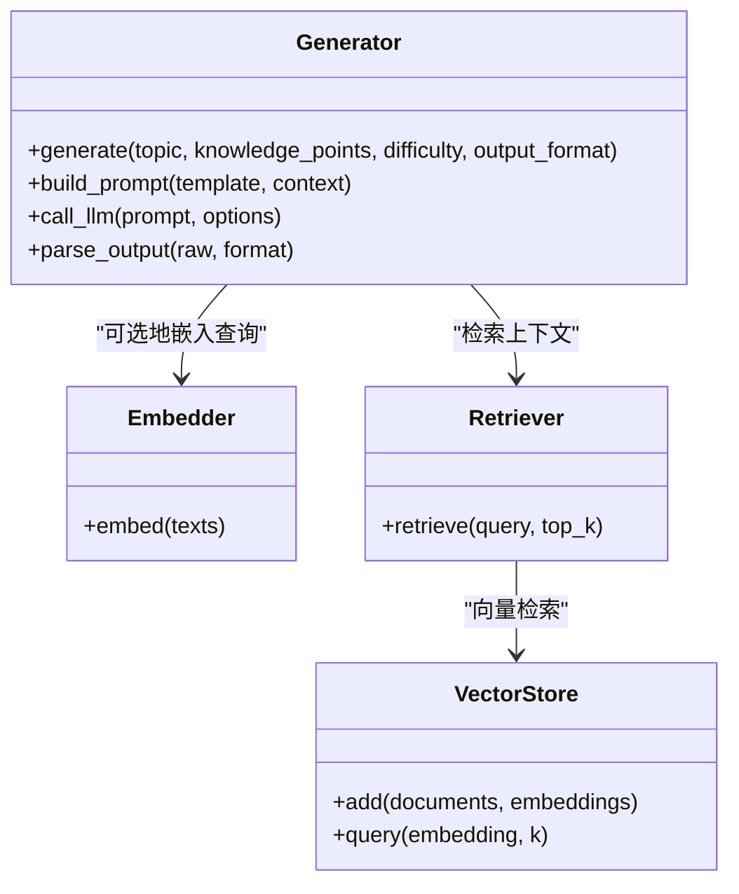
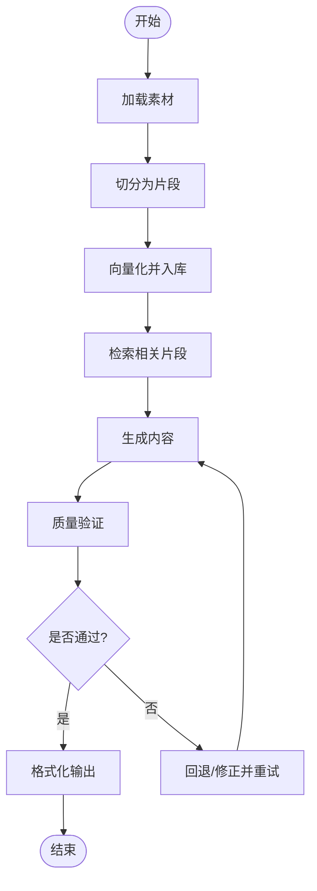
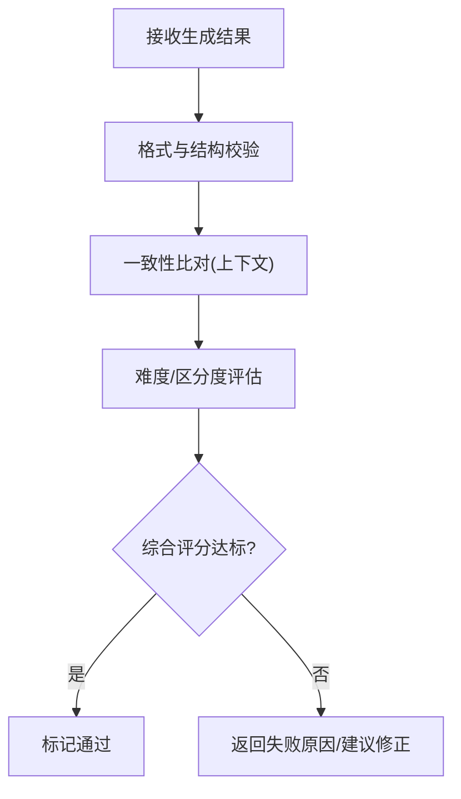
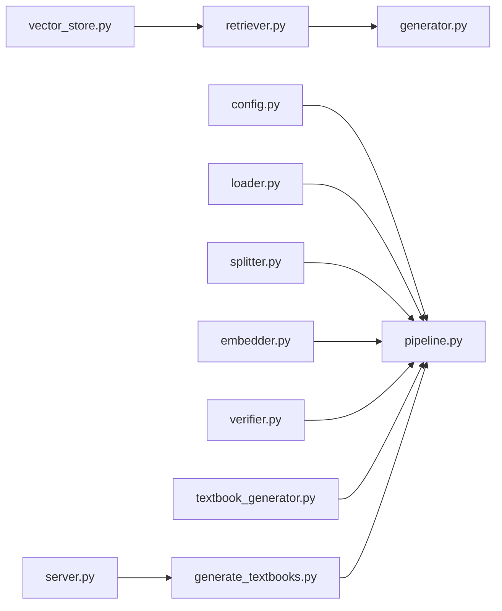

# 智能内容生成

<cite>
**本文引用的文件**   
- [README.md](file://README.md)
- [pyproject.toml](file://pyproject.toml)
- [src/kag_pro/core/generator.py](file://src/kag_pro/core/generator.py)
- [src/kag_pro/core/loader.py](file://src/kag_pro/core/loader.py)
- [src/kag_pro/core/pipeline.py](file://src/kag_pro/core/pipeline.py)
- [src/kag_pro/core/verifier.py](file://src/kag_pro/core/verifier.py)
- [src/kag_pro/core/embedder.py](file://src/kag_pro/core/embedder.py)
- [src/kag_pro/core/retriever.py](file://src/kag_pro/core/retriever.py)
- [src/kag_pro/core/vector_store.py](file://src/kag_pro/core/vector_store.py)
- [src/kag_pro/core/splitter.py](file://src/kag_pro/core/splitter.py)
- [src/kag_pro/data/datasets/textbook_generator.py](file://src/kag_pro/data/datasets/textbook_generator.py)
- [src/kag_pro/data/datasets/loader.py](file://src/kag_pro/data/datasets/loader.py)
- [src/kag_pro/utils/config.py](file://src/kag_pro/utils/config.py)
- [frontend/generate_textbooks.py](file://frontend/generate_textbooks.py)
- [frontend/server.py](file://frontend/server.py)
- [data/chroma_db/](file://data/chroma_db/)
</cite>

## 目录
1. [简介](#简介)
2. [项目结构](#项目结构)
3. [核心组件](#核心组件)
4. [架构总览](#架构总览)
5. [详细组件分析](#详细组件分析)
6. [依赖关系分析](#依赖关系分析)
7. [性能考虑](#性能考虑)
8. [故障排查指南](#故障排查指南)
9. [结论](#结论)
10. [附录](#附录)

## 简介
本文件面向KAG-Pro平台的“智能内容生成”能力，聚焦教材内容与练习题的自动生成流程。文档覆盖以下主题：
- 内容模板管理、质量验证与多格式输出支持
- 生成器架构设计与加载器工作机制
- 内容质量控制策略（提示词工程、校验与过滤）
- 配置选项、批量处理与前端集成
- 不同学科内容的生成效果展示与自定义扩展方法
- 生成质量评估指标与优化技巧

## 项目结构
仓库采用分层组织方式：
- src/kag_pro/core：核心生成管线、检索与向量存储、嵌入、切分、验证等
- src/kag_pro/data/datasets：数据集与教材生成脚本
- src/kag_pro/utils：通用配置工具
- frontend：Web服务与教材批量生成入口
- data/chroma_db：向量数据库持久化目录
- notebooks：原型实验Notebook
- tests：单元测试与回归测试

图表来源
- [frontend/server.py](file://frontend/server.py)
- [frontend/generate_textbooks.py](file://frontend/generate_textbooks.py)
- [src/kag_pro/core/pipeline.py](file://src/kag_pro/core/pipeline.py)
- [src/kag_pro/core/generator.py](file://src/kag_pro/core/generator.py)
- [src/kag_pro/core/loader.py](file://src/kag_pro/core/loader.py)
- [src/kag_pro/core/verifier.py](file://src/kag_pro/core/verifier.py)
- [src/kag_pro/core/embedder.py](file://src/kag_pro/core/embedder.py)
- [src/kag_pro/core/retriever.py](file://src/kag_pro/core/retriever.py)
- [src/kag_pro/core/vector_store.py](file://src/kag_pro/core/vector_store.py)
- [src/kag_pro/core/splitter.py](file://src/kag_pro/core/splitter.py)
- [src/kag_pro/data/datasets/textbook_generator.py](file://src/kag_pro/data/datasets/textbook_generator.py)
- [src/kag_pro/data/datasets/loader.py](file://src/kag_pro/data/datasets/loader.py)
- [src/kag_pro/utils/config.py](file://src/kag_pro/utils/config.py)
- [data/chroma_db/](file://data/chroma_db/)

章节来源
- [README.md](file://README.md)
- [pyproject.toml](file://pyproject.toml)

## 核心组件
- 生成器（Generator）：负责根据主题/知识点与提示词模板生成教材段落或练习题，并调用嵌入与检索增强生成。
- 加载器（Loader）：统一读取外部文本、知识库或本地教材样例，提供标准化输入。
- 管线（Pipeline）：编排“加载→切分→检索→生成→验证→落盘”的端到端流程。
- 验证器（Verifier）：对生成内容进行质量校验（如一致性、难度、格式合规）。
- 嵌入器（Embedder）：将文本转换为向量表示，供检索使用。
- 检索器（Retriever）：基于向量相似度召回相关片段，辅助生成。
- 向量存储（Vector Store）：持久化向量索引（Chroma），支持增量更新与查询。
- 切分器（Splitter）：按语义或长度切分长文本，提升检索精度。
- 教材生成脚本（textbook_generator.py）：面向学科与年级的批量生成入口。
- 配置（config.py）：集中管理模型、路径、阈值、并发等参数。

章节来源
- [src/kag_pro/core/generator.py](file://src/kag_pro/core/generator.py)
- [src/kag_pro/core/loader.py](file://src/kag_pro/core/loader.py)
- [src/kag_pro/core/pipeline.py](file://src/kag_pro/core/pipeline.py)
- [src/kag_pro/core/verifier.py](file://src/kag_pro/core/verifier.py)
- [src/kag_pro/core/embedder.py](file://src/kag_pro/core/embedder.py)
- [src/kag_pro/core/retriever.py](file://src/kag_pro/core/retriever.py)
- [src/kag_pro/core/vector_store.py](file://src/kag_pro/core/vector_store.py)
- [src/kag_pro/core/splitter.py](file://src/kag_pro/core/splitter.py)
- [src/kag_pro/data/datasets/textbook_generator.py](file://src/kag_pro/data/datasets/textbook_generator.py)
- [src/kag_pro/utils/config.py](file://src/kag_pro/utils/config.py)

## 架构总览
整体采用“检索增强生成（RAG）+ 可插拔验证”的流水线架构：
- 输入：主题/知识点、学科与学段、题目类型、难度等级、输出格式等
- 过程：加载素材→切分→向量化→检索→提示词组装→生成→验证→格式化输出
- 输出：结构化教材/练习（文本、Markdown、JSON等），并持久化到向量库与文件系统

图表来源
- [frontend/server.py](file://frontend/server.py)
- [frontend/generate_textbooks.py](file://frontend/generate_textbooks.py)
- [src/kag_pro/core/pipeline.py](file://src/kag_pro/core/pipeline.py)
- [src/kag_pro/core/loader.py](file://src/kag_pro/core/loader.py)
- [src/kag_pro/core/embedder.py](file://src/kag_pro/core/embedder.py)
- [src/kag_pro/core/vector_store.py](file://src/kag_pro/core/vector_store.py)
- [src/kag_pro/core/retriever.py](file://src/kag_pro/core/retriever.py)
- [src/kag_pro/core/generator.py](file://src/kag_pro/core/generator.py)
- [src/kag_pro/core/verifier.py](file://src/kag_pro/core/verifier.py)

## 详细组件分析

### 生成器（Generator）
职责与要点：
- 接收主题、知识点、题型、难度、目标受众等参数
- 组合提示词模板（含示例、约束、评分标准）
- 调用大模型接口进行生成，支持流式与非流式
- 结合检索上下文提升准确性与相关性
- 输出结构化内容（文本、Markdown、JSON），便于后续处理

关键设计模式：
- 模板驱动：提示词模板与业务规则解耦，便于扩展新题型
- 上下文注入：从检索器获取相关片段，减少幻觉
- 容错重试：网络异常与超时自动重试与降级

图表来源
- [src/kag_pro/core/generator.py](file://src/kag_pro/core/generator.py)
- [src/kag_pro/core/embedder.py](file://src/kag_pro/core/embedder.py)
- [src/kag_pro/core/retriever.py](file://src/kag_pro/core/retriever.py)
- [src/kag_pro/core/vector_store.py](file://src/kag_pro/core/vector_store.py)

章节来源
- [src/kag_pro/core/generator.py](file://src/kag_pro/core/generator.py)

### 加载器（Loader）
职责与要点：
- 统一接入多种数据源：本地文本、CSV/JSON、外部API、知识库
- 清洗与标准化：去噪、编码统一、元数据抽取
- 批量加载与分页：避免内存溢出，支持断点续传

典型用法：
- 教材素材批量导入
- 历史题库导入与去重
- 外部开放教育资源抓取与清洗

章节来源
- [src/kag_pro/core/loader.py](file://src/kag_pro/core/loader.py)
- [src/kag_pro/data/datasets/loader.py](file://src/kag_pro/data/datasets/loader.py)

### 管线（Pipeline）
职责与要点：
- 编排端到端流程：加载→切分→检索→生成→验证→输出
- 可插拔阶段：每个阶段可独立替换实现
- 监控与日志：记录耗时、吞吐、错误率与中间产物

图表来源
- [src/kag_pro/core/pipeline.py](file://src/kag_pro/core/pipeline.py)
- [src/kag_pro/core/splitter.py](file://src/kag_pro/core/splitter.py)
- [src/kag_pro/core/embedder.py](file://src/kag_pro/core/embedder.py)
- [src/kag_pro/core/vector_store.py](file://src/kag_pro/core/vector_store.py)
- [src/kag_pro/core/retriever.py](file://src/kag_pro/core/retriever.py)
- [src/kag_pro/core/generator.py](file://src/kag_pro/core/generator.py)
- [src/kag_pro/core/verifier.py](file://src/kag_pro/core/verifier.py)

章节来源
- [src/kag_pro/core/pipeline.py](file://src/kag_pro/core/pipeline.py)

### 验证器（Verifier）
职责与要点：
- 规则校验：长度、格式、必填字段、答案唯一性
- 一致性检查：与检索上下文一致，无事实冲突
- 难度与区分度：依据题型与知识点匹配度打分
- 安全与合规：敏感词过滤、版权风险提示

图表来源
- [src/kag_pro/core/verifier.py](file://src/kag_pro/core/verifier.py)

章节来源
- [src/kag_pro/core/verifier.py](file://src/kag_pro/core/verifier.py)

### 嵌入器（Embedder）与检索器（Retriever）
- 嵌入器：将文本转为高维向量，支持批量与缓存
- 检索器：基于向量相似度召回Top-K片段，支持过滤与重排
- 向量存储：持久化索引，支持增量更新与跨进程共享

章节来源
- [src/kag_pro/core/embedder.py](file://src/kag_pro/core/embedder.py)
- [src/kag_pro/core/retriever.py](file://src/kag_pro/core/retriever.py)
- [src/kag_pro/core/vector_store.py](file://src/kag_pro/core/vector_store.py)

### 教材批量生成（textbook_generator.py）
- 面向学科与年级的参数化生成
- 支持批量主题列表、并发控制、进度与失败重试
- 输出多格式：纯文本、Markdown、结构化JSON

章节来源
- [src/kag_pro/data/datasets/textbook_generator.py](file://src/kag_pro/data/datasets/textbook_generator.py)

### 前端集成（server.py 与 generate_textbooks.py）
- server.py：提供HTTP接口，接收生成请求，调度批量任务
- generate_textbooks.py：命令行/脚本入口，封装批量生成逻辑
- 支持异步任务、状态查询与结果下载

章节来源
- [frontend/server.py](file://frontend/server.py)
- [frontend/generate_textbooks.py](file://frontend/generate_textbooks.py)

### 配置管理（config.py）
- 模型与接口：基座模型、温度、最大长度、重试次数
- 路径与存储：向量库路径、输出目录、临时目录
- 质量阈值：验证分数阈值、最小长度、最大重复率
- 并发与资源：并发数、批大小、超时时间

章节来源
- [src/kag_pro/utils/config.py](file://src/kag_pro/utils/config.py)

## 依赖关系分析
- 模块内聚：core下各组件职责清晰，耦合度低，易于替换
- 外部依赖：向量库（Chroma）、大模型API、文件系统
- 潜在循环：确保生成器不直接依赖管线，避免循环引用
- 扩展点：验证器、嵌入器、检索器均可按策略替换

图表来源
- [src/kag_pro/utils/config.py](file://src/kag_pro/utils/config.py)
- [src/kag_pro/core/pipeline.py](file://src/kag_pro/core/pipeline.py)
- [src/kag_pro/core/loader.py](file://src/kag_pro/core/loader.py)
- [src/kag_pro/core/splitter.py](file://src/kag_pro/core/splitter.py)
- [src/kag_pro/core/embedder.py](file://src/kag_pro/core/embedder.py)
- [src/kag_pro/core/vector_store.py](file://src/kag_pro/core/vector_store.py)
- [src/kag_pro/core/retriever.py](file://src/kag_pro/core/retriever.py)
- [src/kag_pro/core/generator.py](file://src/kag_pro/core/generator.py)
- [src/kag_pro/core/verifier.py](file://src/kag_pro/core/verifier.py)
- [src/kag_pro/data/datasets/textbook_generator.py](file://src/kag_pro/data/datasets/textbook_generator.py)
- [frontend/server.py](file://frontend/server.py)
- [frontend/generate_textbooks.py](file://frontend/generate_textbooks.py)

章节来源
- [pyproject.toml](file://pyproject.toml)

## 性能考虑
- 向量化批处理：合并小批次以减少I/O与模型调用开销
- 检索优化：合理设置top_k与相似度阈值，避免过多无关片段
- 并发控制：根据GPU/CPU与API配额调整并发与批大小
- 缓存策略：对常见主题/知识点缓存生成结果与向量索引
- 增量更新：仅对新增/变更片段重新索引，降低重建成本

[本节为通用指导，无需具体文件来源]

## 故障排查指南
常见问题与定位步骤：
- 生成失败或超时
  - 检查模型接口连通性与配额
  - 查看管线日志中的重试与降级信息
- 检索不到相关内容
  - 确认向量库索引是否存在且已更新
  - 调整top_k与相似度阈值
- 输出格式不正确
  - 检查验证器规则与输出格式映射
- 内存不足
  - 减小批大小与并发数，启用分页加载

章节来源
- [src/kag_pro/core/pipeline.py](file://src/kag_pro/core/pipeline.py)
- [src/kag_pro/core/verifier.py](file://src/kag_pro/core/verifier.py)
- [src/kag_pro/core/vector_store.py](file://src/kag_pro/core/vector_store.py)
- [src/kag_pro/core/retriever.py](file://src/kag_pro/core/retriever.py)
- [src/kag_pro/core/generator.py](file://src/kag_pro/core/generator.py)

## 结论
KAG-Pro的智能内容生成以“检索增强+可插拔验证”为核心，实现了从素材加载、向量化检索、提示词生成到质量校验的完整闭环。通过模块化设计与丰富配置项，平台能够灵活适配不同学科与题型，并提供批量处理与多格式输出能力。建议在生产环境中结合质量阈值与人工抽检，持续优化提示词模板与检索策略，以获得稳定高质量的生成效果。

[本节为总结性内容，无需具体文件来源]

## 附录

### 配置选项速览（示例键名）
- 模型与接口
  - model_name: 模型名称
  - api_base: 接口地址
  - temperature: 随机性
  - max_tokens: 最大生成长度
  - retries: 重试次数
- 路径与存储
  - vector_db_path: 向量库路径
  - output_dir: 输出目录
  - tmp_dir: 临时目录
- 质量阈值
  - min_length: 最小长度
  - similarity_threshold: 相似度阈值
  - verifier_score_threshold: 验证分数阈值
- 并发与资源
  - batch_size: 批大小
  - concurrency: 并发数
  - timeout: 超时秒数

章节来源
- [src/kag_pro/utils/config.py](file://src/kag_pro/utils/config.py)

### 提示词工程最佳实践
- 明确角色与目标：指定生成者身份与受众
- 结构化约束：规定输出格式、字段与示例
- 上下文注入：优先使用检索到的权威片段作为参考
- 逐步细化：先大纲后细节，再校验与修正
- 安全与合规：加入敏感词过滤与版权提示

[本节为通用指导，无需具体文件来源]

### 批量处理与前端使用
- 批量任务
  - 准备主题/知识点清单
  - 设置并发与批大小
  - 运行批量脚本并监控进度
- 前端接口
  - 提交任务：包含主题、学科、题型、难度、输出格式
  - 查询状态：轮询任务状态与进度
  - 下载结果：获取生成的教材/练习文件

章节来源
- [frontend/server.py](file://frontend/server.py)
- [frontend/generate_textbooks.py](file://frontend/generate_textbooks.py)
- [src/kag_pro/data/datasets/textbook_generator.py](file://src/kag_pro/data/datasets/textbook_generator.py)

### 质量评估与优化技巧
- 评估维度
  - 准确性：与检索上下文的一致性
  - 完整性：覆盖知识点与题型要求
  - 可读性：语言流畅、结构清晰
  - 难度匹配：符合目标学段与难度
- 优化技巧
  - 调整检索top_k与阈值
  - 改进提示词模板与示例
  - 引入二次校验与人工抽检
  - 建立反馈闭环，持续迭代模板与策略

[本节为通用指导，无需具体文件来源]