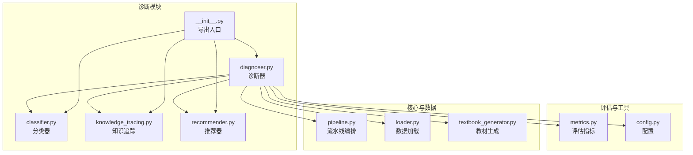
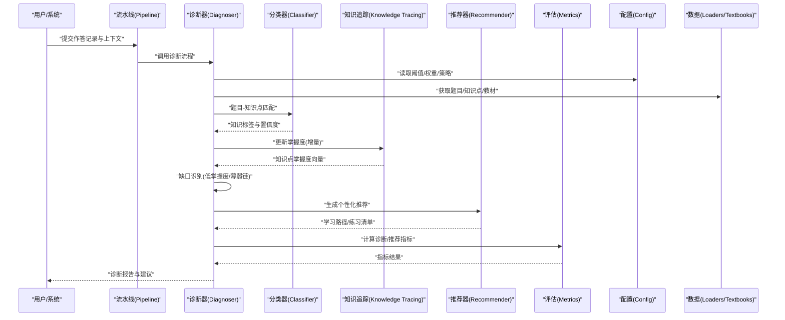
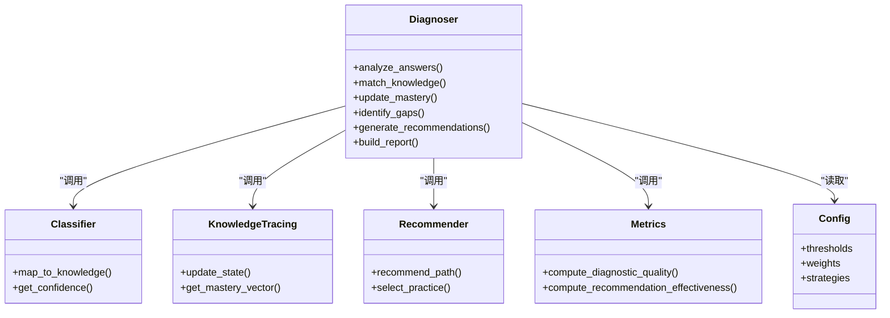
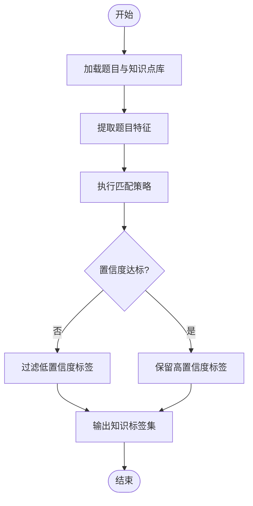
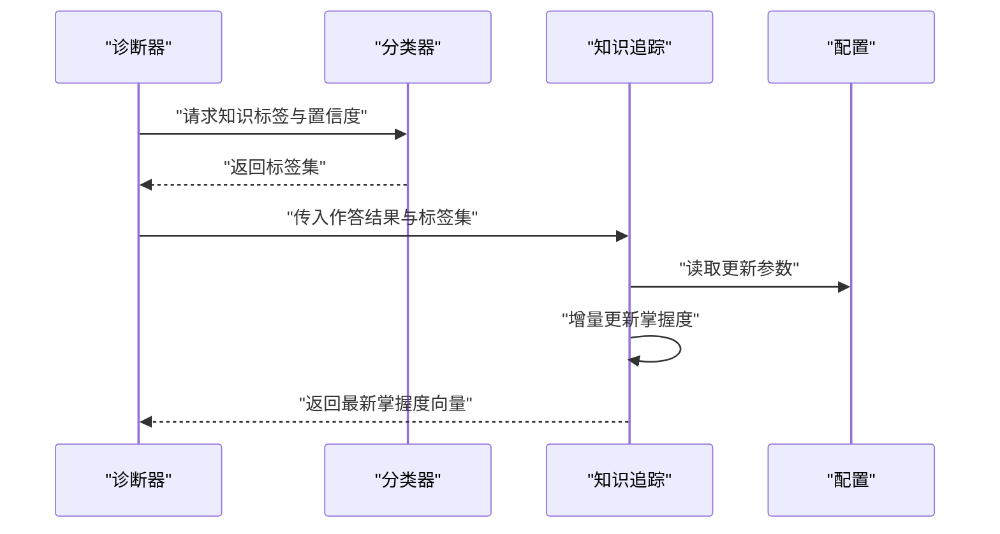
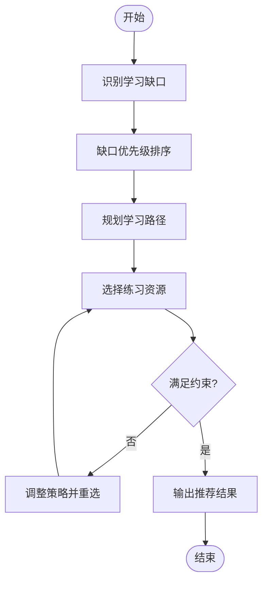
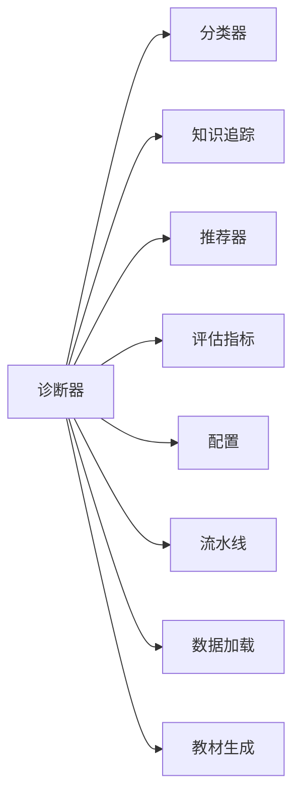

# 智能学习诊断

<cite>
**本文引用的文件**   
- [diagnoser.py](file://src/kag_pro/diagnosis/diagnoser.py)
- [classifier.py](file://src/kag_pro/diagnosis/classifier.py)
- [knowledge_tracing.py](file://src/kag_pro/diagnosis/knowledge_tracing.py)
- [recommender.py](file://src/kag_pro/diagnosis/recommender.py)
- [metrics.py](file://src/kag_pro/evaluation/metrics.py)
- [config.py](file://src/kag_pro/utils/config.py)
- [pipeline.py](file://src/kag_pro/core/pipeline.py)
- [loader.py](file://src/kag_pro/data/datasets/loader.py)
- [textbook_generator.py](file://src/kag_pro/data/datasets/textbook_generator.py)
- [__init__.py](file://src/kag_pro/diagnosis/__init__.py)
</cite>

## 目录
1. [简介](#简介)
2. [项目结构](#项目结构)
3. [核心组件](#核心组件)
4. [架构总览](#架构总览)
5. [详细组件分析](#详细组件分析)
6. [依赖关系分析](#依赖关系分析)
7. [性能考虑](#性能考虑)
8. [故障排查指南](#故障排查指南)
9. [结论](#结论)
10. [附录](#附录)

## 简介
本文件面向KAG-Pro平台的“智能学习诊断”能力，系统化阐述基于学生答题情况的知识点掌握度评估算法与端到端工作流。内容覆盖答案分析、知识匹配、能力画像构建、学习缺口识别、诊断器工作原理、分类器实现逻辑、知识追踪模型与推荐算法；并提供API接口说明、参数配置、使用示例、报告生成流程与个性化建议生成过程，以及应用场景与效果评估指标。

## 项目结构
围绕诊断功能的核心代码位于 diagnosis 子包，配合 evaluation 的指标模块、utils 的配置模块、core 的流水线编排、data 的数据加载与教材生成等模块协同工作。下图给出与诊断相关的模块组织与交互概览。

图表来源
- [diagnoser.py](file://src/kag_pro/diagnosis/diagnoser.py)
- [classifier.py](file://src/kag_pro/diagnosis/classifier.py)
- [knowledge_tracing.py](file://src/kag_pro/diagnosis/knowledge_tracing.py)
- [recommender.py](file://src/kag_pro/diagnosis/recommender.py)
- [metrics.py](file://src/kag_pro/evaluation/metrics.py)
- [config.py](file://src/kag_pro/utils/config.py)
- [pipeline.py](file://src/kag_pro/core/pipeline.py)
- [loader.py](file://src/kag_pro/data/datasets/loader.py)
- [textbook_generator.py](file://src/kag_pro/data/datasets/textbook_generator.py)
- [__init__.py](file://src/kag_pro/diagnosis/__init__.py)

章节来源
- [diagnoser.py](file://src/kag_pro/diagnosis/diagnoser.py)
- [classifier.py](file://src/kag_pro/diagnosis/classifier.py)
- [knowledge_tracing.py](file://src/kag_pro/diagnosis/knowledge_tracing.py)
- [recommender.py](file://src/kag_pro/diagnosis/recommender.py)
- [metrics.py](file://src/kag_pro/evaluation/metrics.py)
- [config.py](file://src/kag_pro/utils/config.py)
- [pipeline.py](file://src/kag_pro/core/pipeline.py)
- [loader.py](file://src/kag_pro/data/datasets/loader.py)
- [textbook_generator.py](file://src/kag_pro/data/datasets/textbook_generator.py)
- [__init__.py](file://src/kag_pro/diagnosis/__init__.py)

## 核心组件
- 诊断器（Diagnoser）：串联答案分析、知识匹配、能力画像、缺口识别与报告生成的主控制器。
- 分类器（Classifier）：将题目与知识点进行映射，输出知识标签及置信度。
- 知识追踪（Knowledge Tracing）：基于历史作答序列更新知识点掌握度，支持增量学习与状态演化。
- 推荐器（Recommender）：依据掌握度与缺口定位，生成个性化学习路径与练习推荐。
- 评估指标（Metrics）：提供诊断质量与推荐效果的量化评估方法。
- 配置（Config）：集中管理阈值、权重、模型参数与策略开关。
- 流水线（Pipeline）：将诊断各阶段组合为可复用的处理管线。
- 数据加载与教材生成（Loader/Textbook Generator）：支撑题目、知识点与教材内容的输入与扩展。

章节来源
- [diagnoser.py](file://src/kag_pro/diagnosis/diagnoser.py)
- [classifier.py](file://src/kag_pro/diagnosis/classifier.py)
- [knowledge_tracing.py](file://src/kag_pro/diagnosis/knowledge_tracing.py)
- [recommender.py](file://src/kag_pro/diagnosis/recommender.py)
- [metrics.py](file://src/kag_pro/evaluation/metrics.py)
- [config.py](file://src/kag_pro/utils/config.py)
- [pipeline.py](file://src/kag_pro/core/pipeline.py)
- [loader.py](file://src/kag_pro/data/datasets/loader.py)
- [textbook_generator.py](file://src/kag_pro/data/datasets/textbook_generator.py)

## 架构总览
下图展示从“学生作答”到“诊断报告与个性化建议”的端到端流程，包括数据接入、知识匹配、掌握度追踪、缺口识别、推荐生成与报告输出。

图表来源
- [diagnoser.py](file://src/kag_pro/diagnosis/diagnoser.py)
- [classifier.py](file://src/kag_pro/diagnosis/classifier.py)
- [knowledge_tracing.py](file://src/kag_pro/diagnosis/knowledge_tracing.py)
- [recommender.py](file://src/kag_pro/diagnosis/recommender.py)
- [metrics.py](file://src/kag_pro/evaluation/metrics.py)
- [config.py](file://src/kag_pro/utils/config.py)
- [pipeline.py](file://src/kag_pro/core/pipeline.py)
- [loader.py](file://src/kag_pro/data/datasets/loader.py)
- [textbook_generator.py](file://src/kag_pro/data/datasets/textbook_generator.py)

## 详细组件分析

### 诊断器（Diagnoser）
职责与流程
- 接收学生作答与上下文信息，按策略驱动答案分析与知识匹配。
- 聚合分类器的知识标签与置信度，结合知识追踪的掌握度向量，进行缺口识别。
- 调用推荐器生成个性化学习路径与练习清单。
- 汇总并输出结构化诊断报告，包含掌握度、缺口、建议与指标。

关键要点
- 控制流清晰：解析输入→匹配知识→更新掌握度→识别缺口→生成推荐→输出报告。
- 可配置化：通过配置对象注入阈值、权重与策略开关，便于不同学段/学科调优。
- 可扩展性：以模块化方式集成新的分类器或追踪模型。

章节来源
- [diagnoser.py](file://src/kag_pro/diagnosis/diagnoser.py)
- [config.py](file://src/kag_pro/utils/config.py)
- [pipeline.py](file://src/kag_pro/core/pipeline.py)

#### 类图（诊断器相关）

图表来源
- [diagnoser.py](file://src/kag_pro/diagnosis/diagnoser.py)
- [classifier.py](file://src/kag_pro/diagnosis/classifier.py)
- [knowledge_tracing.py](file://src/kag_pro/diagnosis/knowledge_tracing.py)
- [recommender.py](file://src/kag_pro/diagnosis/recommender.py)
- [metrics.py](file://src/kag_pro/evaluation/metrics.py)
- [config.py](file://src/kag_pro/utils/config.py)

### 分类器（Classifier）
职责与逻辑
- 将题目文本/结构与知识点集合进行匹配，输出知识标签列表及其置信度。
- 支持多种匹配策略（如关键词、语义相似度、规则模板），并可融合多源特征提升稳定性。
- 提供置信度校准与阈值过滤，避免噪声标签进入后续流程。

复杂度与优化
- 时间复杂度主要取决于题库规模与匹配策略；可通过索引与缓存降低重复计算。
- 空间复杂度受知识点表示与中间特征影响，建议按需加载与惰性计算。

章节来源
- [classifier.py](file://src/kag_pro/diagnosis/classifier.py)
- [config.py](file://src/kag_pro/utils/config.py)

#### 流程图（知识匹配）

图表来源
- [classifier.py](file://src/kag_pro/diagnosis/classifier.py)

### 知识追踪（Knowledge Tracing）
职责与模型
- 维护每个知识点的掌握度状态，随新作答增量更新。
- 支持状态演化（如难度、遗忘曲线、迁移效应），输出稳定的掌握度向量供缺口识别与推荐使用。
- 可与分类器输出的知识标签对齐，确保维度一致。

更新机制
- 基于正确/错误反馈调整掌握度，结合先验与动态权重，避免过拟合单次作答。
- 提供平滑与回退策略，保证在稀疏数据下的鲁棒性。

章节来源
- [knowledge_tracing.py](file://src/kag_pro/diagnosis/knowledge_tracing.py)
- [config.py](file://src/kag_pro/utils/config.py)

#### 时序图（掌握度更新）

图表来源
- [diagnoser.py](file://src/kag_pro/diagnosis/diagnoser.py)
- [classifier.py](file://src/kag_pro/diagnosis/classifier.py)
- [knowledge_tracing.py](file://src/kag_pro/diagnosis/knowledge_tracing.py)
- [config.py](file://src/kag_pro/utils/config.py)

### 推荐器（Recommender）
职责与策略
- 基于掌握度向量与缺口定位，生成个性化学习路径与练习清单。
- 考虑知识点依赖关系、难度梯度与复习间隔，平衡巩固与拓展。
- 支持多目标优化（如覆盖率、难度匹配、时间预算）。

生成流程
- 缺口排序→路径规划→练习选择→约束校验→输出推荐。

章节来源
- [recommender.py](file://src/kag_pro/diagnosis/recommender.py)
- [config.py](file://src/kag_pro/utils/config.py)

#### 流程图（推荐生成）

图表来源
- [recommender.py](file://src/kag_pro/diagnosis/recommender.py)

### 评估指标（Metrics）
职责与方法
- 诊断质量：衡量诊断结果与真实掌握度的吻合程度（如准确率、召回率、F1、AUC等）。
- 推荐有效性：衡量推荐路径对后续表现的提升（如命中率、覆盖率、平均路径长度、收益增益）。
- 提供统一接口，便于在训练/验证/线上场景复用。

章节来源
- [metrics.py](file://src/kag_pro/evaluation/metrics.py)

### 配置（Config）
职责与字段
- 阈值：用于置信度过滤、缺口判定、推荐约束。
- 权重：用于多策略融合、掌握度更新、推荐评分。
- 策略：开关与模式选择（如是否启用遗忘曲线、是否启用依赖关系）。

章节来源
- [config.py](file://src/kag_pro/utils/config.py)

### 流水线（Pipeline）
职责与编排
- 将诊断各阶段封装为步骤，支持顺序/条件/并行编排。
- 提供统一的输入输出契约，便于测试与部署。

章节来源
- [pipeline.py](file://src/kag_pro/core/pipeline.py)

### 数据加载与教材生成（Loader/Textbook Generator）
职责
- Loader：负责题目、知识点、历史作答等数据的加载与预处理。
- Textbook Generator：根据知识点生成结构化教材片段，辅助理解与复习。

章节来源
- [loader.py](file://src/kag_pro/data/datasets/loader.py)
- [textbook_generator.py](file://src/kag_pro/data/datasets/textbook_generator.py)

## 依赖关系分析
诊断模块内部耦合关系如下：诊断器作为中心协调者，依赖分类器、知识追踪、推荐器与评估模块；同时读取配置并编排流水线；数据层提供输入与素材。

图表来源
- [diagnoser.py](file://src/kag_pro/diagnosis/diagnoser.py)
- [classifier.py](file://src/kag_pro/diagnosis/classifier.py)
- [knowledge_tracing.py](file://src/kag_pro/diagnosis/knowledge_tracing.py)
- [recommender.py](file://src/kag_pro/diagnosis/recommender.py)
- [metrics.py](file://src/kag_pro/evaluation/metrics.py)
- [config.py](file://src/kag_pro/utils/config.py)
- [pipeline.py](file://src/kag_pro/core/pipeline.py)
- [loader.py](file://src/kag_pro/data/datasets/loader.py)
- [textbook_generator.py](file://src/kag_pro/data/datasets/textbook_generator.py)

章节来源
- [diagnoser.py](file://src/kag_pro/diagnosis/diagnoser.py)
- [classifier.py](file://src/kag_pro/diagnosis/classifier.py)
- [knowledge_tracing.py](file://src/kag_pro/diagnosis/knowledge_tracing.py)
- [recommender.py](file://src/kag_pro/diagnosis/recommender.py)
- [metrics.py](file://src/kag_pro/evaluation/metrics.py)
- [config.py](file://src/kag_pro/utils/config.py)
- [pipeline.py](file://src/kag_pro/core/pipeline.py)
- [loader.py](file://src/kag_pro/data/datasets/loader.py)
- [textbook_generator.py](file://src/kag_pro/data/datasets/textbook_generator.py)

## 性能考虑
- 分类器匹配：采用索引与缓存减少重复计算；对大规模题库建议使用批量处理与异步IO。
- 知识追踪：增量更新避免全量重算；对稀疏数据启用平滑与回退策略。
- 推荐生成：优先选择局部搜索与启发式剪枝，限制候选集规模。
- 内存与并发：合理设置批大小与线程池；对大对象使用引用传递与惰性加载。
- 监控与降级：对异常分支快速失败与降级策略，保障服务可用性。

[本节为通用指导，不直接分析具体文件]

## 故障排查指南
常见问题与定位
- 知识标签缺失或置信度过低：检查分类器阈值与匹配策略，确认知识点库完整性。
- 掌握度震荡或不收敛：调整知识追踪更新参数，检查作答序列质量与噪声。
- 推荐结果不合理：核查缺口识别阈值与依赖关系配置，验证推荐约束条件。
- 指标异常：核对评估指标输入格式与基线定义，确认数据一致性。

定位步骤
- 查看配置项是否正确加载。
- 打印中间产物（知识标签、掌握度向量、缺口列表、推荐候选）。
- 逐步隔离模块，定位问题边界。

章节来源
- [config.py](file://src/kag_pro/utils/config.py)
- [metrics.py](file://src/kag_pro/evaluation/metrics.py)
- [diagnoser.py](file://src/kag_pro/diagnosis/diagnoser.py)

## 结论
KAG-Pro的智能学习诊断以诊断器为核心，串联分类器、知识追踪与推荐器，形成从“作答→知识匹配→掌握度更新→缺口识别→个性化推荐→报告输出”的闭环。通过可配置的策略与稳健的评估指标，系统可在不同学科与学段中灵活适配，持续优化诊断准确性与推荐有效性。

[本节为总结性内容，不直接分析具体文件]

## 附录

### API 接口说明（概念性）
- 诊断接口
  - 输入：学生ID、作答记录、上下文（题目、知识点、历史表现）。
  - 输出：诊断报告（掌握度、缺口、建议）、指标摘要。
  - 参数：阈值、权重、策略开关（来自配置）。
- 推荐接口
  - 输入：掌握度向量、缺口列表、约束（时间、难度、偏好）。
  - 输出：学习路径、练习清单、预期收益。
- 评估接口
  - 输入：预测结果与真实标签/表现。
  - 输出：诊断质量与推荐有效性指标。

[本节为概念性说明，不直接分析具体文件]

### 参数配置参考（概念性）
- 阈值：置信度阈值、缺口阈值、推荐难度阈值。
- 权重：匹配策略权重、掌握度更新权重、推荐评分权重。
- 策略：是否启用遗忘曲线、依赖关系、平滑与回退。

[本节为概念性说明，不直接分析具体文件]

### 使用示例（概念性）
- 初始化诊断器并加载配置。
- 准备作答记录与知识点库。
- 调用诊断流程，获取报告与建议。
- 调用评估接口，计算指标并归档。

[本节为概念性说明，不直接分析具体文件]

### 实际应用场景与效果评估
- 应用场景：课堂即时诊断、课后作业分析、个性化复习路径规划。
- 效果指标：诊断准确率/召回率/F1/AUC；推荐命中率/覆盖率/平均路径长度/收益增益。
- 评估方法：离线回溯、A/B实验、在线监控与回归检测。

[本节为概念性说明，不直接分析具体文件]