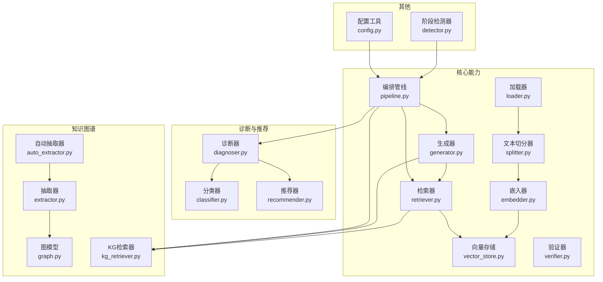
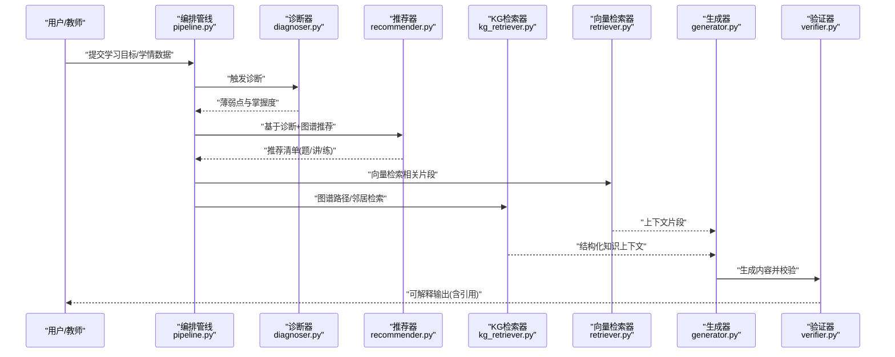
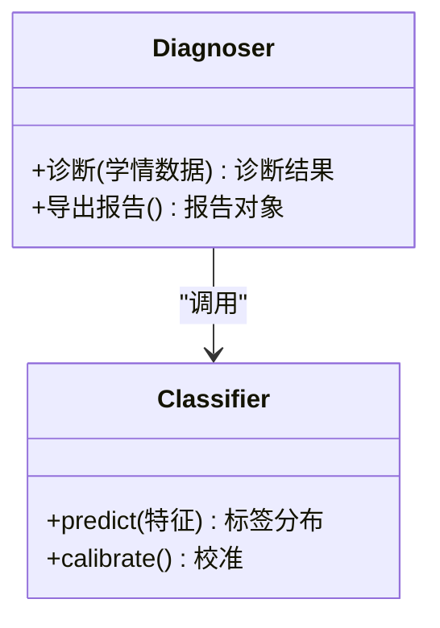
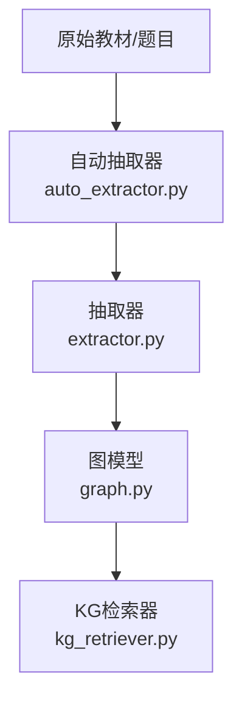
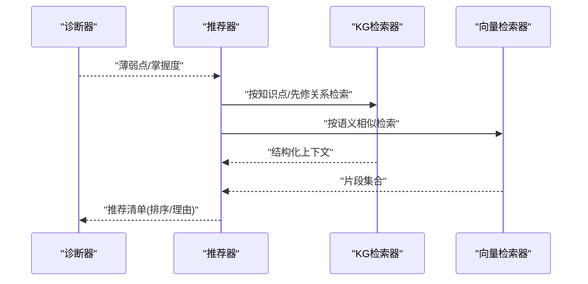
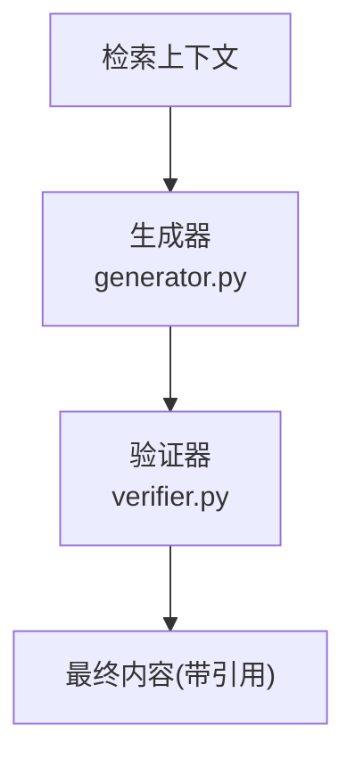
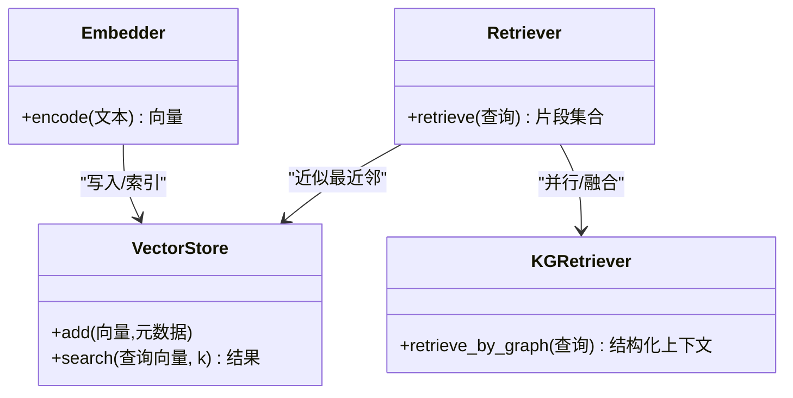
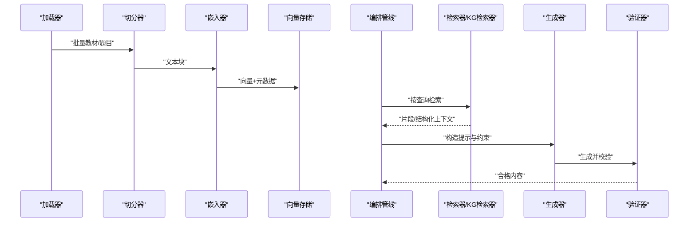
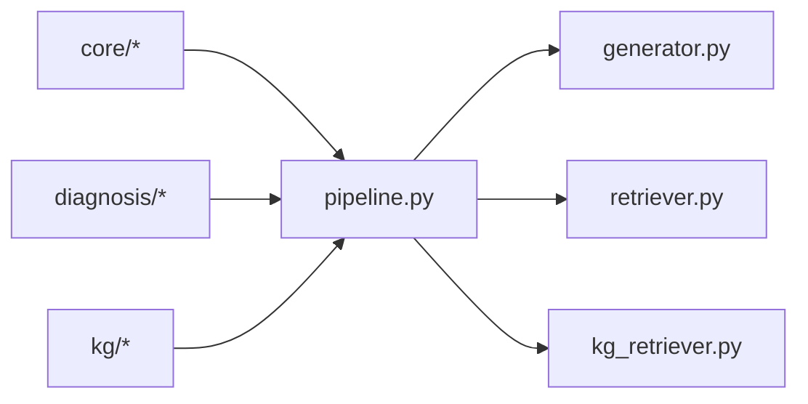

# 核心特性概览

<cite>
**本文引用的文件**   
- [README.md](file://README.md)
- [src/kag_pro/core/pipeline.py](file://src/kag_pro/core/pipeline.py)
- [src/kag_pro/diagnosis/diagnoser.py](file://src/kag_pro/diagnosis/diagnoser.py)
- [src/kag_pro/diagnosis/classifier.py](file://src/kag_pro/diagnosis/classifier.py)
- [src/kag_pro/diagnosis/recommender.py](file://src/kag_pro/diagnosis/recommender.py)
- [src/kag_pro/kg/graph.py](file://src/kag_pro/kg/graph.py)
- [src/kag_pro/kg/auto_extractor.py](file://src/kag_pro/kg/auto_extractor.py)
- [src/kag_pro/kg/extractor.py](file://src/kag_pro/kg/extractor.py)
- [src/kag_pro/kg/kg_retriever.py](file://src/kag_pro/kg/kg_retriever.py)
- [src/kag_pro/core/retriever.py](file://src/kag_pro/core/retriever.py)
- [src/kag_pro/core/embedder.py](file://src/kag_pro/core/embedder.py)
- [src/kag_pro/core/vector_store.py](file://src/kag_pro/core/vector_store.py)
- [src/kag_pro/core/generator.py](file://src/kag_pro/core/generator.py)
- [src/kag_pro/core/splitter.py](file://src/kag_pro/core/splitter.py)
- [src/kag_pro/core/loader.py](file://src/kag_pro/core/loader.py)
- [src/kag_pro/core/verifier.py](file://src/kag_pro/core/verifier.py)
- [src/kag_pro/stage/detector.py](file://src/kag_pro/stage/detector.py)
- [src/kag_pro/utils/config.py](file://src/kag_pro/utils/config.py)
</cite>

## 目录
1. [简介](#简介)
2. [项目结构](#项目结构)
3. [核心组件](#核心组件)
4. [架构总览](#架构总览)
5. [详细组件分析](#详细组件分析)
6. [依赖关系分析](#依赖关系分析)
7. [性能考量](#性能考量)
8. [故障排查指南](#故障排查指南)
9. [结论](#结论)
10. [附录](#附录)

## 简介
本概览面向教育场景，系统性介绍KAG-Pro平台的五大核心特性：智能学习诊断、知识图谱构建、个性化推荐、内容生成与混合检索增强。文档从功能描述、技术实现原理、典型应用场景出发，结合代码级架构图与数据流图，帮助读者快速理解各特性的价值与协作方式，并提供对比表与使用案例，便于在实际教学中落地应用。

## 项目结构
仓库采用分层模块化组织：
- core：通用能力（加载、切分、嵌入、向量存储、检索、生成、验证）
- diagnosis：诊断与推荐（诊断器、分类器、推荐器）
- kg：知识图谱（图模型、抽取器、自动抽取、KG检索）
- stage：阶段检测（用于流程控制或状态判断）
- utils：配置等工具
- data/textbooks：教材样例数据
- frontend/notebooks/tests：前端、原型、测试等辅助资源

图表来源
- [src/kag_pro/core/pipeline.py](file://src/kag_pro/core/pipeline.py)
- [src/kag_pro/core/loader.py](file://src/kag_pro/core/loader.py)
- [src/kag_pro/core/splitter.py](file://src/kag_pro/core/splitter.py)
- [src/kag_pro/core/embedder.py](file://src/kag_pro/core/embedder.py)
- [src/kag_pro/core/vector_store.py](file://src/kag_pro/core/vector_store.py)
- [src/kag_pro/core/retriever.py](file://src/kag_pro/core/retriever.py)
- [src/kag_pro/core/generator.py](file://src/kag_pro/core/generator.py)
- [src/kag_pro/core/verifier.py](file://src/kag_pro/core/verifier.py)
- [src/kag_pro/diagnosis/diagnoser.py](file://src/kag_pro/diagnosis/diagnoser.py)
- [src/kag_pro/diagnosis/classifier.py](file://src/kag_pro/diagnosis/classifier.py)
- [src/kag_pro/diagnosis/recommender.py](file://src/kag_pro/diagnosis/recommender.py)
- [src/kag_pro/kg/graph.py](file://src/kag_pro/kg/graph.py)
- [src/kag_pro/kg/extractor.py](file://src/kag_pro/kg/extractor.py)
- [src/kag_pro/kg/auto_extractor.py](file://src/kag_pro/kg/auto_extractor.py)
- [src/kag_pro/kg/kg_retriever.py](file://src/kag_pro/kg/kg_retriever.py)
- [src/kag_pro/stage/detector.py](file://src/kag_pro/stage/detector.py)
- [src/kag_pro/utils/config.py](file://src/kag_pro/utils/config.py)

章节来源
- [README.md](file://README.md)

## 核心组件
- 智能学习诊断：基于学习者行为与测评结果，定位薄弱知识点并给出可解释的诊断报告。
- 知识图谱构建：从教材与题目中自动抽取概念、关系，形成结构化知识网络，支撑推理与检索。
- 个性化推荐：依据诊断结果与知识图谱，为学习者匹配练习、讲解与拓展材料。
- 内容生成：围绕目标知识点生成讲义、题目与解析，支持多模态素材的组装与校验。
- 混合检索增强：融合向量相似度与知识图谱路径检索，提升问答与生成的准确性与可追溯性。

章节来源
- [src/kag_pro/diagnosis/diagnoser.py](file://src/kag_pro/diagnosis/diagnoser.py)
- [src/kag_pro/kg/auto_extractor.py](file://src/kag_pro/kg/auto_extractor.py)
- [src/kag_pro/diagnosis/recommender.py](file://src/kag_pro/diagnosis/recommender.py)
- [src/kag_pro/core/generator.py](file://src/kag_pro/core/generator.py)
- [src/kag_pro/core/retriever.py](file://src/kag_pro/core/retriever.py)
- [src/kag_pro/kg/kg_retriever.py](file://src/kag_pro/kg/kg_retriever.py)

## 架构总览
系统以“数据入湖—知识抽取—检索增强—生成—验证”为主线，诊断与推荐贯穿全链路，提供闭环教学体验。

图表来源
- [src/kag_pro/core/pipeline.py](file://src/kag_pro/core/pipeline.py)
- [src/kag_pro/diagnosis/diagnoser.py](file://src/kag_pro/diagnosis/diagnoser.py)
- [src/kag_pro/diagnosis/recommender.py](file://src/kag_pro/diagnosis/recommender.py)
- [src/kag_pro/core/retriever.py](file://src/kag_pro/core/retriever.py)
- [src/kag_pro/kg/kg_retriever.py](file://src/kag_pro/kg/kg_retriever.py)
- [src/kag_pro/core/generator.py](file://src/kag_pro/core/generator.py)
- [src/kag_pro/core/verifier.py](file://src/kag_pro/core/verifier.py)

## 详细组件分析

### 智能学习诊断
- 功能描述：对学习者作答、错题、时间等信号进行建模，识别薄弱知识点与能力维度，输出可解释的诊断报告。
- 技术实现：
  - 诊断器负责整合输入特征并调用分类器完成标签预测与置信度评估。
  - 分类器封装具体算法接口，便于替换不同模型。
  - 诊断结果作为下游推荐与生成的关键条件。
- 教育应用：单元测验后自动生成“薄弱点清单”，配合后续练习推送，形成“测—诊—练”闭环。

图表来源
- [src/kag_pro/diagnosis/diagnoser.py](file://src/kag_pro/diagnosis/diagnoser.py)
- [src/kag_pro/diagnosis/classifier.py](file://src/kag_pro/diagnosis/classifier.py)

章节来源
- [src/kag_pro/diagnosis/diagnoser.py](file://src/kag_pro/diagnosis/diagnoser.py)
- [src/kag_pro/diagnosis/classifier.py](file://src/kag_pro/diagnosis/classifier.py)

### 知识图谱构建
- 功能描述：从教材与题目中抽取实体与关系，构建学科知识图谱，支撑语义检索与推理。
- 技术实现：
  - 自动抽取器驱动抽取器流水线，将非结构化文本转为三元组。
  - 图模型维护节点与边，提供查询与遍历接口。
  - KG检索器基于图谱结构与语义进行路径/邻居检索。
- 教育应用：构建“分数—小数—四则运算—几何”等跨章节关联，帮助教师设计跨主题任务。

图表来源
- [src/kag_pro/kg/auto_extractor.py](file://src/kag_pro/kg/auto_extractor.py)
- [src/kag_pro/kg/extractor.py](file://src/kag_pro/kg/extractor.py)
- [src/kag_pro/kg/graph.py](file://src/kag_pro/kg/graph.py)
- [src/kag_pro/kg/kg_retriever.py](file://src/kag_pro/kg/kg_retriever.py)

章节来源
- [src/kag_pro/kg/auto_extractor.py](file://src/kag_pro/kg/auto_extractor.py)
- [src/kag_pro/kg/extractor.py](file://src/kag_pro/kg/extractor.py)
- [src/kag_pro/kg/graph.py](file://src/kag_pro/kg/graph.py)
- [src/kag_pro/kg/kg_retriever.py](file://src/kag_pro/kg/kg_retriever.py)

### 个性化推荐
- 功能描述：根据诊断结果与知识图谱，为学习者生成个性化的学习路径与资源清单。
- 技术实现：
  - 推荐器读取诊断结果与图谱信息，计算候选资源的匹配度与多样性。
  - 与检索器协同，确保推荐内容与当前知识状态对齐。
- 教育应用：为“函数初步”薄弱学生推送“概念辨析—例题—变式训练—微测”的组合包。

图表来源
- [src/kag_pro/diagnosis/recommender.py](file://src/kag_pro/diagnosis/recommender.py)
- [src/kag_pro/kg/kg_retriever.py](file://src/kag_pro/kg/kg_retriever.py)
- [src/kag_pro/core/retriever.py](file://src/kag_pro/core/retriever.py)

章节来源
- [src/kag_pro/diagnosis/recommender.py](file://src/kag_pro/diagnosis/recommender.py)

### 内容生成
- 功能描述：围绕目标知识点生成讲义、题目与解析，并可附带证据来源与难度分级。
- 技术实现：
  - 生成器接收检索到的片段与图谱上下文，结合提示策略产出内容。
  - 验证器对生成内容进行事实一致性、可读性与合规性检查。
- 教育应用：一键生成“面积与周长”专题讲义与配套练习，并标注参考出处。

图表来源
- [src/kag_pro/core/generator.py](file://src/kag_pro/core/generator.py)
- [src/kag_pro/core/verifier.py](file://src/kag_pro/core/verifier.py)

章节来源
- [src/kag_pro/core/generator.py](file://src/kag_pro/core/generator.py)
- [src/kag_pro/core/verifier.py](file://src/kag_pro/core/verifier.py)

### 混合检索增强
- 功能描述：融合向量相似度与知识图谱路径检索，提高问答与生成的准确性与可解释性。
- 技术实现：
  - 向量检索器基于嵌入与向量库召回近邻片段。
  - KG检索器基于图谱拓扑与语义约束进行路径/邻居检索。
  - 两者在编排管线中统一聚合，供生成器使用。
- 教育应用：回答“为什么平行四边形面积等于底乘高？”时，既召回教材定义与图示，又通过图谱链接到“矩形面积—割补法—极限思想”。

图表来源
- [src/kag_pro/core/embedder.py](file://src/kag_pro/core/embedder.py)
- [src/kag_pro/core/vector_store.py](file://src/kag_pro/core/vector_store.py)
- [src/kag_pro/core/retriever.py](file://src/kag_pro/core/retriever.py)
- [src/kag_pro/kg/kg_retriever.py](file://src/kag_pro/kg/kg_retriever.py)

章节来源
- [src/kag_pro/core/retriever.py](file://src/kag_pro/core/retriever.py)
- [src/kag_pro/core/embedder.py](file://src/kag_pro/core/embedder.py)
- [src/kag_pro/core/vector_store.py](file://src/kag_pro/core/vector_store.py)
- [src/kag_pro/kg/kg_retriever.py](file://src/kag_pro/kg/kg_retriever.py)

### 编排与数据流
- 编排管线串联加载、切分、嵌入、索引、检索、生成与验证，同时接入诊断与推荐模块，形成端到端工作流。
- 阶段检测器可在关键节点进行质量门控或流程分支。

图表来源
- [src/kag_pro/core/pipeline.py](file://src/kag_pro/core/pipeline.py)
- [src/kag_pro/core/loader.py](file://src/kag_pro/core/loader.py)
- [src/kag_pro/core/splitter.py](file://src/kag_pro/core/splitter.py)
- [src/kag_pro/core/embedder.py](file://src/kag_pro/core/embedder.py)
- [src/kag_pro/core/vector_store.py](file://src/kag_pro/core/vector_store.py)
- [src/kag_pro/core/retriever.py](file://src/kag_pro/core/retriever.py)
- [src/kag_pro/kg/kg_retriever.py](file://src/kag_pro/kg/kg_retriever.py)
- [src/kag_pro/core/generator.py](file://src/kag_pro/core/generator.py)
- [src/kag_pro/core/verifier.py](file://src/kag_pro/core/verifier.py)
- [src/kag_pro/stage/detector.py](file://src/kag_pro/stage/detector.py)

章节来源
- [src/kag_pro/core/pipeline.py](file://src/kag_pro/core/pipeline.py)
- [src/kag_pro/stage/detector.py](file://src/kag_pro/stage/detector.py)

## 依赖关系分析
- 低耦合高内聚：core模块提供通用能力，diagnosis与kg分别聚焦业务域；pipeline作为编排层组合各组件。
- 外部依赖点：嵌入器与向量存储、生成器与LLM后端、KG检索器与图数据库/内存图。
- 潜在循环风险：避免在core与kg之间直接双向依赖，应通过接口或事件解耦。

图表来源
- [src/kag_pro/core/pipeline.py](file://src/kag_pro/core/pipeline.py)
- [src/kag_pro/core/generator.py](file://src/kag_pro/core/generator.py)
- [src/kag_pro/core/retriever.py](file://src/kag_pro/core/retriever.py)
- [src/kag_pro/kg/kg_retriever.py](file://src/kag_pro/kg/kg_retriever.py)

章节来源
- [src/kag_pro/core/pipeline.py](file://src/kag_pro/core/pipeline.py)

## 性能考量
- 检索加速：优先使用向量近似搜索与KG预索引，减少实时计算开销。
- 批处理：加载与切分阶段采用批处理与增量更新，降低I/O压力。
- 缓存：对高频查询与稳定知识片段做缓存，缩短响应时间。
- 生成优化：限制上下文长度与候选集规模，结合验证器前置过滤，减少无效生成。

[本节为通用指导，不直接分析具体文件]

## 故障排查指南
- 诊断异常：检查分类器输入特征是否完整、阈值设置是否合理；必要时启用校准流程。
- 检索不准：确认嵌入模型与向量库版本一致；调整相似度阈值与Top-K；核对KG边权重与方向。
- 生成幻觉：强化验证器规则与引用强制；缩小上下文范围；增加领域约束词。
- 管线阻塞：查看阶段检测器的门控条件；检查上游组件日志与返回码。

章节来源
- [src/kag_pro/diagnosis/classifier.py](file://src/kag_pro/diagnosis/classifier.py)
- [src/kag_pro/core/retriever.py](file://src/kag_pro/core/retriever.py)
- [src/kag_pro/kg/kg_retriever.py](file://src/kag_pro/kg/kg_retriever.py)
- [src/kag_pro/core/verifier.py](file://src/kag_pro/core/verifier.py)
- [src/kag_pro/stage/detector.py](file://src/kag_pro/stage/detector.py)

## 结论
KAG-Pro以“诊断—图谱—检索—生成—验证”的闭环架构，将智能学习诊断、知识图谱构建、个性化推荐、内容生成与混合检索增强有机融合，既满足教师备课与出题的效率需求，也支持学生的个性化学习与精准巩固。建议在教学实践中优先打通“诊断→推荐→生成→验证”的主链路，再逐步引入更复杂的图谱推理与多源检索策略。

[本节为总结性内容，不直接分析具体文件]

## 附录

### 特性对比与适用场景
- 智能学习诊断：适用于阶段性测评后的学情分析与薄弱点定位。
- 知识图谱构建：适用于跨章节知识梳理、课程大纲设计与教研资产沉淀。
- 个性化推荐：适用于作业布置、复习计划与分层教学。
- 内容生成：适用于讲义编写、题库扩充与课堂素材准备。
- 混合检索增强：适用于高质量问答、论文综述与复杂问题解答。

[本节为概念性说明，不直接分析具体文件]

### 实际使用案例与效果展示
- 案例一：初中数学“函数初步”专题
  - 诊断：识别“变量对应关系”薄弱点
  - 推荐：推送“概念辨析—例题—变式—小测”组合
  - 生成：自动生成讲义与解析，附教材引用
  - 检索：向量片段+图谱路径双重增强
- 案例二：高中物理“电磁场”综合题
  - 诊断：定位“洛伦兹力方向判定”错误模式
  - 推荐：针对性微课与阶梯练习
  - 生成：生成解题模板与易错提醒
  - 检索：结合公式推导与实验情境片段

[本节为示例性说明，不直接分析具体文件]