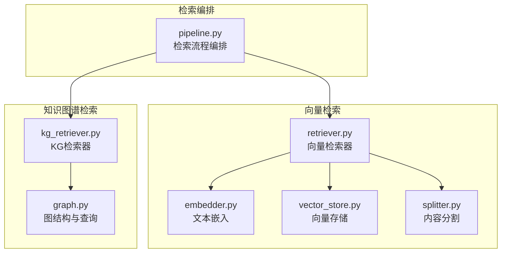
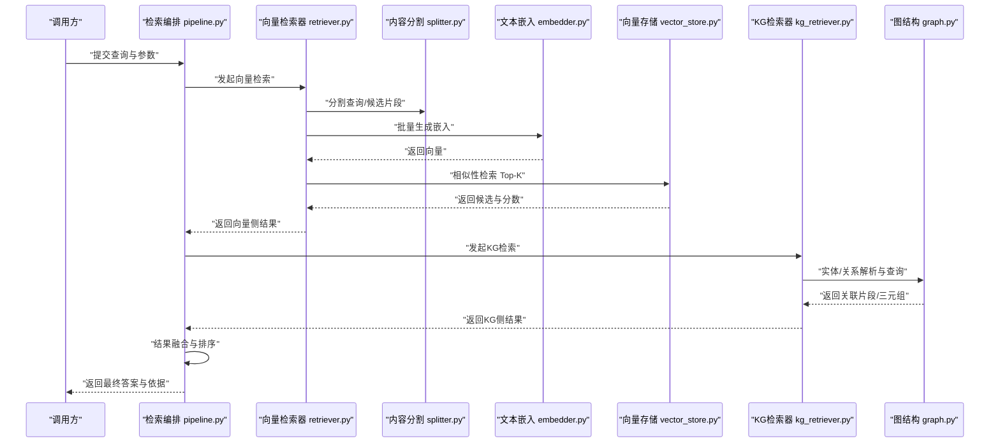
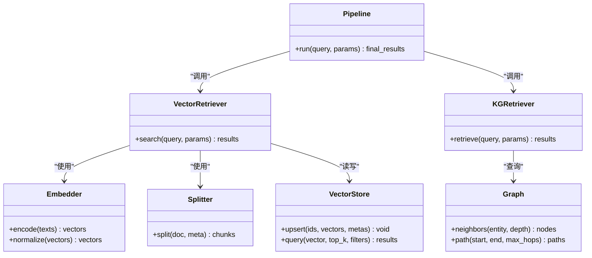
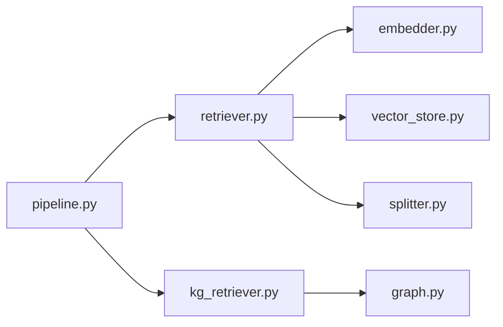

# 混合检索增强

<cite>
**本文引用的文件**   
- [src/kag_pro/core/retriever.py](file://src/kag_pro/core/retriever.py)
- [src/kag_pro/core/embedder.py](file://src/kag_pro/core/embedder.py)
- [src/kag_pro/core/vector_store.py](file://src/kag_pro/core/vector_store.py)
- [src/kag_pro/core/splitter.py](file://src/kag_pro/core/splitter.py)
- [src/kag_pro/kg/kg_retriever.py](file://src/kag_pro/kg/kg_retriever.py)
- [src/kag_pro/kg/graph.py](file://src/kag_pro/kg/graph.py)
- [src/kag_pro/core/pipeline.py](file://src/kag_pro/core/pipeline.py)
- [tests/test_retriever.py](file://tests/test_retriever.py)
</cite>

## 目录
1. [简介](#简介)
2. [项目结构](#项目结构)
3. [核心组件](#核心组件)
4. [架构总览](#架构总览)
5. [详细组件分析](#详细组件分析)
6. [依赖关系分析](#依赖关系分析)
7. [性能与优化](#性能与优化)
8. [故障排查指南](#故障排查指南)
9. [结论](#结论)
10. [附录](#附录)

## 简介
本文件面向KAG-Pro平台的“混合检索增强”能力，系统性阐述如何结合向量相似度搜索与知识图谱关联检索，构建高准确、低延迟的检索系统。文档覆盖以下关键主题：
- 文本嵌入与向量存储：模型选择、索引策略、批量写入与查询
- 内容分割：切分粒度、元数据保留、边界处理
- 混合检索策略：双路召回、结果融合与排序算法
- 检索器实现原理：接口设计、参数调优、缓存机制
- 性能优化：吞吐、时延、内存占用与并发控制
- 实践案例：典型应用场景与最佳实践

## 项目结构
围绕混合检索增强的核心代码主要分布在以下模块：
- 检索编排与入口：core/pipeline.py
- 向量检索：core/retriever.py、core/embedder.py、core/vector_store.py、core/splitter.py
- 知识图谱检索：kg/kg_retriever.py、kg/graph.py
- 测试验证：tests/test_retriever.py

图表来源
- [src/kag_pro/core/pipeline.py](file://src/kag_pro/core/pipeline.py)
- [src/kag_pro/core/retriever.py](file://src/kag_pro/core/retriever.py)
- [src/kag_pro/core/embedder.py](file://src/kag_pro/core/embedder.py)
- [src/kag_pro/core/vector_store.py](file://src/kag_pro/core/vector_store.py)
- [src/kag_pro/core/splitter.py](file://src/kag_pro/core/splitter.py)
- [src/kag_pro/kg/kg_retriever.py](file://src/kag_pro/kg/kg_retriever.py)
- [src/kag_pro/kg/graph.py](file://src/kag_pro/kg/graph.py)

章节来源
- [src/kag_pro/core/pipeline.py](file://src/kag_pro/core/pipeline.py)
- [src/kag_pro/core/retriever.py](file://src/kag_pro/core/retriever.py)
- [src/kag_pro/kg/kg_retriever.py](file://src/kag_pro/kg/kg_retriever.py)

## 核心组件
- 文本嵌入（Embedder）
  - 负责将原始文本转换为稠密向量，支持批量编码与可选归一化
  - 可配置模型名称、设备、批大小等参数
- 向量存储（VectorStore）
  - 提供向量的写入、更新、删除与相似性检索接口
  - 支持索引参数、过滤条件与分页返回
- 内容分割（Splitter）
  - 按语义或固定长度对长文本进行分段，保留必要元数据
  - 支持重叠窗口、最小段落长度与边界合并策略
- 向量检索器（Retriever）
  - 封装“分割→嵌入→索引/查询”的完整链路
  - 支持Top-K、阈值过滤、去重与结果格式化
- 知识图谱检索器（KG Retriever）
  - 基于实体识别与关系抽取，执行路径/邻居/子图检索
  - 支持多跳扩展、关系权重与结果裁剪
- 检索编排（Pipeline）
  - 统一调度向量检索与KG检索，执行结果融合与排序
  - 提供缓存、重试与指标统计

章节来源
- [src/kag_pro/core/embedder.py](file://src/kag_pro/core/embedder.py)
- [src/kag_pro/core/vector_store.py](file://src/kag_pro/core/vector_store.py)
- [src/kag_pro/core/splitter.py](file://src/kag_pro/core/splitter.py)
- [src/kag_pro/core/retriever.py](file://src/kag_pro/core/retriever.py)
- [src/kag_pro/kg/kg_retriever.py](file://src/kag_pro/kg/kg_retriever.py)
- [src/kag_pro/core/pipeline.py](file://src/kag_pro/core/pipeline.py)

## 架构总览
下图展示从用户查询到最终结果的端到端流程，包括双路召回、融合排序与缓存命中路径。

图表来源
- [src/kag_pro/core/pipeline.py](file://src/kag_pro/core/pipeline.py)
- [src/kag_pro/core/retriever.py](file://src/kag_pro/core/retriever.py)
- [src/kag_pro/core/splitter.py](file://src/kag_pro/core/splitter.py)
- [src/kag_pro/core/embedder.py](file://src/kag_pro/core/embedder.py)
- [src/kag_pro/core/vector_store.py](file://src/kag_pro/core/vector_store.py)
- [src/kag_pro/kg/kg_retriever.py](file://src/kag_pro/kg/kg_retriever.py)
- [src/kag_pro/kg/graph.py](file://src/kag_pro/kg/graph.py)

## 详细组件分析

### 文本嵌入（Embedder）
- 职责
  - 将自然语言文本映射为固定维度的稠密向量
  - 支持批量推理以提升吞吐
- 关键要点
  - 模型选择：优先选择中文能力强、维度稳定、推理速度快的开源模型
  - 归一化：对向量做L2归一化便于余弦相似度计算
  - 批大小与设备：根据GPU/CPU资源调整批大小与设备分配
- 复杂度
  - 时间复杂度：O(N·D)，N为批次大小，D为向量维度
  - 空间复杂度：O(N·D)用于缓存批次向量
- 建议
  - 对高频查询启用查询向量缓存
  - 对静态语料预计算并持久化嵌入，减少在线开销

章节来源
- [src/kag_pro/core/embedder.py](file://src/kag_pro/core/embedder.py)

### 内容分割（Splitter）
- 职责
  - 将长文档切分为适合检索的片段，兼顾上下文完整性与检索精度
- 关键要点
  - 切分策略：固定长度、语义边界、层级结构（标题/段落）
  - 重叠窗口：避免跨段信息丢失
  - 元数据保留：来源、位置、父级ID等
- 复杂度
  - 时间复杂度：O(L)，L为文本长度
  - 空间复杂度：O(S)，S为生成的片段数量
- 建议
  - 针对教育类文本采用“小节+段落”两级切分
  - 设置最小片段长度，避免碎片化导致噪声

章节来源
- [src/kag_pro/core/splitter.py](file://src/kag_pro/core/splitter.py)

### 向量存储（VectorStore）
- 职责
  - 提供向量的增删改查与近似最近邻检索
- 关键要点
  - 索引类型：HNSW/IVF/PQ等，权衡召回率与延迟
  - 过滤条件：按来源、标签、时间等维度筛选
  - 批量写入：提高入库效率，降低锁竞争
- 复杂度
  - 写入：O(B·logM)（B为批次，M为库规模）
  - 查询：O(logM + K·d)，K为Top-K，d为距离计算代价
- 建议
  - 大规模场景使用分区索引与异步写入
  - 定期重建索引以平衡新鲜度与稳定性

章节来源
- [src/kag_pro/core/vector_store.py](file://src/kag_pro/core/vector_store.py)

### 向量检索器（Retriever）
- 职责
  - 串联“分割→嵌入→检索”，输出带分数与元数据的候选集
- 关键要点
  - 参数：Top-K、相似度阈值、去重策略、结果截断
  - 容错：网络异常、空结果、超时重试
  - 缓存：查询向量与热门片段缓存
- 复杂度
  - 整体：受限于嵌入与向量检索的瓶颈
- 建议
  - 对短查询优先使用短语匹配作为粗筛
  - 动态Top-K：按置信度自适应调整

章节来源
- [src/kag_pro/core/retriever.py](file://src/kag_pro/core/retriever.py)

### 知识图谱检索器（KG Retriever）
- 职责
  - 基于实体与关系进行精确匹配与多跳推理
- 关键要点
  - 实体链接：消歧与同义词扩展
  - 关系路径：限制最大跳数与边权重
  - 结果裁剪：仅返回与查询强相关的子图
- 复杂度
  - 查询：O(E·k)，E为相关边数，k为跳数
- 建议
  - 热点实体预取邻居表
  - 对复杂查询拆分为多个简单子查询并行执行

章节来源
- [src/kag_pro/kg/kg_retriever.py](file://src/kag_pro/kg/kg_retriever.py)
- [src/kag_pro/kg/graph.py](file://src/kag_pro/kg/graph.py)

### 检索编排（Pipeline）
- 职责
  - 统一调度向量检索与KG检索，执行结果融合与排序
- 关键要点
  - 融合策略：加权打分、去重、多样性打散
  - 排序函数：综合相似度、相关性、权威性与时效性
  - 缓存层：查询级与片段级缓存，TTL与失效策略
- 复杂度
  - 融合排序：O((Nv+Nk)·log(Nv+Nk))
- 建议
  - 分层融合：先粗排再精排
  - 可观测性：记录各阶段耗时与命中率

章节来源
- [src/kag_pro/core/pipeline.py](file://src/kag_pro/core/pipeline.py)

### 类关系图（代码级）

图表来源
- [src/kag_pro/core/embedder.py](file://src/kag_pro/core/embedder.py)
- [src/kag_pro/core/splitter.py](file://src/kag_pro/core/splitter.py)
- [src/kag_pro/core/vector_store.py](file://src/kag_pro/core/vector_store.py)
- [src/kag_pro/core/retriever.py](file://src/kag_pro/core/retriever.py)
- [src/kag_pro/kg/graph.py](file://src/kag_pro/kg/graph.py)
- [src/kag_pro/kg/kg_retriever.py](file://src/kag_pro/kg/kg_retriever.py)
- [src/kag_pro/core/pipeline.py](file://src/kag_pro/core/pipeline.py)

## 依赖关系分析
- 内聚与耦合
  - 检索器对内嵌与向量存储有直接依赖，但通过接口隔离，易于替换实现
  - 编排层聚合两类检索器，保持单一职责
- 外部依赖
  - 嵌入模型：需保证版本稳定与API兼容
  - 向量数据库：关注索引参数与连接池配置
  - 图数据库：注意查询超时与连接复用
- 潜在循环依赖
  - 当前结构无循环导入风险；若新增跨模块回调需谨慎

图表来源
- [src/kag_pro/core/pipeline.py](file://src/kag_pro/core/pipeline.py)
- [src/kag_pro/core/retriever.py](file://src/kag_pro/core/retriever.py)
- [src/kag_pro/core/embedder.py](file://src/kag_pro/core/embedder.py)
- [src/kag_pro/core/vector_store.py](file://src/kag_pro/core/vector_store.py)
- [src/kag_pro/core/splitter.py](file://src/kag_pro/core/splitter.py)
- [src/kag_pro/kg/kg_retriever.py](file://src/kag_pro/kg/kg_retriever.py)
- [src/kag_pro/kg/graph.py](file://src/kag_pro/kg/graph.py)

章节来源
- [src/kag_pro/core/pipeline.py](file://src/kag_pro/core/pipeline.py)
- [src/kag_pro/core/retriever.py](file://src/kag_pro/core/retriever.py)
- [src/kag_pro/kg/kg_retriever.py](file://src/kag_pro/kg/kg_retriever.py)

## 性能与优化
- 嵌入与索引
  - 批量编码：增大批大小以降低平均时延
  - 预计算：离线生成并持久化嵌入，上线只读
  - 索引参数：在召回率与延迟间折中，定期评估
- 检索与缓存
  - 查询向量缓存：相同查询直接命中
  - 片段缓存：热门片段结果缓存，设置合理TTL
  - 去重与剪枝：减少下游排序压力
- 并发与资源
  - 线程/进程池：控制并发度避免过载
  - 连接池：向量库与图数据库复用连接
- 监控与回归
  - 关键指标：P95/P99时延、召回率、准确率、缓存命中率
  - A/B实验：对比不同融合权重与Top-K策略

[本节为通用指导，不直接分析具体文件]

## 故障排查指南
- 常见问题
  - 嵌入失败：检查模型加载、输入编码与设备内存
  - 向量库连接异常：检查网络、认证与索引状态
  - KG查询超时：限制跳数、增加超时与重试策略
  - 结果为空：放宽阈值、扩大Top-K或优化分割粒度
- 定位方法
  - 打印各阶段耗时与中间结果摘要
  - 开启调试日志，记录查询哈希与命中缓存键
  - 使用单元测试复现问题

章节来源
- [tests/test_retriever.py](file://tests/test_retriever.py)

## 结论
通过将向量相似度检索与知识图谱关联检索有机结合，KAG-Pro平台能够在复杂教育场景中实现高准确、低延迟的检索增强。关键在于：
- 合理的文本分割与高质量嵌入
- 高效的向量索引与稳定的图查询
- 稳健的融合排序与完善的缓存体系
- 持续的指标监控与策略调优

[本节为总结性内容，不直接分析具体文件]

## 附录
- 术语
  - 向量相似度：常用余弦相似度衡量
  - Top-K：返回最相似的K个片段
  - TTL：缓存存活时间
- 参考实现路径
  - 检索器主流程：[src/kag_pro/core/retriever.py](file://src/kag_pro/core/retriever.py)
  - 嵌入实现：[src/kag_pro/core/embedder.py](file://src/kag_pro/core/embedder.py)
  - 向量存储：[src/kag_pro/core/vector_store.py](file://src/kag_pro/core/vector_store.py)
  - 内容分割：[src/kag_pro/core/splitter.py](file://src/kag_pro/core/splitter.py)
  - KG检索：[src/kag_pro/kg/kg_retriever.py](file://src/kag_pro/kg/kg_retriever.py)、[src/kag_pro/kg/graph.py](file://src/kag_pro/kg/graph.py)
  - 编排与融合：[src/kag_pro/core/pipeline.py](file://src/kag_pro/core/pipeline.py)
  - 测试用例：[tests/test_retriever.py](file://tests/test_retriever.py)