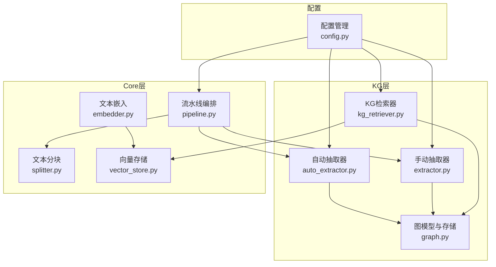
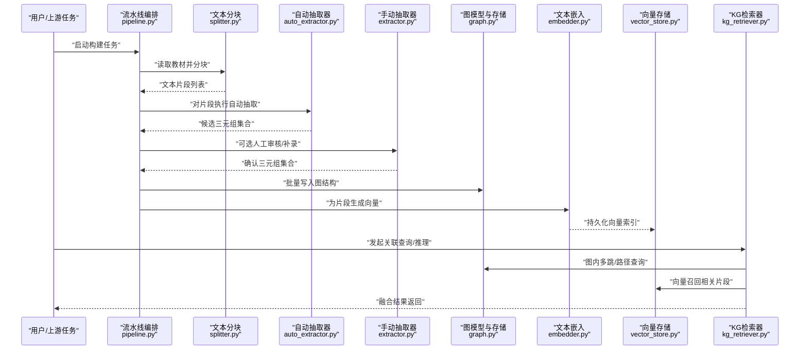
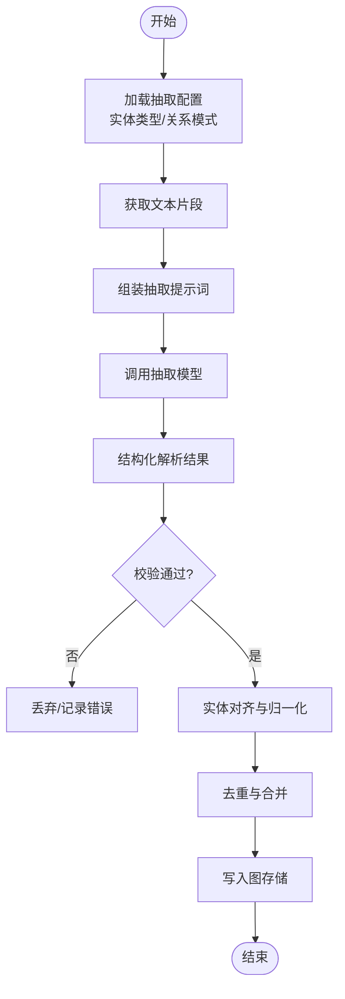
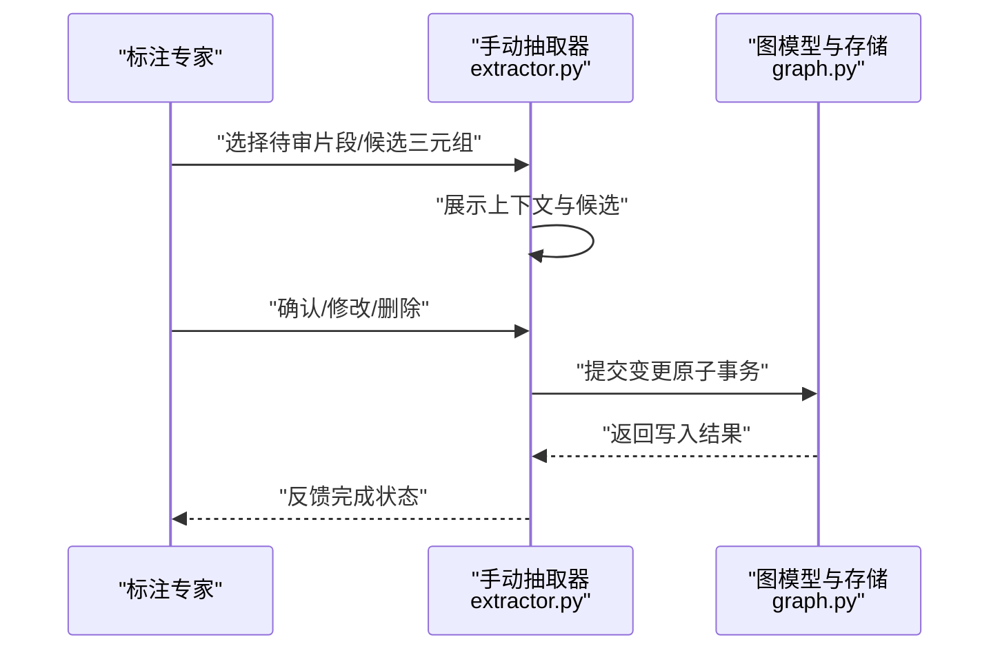
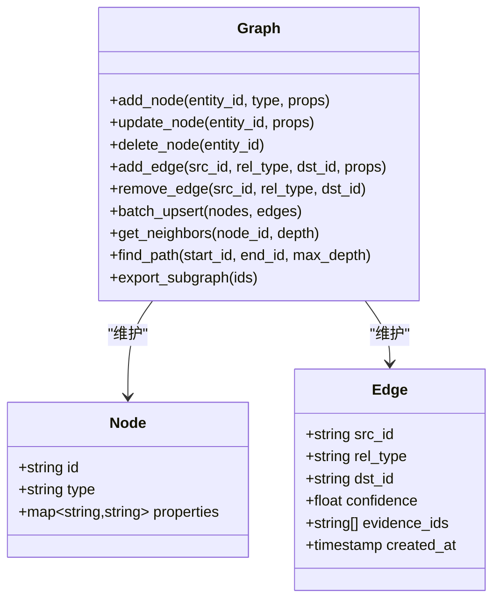
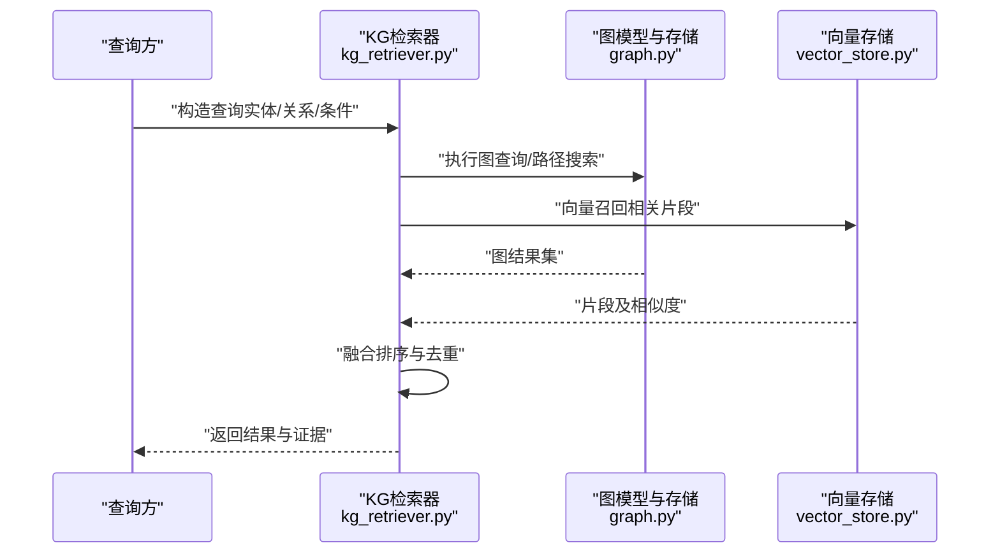
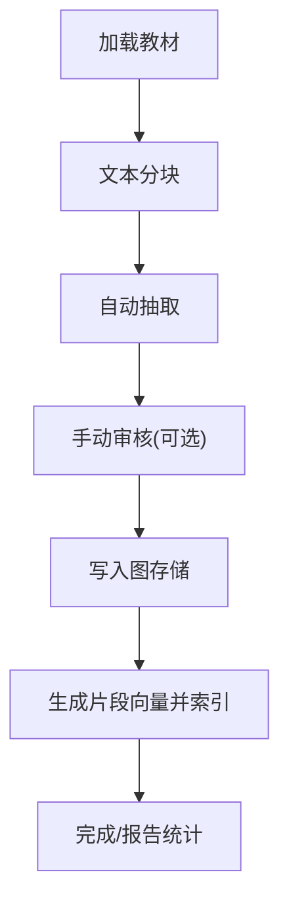
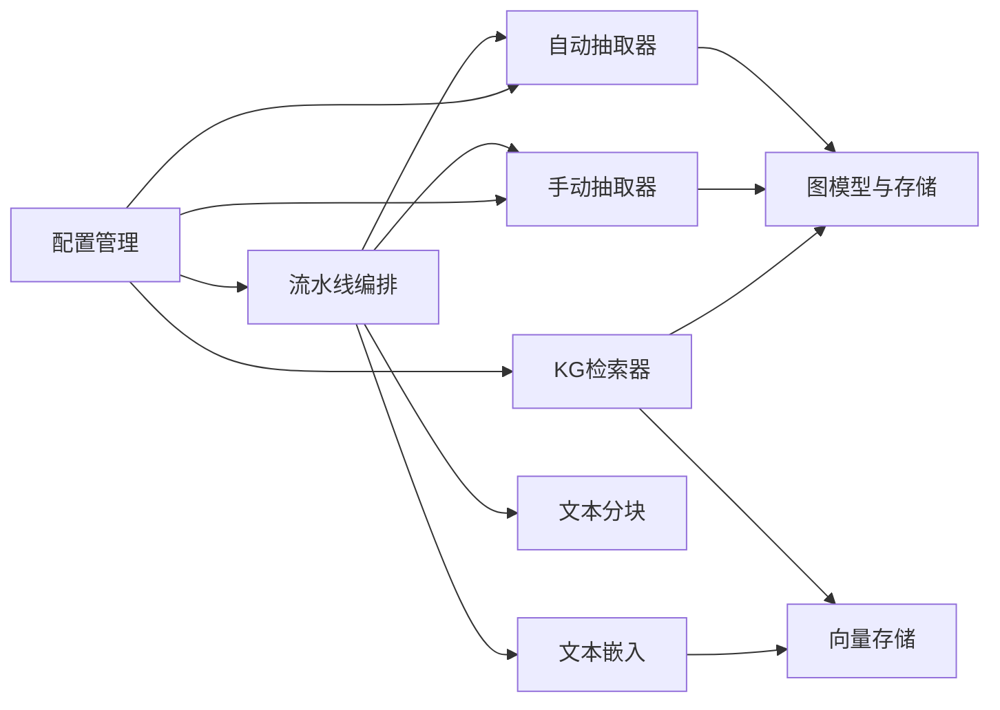

# 知识图谱构建

<cite>
**本文引用的文件**   
- [src/kag_pro/kg/auto_extractor.py](file://src/kag_pro/kg/auto_extractor.py)
- [src/kag_pro/kg/extractor.py](file://src/kag_pro/kg/extractor.py)
- [src/kag_pro/kg/graph.py](file://src/kag_pro/kg/graph.py)
- [src/kag_pro/kg/kg_retriever.py](file://src/kag_pro/kg/kg_retriever.py)
- [src/kag_pro/core/pipeline.py](file://src/kag_pro/core/pipeline.py)
- [src/kag_pro/core/splitter.py](file://src/kag_pro/core/splitter.py)
- [src/kag_pro/core/embedder.py](file://src/kag_pro/core/embedder.py)
- [src/kag_pro/core/vector_store.py](file://src/kag_pro/core/vector_store.py)
- [src/kag_pro/utils/config.py](file://src/kag_pro/utils/config.py)
- [README.md](file://README.md)
</cite>

## 目录
1. [简介](#简介)
2. [项目结构](#项目结构)
3. [核心组件](#核心组件)
4. [架构总览](#架构总览)
5. [详细组件分析](#详细组件分析)
6. [依赖关系分析](#依赖关系分析)
7. [性能考虑](#性能考虑)
8. [故障排查指南](#故障排查指南)
9. [结论](#结论)
10. [附录](#附录)

## 简介
本文件面向KAG-Pro平台的知识图谱构建能力，系统阐述从教材文本中自动抽取实体与关系、存储为图结构、并支持可视化与关联查询的完整流程。文档覆盖：
- 文本预处理、分块策略
- 自动抽取器与手动抽取器的实现原理
- 图数据结构设计与存储
- 查询与推理路径
- 配置项、实体类型与关系模式设计
- 可视化与检索集成方式
- 性能优化与排错建议

## 项目结构
围绕知识图谱构建的核心代码位于 src/kag_pro/kg 目录，并与 core 层的流水线、分块、嵌入与向量存储模块协同工作；utils.config 提供全局配置入口。

图表来源
- [src/kag_pro/kg/auto_extractor.py](file://src/kag_pro/kg/auto_extractor.py)
- [src/kag_pro/kg/extractor.py](file://src/kag_pro/kg/extractor.py)
- [src/kag_pro/kg/graph.py](file://src/kag_pro/kg/graph.py)
- [src/kag_pro/kg/kg_retriever.py](file://src/kag_pro/kg/kg_retriever.py)
- [src/kag_pro/core/pipeline.py](file://src/kag_pro/core/pipeline.py)
- [src/kag_pro/core/splitter.py](file://src/kag_pro/core/splitter.py)
- [src/kag_pro/core/embedder.py](file://src/kag_pro/core/embedder.py)
- [src/kag_pro/core/vector_store.py](file://src/kag_pro/core/vector_store.py)
- [src/kag_pro/utils/config.py](file://src/kag_pro/utils/config.py)

章节来源
- [README.md](file://README.md)

## 核心组件
- 自动抽取器：基于LLM或规则模板，从文本片段中识别实体与关系三元组，并进行去重与规范化。
- 手动抽取器：提供交互式或批处理式的人工标注接口，用于补充、修正自动抽取结果。
- 图模型与存储：维护节点（实体）与边（关系）的增删改查，支持批量写入、冲突合并与索引。
- KG检索器：在图上执行多跳查询、路径发现、子图提取，并可结合向量检索进行混合召回。
- 流水线编排：将“加载→分块→抽取→入库→索引”串联为可配置的执行流。
- 文本分块：按语义段落或固定长度切分，保证上下文窗口与抽取质量。
- 文本嵌入与向量存储：对文本片段生成向量并持久化，支撑相似片段召回与溯源。
- 配置管理：集中管理抽取器参数、图存储后端、索引策略等。

章节来源
- [src/kag_pro/kg/auto_extractor.py](file://src/kag_pro/kg/auto_extractor.py)
- [src/kag_pro/kg/extractor.py](file://src/kag_pro/kg/extractor.py)
- [src/kag_pro/kg/graph.py](file://src/kag_pro/kg/graph.py)
- [src/kag_pro/kg/kg_retriever.py](file://src/kag_pro/kg/kg_retriever.py)
- [src/kag_pro/core/pipeline.py](file://src/kag_pro/core/pipeline.py)
- [src/kag_pro/core/splitter.py](file://src/kag_pro/core/splitter.py)
- [src/kag_pro/core/embedder.py](file://src/kag_pro/core/embedder.py)
- [src/kag_pro/core/vector_store.py](file://src/kag_pro/core/vector_store.py)
- [src/kag_pro/utils/config.py](file://src/kag_pro/utils/config.py)

## 架构总览
下图展示从教材文本到知识图谱的端到端数据流，以及查询时的双向融合（图+向量）。

图表来源
- [src/kag_pro/core/pipeline.py](file://src/kag_pro/core/pipeline.py)
- [src/kag_pro/core/splitter.py](file://src/kag_pro/core/splitter.py)
- [src/kag_pro/kg/auto_extractor.py](file://src/kag_pro/kg/auto_extractor.py)
- [src/kag_pro/kg/extractor.py](file://src/kag_pro/kg/extractor.py)
- [src/kag_pro/kg/graph.py](file://src/kag_pro/kg/graph.py)
- [src/kag_pro/core/embedder.py](file://src/kag_pro/core/embedder.py)
- [src/kag_pro/core/vector_store.py](file://src/kag_pro/core/vector_store.py)
- [src/kag_pro/kg/kg_retriever.py](file://src/kag_pro/kg/kg_retriever.py)

## 详细组件分析

### 自动抽取器（Auto Extractor）
职责与流程
- 输入：文本片段（由分块器产出）
- 输出：标准化三元组（头实体、关系、尾实体），附带置信度与来源片段ID
- 关键步骤：
  - 提示词/模板组装：根据实体类型与关系模式动态构造抽取指令
  - LLM调用与解析：结构化解析返回结果，校验类型与约束
  - 后处理：实体对齐、同义词归一、重复三元组去重
  - 增量更新：仅写入新增/变更三元组，降低写放大

图表来源
- [src/kag_pro/kg/auto_extractor.py](file://src/kag_pro/kg/auto_extractor.py)
- [src/kag_pro/utils/config.py](file://src/kag_pro/utils/config.py)

章节来源
- [src/kag_pro/kg/auto_extractor.py](file://src/kag_pro/kg/auto_extractor.py)
- [src/kag_pro/utils/config.py](file://src/kag_pro/utils/config.py)

### 手动抽取器（Manual Extractor）
职责与流程
- 提供界面或脚本，供专家对自动抽取结果进行审核、修正与补充
- 支持批量导入导出、版本对比与审计日志
- 与自动抽取器共享同一图存储接口，确保一致性

图表来源
- [src/kag_pro/kg/extractor.py](file://src/kag_pro/kg/extractor.py)
- [src/kag_pro/kg/graph.py](file://src/kag_pro/kg/graph.py)

章节来源
- [src/kag_pro/kg/extractor.py](file://src/kag_pro/kg/extractor.py)
- [src/kag_pro/kg/graph.py](file://src/kag_pro/kg/graph.py)

### 图模型与存储（Graph Model & Storage）
设计要点
- 节点（实体）：唯一标识、类型、属性（名称、别名、描述、来源等）
- 边（关系）：关系类型、方向、权重/置信度、证据片段ID、时间戳
- 操作：批量插入、冲突合并（同名实体合并）、删除级联、事务回滚
- 索引：实体名倒排、关系类型索引、属性过滤索引

图表来源
- [src/kag_pro/kg/graph.py](file://src/kag_pro/kg/graph.py)

章节来源
- [src/kag_pro/kg/graph.py](file://src/kag_pro/kg/graph.py)

### KG检索器（KG Retriever）
功能
- 图内查询：按实体/关系/属性过滤，多跳邻居、最短路径、子图导出
- 混合检索：结合向量召回的相关片段，增强答案溯源与解释性
- 推理辅助：基于关系组合的规则推理（如传递性、对称性）

图表来源
- [src/kag_pro/kg/kg_retriever.py](file://src/kag_pro/kg/kg_retriever.py)
- [src/kag_pro/kg/graph.py](file://src/kag_pro/kg/graph.py)
- [src/kag_pro/core/vector_store.py](file://src/kag_pro/core/vector_store.py)

章节来源
- [src/kag_pro/kg/kg_retriever.py](file://src/kag_pro/kg/kg_retriever.py)
- [src/kag_pro/core/vector_store.py](file://src/kag_pro/core/vector_store.py)

### 流水线编排（Pipeline）
职责
- 串联“加载→分块→抽取→入库→索引”各阶段
- 支持断点续跑、并发控制、重试与监控指标上报
- 统一异常捕获与失败告警

图表来源
- [src/kag_pro/core/pipeline.py](file://src/kag_pro/core/pipeline.py)
- [src/kag_pro/core/splitter.py](file://src/kag_pro/core/splitter.py)
- [src/kag_pro/kg/auto_extractor.py](file://src/kag_pro/kg/auto_extractor.py)
- [src/kag_pro/kg/extractor.py](file://src/kag_pro/kg/extractor.py)
- [src/kag_pro/kg/graph.py](file://src/kag_pro/kg/graph.py)
- [src/kag_pro/core/embedder.py](file://src/kag_pro/core/embedder.py)
- [src/kag_pro/core/vector_store.py](file://src/kag_pro/core/vector_store.py)

章节来源
- [src/kag_pro/core/pipeline.py](file://src/kag_pro/core/pipeline.py)
- [src/kag_pro/core/splitter.py](file://src/kag_pro/core/splitter.py)

### 文本分块（Splitter）
策略
- 按段落/标题层级切分，保持语义完整性
- 滑动窗口重叠，避免跨段边界丢失关系
- 可配置最大长度与最小长度阈值

章节来源
- [src/kag_pro/core/splitter.py](file://src/kag_pro/core/splitter.py)

### 文本嵌入与向量存储（Embedder & Vector Store）
作用
- 将文本片段映射为稠密向量，用于相似片段召回
- 提供高维索引、近似最近邻搜索与元数据过滤

章节来源
- [src/kag_pro/core/embedder.py](file://src/kag_pro/core/embedder.py)
- [src/kag_pro/core/vector_store.py](file://src/kag_pro/core/vector_store.py)

### 配置管理（Config）
内容
- 抽取器参数：模型、温度、Top-K、超时、重试次数
- 实体类型与关系模式：枚举定义、约束规则
- 图存储后端：连接信息、批量大小、索引开关
- 向量检索：维度、距离度量、召回数量

章节来源
- [src/kag_pro/utils/config.py](file://src/kag_pro/utils/config.py)

## 依赖关系分析
- 低耦合：抽取器与图存储通过统一接口交互，便于替换实现
- 可插拔：抽取器可切换不同模型或规则引擎
- 可扩展：检索器可同时接入多种图数据库与向量库

图表来源
- [src/kag_pro/kg/auto_extractor.py](file://src/kag_pro/kg/auto_extractor.py)
- [src/kag_pro/kg/extractor.py](file://src/kag_pro/kg/extractor.py)
- [src/kag_pro/kg/graph.py](file://src/kag_pro/kg/graph.py)
- [src/kag_pro/kg/kg_retriever.py](file://src/kag_pro/kg/kg_retriever.py)
- [src/kag_pro/core/pipeline.py](file://src/kag_pro/core/pipeline.py)
- [src/kag_pro/core/splitter.py](file://src/kag_pro/core/splitter.py)
- [src/kag_pro/core/embedder.py](file://src/kag_pro/core/embedder.py)
- [src/kag_pro/core/vector_store.py](file://src/kag_pro/core/vector_store.py)
- [src/kag_pro/utils/config.py](file://src/kag_pro/utils/config.py)

章节来源
- [src/kag_pro/kg/auto_extractor.py](file://src/kag_pro/kg/auto_extractor.py)
- [src/kag_pro/kg/extractor.py](file://src/kag_pro/kg/extractor.py)
- [src/kag_pro/kg/graph.py](file://src/kag_pro/kg/graph.py)
- [src/kag_pro/kg/kg_retriever.py](file://src/kag_pro/kg/kg_retriever.py)
- [src/kag_pro/core/pipeline.py](file://src/kag_pro/core/pipeline.py)
- [src/kag_pro/core/splitter.py](file://src/kag_pro/core/splitter.py)
- [src/kag_pro/core/embedder.py](file://src/kag_pro/core/embedder.py)
- [src/kag_pro/core/vector_store.py](file://src/kag_pro/core/vector_store.py)
- [src/kag_pro/utils/config.py](file://src/kag_pro/utils/config.py)

## 性能考虑
- 抽取阶段
  - 批量调用与并行请求，限制并发上限以避免限流
  - 缓存已处理的片段哈希，避免重复抽取
  - 使用轻量提示词与结构化输出格式，减少解析开销
- 图写入
  - 批量Upsert与事务合并，减少网络往返
  - 实体对齐时采用前缀树/字典加速匹配
- 索引与检索
  - 为高频实体名与关系类型建立倒排索引
  - 向量检索开启近似最近邻与预取策略
  - 查询结果分页与裁剪，避免一次性返回过大子图
- 资源与容错
  - 设置超时与重试退避，失败片段进入死信队列
  - 监控吞吐、延迟与错误率，动态调整批次大小

[本节为通用指导，不直接分析具体文件]

## 故障排查指南
常见问题与定位思路
- 抽取结果为空或大量错误
  - 检查提示词模板与实体/关系模式配置
  - 查看抽取器日志中的解析失败记录
  - 验证模型可用性、密钥与配额
- 图写入冲突或重复
  - 核对实体ID生成策略与归一化规则
  - 启用去重与合并逻辑，检查幂等键
- 检索结果不准确
  - 调整向量召回Top-K与相似度阈值
  - 增加证据片段权重，优化融合排序策略
- 流水线中断
  - 检查分块尺寸是否过大导致上下文溢出
  - 查看断点续跑状态与重试计数

章节来源
- [src/kag_pro/kg/auto_extractor.py](file://src/kag_pro/kg/auto_extractor.py)
- [src/kag_pro/kg/graph.py](file://src/kag_pro/kg/graph.py)
- [src/kag_pro/kg/kg_retriever.py](file://src/kag_pro/kg/kg_retriever.py)
- [src/kag_pro/core/pipeline.py](file://src/kag_pro/core/pipeline.py)
- [src/kag_pro/core/splitter.py](file://src/kag_pro/core/splitter.py)
- [src/kag_pro/core/embedder.py](file://src/kag_pro/core/embedder.py)
- [src/kag_pro/core/vector_store.py](file://src/kag_pro/core/vector_store.py)
- [src/kag_pro/utils/config.py](file://src/kag_pro/utils/config.py)

## 结论
KAG-Pro的知识图谱构建以“分块→抽取→入库→索引→检索”为主线，自动抽取器与手动抽取器互补，图结构与向量检索协同提升问答与推理效果。通过合理的配置、实体/关系模式设计与查询优化，可在大规模教材场景下稳定高效地构建高质量知识图谱。

[本节为总结性内容，不直接分析具体文件]

## 附录

### 构建配置清单（示例字段）
- 抽取器
  - 模型名称/版本、温度、Top-K、超时秒数、重试次数
  - 提示词模板路径、结构化输出格式
- 实体类型与关系模式
  - 实体类型枚举、必填属性、别名映射
  - 关系类型枚举、方向性、约束规则（一对一/一对多）
- 图存储
  - 后端类型、连接参数、批量写入大小、索引开关
- 向量检索
  - 向量维度、距离度量、召回数量、过滤条件

章节来源
- [src/kag_pro/utils/config.py](file://src/kag_pro/utils/config.py)

### 实体类型与关系模式设计建议
- 实体类型
  - 概念、公式、定理、例题、实验、人物、机构、地点等
  - 每个类型定义必要属性（名称、别名、描述、来源片段ID）
- 关系模式
  - 属于/包含、定义于、应用于、依赖于、等价于、反例于等
  - 为每条关系保留证据片段ID与置信度，便于溯源与评估

章节来源
- [src/kag_pro/kg/graph.py](file://src/kag_pro/kg/graph.py)
- [src/kag_pro/kg/auto_extractor.py](file://src/kag_pro/kg/auto_extractor.py)

### 可视化与关联查询用法
- 可视化
  - 导出子图（节点/边/属性）为前端渲染所需格式
  - 支持按类型着色、按关系粗细表示权重
- 关联查询
  - 单跳/多跳邻居、最短路径、路径枚举
  - 条件过滤（实体类型、关系类型、属性范围）
- 推理
  - 基于关系组合的规则推导（如传递性）
  - 与向量召回融合，增强解释性与可追溯性

章节来源
- [src/kag_pro/kg/kg_retriever.py](file://src/kag_pro/kg/kg_retriever.py)
- [src/kag_pro/kg/graph.py](file://src/kag_pro/kg/graph.py)