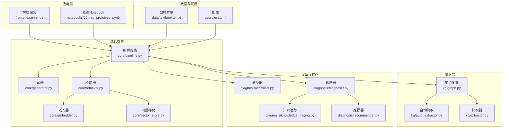
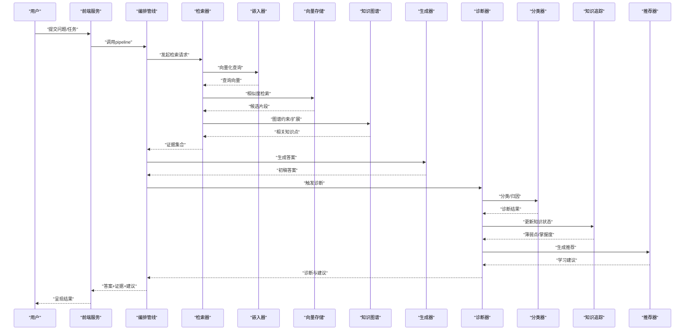
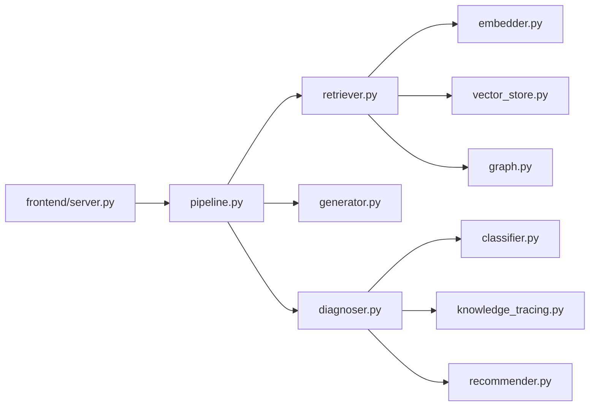

# 项目介绍与背景

<cite>
**本文引用的文件**   
- [README.md](file://README.md)
- [pyproject.toml](file://pyproject.toml)
- [src/kag_pro/core/pipeline.py](file://src/kag_pro/core/pipeline.py)
- [src/kag_pro/core/generator.py](file://src/kag_pro/core/generator.py)
- [src/kag_pro/core/retriever.py](file://src/kag_pro/core/retriever.py)
- [src/kag_pro/core/embedder.py](file://src/kag_pro/core/embedder.py)
- [src/kag_pro/core/vector_store.py](file://src/kag_pro/core/vector_store.py)
- [src/kag_pro/kg/graph.py](file://src/kag_pro/kg/graph.py)
- [src/kag_pro/kg/auto_extractor.py](file://src/kag_pro/kg/auto_extractor.py)
- [src/kag_pro/kg/extractor.py](file://src/kag_pro/kg/extractor.py)
- [src/kag_pro/diagnosis/classifier.py](file://src/kag_pro/diagnosis/classifier.py)
- [src/kag_pro/diagnosis/diagnoser.py](file://src/kag_pro/diagnosis/diagnoser.py)
- [src/kag_pro/diagnosis/knowledge_tracing.py](file://src/kag_pro/diagnosis/knowledge_tracing.py)
- [src/kag_pro/diagnosis/recommender.py](file://src/kag_pro/diagnosis/recommender.py)
- [src/kag_pro/data/textbooks/01_分数初步.txt](file://data/textbooks/01_分数初步.txt)
- [frontend/server.py](file://frontend/server.py)
- [notebooks/00_rag_prototype.ipynb](file://notebooks/00_rag_prototype.ipynb)
</cite>

## 目录
1. [引言](#引言)
2. [项目结构](#项目结构)
3. [核心组件](#核心组件)
4. [架构总览](#架构总览)
5. [详细组件分析](#详细组件分析)
6. [依赖关系分析](#依赖关系分析)
7. [性能考量](#性能考量)
8. [故障排查指南](#故障排查指南)
9. [结论](#结论)
10. [附录](#附录)

## 引言
KAG-Pro教育AI平台以“知识增强生成”（Knowledge-Augmented Generation，简称KAG）为核心技术路线，面向基础教育与高等教育场景，提供从教材内容理解、知识抽取、检索增强到个性化诊断与推荐的一体化能力。与传统基于纯文本的问答或生成系统相比，KAG通过引入结构化知识图谱与向量检索，显著降低幻觉风险、提升答案的可解释性与可追溯性，从而在教育场景中实现更可靠、可评估、可迭代的智能教学辅助。

传统教育技术的局限性主要体现在：
- 内容静态化：教材与题库更新滞后，难以快速响应课程变化与学情差异。
- 个性化不足：缺乏对学习者知识状态的持续建模与动态干预。
- 可解释性弱：黑盒模型难以给出学习路径与错误归因，不利于教师与学生复盘。
- 评测困难：缺少统一的知识对齐与证据链支撑，质量评估成本高。

KAG在教育领域的创新价值在于：
- 将“知识”作为一等公民：用知识图谱组织概念、规则与关系，使生成过程具备事实约束与溯源能力。
- 检索增强生成：在回答前检索相关片段与知识点，结合大模型进行推理与表达，兼顾准确性与可读性。
- 诊断与推荐闭环：基于知识追踪与分类器识别薄弱点，自动推荐练习与讲解材料，形成“测—诊—练—评”的闭环。

技术背景与应用趋势：
- 自然语言处理：用于文档解析、问题理解、答案生成与多模态理解。
- 知识图谱：用于概念建模、关系抽取、路径推理与可视化展示。
- 深度学习与向量检索：用于语义匹配、相似检索与跨模态对齐。
- 教育数据科学：用于学习分析、知识追踪、自适应学习与学习成效评估。

开发动机与目标用户：
- 动机：构建一个可落地、可扩展、可评估的教育AI基础设施，打通“知识—检索—生成—诊断—推荐”的全链路。
- 目标用户：学生（自主学习与错题巩固）、教师（备课与答疑）、学校与机构（资源建设与管理）。
- 预期场景：智能答疑、个性化学习路径规划、自动生成讲义与习题、课堂互动与作业批改辅助、教育资源数字化与知识化管理。

[本节为概念性介绍，不直接分析具体代码文件]

## 项目结构
仓库采用分层与模块化设计，核心逻辑集中在 src/kag_pro 下，按功能域划分为 core、kg、diagnosis、data、evaluation、stage、utils 等子包；前端服务位于 frontend，示例与原型位于 notebooks，测试用例位于 tests，数据样例位于 data。

图表来源
- [src/kag_pro/core/pipeline.py](file://src/kag_pro/core/pipeline.py)
- [src/kag_pro/core/generator.py](file://src/kag_pro/core/generator.py)
- [src/kag_pro/core/retriever.py](file://src/kag_pro/core/retriever.py)
- [src/kag_pro/core/embedder.py](file://src/kag_pro/core/embedder.py)
- [src/kag_pro/core/vector_store.py](file://src/kag_pro/core/vector_store.py)
- [src/kag_pro/kg/graph.py](file://src/kag_pro/kg/graph.py)
- [src/kag_pro/kg/auto_extractor.py](file://src/kag_pro/kg/auto_extractor.py)
- [src/kag_pro/kg/extractor.py](file://src/kag_pro/kg/extractor.py)
- [src/kag_pro/diagnosis/classifier.py](file://src/kag_pro/diagnosis/classifier.py)
- [src/kag_pro/diagnosis/diagnoser.py](file://src/kag_pro/diagnosis/diagnoser.py)
- [src/kag_pro/diagnosis/knowledge_tracing.py](file://src/kag_pro/diagnosis/knowledge_tracing.py)
- [src/kag_pro/diagnosis/recommender.py](file://src/kag_pro/diagnosis/recommender.py)
- [frontend/server.py](file://frontend/server.py)
- [notebooks/00_rag_prototype.ipynb](file://notebooks/00_rag_prototype.ipynb)
- [data/textbooks/01_分数初步.txt](file://data/textbooks/01_分数初步.txt)
- [pyproject.toml](file://pyproject.toml)

章节来源
- [README.md](file://README.md)
- [pyproject.toml](file://pyproject.toml)

## 核心组件
- 编排管线（Pipeline）：串联“加载—切分—嵌入—索引—检索—验证—生成—诊断—推荐”的关键步骤，对外暴露统一的调用接口，便于前后端集成与实验迭代。
- 生成器（Generator）：负责将检索到的证据与上下文整合为自然语言输出，支持多种提示策略与后处理。
- 检索器（Retriever）：基于向量相似度与可选的图谱约束进行召回，返回相关片段与知识点。
- 嵌入器（Embedder）：将文本映射为向量表示，支撑语义检索与跨文档对齐。
- 向量存储（Vector Store）：持久化向量索引，支持增量更新与批量导入。
- 知识图谱（KG）：维护概念、属性与关系，提供查询与推理能力。
- 抽取器（Extractor/Auto Extractor）：从教材与资料中自动抽取实体与关系，构建或扩充图谱。
- 诊断与推荐（Diagnosis & Recommendation）：基于分类器与知识追踪模型识别薄弱点，并生成个性化学习建议与练习。

章节来源
- [src/kag_pro/core/pipeline.py](file://src/kag_pro/core/pipeline.py)
- [src/kag_pro/core/generator.py](file://src/kag_pro/core/generator.py)
- [src/kag_pro/core/retriever.py](file://src/kag_pro/core/retriever.py)
- [src/kag_pro/core/embedder.py](file://src/kag_pro/core/embedder.py)
- [src/kag_pro/core/vector_store.py](file://src/kag_pro/core/vector_store.py)
- [src/kag_pro/kg/graph.py](file://src/kag_pro/kg/graph.py)
- [src/kag_pro/kg/auto_extractor.py](file://src/kag_pro/kg/auto_extractor.py)
- [src/kag_pro/kg/extractor.py](file://src/kag_pro/kg/extractor.py)
- [src/kag_pro/diagnosis/classifier.py](file://src/kag_pro/diagnosis/classifier.py)
- [src/kag_pro/diagnosis/diagnoser.py](file://src/kag_pro/diagnosis/diagnoser.py)
- [src/kag_pro/diagnosis/knowledge_tracing.py](file://src/kag_pro/diagnosis/knowledge_tracing.py)
- [src/kag_pro/diagnosis/recommender.py](file://src/kag_pro/diagnosis/recommender.py)

## 架构总览
下图展示了从用户提问到最终答案与学习建议的端到端流程，体现“检索增强+知识图谱+诊断推荐”的协同机制。

图表来源
- [frontend/server.py](file://frontend/server.py)
- [src/kag_pro/core/pipeline.py](file://src/kag_pro/core/pipeline.py)
- [src/kag_pro/core/retriever.py](file://src/kag_pro/core/retriever.py)
- [src/kag_pro/core/embedder.py](file://src/kag_pro/core/embedder.py)
- [src/kag_pro/core/vector_store.py](file://src/kag_pro/core/vector_store.py)
- [src/kag_pro/kg/graph.py](file://src/kag_pro/kg/graph.py)
- [src/kag_pro/core/generator.py](file://src/kag_pro/core/generator.py)
- [src/kag_pro/diagnosis/diagnoser.py](file://src/kag_pro/diagnosis/diagnoser.py)
- [src/kag_pro/diagnosis/classifier.py](file://src/kag_pro/diagnosis/classifier.py)
- [src/kag_pro/diagnosis/knowledge_tracing.py](file://src/kag_pro/diagnosis/knowledge_tracing.py)
- [src/kag_pro/diagnosis/recommender.py](file://src/kag_pro/diagnosis/recommender.py)

## 详细组件分析

### 编排管线（Pipeline）
- 职责：定义执行顺序、参数传递与异常边界；对外提供“输入→输出”的统一接口；支持按需启用/禁用模块（如仅检索、仅生成、仅诊断）。
- 关键流程：加载与预处理 → 切分与索引 → 检索与验证 → 生成与后处理 → 诊断与推荐。
- 扩展点：可通过插件式组件替换嵌入器、检索器、生成器与诊断器，适配不同模型与业务需求。

章节来源
- [src/kag_pro/core/pipeline.py](file://src/kag_pro/core/pipeline.py)

### 检索器（Retriever）与嵌入器（Embedder）
- 检索器：接收查询向量，从向量存储召回Top-K片段，并可结合知识图谱进行关系过滤与路径扩展，提高召回相关性。
- 嵌入器：将文本转换为稠密向量，支持领域微调与批量生产；需考虑维度、归一化与索引策略。
- 典型优化：混合检索（关键词+向量）、重排序、去重与截断、缓存热点查询。

章节来源
- [src/kag_pro/core/retriever.py](file://src/kag_pro/core/retriever.py)
- [src/kag_pro/core/embedder.py](file://src/kag_pro/core/embedder.py)
- [src/kag_pro/core/vector_store.py](file://src/kag_pro/core/vector_store.py)

### 生成器（Generator）
- 职责：融合检索证据与用户意图，生成准确、连贯且可解释的答案；支持引用标注与证据链接。
- 策略：提示工程、思维链引导、约束解码、后处理校验（如术语一致性、单位与数值检查）。
- 安全与合规：敏感词过滤、版权与隐私保护、可追溯引用。

章节来源
- [src/kag_pro/core/generator.py](file://src/kag_pro/core/generator.py)

### 知识图谱（KG）与抽取器（Extractor/Auto Extractor）
- 知识图谱：以节点表示概念/实体，边表示关系/属性，支持查询、路径发现与可视化。
- 抽取器：从教材与资料中抽取三元组，支持规则与模型混合抽取；自动抽取器可基于预训练模型进行零样本/少样本抽取。
- 维护：版本化、冲突合并、质量评估与人工校对流程。

章节来源
- [src/kag_pro/kg/graph.py](file://src/kag_pro/kg/graph.py)
- [src/kag_pro/kg/extractor.py](file://src/kag_pro/kg/extractor.py)
- [src/kag_pro/kg/auto_extractor.py](file://src/kag_pro/kg/auto_extractor.py)

### 诊断与推荐（Diagnosis & Recommendation）
- 分类器：对题目/回答进行分类与归因，识别错误类型与知识缺口。
- 诊断器：综合分类结果与历史表现，输出诊断报告与改进建议。
- 知识追踪：基于学习者交互序列估计掌握度，驱动个性化推荐。
- 推荐器：根据薄弱点与学习目标，生成学习路径、练习题与讲解材料。

章节来源
- [src/kag_pro/diagnosis/classifier.py](file://src/kag_pro/diagnosis/classifier.py)
- [src/kag_pro/diagnosis/diagnoser.py](file://src/kag_pro/diagnosis/diagnoser.py)
- [src/kag_pro/diagnosis/knowledge_tracing.py](file://src/kag_pro/diagnosis/knowledge_tracing.py)
- [src/kag_pro/diagnosis/recommender.py](file://src/kag_pro/diagnosis/recommender.py)

### 数据与示例
- 教材样例：data/textbooks 目录下包含多学科的教材文本，可用于演示知识抽取、检索与生成流程。
- Notebook原型：notebooks/00_rag_prototype.ipynb 提供端到端原型，帮助初学者快速上手。
- 前端服务：frontend/server.py 提供简单HTTP服务，便于本地联调与演示。

章节来源
- [data/textbooks/01_分数初步.txt](file://data/textbooks/01_分数初步.txt)
- [notebooks/00_rag_prototype.ipynb](file://notebooks/00_rag_prototype.ipynb)
- [frontend/server.py](file://frontend/server.py)

## 依赖关系分析
- 内部依赖：
  - pipeline 依赖 retriever、embedder、vector_store、generator、diagnosis 各模块。
  - retriever 依赖 embedder 与 vector_store，并可调用 kg/graph 进行约束。
  - diagnosis 依赖 classifier、knowledge_tracing、recommender。
- 外部依赖：
  - 向量数据库与嵌入模型（由配置管理）。
  - 大语言模型API或本地部署模型（由生成器与嵌入器使用）。
  - 前端框架（由前端服务使用）。

图表来源
- [src/kag_pro/core/pipeline.py](file://src/kag_pro/core/pipeline.py)
- [src/kag_pro/core/retriever.py](file://src/kag_pro/core/retriever.py)
- [src/kag_pro/core/embedder.py](file://src/kag_pro/core/embedder.py)
- [src/kag_pro/core/vector_store.py](file://src/kag_pro/core/vector_store.py)
- [src/kag_pro/kg/graph.py](file://src/kag_pro/kg/graph.py)
- [src/kag_pro/core/generator.py](file://src/kag_pro/core/generator.py)
- [src/kag_pro/diagnosis/diagnoser.py](file://src/kag_pro/diagnosis/diagnoser.py)
- [src/kag_pro/diagnosis/classifier.py](file://src/kag_pro/diagnosis/classifier.py)
- [src/kag_pro/diagnosis/knowledge_tracing.py](file://src/kag_pro/diagnosis/knowledge_tracing.py)
- [src/kag_pro/diagnosis/recommender.py](file://src/kag_pro/diagnosis/recommender.py)
- [frontend/server.py](file://frontend/server.py)

章节来源
- [pyproject.toml](file://pyproject.toml)

## 性能考量
- 检索效率：合理设置Top-K、使用近似最近邻索引与批量查询；对热点查询做缓存。
- 嵌入成本：选择合适维度的嵌入模型，必要时进行降维与量化；离线批量生产向量。
- 生成延迟：控制上下文长度、使用流式输出与并行化提示模板；对长文档进行摘要与裁剪。
- 图谱规模：定期清理冗余节点与边，建立索引与分区，避免全图扫描。
- 资源隔离：将检索、生成、诊断拆分为独立服务，按需弹性扩缩容。

[本节为通用指导，不直接分析具体代码文件]

## 故障排查指南
- 检索不到相关内容：
  - 检查嵌入器是否成功向量化、向量存储是否已索引、检索阈值是否过高。
  - 确认语料是否覆盖目标知识点，必要时补充教材或调整切分粒度。
- 答案不准确或幻觉：
  - 增加证据数量与多样性，启用知识图谱约束；优化提示模板与后处理规则。
  - 引入验证器与引用标注，确保答案可追溯。
- 诊断与推荐不稳定：
  - 检查分类器标签分布与知识追踪的数据质量；校准阈值与权重。
  - 对推荐结果进行A/B测试与人工抽检。
- 前端与服务通信异常：
  - 检查端口占用、跨域配置与日志；简化请求体与重试策略。

章节来源
- [src/kag_pro/core/retriever.py](file://src/kag_pro/core/retriever.py)
- [src/kag_pro/core/generator.py](file://src/kag_pro/core/generator.py)
- [src/kag_pro/diagnosis/diagnoser.py](file://src/kag_pro/diagnosis/diagnoser.py)
- [frontend/server.py](file://frontend/server.py)

## 结论
KAG-Pro教育AI平台以“知识增强生成”为主线，将知识图谱、检索增强与大模型生成有机结合，构建了从内容理解到个性化教学的完整闭环。通过模块化设计与清晰的依赖关系，平台具备良好的可扩展性与可维护性，能够支撑多样化的教育应用场景。未来可在以下方向持续演进：
- 多模态融合：图文、视频与交互式题型的统一建模。
- 实时学习分析：在线知识追踪与即时反馈。
- 开放生态：标准化API与插件体系，促进第三方模型与资源的接入。

[本节为总结性内容，不直接分析具体代码文件]

## 附录
- 快速开始：
  - 参考 notebook 原型了解端到端流程。
  - 使用前端服务进行本地联调与演示。
- 数据准备：
  - 将教材文本放入 data/textbooks，运行抽取与索引流程。
- 配置说明：
  - 在 pyproject.toml 中管理模型、向量库与前端服务参数。

章节来源
- [notebooks/00_rag_prototype.ipynb](file://notebooks/00_rag_prototype.ipynb)
- [frontend/server.py](file://frontend/server.py)
- [data/textbooks/01_分数初步.txt](file://data/textbooks/01_分数初步.txt)
- [pyproject.toml](file://pyproject.toml)