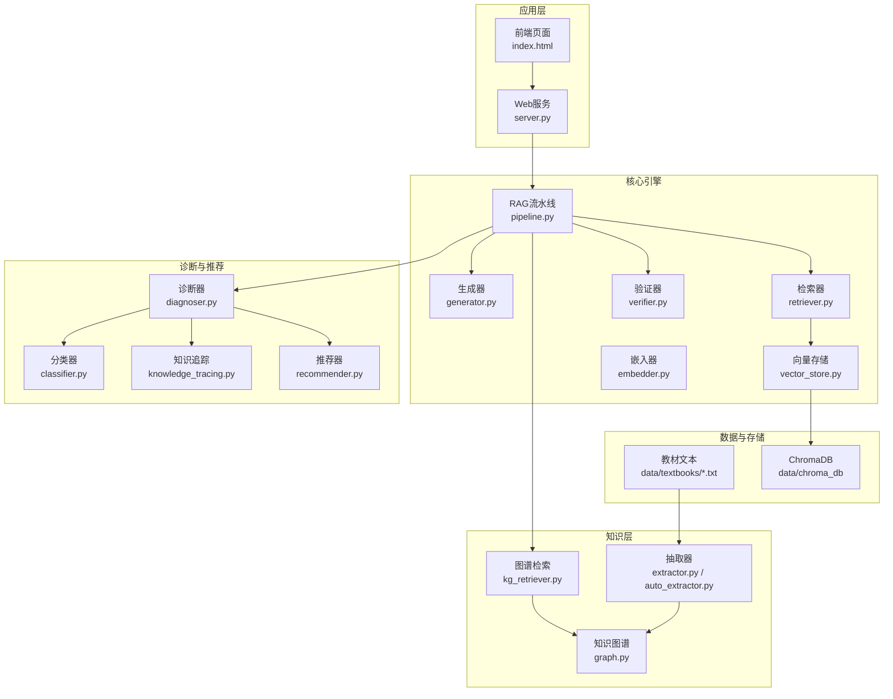
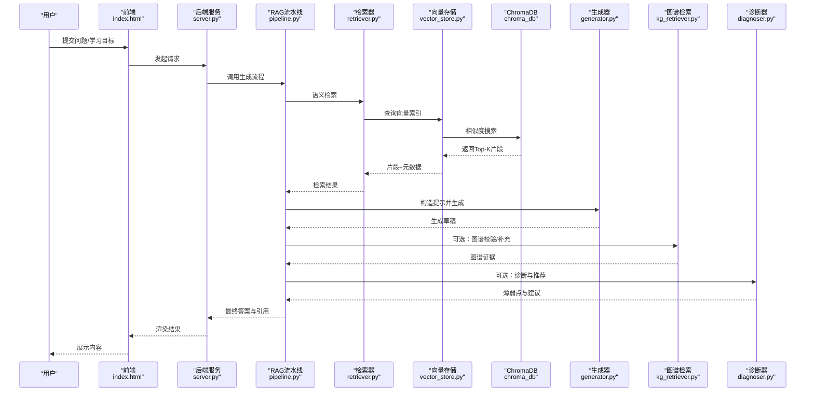
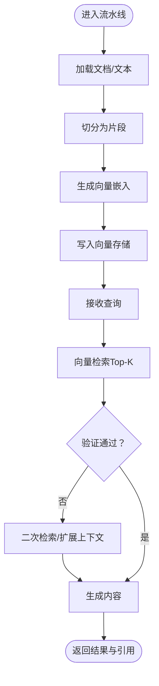
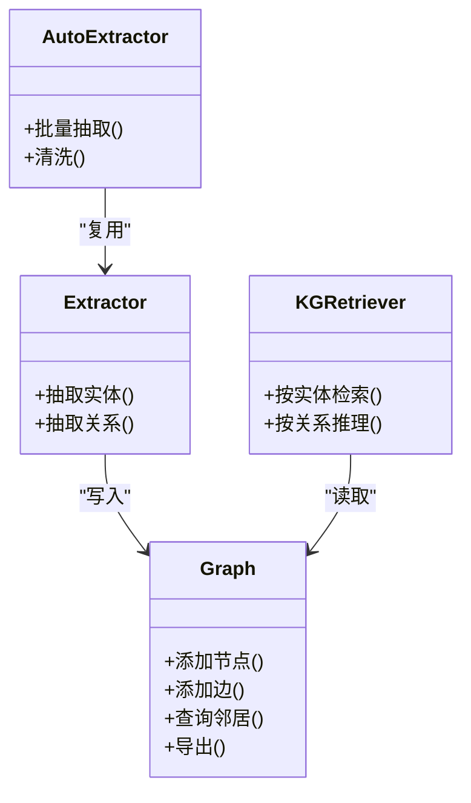
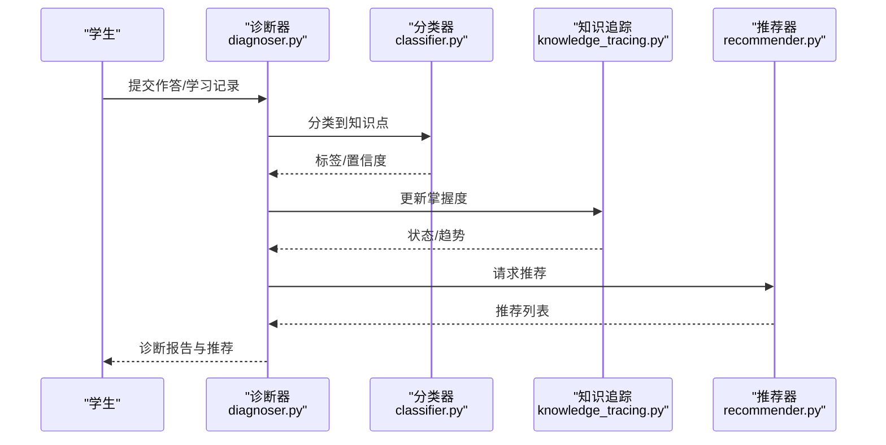
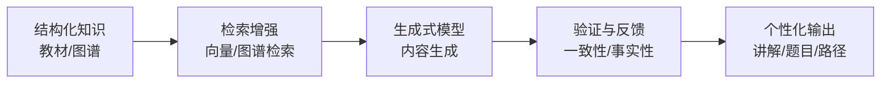
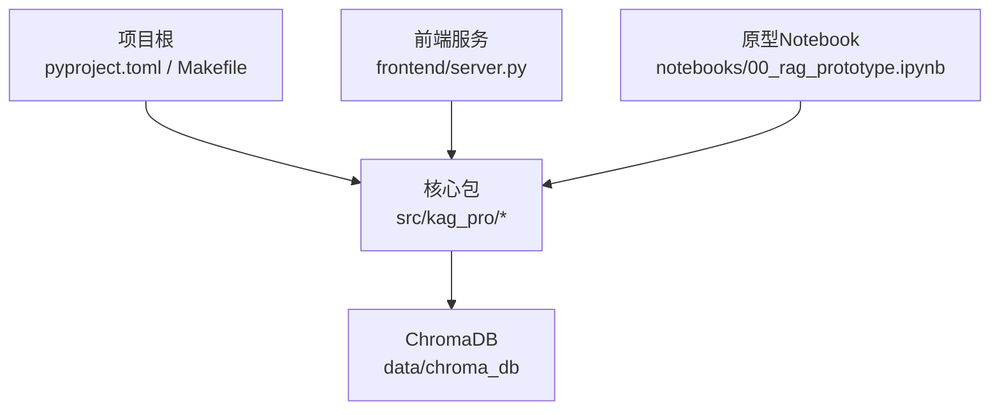

# 项目概述

<cite>
**本文引用的文件**   
- [README.md](file://README.md)
- [pyproject.toml](file://pyproject.toml)
- [Makefile](file://Makefile)
- [src/kag_pro/core/pipeline.py](file://src/kag_pro/core/pipeline.py)
- [src/kag_pro/core/generator.py](file://src/kag_pro/core/generator.py)
- [src/kag_pro/core/retriever.py](file://src/kag_pro/core/retriever.py)
- [src/kag_pro/core/vector_store.py](file://src/kag_pro/core/vector_store.py)
- [src/kag_pro/core/embedder.py](file://src/kag_pro/core/embedder.py)
- [src/kag_pro/kg/graph.py](file://src/kag_pro/kg/graph.py)
- [src/kag_pro/kg/extractor.py](file://src/kag_pro/kg/extractor.py)
- [src/kag_pro/kg/auto_extractor.py](file://src/kag_pro/kg/auto_extractor.py)
- [src/kag_pro/kg/kg_retriever.py](file://src/kag_pro/kg/kg_retriever.py)
- [src/kag_pro/diagnosis/classifier.py](file://src/kag_pro/diagnosis/classifier.py)
- [src/kag_pro/diagnosis/diagnoser.py](file://src/kag_pro/diagnosis/diagnoser.py)
- [src/kag_pro/diagnosis/knowledge_tracing.py](file://src/kag_pro/diagnosis/knowledge_tracing.py)
- [src/kag_pro/diagnosis/recommender.py](file://src/kag_pro/diagnosis/recommender.py)
- [src/kag_pro/data/textbooks/01_分数初步.txt](file://src/kag_pro/data/textbooks/01_分数初步.txt)
- [frontend/server.py](file://frontend/server.py)
- [frontend/index.html](file://frontend/index.html)
- [notebooks/00_rag_prototype.ipynb](file://notebooks/00_rag_prototype.ipynb)
</cite>

## 目录
1. [简介](#简介)
2. [项目结构](#项目结构)
3. [核心组件](#核心组件)
4. [架构总览](#架构总览)
5. [详细组件分析](#详细组件分析)
6. [依赖分析](#依赖分析)
7. [性能考虑](#性能考虑)
8. [故障排查指南](#故障排查指南)
9. [结论](#结论)
10. [附录：快速开始](#附录快速开始)

## 简介
KAG-Pro 教育AI平台是一个以“知识增强生成（Knowledge-Augmented Generation, KAG）”为核心的教学辅助系统。它通过构建学科知识图谱、结合向量检索与生成模型，实现智能诊断、内容生成与个性化推荐等能力，服务于中小学至高中阶段的数学、物理、化学、生物、地理、历史等学科。

- 核心目标
  - 将结构化知识与大模型生成能力融合，提升生成内容的准确性与可解释性
  - 为学习者提供基于知识点的智能诊断与个性化学习路径
  - 支持教材文本的自动切分、向量化与检索增强生成（RAG）
  - 提供轻量Web服务与示例前端，便于演示与集成

- 主要特性
  - 知识图谱构建与检索：从文本中抽取实体与关系，形成可查询的知识网络
  - 智能诊断与追踪：基于学习行为进行知识点掌握度评估与薄弱点定位
  - 内容生成：依据检索到的相关知识片段生成讲解、习题与解析
  - 个性化推荐：根据诊断结果推荐学习材料与练习
  - RAG流水线：加载→切分→嵌入→存储→检索→验证→生成的端到端流程
  - 数据资产沉淀：教材文本、论文与收藏集的结构化管理

- 技术栈选择理由
  - ChromaDB：作为向量数据库，提供高效的相似度检索与本地部署能力，适合教育场景的数据规模与隐私要求
  - 深度学习框架：用于文本嵌入与可能的微调任务，支撑语义理解与检索质量
  - Web服务框架：提供REST接口与简单前端页面，降低使用门槛并便于集成到现有教学系统

[本节不直接分析具体源文件]

## 项目结构
仓库采用分层与按功能域组织的方式：
- src/kag_pro：核心Python包
  - core：RAG流水线、生成器、检索器、向量存储、嵌入器、验证器等
  - kg：知识图谱构建与检索
  - diagnosis：诊断、分类、知识追踪与推荐
  - data：教材文本、外部数据集、收藏夹与论文
  - evaluation：评估指标
  - stage：阶段检测（如学段识别）
  - utils：配置与工具
- frontend：简易Web服务与HTML页面
- notebooks：原型探索与演示
- tests：单元测试与集成测试
- data/chroma_db：ChromaDB持久化目录（默认）

图示来源
- [frontend/server.py](file://frontend/server.py)
- [frontend/index.html](file://frontend/index.html)
- [src/kag_pro/core/pipeline.py](file://src/kag_pro/core/pipeline.py)
- [src/kag_pro/core/generator.py](file://src/kag_pro/core/generator.py)
- [src/kag_pro/core/retriever.py](file://src/kag_pro/core/retriever.py)
- [src/kag_pro/core/vector_store.py](file://src/kag_pro/core/vector_store.py)
- [src/kag_pro/core/embedder.py](file://src/kag_pro/core/embedder.py)
- [src/kag_pro/core/verifier.py](file://src/kag_pro/core/verifier.py)
- [src/kag_pro/kg/graph.py](file://src/kag_pro/kg/graph.py)
- [src/kag_pro/kg/extractor.py](file://src/kag_pro/kg/extractor.py)
- [src/kag_pro/kg/auto_extractor.py](file://src/kag_pro/kg/auto_extractor.py)
- [src/kag_pro/kg/kg_retriever.py](file://src/kag_pro/kg/kg_retriever.py)
- [src/kag_pro/diagnosis/diagnoser.py](file://src/kag_pro/diagnosis/diagnoser.py)
- [src/kag_pro/diagnosis/knowledge_tracing.py](file://src/kag_pro/diagnosis/knowledge_tracing.py)
- [src/kag_pro/diagnosis/classifier.py](file://src/kag_pro/diagnosis/classifier.py)
- [src/kag_pro/diagnosis/recommender.py](file://src/kag_pro/diagnosis/recommender.py)
- [src/kag_pro/data/textbooks/01_分数初步.txt](file://src/kag_pro/data/textbooks/01_分数初步.txt)

章节来源
- [README.md](file://README.md)
- [pyproject.toml](file://pyproject.toml)
- [Makefile](file://Makefile)

## 核心组件
- RAG流水线（core.pipeline）
  - 职责：编排加载、切分、嵌入、存储、检索、验证与生成步骤，对外暴露统一入口
  - 关键输入：文档集合或单篇文本；关键输出：生成内容与引用来源
- 生成器（core.generator）
  - 职责：基于检索上下文与提示词模板生成教学内容、题目与解析
- 检索器（core.retriever）
  - 职责：对查询进行语义匹配，返回相关片段与元数据
- 向量存储（core.vector_store）
  - 职责：封装ChromaDB操作，负责索引创建、插入与相似检索
- 嵌入器（core.embedder）
  - 职责：将文本转换为稠密向量，供检索与相似度计算
- 验证器（core.verifier）
  - 职责：对生成内容进行事实性与一致性校验，必要时触发二次检索或修正
- 知识图谱（kg.graph / extractor / auto_extractor / kg_retriever）
  - 职责：从文本抽取实体与关系，构建图谱；提供基于图谱的检索与推理
- 诊断与推荐（diagnosis.*）
  - 职责：对学习行为建模，评估知识点掌握度，定位薄弱点并推荐材料

章节来源
- [src/kag_pro/core/pipeline.py](file://src/kag_pro/core/pipeline.py)
- [src/kag_pro/core/generator.py](file://src/kag_pro/core/generator.py)
- [src/kag_pro/core/retriever.py](file://src/kag_pro/core/retriever.py)
- [src/kag_pro/core/vector_store.py](file://src/kag_pro/core/vector_store.py)
- [src/kag_pro/core/embedder.py](file://src/kag_pro/core/embedder.py)
- [src/kag_pro/core/verifier.py](file://src/kag_pro/core/verifier.py)
- [src/kag_pro/kg/graph.py](file://src/kag_pro/kg/graph.py)
- [src/kag_pro/kg/extractor.py](file://src/kag_pro/kg/extractor.py)
- [src/kag_pro/kg/auto_extractor.py](file://src/kag_pro/kg/auto_extractor.py)
- [src/kag_pro/kg/kg_retriever.py](file://src/kag_pro/kg/kg_retriever.py)
- [src/kag_pro/diagnosis/classifier.py](file://src/kag_pro/diagnosis/classifier.py)
- [src/kag_pro/diagnosis/diagnoser.py](file://src/kag_pro/diagnosis/diagnoser.py)
- [src/kag_pro/diagnosis/knowledge_tracing.py](file://src/kag_pro/diagnosis/knowledge_tracing.py)
- [src/kag_pro/diagnosis/recommender.py](file://src/kag_pro/diagnosis/recommender.py)

## 架构总览
下图展示了从用户请求到最终输出的端到端流程，涵盖RAG、知识图谱与诊断推荐模块的协作。

图示来源
- [frontend/index.html](file://frontend/index.html)
- [frontend/server.py](file://frontend/server.py)
- [src/kag_pro/core/pipeline.py](file://src/kag_pro/core/pipeline.py)
- [src/kag_pro/core/retriever.py](file://src/kag_pro/core/retriever.py)
- [src/kag_pro/core/vector_store.py](file://src/kag_pro/core/vector_store.py)
- [src/kag_pro/core/generator.py](file://src/kag_pro/core/generator.py)
- [src/kag_pro/kg/kg_retriever.py](file://src/kag_pro/kg/kg_retriever.py)
- [src/kag_pro/diagnosis/diagnoser.py](file://src/kag_pro/diagnosis/diagnoser.py)

## 详细组件分析

### 组件A：RAG流水线与生成
- 设计要点
  - 流水线将多阶段处理解耦，便于替换嵌入模型、检索策略与生成器
  - 支持“先检索后生成”和“检索-验证-再检索”的闭环
- 关键交互
  - 检索器从向量存储获取相关片段
  - 生成器基于片段与提示词生成内容
  - 验证器对生成结果进行一致性检查
- 优化建议
  - 对高频查询做缓存
  - 调整Top-K与阈值平衡召回与延迟
  - 引入重排序以提升相关性

图示来源
- [src/kag_pro/core/pipeline.py](file://src/kag_pro/core/pipeline.py)
- [src/kag_pro/core/retriever.py](file://src/kag_pro/core/retriever.py)
- [src/kag_pro/core/vector_store.py](file://src/kag_pro/core/vector_store.py)
- [src/kag_pro/core/embedder.py](file://src/kag_pro/core/embedder.py)
- [src/kag_pro/core/generator.py](file://src/kag_pro/core/generator.py)
- [src/kag_pro/core/verifier.py](file://src/kag_pro/core/verifier.py)

章节来源
- [src/kag_pro/core/pipeline.py](file://src/kag_pro/core/pipeline.py)
- [src/kag_pro/core/generator.py](file://src/kag_pro/core/generator.py)
- [src/kag_pro/core/retriever.py](file://src/kag_pro/core/retriever.py)
- [src/kag_pro/core/vector_store.py](file://src/kag_pro/core/vector_store.py)
- [src/kag_pro/core/embedder.py](file://src/kag_pro/core/embedder.py)
- [src/kag_pro/core/verifier.py](file://src/kag_pro/core/verifier.py)

### 组件B：知识图谱构建与检索
- 设计要点
  - 抽取器从文本中提取实体与关系，构建图结构
  - 自动抽取器提供开箱即用的抽取流程
  - 图谱检索器支持基于关系的推理与回溯
- 典型流程
  - 文本→抽取→三元组→图节点/边→索引→检索

图示来源
- [src/kag_pro/kg/graph.py](file://src/kag_pro/kg/graph.py)
- [src/kag_pro/kg/extractor.py](file://src/kag_pro/kg/extractor.py)
- [src/kag_pro/kg/auto_extractor.py](file://src/kag_pro/kg/auto_extractor.py)
- [src/kag_pro/kg/kg_retriever.py](file://src/kag_pro/kg/kg_retriever.py)

章节来源
- [src/kag_pro/kg/graph.py](file://src/kag_pro/kg/graph.py)
- [src/kag_pro/kg/extractor.py](file://src/kag_pro/kg/extractor.py)
- [src/kag_pro/kg/auto_extractor.py](file://src/kag_pro/kg/auto_extractor.py)
- [src/kag_pro/kg/kg_retriever.py](file://src/kag_pro/kg/kg_retriever.py)

### 组件C：智能诊断与个性化推荐
- 设计要点
  - 分类器对题目/回答进行分类，映射到知识点
  - 诊断器整合分类与追踪结果，给出掌握度与薄弱点
  - 推荐器基于诊断结果推荐学习材料与练习
- 数据流
  - 学习行为→分类→追踪→诊断→推荐

图示来源
- [src/kag_pro/diagnosis/diagnoser.py](file://src/kag_pro/diagnosis/diagnoser.py)
- [src/kag_pro/diagnosis/classifier.py](file://src/kag_pro/diagnosis/classifier.py)
- [src/kag_pro/diagnosis/knowledge_tracing.py](file://src/kag_pro/diagnosis/knowledge_tracing.py)
- [src/kag_pro/diagnosis/recommender.py](file://src/kag_pro/diagnosis/recommender.py)

章节来源
- [src/kag_pro/diagnosis/diagnoser.py](file://src/kag_pro/diagnosis/diagnoser.py)
- [src/kag_pro/diagnosis/classifier.py](file://src/kag_pro/diagnosis/classifier.py)
- [src/kag_pro/diagnosis/knowledge_tracing.py](file://src/kag_pro/diagnosis/knowledge_tracing.py)
- [src/kag_pro/diagnosis/recommender.py](file://src/kag_pro/diagnosis/recommender.py)

### 概念总览：知识增强生成（KAG）在教育中的应用
- 概念说明
  - KAG = 结构化知识（知识图谱/教材）+ 生成式模型（LLM）+ 检索增强（RAG）
  - 通过“检索-验证-生成”的闭环，提高生成内容的准确性与可解释性
- 教育价值
  - 精准定位薄弱知识点，提供针对性讲解与练习
  - 自动生成符合课标与学段的教材与试题
  - 支持教师备课与课堂互动，提升学习效率

[本图为概念示意，无需源码对应]

## 依赖分析
- 运行时依赖
  - Python环境与包管理由pyproject.toml声明
  - Makefile提供常用命令（安装、运行、测试等）
- 外部存储
  - ChromaDB用于向量检索，数据默认位于data/chroma_db
- 前端与服务
  - frontend/server.py提供HTTP接口，index.html为演示页面
- 原型与实验
  - notebooks/00_rag_prototype.ipynb可用于快速验证RAG流程

图示来源
- [pyproject.toml](file://pyproject.toml)
- [Makefile](file://Makefile)
- [frontend/server.py](file://frontend/server.py)
- [notebooks/00_rag_prototype.ipynb](file://notebooks/00_rag_prototype.ipynb)

章节来源
- [pyproject.toml](file://pyproject.toml)
- [Makefile](file://Makefile)
- [frontend/server.py](file://frontend/server.py)
- [notebooks/00_rag_prototype.ipynb](file://notebooks/00_rag_prototype.ipynb)

## 性能考虑
- 检索效率
  - 合理设置Top-K与相似度阈值，避免过多无关片段影响生成质量
  - 对热点片段进行缓存，减少重复检索开销
- 嵌入与索引
  - 选择合适的嵌入维度与模型，平衡精度与速度
  - 定期重建索引以反映新增教材与知识更新
- 生成与验证
  - 控制提示词长度与上下文窗口，降低延迟
  - 验证失败时采用增量检索而非全量重算
- 资源占用
  - 在本地开发环境优先使用轻量模型与内存型ChromaDB实例
  - 生产环境可按需扩容GPU/CPU资源

[本节提供通用指导，不直接分析具体源文件]

## 故障排查指南
- 常见问题
  - 无法连接ChromaDB：检查data/chroma_db目录权限与磁盘空间
  - 检索结果为空：确认嵌入模型与索引是否一致，检查文本编码与切分策略
  - 生成内容不稳定：调整温度、Top-P与提示词模板，增加验证环节
  - 前端无法访问：确认端口占用与服务进程状态
- 定位方法
  - 查看日志与错误堆栈
  - 使用notebooks中的原型脚本逐步验证各阶段
  - 针对特定教材片段进行最小复现

章节来源
- [frontend/server.py](file://frontend/server.py)
- [notebooks/00_rag_prototype.ipynb](file://notebooks/00_rag_prototype.ipynb)

## 结论
KAG-Pro通过将结构化知识与生成式模型深度融合，构建了面向教育的知识增强生成平台。其模块化架构使RAG、知识图谱与诊断推荐各司其职且易于扩展。借助ChromaDB与轻量前端，开发者可以快速搭建并迭代教育AI应用。建议在后续版本中持续优化检索质量、验证机制与个性化推荐算法，以满足更复杂的教学场景需求。

[本节为总结性内容，不直接分析具体源文件]

## 附录：快速开始
- 环境准备
  - 安装Python依赖（参考pyproject.toml）
  - 初始化ChromaDB数据目录（data/chroma_db）
- 基本配置
  - 配置嵌入模型与生成模型参数（可在utils/config或相应模块中设置）
  - 指定教材文本目录（src/kag_pro/data/textbooks）
- 运行示例
  - 启动Web服务（frontend/server.py），打开浏览器访问index.html
  - 或使用notebooks中的原型脚本执行一次完整的RAG流程
- 第一个示例
  - 选择一份教材文本（例如“01_分数初步.txt”）
  - 执行加载→切分→嵌入→存储→检索→生成→验证的完整流程
  - 观察生成内容与引用来源，并根据需要调整检索与生成参数

章节来源
- [pyproject.toml](file://pyproject.toml)
- [Makefile](file://Makefile)
- [frontend/server.py](file://frontend/server.py)
- [frontend/index.html](file://frontend/index.html)
- [notebooks/00_rag_prototype.ipynb](file://notebooks/00_rag_prototype.ipynb)
- [src/kag_pro/data/textbooks/01_分数初步.txt](file://src/kag_pro/data/textbooks/01_分数初步.txt)